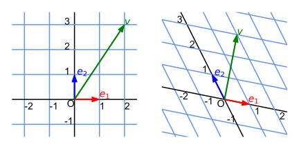
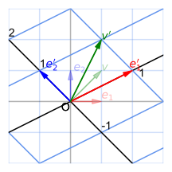
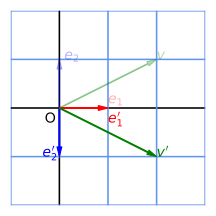
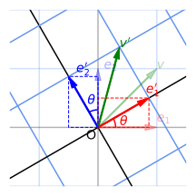
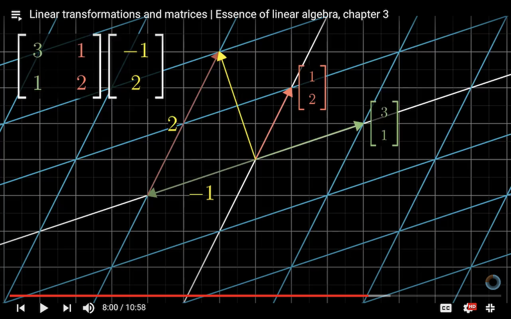

# Introduction to Linear Algebra

### **Part 1: Linear Transformation and Matrix**

*Credit*: Many ideas of this material come from the [*Essence of Linear Algebra*][LA_3b1b] video series (by Grant Sanderson, a.k.a. 3Blue1Brown).

[LA_3b1b]: https://youtu.be/fNk_zzaMoSs

### **Contents**

- [Vector Spaces and Basis Vectors](#vector-spaces-and-basis-vectors)
    - [Vector Spaces](#vector-spaces)
    - [Basis Vectors](#basis-vectors)
    - [Note on Notations: Einstein Summation Rule](#note-on-notations-einstein-summation-rule)
- [Linear Transformations](#linear-transformations)
    - [Matrix Representation of Linear Transformations](#matrix-representation-of-linear-transformations)
    - [EXERCISE: Examples of 2D Linear Transformations](#exercise-examples-of-2d-linear-transformations)
- [Matrix-Vector Multiplication](#matrix-vector-multiplication)
    - [EXERCISE](#exercise)
- [Composition of Linear Transformation](#composition-of-linear-transformation)
    - [EXERCISE](#exercise-1)

## Vector Spaces and Basis Vectors

### Vector Spaces

For the purpose of an introductory physics course, **vectors** can be imagined as arrows in the plane (2D), the space (3D) or in higher dimensional spaces, and a **vector space** (denoted by $V$) is the collection (set) of all vectors in that space. 

We can perform the following operations on vectors in the vector space:

- **Addition** of vectors

- **Scalar multiplication** on a vector (by *real* numbers)

    (Later in your life you will have to deal with *complex* numbers, but now we restrict ourselves to the real world.)

[vec_space]: https://en.wikipedia.org/wiki/Vector_space

### Basis Vectors

Given a set of *linearly independent* vectors $\{e_1,...,e_n\}$, if *any* vector $v\in V$ can be *uniquely* represented as a linear combination of $e_1, ..., e_n$

$$
v = \sum_{i=1}^{n} v_i e_i
\qquad v_1,...,v_n\in \mathbb{R}
$$

Then the vectors $e_1, ..., e_n$ are called **basis vectors** of $V$. The number of these vectors $n$ is called the **dimension** of $V$ (denoted by $\dim V$). 

The number $v_i$ is called the **components** of the vector $v$ along the basis vector $e_i$. Then the vector $v$ can be also written as a **column vector** (without explicit reference to the basis we are using)

$$
v = \begin{bmatrix}
    v_1 \\ \vdots \\ v_n
\end{bmatrix}
$$

*Remarks*:

- The choice of basis vectors is *not unique*, since there are *infinitely many* sets of $n$ linearly-independent vectors in the vector space $V$. 

- Two vectors of the same components will be different if the sets of basis vectors used to construct them are not the same. 

    

       
    *Two different vectors can have the same components (2, 3)  under different basis; the figures are drawn to the same scale*

    

- Usually we choose an **orthonormal basis**, i.e. each basis vector is of length 1, and is orthogonal to other basis vectors (i.e. **inner product** is zero). 
    
    An example is the usual $x, y, ...$ unit vectors (sometimes denoted by $\hat{i}, \hat{j}, \hat{k}, ...$). Let us call them the **standard basis**. In this case, the components of a vector *coincides* with the coordinates of the end point of the vector. 

### Note on Notations: Einstein Summation Rule

People are tired of always writing the summation sign $\sum$ in linear algebra calculations. Fortunately, the genius Albert Einstein invented the following rule: 

**If an index appears twice, then sum over it.**

which allows people to throw away the summation signs. For example:

$$
\sum_i v_i e_i \to v_i e_i
$$

The index $i$ appears twice, thus we should sum over $i$. Unless there might be some ambiguity, we shall always adopt the Einstein summation rule in the following. 

In addition, we are free to choose which letter represents the index to be summed over:

$$
\sum_i v_i e_i = \sum_j v_j e_j  = \cdots
\, \Rightarrow \,
v_i e_i = v_j e_j = \cdots
$$

## Linear Transformations

A **linear transformation** (denoted by $A$) on a vector space $V$ maps a vector $u \in V$ to another vector $v = Au \in V$:

$$
A: V \to V
$$

The transformation must satisfy the following two *defining* requirements (called the **linearity conditions**):

- $\forall \, u, v\in V \qquad \quad A(u + v)=A u + A v$

- $\forall \, v\in V, c\in \mathbb{C} \quad A(c u) = c (A u)$

In other words, it does not matter whether you perform linear transformations before or after vector addition and scalar multiplication. 

### Matrix Representation of Linear Transformations

The above definition is somewhat abstract. Let us represent it by something more concrete: the **matrix**. 

Due to the linearity, a linear transformation $A$ can be *fully* described if we know its action on *every* basis vector ($i = 1, ..., n$) of $V$:

$$
e_i \to e'_i \equiv A e_i
$$

Then for any vector $v$, we have

$$
\begin{aligned}
    v' 
    &\equiv A v 
    \\
    &= A (v_i e_i) 
    &\quad &\text{(Expand $v$ using $\{e_i\}$)}
    \\
    &= v_i (A e_i) 
    &\quad &\text{(Use linearity of $A$)}
    \\
    &= v_i e'_i
    &\quad &(e'_i = A e_i)
\end{aligned}
$$

We note that components of $v'$ along the new basis are the same as the components of $v$ along the old basis.

Nothing prevents us to expand $e'_i$ as linear combination of the basis vectors: 

$$
e'_i = A e_i = e_j A_{j i} \qquad (i = 1, ..., n)
$$

The numbers $A_{j i}$ are linear combination coefficients. We do not write $A_{i j} e_j$, which is just a matter of convention. 

For example, when $\dim{V} = 2$:

$$
\begin{aligned}
    e'_1 &= A e_1 = A_{11} e_1 + A_{21} e_2
    = \begin{bmatrix}
        A_{11} \\ A_{21}
    \end{bmatrix}
    \\
    e'_2 &= A e_2 = A_{12} e_1 + A_{22} e_2
    =\begin{bmatrix}
        A_{12} \\ A_{22}
    \end{bmatrix}
\end{aligned}
$$

Then we combine this two column vectors to form a **matrix** that represents the linear transformation $A$ (it does not matter whether you use usual or square brackets):

$$
A = \begin{bmatrix}
    A_{11} & A_{12} \\
    A_{21} & A_{22}
\end{bmatrix} \quad
\text{(under the basis $\{e_1, e_2\}$)}
$$

In this construction, $A_{i j}$ means the matrix element at the $i$th row and the $j$th column. 

Remember the meaning of each column of the transformation matrix: **the $i$th column is the transformation result of the $i$th basis vector**. 

### EXERCISE: Examples of 2D Linear Transformations

- **An arbitrary linear transformation**

    

       
    $e'_1 = 2e_1 + e_2, \quad e'_2 = -e_1 + e_2, \quad v = e_1 + e_2$

    

    Question: Let $v' = a e'_1 + b e'_2$. What is the value of $(a, b)$?

    $$
    \begin{aligned}
        \text{A. } (1, 2)
        \quad
        \text{B. } (2, 1)
        \quad
        \text{C. } (\frac{1}{2}, 2)
        \quad
        \text{D. } (1,1)
    \end{aligned}
    $$

- **Reflection**

    

       
    *Reflection with respect to x-axis*

    

    Question: what is the representation matrix?

    $$
    \begin{aligned}
        &\text{A. } \begin{bmatrix}
            1 & -1 \\
            0 & 0
        \end{bmatrix}
        &\quad
        &\text{B. } \begin{bmatrix}
            1 & 0 \\
            0 & -1
        \end{bmatrix}
        \\
        &\text{C. } \begin{bmatrix}
            -1 & 0 \\
            0 & 1
        \end{bmatrix}
        &\quad
        &\text{D. } \begin{bmatrix}
            1 & 0 \\
            0 & 1
        \end{bmatrix}
    \end{aligned}
    $$

- **Rotation**

    

       
    *2D counter-clockwise rotation by angle $\theta$*

    

    Question: what is the representation matrix?

    $$
    \begin{aligned}
        &\text{A. } \begin{bmatrix}
            \cos \theta & -\sin \theta \\
            \sin \theta & \cos \theta
        \end{bmatrix}
        &\quad
        &\text{B. } \begin{bmatrix}
            \cos \theta & \sin \theta \\
            \sin \theta & \cos \theta
        \end{bmatrix}
        \\
        &\text{C. } \begin{bmatrix}
            \sin \theta & \cos \theta \\
            -\sin \theta & \cos \theta 
        \end{bmatrix}
        &\quad
        &\text{D. } \begin{bmatrix}
            \cos \theta & \sin \theta \\
            -\sin \theta & \cos \theta 
        \end{bmatrix}
    \end{aligned}
    $$

## Matrix-Vector Multiplication

Using the linearity $A$, we can find the new vector $A v$: 

$$
\begin{aligned}
    v' &= v_j e'_j
    \\
    &= v_j (e_i A_{i j}) 
    &\quad &\text{(Expand $e'_j$ using $\{e_i\}$)}
    \\
    &= (A_{i j} v_j) e_i
    &\quad &\text{(Rearrange)}
\end{aligned}
$$

Meanwhile, under the old basis $\{e_i\}$

$$
v' = Av = (Av)_i e_i
$$

Therefore, the components of $A v$ (along the old basis) are given by

$$
(A v)_i = A_{i j} v_j
$$

This is *defined* as the rule of the multiplication of matrix $A$ and column vector $v$.

For example, when $\dim{V} = 2$:

$$
A v =
\begin{bmatrix}
    A_{11} & A_{12} \\
    A_{21} & A_{22}
\end{bmatrix}
\begin{bmatrix}
    v_1 \\
    v_2
\end{bmatrix}
= \begin{bmatrix}
    A_{11} v_1 + A_{12} v_2 \\
    A_{21} v_1 + A_{22} v_2
\end{bmatrix}
$$

### EXERCISE

   
*(Have you watched the [videos][LA_3b1b] now?)*

The result of the product above is:

$$
\begin{aligned}
    \text{A. } \begin{bmatrix}
        -1 \\ 2
    \end{bmatrix}
    \quad
    \text{B. } \begin{bmatrix}
        3 \\ 2
    \end{bmatrix}
    \quad
    \text{C. } \begin{bmatrix}
        -1 \\ 3
    \end{bmatrix}
    \quad
    \text{D. } \begin{bmatrix}
        1 \\ 2
    \end{bmatrix}
\end{aligned}
$$

## Composition of Linear Transformation

Suppose we have two linear transformations $A, B$. We first apply $B$ onto a vector $v$, then apply $A$. The result of the combined transformation is denoted by $A B v$ (the transformations are written from right to left according to the order).

Now let us find the components of $ABv$: first calculate $Bv$

$$
(Bv)_j = B_{jk} v_k
$$

Then apply $A$:

$$
[A(Bv)]_i = A_{ij} (Bv)_j = A_{ij} B_{jk} v_k
$$

We discover that if we define a new matrix $C$ by

$$
C_{i k} \equiv A_{i j} B_{j k}
$$

We obtain

$$
[A(B v)]_i = C_{ik} v_k
$$

This means that *$C$ is the representation matrix of the composite transformation $AB$* (under the original basis). Thus we define that the **product** of the matrices $A, B$ is 

$$
(AB)_{i k} \equiv A_{i j} B_{j k}
$$

so that

$$
[A(B v)]_i = [(AB) v]_i
$$

For example, when $\dim{V} = 2$

$$
AB = \begin{bmatrix}
    A_{11} B_{11} + A_{12} B_{21} & A_{11} B_{12} + A_{12} B_{22} \\
    A_{21} B_{11} + A_{22} B_{21} & A_{21} B_{12} + A_{22} B_{22}
\end{bmatrix}
$$

### EXERCISE

Let $R(\theta)$ be the 2D rotation matrix (we obtained it earlier in the exercise). Show that 

$$
R(\alpha) R(\beta) = R(\alpha + \beta)
$$

- If you have finished, select A;
- If you do not know how to do it, select B. 