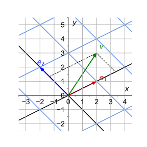
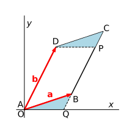

# Introduction to Linear Algebra (Part 2)

*Credit*: Many ideas of this material comes from the [*Essence of Linear Algebra*][LA_3b1b] video series (by Grant Sanderson, a.k.a. 3Blue1Brown).

[LA_3b1b]: https://youtu.be/fNk_zzaMoSs

### **Contents**

- [Determinant of a Matrix](#determinant-of-a-matrix)
    - [2D Determinant](#2d-determinant)
    - [3D Determinant](#3d-determinant)
- [Inverse of Linear Transformation and Matrix](#inverse-of-linear-transformation-and-matrix)
    - [Determinant and Matrix Invertibility](#determinant-and-matrix-invertibility)
    - [Inverse of Product of Matrices](#inverse-of-product-of-matrices)
    - [EXERCISE](#exercise)
- [Change of Basis](#change-of-basis)
    - [Description of the New Basis](#description-of-the-new-basis)
    - [Components of Vectors along the New Basis](#components-of-vectors-along-the-new-basis)
    - [Matrix of Linear Transformation under the New Basis](#matrix-of-linear-transformation-under-the-new-basis)
    - [Inner Product under the New Basis](#inner-product-under-the-new-basis)
    - [EXERCISE](#exercise-1)
- [Appendix: Geometrical Meaning of Determinant](#appendix-geometrical-meaning-of-determinant)
    - [2D Determinant = Parallelogram Area](#2d-determinant--parallelogram-area)
    - [3D Determinant = Parallelepiped Volume](#3d-determinant--parallelepiped-volume)
    - [EXERCISE](#exercise-2)

## Determinant of a Matrix

### 2D Determinant

   
*Geometric meaning of 2D determinant*

Let $a, b$ be the two columns of a $2 \times 2$ matrix $A$ (**under an orthonormal basis**, but it need not to be the standard one; this is important)

$$
A = \begin{bmatrix}
    a_1 & b_1 \\
    a_2 & b_2
\end{bmatrix}
$$

We can use the two vectors to construct a **parallelogram** $ABCD$ (see figure), whose *area* is given by the formula (see Appendix; try to prove it by yourself):

$$
\text{Area} = 
|a_1 b_2 - a_2 b_1|
$$

If we are not using the components along an orthonormal basis, the result will be more complicated. The expression inside the absolute value sign $| \, |$ is defined as the **determinant** of matrix $A$, denoted by

$$
\det A \equiv a_1 b_2 - a_2 b_1
$$

The determinant can be a negative number. When $\det A > 0$, we say that the two vectors $a, b$ form a **right-hand basis** of the 2D vector space. Thus the standard basis itself 

$$
e_1 = (1,0)^\top, \quad
e_2 = (0,1)^\top
$$ 

is a right-hand basis.

When $\det A = 0$, it means that $a$ and $b$ are *on the same line*.

### 3D Determinant

   
*Geometric meaning of 3D determinant*

Similar to the 2D case, let $a, b, c$ be the three columns of a $3 \times 3$ matrix $A$ (**under orthonormal basis**)

$$
A = \begin{bmatrix}
    a_1 & b_1 & c_1 \\
    a_2 & b_2 & c_2 \\
    a_3 & b_3 & c_3
\end{bmatrix}
$$

We can use the three vectors to construct a **parallelepiped** (see figure), whose *volume* is given by the formula (see Appendix):

$$
\begin{aligned}
    \text{Volume} = 
    | &a_1 b_2 c_3 + a_2 b_3 c_1 + a_3 b_1 c_2 \\
    &- a_3 b_2 c_1 - a_2 b_1 c_3 - a_1 b_3 c_2|
\end{aligned}
$$

The expression inside the absolute value sign $| \, |$ is defined as the **determinant** of matrix $A$, still denoted by $\det A$. It can be rewritten in terms of 2D determinants:

$$
\det A = a_1 \det \begin{bmatrix}
    b_2 & c_2 \\
    b_3 & c_3 
\end{bmatrix}
- a_2 \det \begin{bmatrix}
    b_1 & c_1 \\
    b_3 & c_3 
\end{bmatrix}
+ a_3 \det \begin{bmatrix}
    b_1 & c_1 \\
    b_2 & c_2 
\end{bmatrix}
$$

When $\det A > 0$, we say that the two vectors $a, b$ form a **right-hand basis** of the 3D vector space. Thus the standard basis itself

$$
e_1 = (1,0,0)^\top, \quad 
e_2 = (0,1,0)^\top, \quad
e_3 = (0,0,1)^\top
$$ 

is a right-hand basis.

When $\det A = 0$, it means that $a, b, c$ are *on the same plane*.

## Inverse of Linear Transformation and Matrix

For a given linear transformation $A$, *if we can find* another transformation $B$ that completely *cancels* the effect of $A$, *and* $A$ completely cancels the effect of $B$, then we say that $A$ and $B$ are the **inverse of each other**. 

The matrix representation of $B$ is called the **inverse** of the matrix $A$. We shall use the notation $A^{-1}$ to denote both the inverse transformation and the inverse matrix.

Mathematically, "completely cancel" means

$$
A A^{-1} = A^{-1} A = 1
$$

where $1$ is the **identity transformation**, whose effect is no effect at all. Its matrix representation is called the **identity matrix**:

$$
(1)_{ij} = \delta_{ij}
$$

*Remark*:

- Do *not* use $1/A$ to denote the inverse of $A$.

- Note that we used the expression "if we can find". This means that some linear transformation does *not* have its inverse.

- We state without proof that if a linear transformation is invertible, then *its inverse is unique*. 

Here we shall not teach you how to calculate the inverse of an arbitrary invertible matrix, which can be done by computers. 

### Determinant and Matrix Invertibility

Consider a linear transformation $A$.

   
*A non-invertible 2D linear transformation*   
*(Screenshot from the linear transformation demo)*

First suppose $A$ is in 2D, it is not difficult to understand if $A$ transforms the two basis vectors to the *same line* (see figure), then we *lost the information in one dimension*, since any linear combination of $A e_1, A e_2$ gives vectors on that same line. Thus the transformation will *not* be invertible. 

Similarly, for $A$ in 3D, if $A$ transforms the two basis vectors to the *same plane* (including the case when all basis vectors are transformed to the same line), then we lost the information in one (or even two) dimension(s). Then the transformation will *not* be invertible. 

These cases happen when $\det A = 0$. Thus we obtain the following criteria for $A$ to be invertible.

**A (square) matrix $A$ is invertible if and only if $\det{A} \ne 0$.**

This holds for any dimensions. 

### Inverse of Product of Matrices

When you invert a product of matrices, the order of the product sequence should be *reversed*, i.e.

$$
\left(A_1A_2 \cdots A_n\right){}^{-1}
= A_n^{-1} \cdots A_2^{-1} A_1^{-1}
$$

This is easy to understand if you think in terms of the transformations they represent. For example, consider the problem of putting an elephant into a refrigerator with closed doors. We need to do it in 3 steps:

|Operation|Represented by|
|-:|:-|
|Open the door|$A_1$|
|Move the elephant in|$A_2$|
|Close the door|$A_3$|

Is it obvious to you that $A_1, A_3$ are inverse of each other? Net effect: 

$$
\begin{aligned}
    &|\text{elephant in refrigerator} \rangle
    \\
    & \quad = 
    A_3 A_2 A_1 | \text{elephant out of refrigerator} \rangle
\end{aligned}
$$

The inverse operation is evidently

|Operation|Represented by|
|-:|:-|
|Open the door|$A_3^{-1}$|
|Move the elephant out|$A_2^{-1}$|
|Close the door|$A_1^{-1}$|

Net effect: 

$$
\begin{aligned}
    &|\text{elephant out of refrigerator} \rangle
    \\
    & \quad = 
    A_1^{-1} A_2^{-1} A_3^{-1} | \text{elephant in refrigerator} \rangle
\end{aligned}
$$

### EXERCISE

- Calculate $\det 1$. What does it mean?

- For a general $2 \times 2$ matrix
    
    $$
    A = \begin{bmatrix}
        a & b \\
        c & d
    \end{bmatrix}
    $$

    - When will $A$ be invertible?
    
    - Explicitly calculate $A^{-1}$. Verify your answer for the last question. 

## Change of Basis

It is expected that if we change to a new set of basis vectors:

- A vector will have different components 
- A linear transformation will be represented by a different matrix

In this section we shall show, in two dimensions, how to find the components of vectors and representation matrices of linear transformations under a new set of basis vectors. The generalization to higher dimensions is straightforward.

### Description of the New Basis

The new basis $e'_1, e'_2$ can always be described by their components along the old basis $e_1, e_2$. In other words, the new basis is related to the old basis by a linear transformation $\mathcal{D}$:

$$
e'_1 = \mathcal{D} e_1 
= \begin{bmatrix}
    \mathcal{D}_{11} \\ \mathcal{D}_{21}
\end{bmatrix}, 
\quad
e'_2 = \mathcal{D} e_2
= \begin{bmatrix}
    \mathcal{D}_{12} \\ \mathcal{D}_{22}
\end{bmatrix}
$$

Thus the change from the old basis to the new basis is described by the matrix (under the old basis)

$$
\mathcal{D} = \begin{bmatrix}
    \mathcal{D}_{11} & \mathcal{D}_{12} \\
    \mathcal{D}_{21} & \mathcal{D}_{22}
\end{bmatrix}
$$

*Remark*: The inverse operation, i.e. change from the new basis to the old basis, is described by the inverse matrix $\mathcal{D}^{-1}$ (**under the new basis**).

### Components of Vectors along the New Basis

For an arbitrary vector, its components along the new and the old basis vectors are related by

$$
\begin{aligned}
    v 
    &= v_1 e_1 + v_2 e_2 
    &\quad &\text{(in old basis)}
    \\
    &= v'_1 e'_1 + v'_2 e'_2 
    &\quad &\text{(in new basis)}
    \\
    &= v'_1 \mathcal{D}e_1 + v'_2 \mathcal{D} e_2 
    \\
    &= \mathcal{D} (v'_1 e_1 + v'_2 e_2)
    &\quad &\text{(using linearity of $\mathcal{D}$)}
\end{aligned}
$$

Using the matrix notation to make the expression more clear:

$$
\begin{bmatrix}
    v_1 \\ v_2
\end{bmatrix}
= \mathcal{D} \begin{bmatrix}
    v'_1 \\ v'_2
\end{bmatrix}
$$

Thus the components of $v$ along the new basis are given by

$$
\begin{bmatrix}
    v'_1 \\ v'_2
\end{bmatrix} = \mathcal{D}^{-1}
\begin{bmatrix}
    v_1 \\ v_2
\end{bmatrix} 
\quad \text{or} \quad
v' = \mathcal{D}^{-1} v
$$

where $v' \equiv v'_1 e_1 + v'_2 e_2$ is the vector constructed using the *new* components and the *old* basis vectors.

### Matrix of Linear Transformation under the New Basis

In the *basis-free* language, for an arbitrary vector $v \in V$, a linear transformation $A$ sends it to another vector $w \in V$:

$$
w = A v
$$

In the old basis ("un-primed"), we have the matrix form

$$
\begin{bmatrix}
    w_1 \\
    w_2
\end{bmatrix} 
= \begin{bmatrix}
    A_{11} & A_{12} \\
    A_{21} & A_{22}
\end{bmatrix}
\begin{bmatrix}
    v_1 \\
    v_2
\end{bmatrix} 
\quad \text{or} \quad 
w = A v
$$

In the new basis, we have a similar expression (with all elements "primed")

$$
\begin{bmatrix}
    w'_1 \\
    w'_2
\end{bmatrix} 
= \begin{bmatrix}
    A'_{11} & A'_{12} \\
    A'_{21} & A'_{22}
\end{bmatrix}
\begin{bmatrix}
    v'_1 \\
    v'_2
\end{bmatrix}
\quad \text{or} \quad 
w' = A' v'
$$

The matrix $A'$ is exactly the representation of the transformation $A$ under the new basis. Remember that

$$
w' = \mathcal{D}^{-1} w , \quad
v' = \mathcal{D}^{-1} v
$$

Then we obtain

$$
\begin{aligned}
    \mathcal{D}^{-1} w 
    &= A' \mathcal{D}^{-1} v
    \\
    &= \mathcal{D}^{-1} A v \qquad (w = A v)
\end{aligned}
$$

Since $v$ is arbitrary, we must have

$$
A' \mathcal{D}^{-1} = \mathcal{D}^{-1} A
$$

Multiply both sides by $\mathcal{D}$ *on the right*, we obtain the new representation matrix $A'$:

$$
A' = \mathcal{D}^{-1} A \mathcal{D}
$$

*Remark*: If two matrices $A,B$ are related by a change of basis, i.e.

$$
B=\mathcal{D}^{-1}A \mathcal{D}
$$

we say that $A$ and $B$ are **similar** to each other (the word "similar" is chosen for obvious reasons). The "sandwich" operation $\mathcal{D}^{-1}A \mathcal{D}$ is called a **similarity transformation**.

### Inner Product under the New Basis

Geometrically, the inner product $u, v$ depends only on the length of $u, v$ and the angle $\theta$ between them:

$$
u \cdot v = |u| |v| \cos \theta
$$

Thus intuitively, inner product should be *invariant* under change of basis, which does not change the vectors at all. Now let us verify it (this is a good exercise of matrix multiplication and Einstein summation rule).

Under the old basis:

$$
u \cdot v = u_i v_j (e_i \cdot e_j)
$$

Under the new basis:

$$
\begin{aligned}
    u \cdot v 
    &= u'_i v'_j (e'_i \cdot e'_j)
    \\
    &= (\mathcal{D}^{-1} u)_i (\mathcal{D}^{-1} v)_j
    \times
    ((\mathcal{D} e_i) \cdot (\mathcal{D} e_j))
    \\
    &= (\mathcal{D}^{-1})_{ik} u_k
    (\mathcal{D}^{-1})_{jl} v_l
    \times
    (\mathcal{D} e_i)_m (\mathcal{D} e_j)_n
    (e_m \cdot e_n)
    \\
    &= (\mathcal{D}^{-1})_{ik} u_k
    (\mathcal{D}^{-1})_{jl} v_l
    \times
    \mathcal{D}_{ma} (e_i)_a
    \mathcal{D}_{nb} (e_j)_b
    (e_m \cdot e_n)
\end{aligned}
$$

However, we know that the $a$th component of $e_i$ along the basis itself is

$$
(e_i)_a = \delta_{i a}
$$

Similarly $(e_j)_b = \delta_{jb}$. Therefore

$$
\begin{aligned}
    u \cdot v 
    &= (\mathcal{D}^{-1})_{ik} u_k
    (\mathcal{D}^{-1})_{jl} v_l
    \times
    \mathcal{D}_{ma} \delta_{ia}
    \mathcal{D}_{nb} \delta_{jb}
    (e_m \cdot e_n)
    \\
    &= (\mathcal{D}^{-1})_{ik} u_k
    (\mathcal{D}^{-1})_{jl} v_l
    \times
    \mathcal{D}_{mi} \mathcal{D}_{nj} 
    (e_m \cdot e_n)
    \\
    &= [\mathcal{D}_{mi} (\mathcal{D}^{-1})_{ik}]
    [\mathcal{D}_{nj} (\mathcal{D}^{-1})_{jl}]
    u_k v_l (e_m \cdot e_n)
    \\
    &= (\mathcal{D}\mathcal{D}^{-1})_{mk}
    (\mathcal{D}\mathcal{D}^{-1})_{nl}
    u_k v_l (e_m \cdot e_n)
    \\
    &= \delta_{mk} \delta_{nl} u_k v_l (e_m \cdot e_n)
    \\
    &= u_m v_n (e_m \cdot e_n)
\end{aligned}
$$

Renaming $(m,n)$ to $(i,j)$, we have verified that $u \cdot v$ is invariant under change of basis.

### EXERCISE

   
*An example of change of basis*

From the information of the figure above:

- Find the matrix $\mathcal{D}$ representing the change of basis from the standard $e_x, e_y$ to $e_1, e_2$.

- Calculate the new components of the vector $v$. You can calculate $\mathcal{D}^{-1}$ using computers. Check if your result agrees with the figure.

## Appendix: Geometrical Meaning of Determinant

### 2D Determinant = Parallelogram Area

   
*Calculation of area of parallelogram ABCD*

We draw a line through point D parallel to the $x$ axis. Cut off the triangle DPC and move it to AQB. Now we obtain a new parallelogram AQPD, which has the same area as ABCD. 

However, since its base AQ is on the $x$ axis, the formula $A = ah$ can now be applied directly. The height of AQPD is obviously equal to $b_{y}$. It remains to find the base AQ.

Since BQ is parallel to $\boldsymbol{b}$, we can set

$$\overrightarrow{BQ} = \alpha\boldsymbol{b}$$

Then, from $\overrightarrow{OQ} = \overrightarrow{AB} + \overrightarrow{BQ} = \boldsymbol{a} + \alpha\boldsymbol{b}$, we obtain (for the $x,y$ components respectively)

$$
\left.
\begin{aligned}
    x_{Q} = a_{x} + \alpha b_{x} \\
    0 = a_{y} + \alpha b_{y}
\end{aligned}
\right\}
\, \Rightarrow \,
\left\{
\begin{aligned}
    &\alpha = - \frac{a_{y}}{b_{y}}
    \\
    &x_{Q} = a_{x} - \frac{a_{y}b_{x}}{b_{y}}
\end{aligned}
\right.
$$

Finally

$$
A = |x_{Q}| |b_{y}| 
= |a_{x}b_{y} - a_{y}b_{x}|
$$

### 3D Determinant = Parallelepiped Volume

   
*Calculation of volume of parallelepiped*

Let CSTU be the cross-section through C of the parallelepiped parallel to the $xy$-plane. We observe that if we move the part above CSTU to the bottom of the parallelepiped, we will get a new parallelepiped OPQR-CSTU (notice that OPQR is *in the* $xy$*-plane*), which has the same volume as the original parallelepiped.

Let the coordinates of P and R be respectively

$$P:\left( x_{P},\ y_{P},\ 0 \right),\ \ R:\left( x_{R},\ y_{R},\ 0 \right)$$

The vectors $\overrightarrow{AP}$ and $\overrightarrow{BR}$ are parallel to $\boldsymbol{c}$. Therefore, they can be expressed as

$$\overrightarrow{AP} = \alpha\boldsymbol{c},\ \ \overrightarrow{BR} = \beta\boldsymbol{c}$$

And the coordinates of P and Q can be found from

$$\overrightarrow{OP} = \overrightarrow{OA} + \overrightarrow{AP} = \boldsymbol{a} + \alpha\boldsymbol{c},\ \ \overrightarrow{OR} = \overrightarrow{OB} + \overrightarrow{BR} = \boldsymbol{b} + \beta\boldsymbol{c}$$

Therefore, we write

$$
\left\{
\begin{aligned}
    x_{P} = a_{x} + \alpha c_{x} \\
    y_{P} = a_{y} + \alpha c_{y} \\
    0 = a_{z} + \alpha c_{z} 
\end{aligned}
\right. ,
\quad
\left\{
\begin{aligned}
    x_{R} = b_{x} + \beta c_{x} \\
    y_{R} = b_{y} + \beta c_{y} \\
    0 = b_{z} + \alpha c_{z}
\end{aligned}
\right.
$$

from which we obtain

$$
\alpha = - \frac{a_{z}}{c_{z}} ,\quad
\beta = - \frac{b_{z}}{c_{z}}
$$

Therefore

$$
\left\{
\begin{aligned}
    x_{P} = a_{x} - \frac{a_{z}c_{x}}{c_{z}} \\
    y_{P} = a_{y} - \frac{a_{z}c_{y}}{c_{z}}
\end{aligned}
\right. , 
\quad
\left\{
\begin{aligned}
    x_{R} = b_{x} - \frac{b_{z}c_{x}}{c_{z}} \\
    y_{R} = b_{y} - \frac{b_{z}c_{y}}{c_{z}}
\end{aligned}
\right.
$$

Using the results for 2D, we immediately get

$$
\begin{aligned}
    &A_{\text{OPQR}} 
    = \det \begin{bmatrix}
        x_{P} & x_{R} \\
        y_{P} & y_{R}
    \end{bmatrix}
    \\
    &= \frac{1}{c_{z}}\left( a_{x}b_{y}c_{z} + a_{y}b_{z}c_{x} + a_{z}b_{x}c_{y} - a_{z}b_{y}c_{x} - a_{y}b_{x}c_{z} - a_{x}b_{z}c_{y} \right)
\end{aligned}
$$

The height of the new parallelepiped is evidently equal to $c_{z}$. Then, the volume $V$ is simply

$$
\begin{aligned}
    V &= A_{\text{OPQR}} \times c_{z} 
    \\
    &= a_{x}b_{y}c_{z} + a_{y}b_{z}c_{x} + a_{z}b_{x}c_{y} - a_{z}b_{y}c_{x} - a_{y}b_{x}c_{z} - a_{x}b_{z}c_{y}
\end{aligned}
$$

This defines the determinant

$$
V = \det \begin{bmatrix}
    a_{x} & b_{x} & c_{x} \\
    a_{y} & b_{y} & c_{y} \\
    a_{z} & b_{z} & c_{z} \\
\end{bmatrix}
$$

### EXERCISE

Generalize the above procedure to derive the expression of the 4D determinant. Its absolute value defines the "volume" of a 4D parallelepiped.