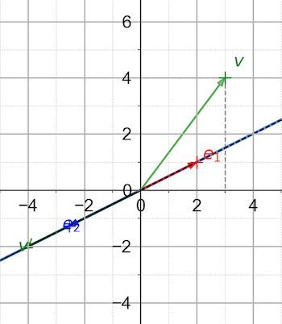
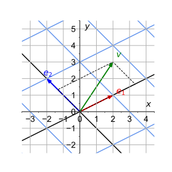

# Introduction to Linear Algebra

### **Part 2: Inverse Transformation and Change of Basis**

*Credit*: Many ideas of this material come from the [*Essence of Linear Algebra*][LA_3b1b] video series (by Grant Sanderson, a.k.a. 3Blue1Brown).

[LA_3b1b]: https://youtu.be/fNk_zzaMoSs

### **Contents**

- [Inverse of Linear Transformation and Matrix](#inverse-of-linear-transformation-and-matrix)
    - [Matrix Invertibility](#matrix-invertibility)
    - [Inverse of Product of Matrices](#inverse-of-product-of-matrices)
    - [EXERCISE](#exercise)
- [Change of Basis](#change-of-basis)
    - [Description of the New Basis](#description-of-the-new-basis)
    - [Components of Vectors along the New Basis](#components-of-vectors-along-the-new-basis)
    - [Matrix of Linear Transformation under the New Basis](#matrix-of-linear-transformation-under-the-new-basis)
    - [EXERCISE](#exercise-1)

## Inverse of Linear Transformation and Matrix

For a given linear transformation $A$, *if we can find* another transformation $B$ that completely *cancels* the effect of $A$, *and* $A$ completely cancels the effect of $B$, then we say that $A$ and $B$ are the **inverse of each other**. 

The matrix representation of $B$ is called the **inverse** of the matrix $A$. We shall use the notation $A^{-1}$ to denote both the inverse transformation and the inverse matrix.

Mathematically, "completely cancel" means

$$
A A^{-1} = A^{-1} A = 1
$$

where $1$ is the **identity transformation**, whose effect is no effect at all. Its matrix representation is called the **identity matrix**, the same under any choice of basis vectors:

$$
(1)_{ij} = \delta_{ij}
= \begin{bmatrix}
    1 & & \\
    & \ddots & \\
    & & 1
\end{bmatrix}
= \operatorname{diag}(1,...,1)
$$

*Remark*:

- Do *not* use $1/A$ to denote the inverse of $A$.

- Note that we used the expression "if we can find". This means that some linear transformation does *not* have its inverse.

- We state without proof that if a linear transformation is invertible, then **its inverse is unique**. 

Here we shall not teach you how to calculate the inverse of an arbitrary invertible matrix, which can be done by computers. 

### Matrix Invertibility

   
*A non-invertible 2D linear transformation*   
*(Screenshot from the linear transformation demo)*

Consider a linear transformation $A$. First suppose $A$ is in 2D, it is not difficult to understand if $A$ transforms the two basis vectors to the *same line* (see figure), then we *lost the information in one dimension*, since any linear combination of $A e_1, A e_2$ gives vectors on that same line. Thus the transformation will *not* be invertible. 

Similarly, for $A$ in 3D, if $A$ transforms the two basis vectors to the *same plane* (including the case when all basis vectors are transformed to the same line), then we lost the information in one (or even two) dimension(s). Then the transformation will *not* be invertible. 

Generalizing the idea above, we have the following criteria:

**An $n \times n$ matrix $A$ is invertible if and only if its columns  form a set of basis vectors of the $n$-dimensional vector space.**

This holds for any dimensions. 

### Inverse of Product of Matrices

When you invert a product of matrices, the order of the product sequence should be *reversed*, i.e.

$$
\left(A_1A_2 \cdots A_n\right){}^{-1}
= A_n^{-1} \cdots A_2^{-1} A_1^{-1}
$$

This is easy to understand if you think in terms of the transformations they represent. For example, consider the problem of putting an elephant into a refrigerator with closed doors. We need to do it in 3 steps:

|Operation|Represented by|
|-:|:-|
|Open the door|$A_1$|
|Move the elephant in|$A_2$|
|Close the door|$A_3$|

Is it obvious to you that $A_1, A_3$ are inverse of each other? Net effect: 

$$
\begin{aligned}
    &|\text{elephant in refrigerator} \rangle
    \\
    & \quad = 
    A_3 A_2 A_1 | \text{elephant out of refrigerator} \rangle
\end{aligned}
$$

The inverse operation is evidently

|Operation|Represented by|
|-:|:-|
|Open the door|$A_3^{-1}$|
|Move the elephant out|$A_2^{-1}$|
|Close the door|$A_1^{-1}$|

Net effect: 

$$
\begin{aligned}
    &|\text{elephant out of refrigerator} \rangle
    \\
    & \quad = 
    A_1^{-1} A_2^{-1} A_3^{-1} | \text{elephant in refrigerator} \rangle
\end{aligned}
$$

### EXERCISE

For a general $2 \times 2$ matrix
    
$$
A = \begin{bmatrix}
    a & b \\
    c & d
\end{bmatrix}
$$

Explicitly calculate $A^{-1}$. When will $A$ not be invertible?

## Change of Basis

Sometimes the standard basis may not be very convenient. Thus we naturally face the question of how to describe things using another set of basis vectors. It is expected that if we change to a new set of basis vectors:

- A vector will have different components 
- A linear transformation will be represented by a different matrix

In this section we shall show, in two dimensions, how to find the components of vectors and representation matrices of linear transformations under a new set of basis vectors. The generalization to higher dimensions is straightforward.

### Description of the New Basis

The new basis $e'_1, e'_2$ can always be described by their components along the old basis $e_1, e_2$ (which need not be the standard basis). In other words, the new basis is related to the old basis by a linear transformation $\mathcal{D}$:

$$
e'_1 = \mathcal{D} e_1 
= \begin{bmatrix}
    \mathcal{D}_{11} \\ \mathcal{D}_{21}
\end{bmatrix}, 
\quad
e'_2 = \mathcal{D} e_2
= \begin{bmatrix}
    \mathcal{D}_{12} \\ \mathcal{D}_{22}
\end{bmatrix}
$$

Thus the change from the old basis to the new basis is described by the matrix (under the old basis)

$$
\mathcal{D} = \begin{bmatrix}
    \mathcal{D}_{11} & \mathcal{D}_{12} \\
    \mathcal{D}_{21} & \mathcal{D}_{22}
\end{bmatrix}
$$

*Remark*: The inverse operation, i.e. change from the new basis to the old basis, is described by the inverse matrix $\mathcal{D}^{-1}$ (**under the new basis**).

### Components of Vectors along the New Basis

For an arbitrary vector, its components along the new and the old basis vectors are related by

$$
\begin{aligned}
    v 
    &= v_1 e_1 + v_2 e_2 
    &\quad &\text{(in old basis)}
    \\
    &= v'_1 e'_1 + v'_2 e'_2 
    &\quad &\text{(in new basis)}
    \\
    &= v'_1 \mathcal{D}e_1 + v'_2 \mathcal{D} e_2 
    \\
    &= \mathcal{D} (v'_1 e_1 + v'_2 e_2)
    &\quad &\text{(using linearity of $\mathcal{D}$)}
\end{aligned}
$$

Using the matrix notation to make the expression more clear:

$$
\begin{bmatrix}
    v_1 \\ v_2
\end{bmatrix}
= \mathcal{D} \begin{bmatrix}
    v'_1 \\ v'_2
\end{bmatrix}
$$

Thus the components of $v$ along the new basis are given by

$$
\begin{bmatrix}
    v'_1 \\ v'_2
\end{bmatrix} = \mathcal{D}^{-1}
\begin{bmatrix}
    v_1 \\ v_2
\end{bmatrix} 
\quad \text{or} \quad
v' = \mathcal{D}^{-1} v
$$

where $v' \equiv v'_1 e_1 + v'_2 e_2$ is the vector constructed using the *new* components and the *old* basis vectors.

### Matrix of Linear Transformation under the New Basis

In the *basis-free* language, for an arbitrary vector $v \in V$, a linear transformation $A$ sends it to another vector $w \in V$:

$$
w = A v
$$

In the old basis ("un-primed"), we have the matrix form

$$
\begin{bmatrix}
    w_1 \\
    w_2
\end{bmatrix} 
= \begin{bmatrix}
    A_{11} & A_{12} \\
    A_{21} & A_{22}
\end{bmatrix}
\begin{bmatrix}
    v_1 \\
    v_2
\end{bmatrix} 
\quad \text{or} \quad 
w = A v
$$

In the new basis, we have a similar expression (with all elements "primed")

$$
\begin{bmatrix}
    w'_1 \\
    w'_2
\end{bmatrix} 
= \begin{bmatrix}
    A'_{11} & A'_{12} \\
    A'_{21} & A'_{22}
\end{bmatrix}
\begin{bmatrix}
    v'_1 \\
    v'_2
\end{bmatrix}
\quad \text{or} \quad 
w' = A' v'
$$

The matrix $A'$ is exactly the representation of the transformation $A$ under the new basis. Remember that

$$
w' = \mathcal{D}^{-1} w , \quad
v' = \mathcal{D}^{-1} v
$$

Then we obtain

$$
\begin{aligned}
    \mathcal{D}^{-1} w 
    &= A' \mathcal{D}^{-1} v
    \\
    &= \mathcal{D}^{-1} A v \qquad (w = A v)
\end{aligned}
$$

Since $v$ is arbitrary, we must have

$$
A' \mathcal{D}^{-1} = \mathcal{D}^{-1} A
$$

Multiply both sides by $\mathcal{D}$ *on the right*, we obtain the new representation matrix $A'$:

$$
A' = \mathcal{D}^{-1} A \mathcal{D}
$$

*Remark*: If two matrices $A,B$ are related by a change of basis, i.e.

$$
B=\mathcal{D}^{-1}A \mathcal{D}
$$

we say that $A$ and $B$ are **similar** to each other (the word "similar" is chosen for obvious reasons). The "sandwich" operation $\mathcal{D}^{-1}A \mathcal{D}$ is called a **similarity transformation**.

### EXERCISE

   
*An example of change of basis*

From the information of the figure above:

- Write down the matrix $\mathcal{D}$ representing the change of basis from the standard $e_x, e_y$ to $e_1, e_2$.

- Calculate the new components of the vector $v$. You may find $\mathcal{D}^{-1}$ using a computer. Check if your result agrees with the figure.
