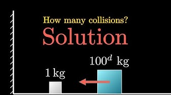

# Introduction to Linear Algebra 

### **Part 3: Eigenvalues and Eigenvectors**

*Credit*: Many ideas of this material comes from the [*Essence of Linear Algebra*][LA_3b1b] video series (by Grant Sanderson, a.k.a. 3Blue1Brown).

[LA_3b1b]: https://youtu.be/fNk_zzaMoSs

### **Contents**

- [Eigenvalues and Eigenvectors](#eigenvalues-and-eigenvectors)
    - [Definitions](#definitions)
    - [The Number $i$ and Rotation](#the-number-i-and-rotation)
    - [Eigen-Decomposition](#eigen-decomposition)
    - [Application: An Collision Problem](#application-an-collision-problem)
- [Things Omitted in This Introduction](#things-omitted-in-this-introduction)

## Eigenvalues and Eigenvectors

### Definitions

### The Number $i$ and Rotation

### Eigen-Decomposition

### Application: An Collision Problem

(This problem is borrowed from the 3b1b video [*The most unexpected answer to a counting puzzle*](https://youtu.be/HEfHFsfGXjs).)

There is a [more geometrical solution](https://youtu.be/jsYwFizhncE) to this problem. But nevertheless, I will make use of eigen-decomposition of matrices (which is more tedious) to lead to the same geometric picture, and show the power of algebra. 

Let us call the big block 1, and the small block 2, and take right as the positive direction of velocity. Let $v_1^{(n)}, v_2^{(n)}$ be the velocities of 1,2 after the $n$th collision. The initial state is

$$
v_1^{(0)} = -v_0 < 0, \quad
v_2^{(0)} = 0
$$

The sequence of collision events is

$$
\begin{aligned}
    &\text{1 and 2 $\to$ 2 and Wall $\to$ 1 and 2 $\to \cdots$}
    \\
    &\cdots \to
    \begin{cases}
        \text{2 and Wall (end)} \\
        \text{2 and Wall $\to$ 1 and 2 (end)}
    \end{cases}
\end{aligned}
$$

We see that there are two possible endings. When the collision ends, we must have

$$
v_1^{(n)} \ge v_2^{(n)} \ge 0
$$

Now let us find the relation between $v_{1,2}^{(n)}$ and $v_{1,2}^{(n+1)}$. 

- When $n = 0,2,4,...$ (even), the next collision happens between $A$ and $B$. Using conservation of linear momentum and energy, we obtain
    
    $$
    \begin{aligned}
        m_1 v_1^{(n)} + m_2 v_2^{(n)}
        &= m_1 v_1^{(n+1)} + m_2 v_2^{(n+1)}
        \\
        \frac{1}{2} m_1 v_1^{(n)2}
        + \frac{1}{2} m_2 v_2^{(n)2}
        &= \frac{1}{2} m_1 v_1^{(n+1)2}
        + \frac{1}{2} m_2 v_2^{(n+1)2}
    \end{aligned}
    $$

    Solving this set of equations, we obtain the familiar result ($a \equiv m_1 / m_2$)

    $$
    \begin{aligned}
        v_1^{(n+1)} &= \frac{a-1}{a+1} v_1^{(n)}
        + \frac{2}{a+1} v_2^{(n)}
        \\
        v_2^{(n+1)} &= \frac{2a}{a+1} v_1^{(n)}
        + \frac{-a+1}{a+1} v_2^{(n)}
    \end{aligned}
    $$

    Let us put it *in matrix form*: define

    $$
    v^{(n)} \equiv \begin{bmatrix}
        v_2^{(n)} \\ v_1^{(n)}
    \end{bmatrix}, \quad
    P = \frac{1}{a+1} \begin{bmatrix}
        a-1 & 2 \\
        2a & -a+1
    \end{bmatrix}
    $$

    Then we can elegantly write

    $$
    v^{(n+1)} = P v^{(n)} \qquad n = 0,2,4,...
    $$

- When $n = 1,3,5,...$ (odd), the next collision happens between 2 and the wall. Things are easy in this case:
    
    $$
    v_1^{(n+1)} = v_1^{(n)}
    \qquad
    v_2^{(n+1)} = - v_2^{(n)}
    $$

    Defining the matrix 

    $$
    Q = \begin{bmatrix}
        1 & 0 \\
        0 & -1
    \end{bmatrix}
    $$

    We obtain

    $$
    v^{(n+1)} = Q v^{(n)} \qquad n = 1,3,5,...
    $$

Now we can use the $P,Q$ matrices to calculate the velocities after $n$ collisions:

$$
v^{(n)} = ... Q P Q P v^{(0)}
$$

First, consider the simpler case when there will be $n = 2k \, (k = 0,1,2,...)$ collisions. Then we combine $QP = S$, and

$$
v^{(2k)} = \underbrace{S \cdots S}_{k} v^{(0)} = S^k v^{(0)}
$$

The matrix elements of $S$ are

$$
S = \frac{1}{a+1}
\begin{bmatrix}
    a-1 & 2 \\
    -2a & a-1
\end{bmatrix}
$$

How can we calculate $S^k$? Now comes the trick of eigen-decomposition: luckily, the matrix $S$ can be diagonalized

$$
S = D \Lambda D^{-1}
$$

The eigenvalues (diagonal elements of $\Lambda$) are

$$
\lambda_1 = \lambda \equiv \frac{\sqrt{a}-i}{\sqrt{a}+i} , 
\qquad
\lambda_2 = \bar{\lambda} \equiv \frac{\sqrt{a}+i}{\sqrt{a}-i}
$$

We notice that $\lambda_2$ is the *complex conjugate* of $\lambda_1$. The eigenvectors (columns of the $D$ matrix) are 

$$
\begin{aligned}
    D = \begin{bmatrix}
        i/\sqrt{a} & -i/\sqrt{a} \\
        1 & 1
    \end{bmatrix} 
    \, \Rightarrow \,
    D^{-1} = \frac{1}{2} \begin{bmatrix}
        -i\sqrt{a} & 1 \\
        i\sqrt{a} & 1
    \end{bmatrix}
\end{aligned}
$$

Then 

$$
\begin{aligned}
    S^k &= (D \Lambda D^{-1})^k
    \\
    &= D \Lambda D^{-1} D \Lambda D^{-1} \cdots D \Lambda D^{-1}
    \\
    &= D \Lambda^k D^{-1}
\end{aligned}
$$

But since $\Lambda$ is diagonal, finding its power is easy:

$$
\Lambda^k = \begin{bmatrix}
    \lambda^k & 0 \\
    0 & \bar{\lambda}^{k}
\end{bmatrix}
$$

Thus (we omit some details of the calculation here and just give the result)

$$
v^{(2k)} = S^k v^{(0)} 
= \frac{v_0}{2}
\begin{bmatrix}
- (\lambda^k + \bar{\lambda}^k)
\\
i \sqrt{a} (\lambda^k - \bar{\lambda}^k)
\end{bmatrix}
$$

To further simplify the expression, we make use of the exponential notation of complex numbers: let

$$
\lambda = r e^{-i \theta} = r (\cos \theta - i \sin \theta)
$$

We add a minus sign before $\theta$ for convenience later. Obviously $r = |\lambda| = 1$; to determine $\theta$, we rewrite $\lambda$ as

$$
\begin{aligned}
    \lambda &\equiv \frac{\sqrt{a}-i}{\sqrt{a}+i}
    = \frac{(\sqrt{a}-i)^2}{(\sqrt{a}+i)(\sqrt{a}-i)}
    \\
    &= \frac{(a - 1) - 2 \sqrt{a} i}{a + 1}
\end{aligned}
$$

Thus

$$
\tan \theta 
= \frac{2 \sqrt{a}}{a - 1}
$$

i.e. $\theta$ is an angle between $0$ and $\pi/2$. Then (recall that $v_1^{(0)} < 0$)

$$
\begin{aligned}
    v^{(2k)} &= \frac{v_0}{2}
    \begin{bmatrix}
        - (e^{-ik\theta} + e^{ik\theta}) \\
        i \sqrt{a} (e^{-ik\theta} - e^{ik\theta})
    \end{bmatrix}
    \\
    &= v_0 \begin{bmatrix}
        - \cos k\theta \\
        \sqrt{a} \sin k\theta
    \end{bmatrix}
\end{aligned}
$$

And, if the collision already stops at $n = 2k-1 \, (k = 1,2,...)$, we simply reverse the direction of $v_2$ and write

$$
v^{(2k-1)} = P^{-1} v^{(2k)}
= v_0 \begin{bmatrix}
    -\cos k \theta \\
    - \sqrt{a} \sin k \theta
\end{bmatrix}
$$

The $\sqrt{a}$ factor in the second slot of the column vector $v_2$ is especially annoying; let us get rid of it by defining an new column vector

$$
V^{(n)} \equiv \frac{1}{v_0} 
\begin{bmatrix}
    v_1^{(n)} \\ v_2^{(n)} / \sqrt{a}
\end{bmatrix}
$$

Then

$$
\begin{aligned}
    V^{(2k)} &= \begin{bmatrix}
        -\cos k\theta \\ \sin k\theta
    \end{bmatrix} &\quad &k = 0,2,4,...
    \\
    V^{(2k-1)} &= \begin{bmatrix}
        -\cos k\theta \\ -\sin k\theta
    \end{bmatrix} &\quad &k = 1,3,5...
\end{aligned} 
$$

Do you notice that $V^{(n)}$ is always on the *unit circle*? The collision stops at $v_1^{(n)} \ge v_2^{(n)} \ge 0$. In terms of the components of $V^{(n)}$, this condition reads

$$
0 \le V_2 \le \frac{V_1}{\sqrt{a}}
$$

Here comes Grant Sanderson's geometric picture. 

## Things Omitted in This Introduction

Here I list some topics that are important but will not be needed in this course, some of which are covered in the *Essence of Linear Algebra* series:

- **Cramer's rule** of solving linear equations ([Episode 12](https://youtu.be/jBsC34PxzoM) of *Essence of Linear Algebra* gives a *very beautiful* proof of it, using the geometric meaning of determinants) 

- **Singular value decomposition** of matrices