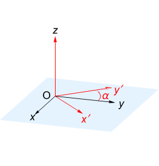
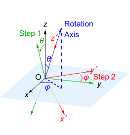
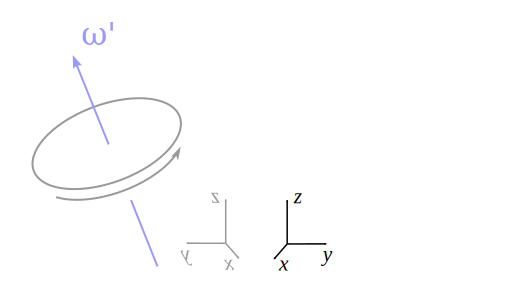

# Angular Velocity and Cross Product

### **Contents**

- [Matrix Representation of Rotations](#matrix-representation-of-rotations)
    - [Rotation Around the Coordinate Axes](#rotation-around-the-coordinate-axes)
    - [Matrix for Arbitrary 3D Rotations](#matrix-for-arbitrary-3d-rotations)
    - [EXERCISE](#exercise)
- [Angular Velocity Matrix and Vector](#angular-velocity-matrix-and-vector)
- [Cross Product](#cross-product)
    - [EXERCISE](#exercise-1)
- [Angular Velocity under Reflections](#angular-velocity-under-reflections)
    - [EXERCISE](#exercise-2)

*(We shall not consider the complicated case where the direction of rotation axis changes with time. An example is [**precession**](https://en.wikipedia.org/wiki/Precession).)*

In most introductory courses on classical mechanics, the teachers simply tell students the following "facts":

- For a point rotating around a *fixed* axis (rotation angle =
$\alpha (t)$), the **angular velocity** $\boldsymbol{\omega}(t)$ is a *vector* of

    - Magnitude: $\omega(t) = d\alpha (t)/dt$
    
    - Direction: Parallel to the axis of rotation, determined by some "**right-hand rule**"

- With the above definition of $\boldsymbol{\omega}$, The linear velocity $\boldsymbol{v}(t)$ of the point can be found by some *mysterious* operation called the **cross product**, defined by

    $$
    \boldsymbol{v}
    = \boldsymbol{\omega} \times \boldsymbol{r}
    =\det \begin{bmatrix}
        e_x & \omega_1 & r_1 \\
        e_y & \omega_2 & r_2 \\
        e_z & \omega_3 & r_3
    \end{bmatrix} 
    = \begin{bmatrix}
        \omega_2 r_3 - \omega_3 r_2 \\
        \omega_3 r_1 - \omega_1 r_3 \\
        \omega_1 r_2 - \omega_2 r_1
    \end{bmatrix}
    $$

To really understand how people "invented" the angular velocity vector and cross product, you must use the correct mathematical language to describe rotations. You know that rotations are *linear transformations*, so we should speak in terms of matrices and vectors.

After going through this material, the *most important* (and maybe surprising to you, or any starters) thing you should remember is:

**The angular velocity is not a vector!**

## Matrix Representation of Rotations

### Rotation Around the Coordinate Axes

   
*Rotation around the $z$-axis by angle $\alpha$*

The matrix of rotation by an angle $\alpha$ ($\alpha >0$ for counter-clockwise rotations) around the $z$-axis (under the standard basis) is

$$
R_z(\alpha)
= \begin{bmatrix}
    \cos  \alpha  & -\sin  \alpha  & 0 \\
    \sin  \alpha  & \cos  \alpha  & 0 \\
    0 & 0 & 1
\end{bmatrix}
$$

You can easily derive it by the meaning of the columns of a transformation matrix. 

Similarly, you can show that the rotation matrix around $x$-axis and $y$-axis (under the standard basis) are, respectively

$$
R_x(\alpha) 
= \begin{bmatrix}
    1 & 0 & 0 \\
    0 & \cos  \alpha  & -\sin  \alpha  \\
    0 & \sin  \alpha  & \cos  \alpha
\end{bmatrix}
, \,
R_y(\alpha)
= \begin{bmatrix}
    \cos  \alpha  & 0 & \sin  \alpha  \\
    0 & 1 & 0 \\
    -\sin  \alpha  & 0 & \cos  \alpha
\end{bmatrix}
$$

### Matrix for Arbitrary 3D Rotations

Every rotation in 3D space can be determined by 3 quantities:

- **The direction** of the rotation axis, specified by the **polar angle** $\theta$ and the **azimuth angle** $\varphi$ (collectively denoted by $n = (\theta, \varphi)$)

- **The angle of rotation** $\alpha$ around the rotation axis

To obtain the general rotation matrix (denoted by $R_n( \alpha)$), we proceed in the following way:

1. **Change basis so that the rotation axis *coincides* with the $z$-axis**

    We first rotate the old basis $K = \{e_i\}$ by $\theta$ around the old $y$-axis, then rotate around the old $z$-axis by an angle $\varphi$ to get the new basis $K' = \{e'_i\}$. 
    
    This change of basis is described by the matrix

    $$
    \mathcal{D}_n
    = R_z(\varphi) R_y(\theta)
    $$

2. **Rotate the object around the new $z$-axis**

    The new basis $K'$ is still an orthonormal basis, so the three basis rotation matrices $R_i(\alpha) \, (i=x,y,z)$ are not changed. The problem is now reduced to the rotation around the new $z$-axis by an angle $\alpha$, described by

    $$ R_z(\alpha)$$

   
*Two steps to obtain the new basis*

From the theory of change of basis, the new representation matrix $R_z(\alpha)$ is related to the old one $R_n(\alpha)$ by the similar transformation

$$
R_z(\alpha)
= \mathcal{D}^{-1}_n R_n(\alpha) \mathcal{D}_n
$$

Therefore, the **general 3D rotation matrix** around the axis along direction $n = (\theta,\varphi)$ by angle $\alpha$ is

$$
\begin{aligned}
    R_n(\alpha)
    &= \mathcal{D}_n
    R_z(\alpha) \mathcal{D}^{-1}_n
    \\
    &= R_z(\varphi) R_y(\theta) R_z(\alpha)
    R_y^{-1}(\theta) R_z^{-1}(\varphi)
\end{aligned}
$$

### EXERCISE

- Derive the matrices $R_x(\theta), R_y(\theta), R_z(\theta)$.

- Using properties of trigonometric functions, verify that 
    
    $$
    \begin{aligned}
        R_i^{-1}(\alpha) &= R_i(-\alpha) \\
        R_i(\alpha + \beta) &= R_i(\alpha) R_i(\beta)
        \\
        &= R_i(\beta) R_i(\alpha) 
    \end{aligned}
    \qquad i = x,y,z
    $$

    Are these results trivial to you?

- Using geometrical properties of rotation, show that for the general rotation matrix $R_n(\alpha)$:

    - $R_n^\mathsf{T}(\alpha) R_n(\alpha) = 1$ (rotation matrices are **orthogonal matrices**).

        *Remark*: Calculating the inverse of a rotation matrix is now easy: we only need to exchange its columns and rows:

        $$
        R^{-1} = R^\mathsf{T}
        $$

    - $\det R=1$ (With both properties, it will be called a **special** orthogonal matrix).
    
    - $R_n(\alpha)$ only has one real eigenvalue 1 (*Question: what is the corresponding eigenvector?*)

## Angular Velocity Matrix and Vector

To find the linear velocity of the rotating object at $\boldsymbol{r}(t)$, recall that (assume that the rotation starts at time $t = 0$)

$$
\boldsymbol{r}(t)
= R_n(\alpha (t))
\boldsymbol{r}(0)
\qquad \alpha (0)=0
$$

Now we want to calculate the *instantaneous* linear velocity at time $t_0$:

$$
\boldsymbol{v}(t_0) 
\equiv 
\frac{d\boldsymbol{r}(t_0)}{dt}
= \frac{dR _n(\alpha (t_0))}{dt}
\boldsymbol{r}(0)
$$

We separate the rotation to two steps:

$$
R_n(\alpha(t))
= R_n(\alpha(t)-\alpha(t_0))
R_n(\alpha(t_0))
$$

Then $[\alpha(t)-\alpha(t_0)]_{t=t_0} = 0$, and we now define the **angular velocity matrix**:

$$
\omega(t_0) \equiv \left[
    \frac{dR_n(\alpha(t)-\alpha(t_0))}{dt}
\right]_{t=t_0}
$$

Its matrix elements are

$$
\begin{aligned}
    \omega(t_0)
    &= R_z(\varphi) R_y(\theta) \left[
    \frac{d R_z(\alpha(t)-\alpha(t_0))}{dt}
    \right]_{t=t_0} R_y^{-1}(\theta) R_z^{-1}(\varphi)
    \\
    &= R_z(\varphi) R_y(\theta) \begin{bmatrix}
        0 & -\omega(t_0) & 0 \\
        \omega(t_0) & 0 & 0 \\
        0 & 0 & 0 
    \end{bmatrix}
    R_y(-\theta) R_z(-\varphi)
    \\
    &= \begin{bmatrix}
        0 & -\omega _3 & \omega _2 \\
        \omega _3 & 0 & -\omega _1 \\
        -\omega _2 & \omega _1 & 0
    \end{bmatrix}
\end{aligned}
$$

where

$$
\begin{aligned}
    \omega_1 = \omega_{32} 
    & = \omega(t_0) \sin \theta \cos \varphi 
    \\
    \omega_2 = \omega_{13} 
    & = \omega(t_0) \sin \theta \sin \varphi 
    \\
    \omega_3 = \omega_{21} 
    & = \omega(t_0)  \cos \theta
\end{aligned} \qquad
\omega(t_0) = \frac{d\alpha(t_0)}{dt}
$$

If you are familiar with the spherical polar coordinates, you should immediately recognize that these three elements are exactly the Cartesian components of a *vector* $\boldsymbol{\omega}$. The direction of $\boldsymbol{\omega}$ is *parallel to the rotation axis*. We then define the *combination of this three numbers* as the **angular velocity vector**. 

Then the linear velocity $\boldsymbol{v}(t_0)$ is given by

$$
\begin{aligned}
    \boldsymbol{v}(t_0)
    &= \omega(t_0) R_n(\alpha(t_0)) \boldsymbol{r}(0)
    \\
    &= \omega(t_0) \boldsymbol{r}(t_0)
\end{aligned}
$$

Since this holds for any time $t_0$, we can finally remove the subscript 0 and directly write

$$
\boldsymbol{v}(t) = \omega(t) \boldsymbol{r}(t)
$$

$\omega(t)$ here is the angular velocity *matrix*.

*Remark*: We see that the angular velocity matrix has one notable property

$$
\omega_{i j}=-\omega_{j i}
$$

Such matrices are said to be **anti-symmetric**.

## Cross Product

After we rewrite the matrix $dR/dt$ using the three numbers
$\omega_i (i=1,2,3)$, the linear velocity can be expressed as

$$
\begin{aligned}
    \boldsymbol{v}
    = \omega_{i j} r_j 
    &= \begin{bmatrix}
        0 & -\omega_3 & \omega_2 \\
        \omega_3 & 0 & -\omega_1 \\
        -\omega_2 & \omega_1 & 0
    \end{bmatrix} \begin{bmatrix}
        r_1 \\
        r_2 \\
        r_3
    \end{bmatrix}
    \\
    &= \begin{bmatrix}
        \omega_2 r_3 - \omega_3 r_2 \\
        \omega_3 r_1 - \omega_1 r_3 \\
        \omega_1 r_2 - \omega_2 r_1
    \end{bmatrix}
\end{aligned}
$$

This *defines* the formula of **cross product**:

$$
\boldsymbol{\omega} \times \boldsymbol{r}
= \begin{bmatrix}
    \omega_2 r_3 - \omega_3 r_2 \\
    \omega_3 r_1 - \omega_1 r_3 \\
    \omega_1 r_2 - \omega_2 r_1
\end{bmatrix}
$$

### EXERCISE

Please verify that

$$
M = \begin{bmatrix}
    a_1 & a_2 & a_3 \\
    b_1 & b_2 & b_3 \\
    c_1 & c_2 & c_3
\end{bmatrix}
\Rightarrow 
\det M = \boldsymbol{a}\cdot (\boldsymbol{b}\times \boldsymbol{c})
$$

## Angular Velocity under Reflections

Now you should know that the angular velocity *matrix* is the more natural quantity, and the angular velocity *vector* is just some derived object. But there must be some reason why people treat it as a vector under most cases.

In fact, under *rotations* of the object, the angular velocity vector behaves exactly the same as the position vector (which is, *by definition*, a *true* vector). However, it will betray itself under *reflections*. 

Consider for simplicity the reflection about the $xz$-plane. You can apply the right-hand rule in a mirror to have a feeling about this minus sign.

   
*A rotating disc and its image in the mirror*

Let us see whether we can mathematically derive it using the angular velocity *matrix*. The transformation matrix of the $xz$-reflection is

$$
P_y = \begin{bmatrix}
    1 & 0 & 0 \\
    0 & -1 & 0 \\
    0 & 0 & 1
\end{bmatrix}
$$

You should be able to write it down quickly using the meaning of the three columns of the matrix. Its inverse is obviously itself.

In the mirror (reflected world), since $\boldsymbol{v}$ and $\boldsymbol{r}$ are both "true" vectors, we have

$$
\begin{aligned}
    &\boldsymbol{r}' = P_y\boldsymbol{r}, \quad
    \boldsymbol{v}' = P_y\boldsymbol{v}
    \\ \\
    &\Rightarrow 
    \begin{bmatrix}
        x' \\
        y' \\
        z'
    \end{bmatrix}
    = \begin{bmatrix}
        x \\
        -y \\
        z
    \end{bmatrix}, \quad
    \begin{bmatrix}
        v_x' \\
        v_y' \\
        v_z'
    \end{bmatrix}
    = \begin{bmatrix}
        v_x \\
        -v_y \\
        v_z
    \end{bmatrix}
\end{aligned}
$$

However, the new $\boldsymbol{\omega}'$ vector must be extracted from the new $\omega'$ matrix, instead of applying $\boldsymbol{\omega}' = P_y\boldsymbol{\omega}$ (wrong). By definition

$$
\boldsymbol{v} = \omega \boldsymbol{r}
\Rightarrow 
\boldsymbol{v}' = \omega' \boldsymbol{r}'
$$

Note that here $\omega$ and $\omega'$ are both angular velocity matrices, not angular speed. Then

$$
P_y\boldsymbol{v}=\omega' P_y\boldsymbol{r}
$$

The left-hand side is again equal to $P_y\omega  \boldsymbol{r}$. Therefore, 

$$
P_y\omega \boldsymbol{r} = \omega'P_y \boldsymbol{r}
$$

Since this is true for *any* position $\boldsymbol{r}$, we obtain the following rule:

$$
\begin{aligned}
    &P_y \omega = \omega' P_y
    \\
    &\Rightarrow  \omega'
    = P_y \omega  P_y^{-1}
    = \begin{bmatrix}
        0 & \omega_3 & \omega_2 \\
        -\omega_3 & 0 & \omega_1 \\
        -\omega_2 & -\omega_1 & 0
    \end{bmatrix}
\end{aligned}
$$

We remark that $\omega$ and $\omega'$ are related by a similarity transformation. Now we can read off the new angular velocity *vector*:

$$
\boldsymbol{\omega}' 
= \begin{bmatrix}
    -\omega_1 \\
    \omega_2 \\
    -\omega_3
\end{bmatrix}
= - P_y \boldsymbol{\omega}
$$

We find that there is an additional minus sign. In mathematics, objects like the angular velocity vector are called **pseudo-vectors**. You can read the corresponding [Wikipedia article](https://en.wikipedia.org/wiki/Pseudovector) to learn more about it.

### EXERCISE

Show that the angular velocity vector behaves in the same way as the position vector under rotations. You may need the general rotation matrix we found earlier.

