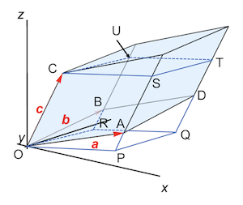

# Linear Transformation and Matrix

PHYS1110D Supplementary Material 1   

*Note*: The [*Essence of Linear Algebra*][link] video series (by Grant Sanderson, a.k.a. 3Blue1Brown) really helps when learning the mathematical concepts involved in this material.

[link]: https://youtu.be/fNk_zzaMoSs

## Vector Spaces and Basis Vectors

### Vector Spaces

For the purpose of an introductory physics course, a **vector space** (denoted by $V$) can be regarded as the usual plane (2D) or space (3D), and **vectors** are like arrows in the plane or the space. 

We can perform the following operations on vectors:

- **Addition** of vectors

- **Scalar multiplication** on a vector (by real numbers)

Later in your life you will have to deal with **complex numbers**, but now we restrict ourselves to the real world.

I will not show the general mathematical definition, which can be found on [Wikipedia][vec_space] or in any textbook on linear algebra (I personally recommend Chapter 7 and 8 of *Mathematical Methods for Physics and Engineering*).

[vec_space]: https://en.wikipedia.org/wiki/Vector_space

### Basis Vectors

Each "**finite-dimensional**" vector space have a set of **basis vectors** $\{e_1,...,e_n\}$, so that any vector $v\in V$ can be *uniquely* represented as

$$
v = \sum_{i=1}^{n} v_i e_i
\qquad v_1,...,v_n\in \mathbb{R}
$$

The number of basis vectors $n$ is called the **dimension** of $V$ (denoted by $\dim V$). 

The number $v_i$ is called the **components** of the vector $v$ along the basis vector $e_i$. Then the vector $v$ can be also written as a **column vector** (without explicit reference to the basis vectors)

$$
v = \begin{bmatrix}
    v_1 \\ \vdots \\ v_n
\end{bmatrix}
$$

The choice of basis vectors is *not unique*: any set of **linearly-independent** $\dim{V}$ vectors can be used as basis vectors. By "linearly-independent", we mean that 

$$
\sum_{i=1}^n v_i e_i = 0 
\, \Leftrightarrow \,
v_1 = \cdots = v_n = 0
$$

*Remark*: the components of the $i$th basis vector are simply given by

$$
v_i = 1 , \quad \text{other components} = 0
$$

e.g. for $\dim{V} = 2$, we have

$$
e_1 = \begin{bmatrix}
    1 \\ 0
\end{bmatrix}, \quad
e_2 = \begin{bmatrix}
    0 \\ 1
\end{bmatrix}
$$

You must be aware that **this does not mean that they are the traditional unit vectors along the $x$, $y$, ... axes**. 

### Note on Notations: Einstein Summation Rule

People are tired of always writing the summation sign $\sum$. Thus the genius Einstein invented the following rule: 

**If an index appears twice, then sum over it.**

which allows people to throw away the summation signs. For example:

$$
\sum_i v_i e_i \to v_i e_i
$$

The index $i$ appears twice, thus we should sum over $i$. Unless there might be some ambiguity, we shall always adopt the Einstein summation rule in the following. 

In addition, we are free to choose which letter represents the index to be summed over:

$$
\sum_i v_i e_i = \sum_j v_j e_j  = \cdots
\, \Rightarrow \,
v_i e_i = v_j e_j = \cdots
$$

### Inner Product 

For two vectors $u,v\in V$, we can define an operation called the **inner product** (denoted by $u \cdot v$), which send two vectors *to a real number*: (below is the mathematical description of the same thing)

$$
\_ \cdot \_ : V \times V \to \mathbb{R}
$$

and have the following properties:

- **Symmetry**: $\forall \, u,v \in V$

    $$
    u \cdot v = v \cdot u
    $$

- **Linearity in the second argument**: $\forall \, u,v,w \in V ;\, \alpha,\beta \in \mathbb{R}$
    
    $$
    u \cdot (\alpha v + \beta w) 
    = \alpha (u \cdot v) + \beta(u \cdot w)
    $$

The two properties combined gives linearity in the first argument, too (show this by yourself; thus we say that the inner product is a **bi-linear** function):

$$
(\alpha v + \beta w) \cdot u
= \alpha (v \cdot u) + \beta(w \cdot u)
$$

*Remark*: Some concepts derived from the inner product

- Two vectors are said to be **orthogonal** to each other if their inner product is 0.
- The **length** of a vector $v$ is defined as $\sqrt{v \cdot v}$. 

### Orthonormal Basis Vectors

Until now we have not described how to really calculate the inner product. For two vectors $u,v \in V$

$$
u = u_i e_i, \quad v = v_i e_i
$$

Due to bi-liearity of inner product, $u \cdot v$ can be reduced to the linear combination of the inner product of basis vectors:

$$
u \cdot v = u_i v_j (e_i \cdot e_j)
$$

The numbers $e_i \cdot e_j$ are still undetermined, and depends on both the choice of basis vectors, which is *not unique*. Now we pick a *special* choice of basis vectors such that

$$
e_i \cdot e_j = \delta_{ij} 
= \begin{cases}
    1 & i = j \\
    0 & i \ne j
\end{cases}
$$

i.e. each basis vector has length 1, and is orthogonal to all other basis vectors. You can just imagine them as the unit vector along the $x$, $y$-axes. Such a set of basis vectors is called an **orthonormal basis**.

Then we recover something you already know:

$$
u \cdot v = u_i v_j \delta_{ij} = u_i v_i
$$

We emphasize that this definition is valid only when we are using the components of $u,v$ under an orthonormal set of basis.

## Linear Transformations

A **linear transformation** (denoted by $A$) on a $V$ maps a vector $u \in V$ to another vector $v = Au \in V$:

$$
A: V \to V
$$

The transformation must satisfy the following two *defining* requirements (called the **linearity conditions**):

- $\forall \, u, v\in V \quad A(u + v)=A u + A v$

- $\forall \, v\in V, c\in \mathbb{C} \quad A(c u) = c (A u)$

In other words, it does not matter whether you perform linear transformations before or after vector addition and scalar multiplication. 

### Matrix Representation of Linear Transformations

Due to the linearity, a linear transformation $A$ can be *fully* described by specifying its action $e_i \to A e_i$ on *each* basis vector ($i = 1, ..., n$). Then for any vector $v$, we have

$$
A v = A (v_i e_i) = v_i (A e_i)
$$

Nothing prevents us to express $A e_i$ as linear combination of the basis vectors: 

$$
e'_i = A e_i = e_j A_{j i} \qquad (i = 1, ..., n)
$$

The numbers $A_{j i}$ are linear combination coefficients. We do not write $A_{i j} e_j$, which is just a matter of convention. 

For example, when $\dim{V} = 2$:

$$
\begin{aligned}
    e'_1 &= A e_1 = A_{11} e_1 + A_{21} e_2
    = \begin{bmatrix}
        A_{11} \\ A_{21}
    \end{bmatrix}
    \\
    e'_2 &= A e_2 = A_{12} e_1 + A_{22} e_2
    =\begin{bmatrix}
        A_{12} \\ A_{22}
    \end{bmatrix}
\end{aligned}
$$

Then we combine this two column vectors to form a **matrix** that represents the linear transformation $A$:

$$
A = \begin{bmatrix}
    A_{11} & A_{12} \\
    A_{21} & A_{22}
\end{bmatrix} \quad
\text{(under the basis $\{e_1, e_2\}$)}
$$

In this construction, $A_{i j}$ means the matrix element at the $i$th row and the $j$th column.

Remember the meaning of each column of the transformation matrix: **the $i$th column is the transformation result of the $i$th basis vector**. 

### Examples of Linear Transformations (in 2D)

- **Rotation**

- **Reflection**

- **Scaling (Dilation)**

*Remark*: **Translation** ($T: v \to v + t$, where $t$ is the translation vector) is not a linear transformation! You can easily verify, for two vectors $v, w \in V$

$$
\left.
\begin{aligned}
    T (v + w) &= (v + w) + t
    \\
    T v + T w &= (v + w) + 2t
\end{aligned}
\right\} \Rightarrow
T(v + w) \ne Tv + Tw
$$

You can read [this Wikipedia entry][affine_trans] to see how to use matrices *in $(d+1)$ dimension* to represent $d$-dimensional translations. 

[affine_trans]: https://en.wikipedia.org/wiki/Affine_transformation#Representation

## Matrix-Vector Multiplication

Using the linearity $A$, we can find the new vector $A v$ to which the vector $v$ is sent by the linear transformation $A$: 

$$
\begin{aligned}
    v' &= Av = A(v_j e_j) = v_j (A e_j)
    \\
    &= v_j (e_i A_{i j}) = (A_{i j} v_j) e_i
\end{aligned}
$$

Therefore, the components of $A v$ are given by

$$
(A v)_i = A_{i j} v_j
$$

This is *defined* as the rule of the multiplication of matrix $A$ and column vector $v$.

For example, when $\dim{V} = 2$:

$$
A v =
\begin{bmatrix}
    A_{11} & A_{12} \\
    A_{21} & A_{22}
\end{bmatrix}
\begin{bmatrix}
    v_1 \\
    v_2
\end{bmatrix}
= \begin{bmatrix}
    A_{11} v_1 + A_{12} v_2 \\
    A_{21} v_1 + A_{22} v_2
\end{bmatrix}
$$

### EXERCISE

Compute the components of $A v$ when

$$
A = \begin{bmatrix}
    3 & 1 \\
    1 & 2
\end{bmatrix} \quad
v = \begin{bmatrix}
    -1 \\ 2
\end{bmatrix}
$$

## Matrix Product

Suppose we have two linear transformations $A, B$. We first apply $B$ onto a vector $v$, then apply $A$. The result is

$$
\begin{aligned}
    [A (B v)]_{i}
    = A_{i j} (B v)_{j}
    = A_{i j} (B_{j k} v_k)
    = A_{i j} B_{j k} v_k
\end{aligned}
$$

We discover that if we define a new matrix $C$ by

$$
C_{i k} \equiv A_{i j} B_{j k}
$$

We obtain

$$
[A(B v)]_i = C_{ik} v_k
$$

This means that *$C$ is the representation matrix of the combined transformation $AB$*. Thus we define that the **product** of the representation matrices $A, B$ is given by

$$
(AB)_{i k} \equiv A_{i j} B_{j k}
$$

For example, when $\dim{V} = 2$

$$
AB = \begin{bmatrix}
    A_{11} B_{11} + A_{12} B_{21} & A_{11} B_{12} + A_{12} B_{22} \\
    A_{21} B_{11} + A_{22} B_{21} & A_{21} B_{12} + A_{22} B_{22}
\end{bmatrix}
$$

### EXERCISE

The matrix product defined in this way has the following properties:

- **Associativity**: $(AB)C = A(BC)$
- **Non-commutativity**: In general $AB \ne BA$

Please prove (or verify) them. 

## Determinant of a Matrix

   
*Geometric meaning of 2D determinant*

## Matrix Inversion

Here we shall not teach you how to calculate the inverse of an arbitrary invertible matrix, which can be done by computers. 

### Determinant and Matrix Invertibility

**A (square) matrix $A$ is invertible if and only if $\det{A} \ne 0$.**

### Inverse of Product of Matrices

When you invert a product of matrices, the order of the product sequence should be *reversed*, i.e.

$$
\left(A_1A_2 \cdots A_n\right){}^{-1}=\left(A_n\right){}^{-1} \cdots \left(A_2\right){}^{-1}\left(A_1\right){}^{-1}
$$

This is easy to understand if you think in terms of the transformations they represent. For example, consider the problem of putting an elephant into a refrigerator with closed doors. We need to do it in 3 steps:

|Operation|Represented by|
|-:|:-|
|Open the door|$A_1$|
|Move the elephant in|$A_2$|
|Close the door|$A_3$|

Is it obvious to you that $A_1, A_3$ are inverse of each other? Net effect: 

$$
\begin{aligned}
    &|\text{elephant in refrigerator} \rangle
    \\
    & \quad = 
    A_3 A_2 A_1 | \text{elephant out of refrigerator} \rangle
\end{aligned}
$$

The inverse operation is evidently

|Operation|Represented by|
|-:|:-|
|Open the door|$A_3^{-1}$|
|Move the elephant out|$A_2^{-1}$|
|Close the door|$A_1^{-1}$|

Net effect: 

$$
\begin{aligned}
    &|\text{elephant out of refrigerator} \rangle
    \\
    & \quad = 
    A_1^{-1} A_2^{-1} A_3^{-1} | \text{elephant in refrigerator} \rangle
\end{aligned}
$$

## Change of Basis

It is expected that if we change to a new set of basis vectors:

- A vector will be represented by different components 
- A linear transformation will be represented by a different matrix

In this section we shall show how to find the representation of vectors and linear transformations under a new set of basis vectors. 

### Description of the New Basis

The new basis $e'_1, e'_2$ can always be described by their components along the old basis $e_1, e_2$. In other words, the new basis is related to the old basis by a linear transformation $\mathcal{D}$:

$$
e'_1 = \mathcal{D} e_1 
= \begin{bmatrix}
    \mathcal{D}_{11} \\ \mathcal{D}_{21}
\end{bmatrix}, 
\quad
e'_2 = \mathcal{D} e_2
= \begin{bmatrix}
    \mathcal{D}_{12} \\ \mathcal{D}_{22}
\end{bmatrix}
$$

Thus the change from the old basis to the new basis is described by the matrix (under the old basis)

$$
\mathcal{D} = \begin{bmatrix}
    \mathcal{D}_{11} & \mathcal{D}_{12} \\
    \mathcal{D}_{21} & \mathcal{D}_{22}
\end{bmatrix}
$$

*Remark*: The inverse operation, i.e. change from the new basis to the old basis, is described by the matrix (under the *new* basis) $\mathcal{D}^{-1}$.

### Components of Vectors along New Basis

For an arbitrary vector, its components along the new and the old basis vectors are related by

$$
\begin{aligned}
    v 
    &= v_1 e_1 + v_2 e_2 
    &\quad &\text{(in old basis)}
    \\
    &= v'_1 e'_1 + v'_2 e'_2 
    &\quad &\text{(in new basis)}
    \\
    &= v'_1 \mathcal{D}e_1 + v'_2 \mathcal{D} e_2 
    \\
    &= \mathcal{D} (v'_1 e_1 + v'_2 e_2)
    &\quad &\text{(using linearity of $\mathcal{D}$)}
\end{aligned}
$$

Using the matrix notation to make the expression more clear:

$$
\begin{bmatrix}
    v_1 \\ v_2
\end{bmatrix}
= \mathcal{D} \begin{bmatrix}
    v'_1 \\ v'_2
\end{bmatrix}
$$

Thus the components of $v$ along the new basis are given by

$$
\begin{bmatrix}
    v'_1 \\ v'_2
\end{bmatrix} = \mathcal{D}^{-1}
\begin{bmatrix}
    v_1 \\ v_2
\end{bmatrix} 
\quad \text{or} \quad
v' = \mathcal{D}^{-1} v
$$

where $v' \equiv v'_1 e_1 + v'_2 e_2$ is the vector constructed using the *new* components and the *old* basis vectors.

### Matrix of Linear Transformations under New Basis

In the *basis-free* language, for an arbitrary vector $v \in V$, a linear transformation $A$ sends it to another vector $w \in V$:

$$
w = A v
$$

In the old basis ("un-primed"), we have the matrix form

$$
\begin{bmatrix}
    w_1 \\
    w_2
\end{bmatrix} 
= \begin{bmatrix}
    A_{11} & A_{12} \\
    A_{21} & A_{22}
\end{bmatrix}
\begin{bmatrix}
    v_1 \\
    v_2
\end{bmatrix} 
\quad \text{or} \quad 
w = A v
$$

In the new basis, we have a similar expression (with all elements "primed")

$$
\begin{bmatrix}
    w'_1 \\
    w'_2
\end{bmatrix} 
= \begin{bmatrix}
    A'_{11} & A'_{12} \\
    A'_{21} & A'_{22}
\end{bmatrix}
\begin{bmatrix}
    v'_1 \\
    v'_2
\end{bmatrix}
\quad \text{or} \quad 
w' = A' v'
$$

The matrix $A'$ is exactly the representation of the transformation $A$ under the new basis. Remember that

$$
w' = \mathcal{D}^{-1} w , \quad
v' = \mathcal{D}^{-1} v
$$

Then we obtain

$$
\begin{aligned}
    \mathcal{D}^{-1} w 
    &= A' \mathcal{D}^{-1} v
    \\
    &= \mathcal{D}^{-1} A v \qquad (w = A v)
\end{aligned}
$$

Since $v$ is arbitrary, we must have

$$
A' \mathcal{D}^{-1} = \mathcal{D}^{-1} A
$$

Multiply both sides by $\mathcal{D}$ *on the right*, we obtain the new representation matrix $A'$:

$$
A' = \mathcal{D}^{-1} A \mathcal{D}
$$

*Remark*: If two matrices $A,B$ are related by a change of basis, i.e.

$$
B=\mathcal{D}^{-1}A \mathcal{D}
$$

we say that $A$ and $B$ are **similar** to each other (the word "similar" is chosen for obvious reasons). The "sandwich" operation $\mathcal{D}^{-1}A \mathcal{D}$ is called a **similarity transformation**.

## Appendix A:  Proof of Geometrical Meaning of Determinant

### 2D Determinant = Parallelogram Area

   
*Calculation of area of parallelogram ABCD*

We draw a line through point D parallel to the $x$ axis. Cut off the triangle DPC and move it to AQB. Now we obtain a new parallelogram AQPD, which has the same area as ABCD. 

However, since its base AQ is on the $x$ axis, the formula $A = ah$ can now be applied directly. The height of AQPD is obviously equal to $b_{y}$. It remains to find the base AQ.

Since BQ is parallel to $\boldsymbol{b}$, we can set

$$\overrightarrow{BQ} = \alpha\boldsymbol{b}$$

Then, from $\overrightarrow{OQ} = \overrightarrow{AB} + \overrightarrow{BQ} = \boldsymbol{a} + \alpha\boldsymbol{b}$, we obtain (for the $x,y$ components respectively)

$$
\left.
\begin{aligned}
    x_{Q} = a_{x} + \alpha b_{x} \\
    0 = a_{y} + \alpha b_{y}
\end{aligned}
\right\}
\, \Rightarrow \,
\left\{
\begin{aligned}
    &\alpha = - \frac{a_{y}}{b_{y}}
    \\
    &x_{Q} = a_{x} - \frac{a_{y}b_{x}}{b_{y}}
\end{aligned}
\right.
$$

Finally

$$
A = |x_{Q}| |b_{y}| 
= |a_{x}b_{y} - a_{y}b_{x}|
$$

### 3D Determinant = Parallelepiped Volume

   
*Calculation of area of parallelogram ABCD*

Let CSTU be the cross-section through C of the parallelepiped parallel to the $\text{xy}$-plane. We observe that if we move the part above CSTU to the bottom of the parallelepiped, we will get a new parallelepiped OPQR-CSTU (notice that OPQR is *in the* $\text{xy}$*-plane*), which has the same volume as the original parallelepiped.

Let the coordinates of P and R be respectively

$$P:\left( x_{P},\ y_{P},\ 0 \right),\ \ R:\left( x_{R},\ y_{R},\ 0 \right)$$

The vectors $\overrightarrow{AP}$ and $\overrightarrow{BR}$ are parallel to $\boldsymbol{c}$. Therefore, they can be expressed as

$$\overrightarrow{AP} = \alpha\boldsymbol{c},\ \ \overrightarrow{BR} = \beta\boldsymbol{c}$$

And the coordinates of P and Q can be found from

$$\overrightarrow{OP} = \overrightarrow{OA} + \overrightarrow{AP} = \boldsymbol{a} + \alpha\boldsymbol{c},\ \ \overrightarrow{OR} = \overrightarrow{OB} + \overrightarrow{BR} = \boldsymbol{b} + \beta\boldsymbol{c}$$

Therefore, we write

$$
\left\{
\begin{aligned}
    x_{P} = a_{x} + \alpha c_{x} \\
    y_{P} = a_{y} + \alpha c_{y} \\
    0 = a_{z} + \alpha c_{z} 
\end{aligned}
\right. ,
\quad
\left\{
\begin{aligned}
    x_{R} = b_{x} + \beta c_{x} \\
    y_{R} = b_{y} + \beta c_{y} \\
    0 = b_{z} + \alpha c_{z}
\end{aligned}
\right.
$$

from which we obtain

$$
\alpha = - \frac{a_{z}}{c_{z}} ,\quad
\beta = - \frac{b_{z}}{c_{z}}
$$

Therefore

$$
\left\{
\begin{aligned}
    x_{P} = a_{x} - \frac{a_{z}c_{x}}{c_{z}} \\
    y_{P} = a_{y} - \frac{a_{z}c_{y}}{c_{z}}
\end{aligned}
\right. , 
\quad
\left\{
\begin{aligned}
    x_{R} = b_{x} - \frac{b_{z}c_{x}}{c_{z}} \\
    y_{R} = b_{y} - \frac{b_{z}c_{y}}{c_{z}}
\end{aligned}
\right.
$$

Using the results for 2D, we immediately get

$$
\begin{aligned}
    &A_{\text{OPQR}} 
    = \det \begin{bmatrix}
        x_{P} & x_{R} \\
        y_{P} & y_{R}
    \end{bmatrix}
    \\
    &= \frac{1}{c_{z}}\left( a_{x}b_{y}c_{z} + a_{y}b_{z}c_{x} + a_{z}b_{x}c_{y} - a_{z}b_{y}c_{x} - a_{y}b_{x}c_{z} - a_{x}b_{z}c_{y} \right)
\end{aligned}
$$

The height of the new parallelepiped is evidently equal to $c_{z}$. Then, the volume $V$ is simply

$$
\begin{aligned}
    V &= A_{\text{OPQR}} \times c_{z} 
    \\
    &= a_{x}b_{y}c_{z} + a_{y}b_{z}c_{x} + a_{z}b_{x}c_{y} - a_{z}b_{y}c_{x} - a_{y}b_{x}c_{z} - a_{x}b_{z}c_{y}
\end{aligned}
$$

This defines the determinant

$$
V = \det \begin{bmatrix}
    a_{x} & b_{x} & c_{x} \\
    a_{y} & b_{y} & c_{y} \\
    a_{z} & b_{z} & c_{z} \\
\end{bmatrix}
$$
