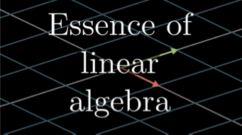
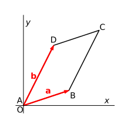
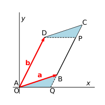

# Introduction to  Linear Algebra (Part 2)

*Note*: The [*Essence of Linear Algebra*][link] video series (by Grant Sanderson, a.k.a. 3Blue1Brown) really helps when learning the mathematical concepts involved in this material.

[link]: https://youtu.be/fNk_zzaMoSs

## Determinant of a Matrix

   
*Geometric meaning of 2D determinant*

## Matrix Inversion

Here we shall not teach you how to calculate the inverse of an arbitrary invertible matrix, which can be done by computers. 

### Determinant and Matrix Invertibility

**A (square) matrix $A$ is invertible if and only if $\det{A} \ne 0$.**

### Inverse of Product of Matrices

When you invert a product of matrices, the order of the product sequence should be *reversed*, i.e.

$$
\left(A_1A_2 \cdots A_n\right){}^{-1}=\left(A_n\right){}^{-1} \cdots \left(A_2\right){}^{-1}\left(A_1\right){}^{-1}
$$

This is easy to understand if you think in terms of the transformations they represent. For example, consider the problem of putting an elephant into a refrigerator with closed doors. We need to do it in 3 steps:

|Operation|Represented by|
|-:|:-|
|Open the door|$A_1$|
|Move the elephant in|$A_2$|
|Close the door|$A_3$|

Is it obvious to you that $A_1, A_3$ are inverse of each other? Net effect: 

$$
\begin{aligned}
    &|\text{elephant in refrigerator} \rangle
    \\
    & \quad = 
    A_3 A_2 A_1 | \text{elephant out of refrigerator} \rangle
\end{aligned}
$$

The inverse operation is evidently

|Operation|Represented by|
|-:|:-|
|Open the door|$A_3^{-1}$|
|Move the elephant out|$A_2^{-1}$|
|Close the door|$A_1^{-1}$|

Net effect: 

$$
\begin{aligned}
    &|\text{elephant out of refrigerator} \rangle
    \\
    & \quad = 
    A_1^{-1} A_2^{-1} A_3^{-1} | \text{elephant in refrigerator} \rangle
\end{aligned}
$$

## Change of Basis

It is expected that if we change to a new set of basis vectors:

- A vector will be represented by different components 
- A linear transformation will be represented by a different matrix

In this section we shall show how to find the representation of vectors and linear transformations under a new set of basis vectors. 

### Description of the New Basis

The new basis $e'_1, e'_2$ can always be described by their components along the old basis $e_1, e_2$. In other words, the new basis is related to the old basis by a linear transformation $\mathcal{D}$:

$$
e'_1 = \mathcal{D} e_1 
= \begin{bmatrix}
    \mathcal{D}_{11} \\ \mathcal{D}_{21}
\end{bmatrix}, 
\quad
e'_2 = \mathcal{D} e_2
= \begin{bmatrix}
    \mathcal{D}_{12} \\ \mathcal{D}_{22}
\end{bmatrix}
$$

Thus the change from the old basis to the new basis is described by the matrix (under the old basis)

$$
\mathcal{D} = \begin{bmatrix}
    \mathcal{D}_{11} & \mathcal{D}_{12} \\
    \mathcal{D}_{21} & \mathcal{D}_{22}
\end{bmatrix}
$$

*Remark*: The inverse operation, i.e. change from the new basis to the old basis, is described by the matrix (under the *new* basis) $\mathcal{D}^{-1}$.

### Components of Vectors along New Basis

For an arbitrary vector, its components along the new and the old basis vectors are related by

$$
\begin{aligned}
    v 
    &= v_1 e_1 + v_2 e_2 
    &\quad &\text{(in old basis)}
    \\
    &= v'_1 e'_1 + v'_2 e'_2 
    &\quad &\text{(in new basis)}
    \\
    &= v'_1 \mathcal{D}e_1 + v'_2 \mathcal{D} e_2 
    \\
    &= \mathcal{D} (v'_1 e_1 + v'_2 e_2)
    &\quad &\text{(using linearity of $\mathcal{D}$)}
\end{aligned}
$$

Using the matrix notation to make the expression more clear:

$$
\begin{bmatrix}
    v_1 \\ v_2
\end{bmatrix}
= \mathcal{D} \begin{bmatrix}
    v'_1 \\ v'_2
\end{bmatrix}
$$

Thus the components of $v$ along the new basis are given by

$$
\begin{bmatrix}
    v'_1 \\ v'_2
\end{bmatrix} = \mathcal{D}^{-1}
\begin{bmatrix}
    v_1 \\ v_2
\end{bmatrix} 
\quad \text{or} \quad
v' = \mathcal{D}^{-1} v
$$

where $v' \equiv v'_1 e_1 + v'_2 e_2$ is the vector constructed using the *new* components and the *old* basis vectors.

### Matrix of Linear Transformations under New Basis

In the *basis-free* language, for an arbitrary vector $v \in V$, a linear transformation $A$ sends it to another vector $w \in V$:

$$
w = A v
$$

In the old basis ("un-primed"), we have the matrix form

$$
\begin{bmatrix}
    w_1 \\
    w_2
\end{bmatrix} 
= \begin{bmatrix}
    A_{11} & A_{12} \\
    A_{21} & A_{22}
\end{bmatrix}
\begin{bmatrix}
    v_1 \\
    v_2
\end{bmatrix} 
\quad \text{or} \quad 
w = A v
$$

In the new basis, we have a similar expression (with all elements "primed")

$$
\begin{bmatrix}
    w'_1 \\
    w'_2
\end{bmatrix} 
= \begin{bmatrix}
    A'_{11} & A'_{12} \\
    A'_{21} & A'_{22}
\end{bmatrix}
\begin{bmatrix}
    v'_1 \\
    v'_2
\end{bmatrix}
\quad \text{or} \quad 
w' = A' v'
$$

The matrix $A'$ is exactly the representation of the transformation $A$ under the new basis. Remember that

$$
w' = \mathcal{D}^{-1} w , \quad
v' = \mathcal{D}^{-1} v
$$

Then we obtain

$$
\begin{aligned}
    \mathcal{D}^{-1} w 
    &= A' \mathcal{D}^{-1} v
    \\
    &= \mathcal{D}^{-1} A v \qquad (w = A v)
\end{aligned}
$$

Since $v$ is arbitrary, we must have

$$
A' \mathcal{D}^{-1} = \mathcal{D}^{-1} A
$$

Multiply both sides by $\mathcal{D}$ *on the right*, we obtain the new representation matrix $A'$:

$$
A' = \mathcal{D}^{-1} A \mathcal{D}
$$

*Remark*: If two matrices $A,B$ are related by a change of basis, i.e.

$$
B=\mathcal{D}^{-1}A \mathcal{D}
$$

we say that $A$ and $B$ are **similar** to each other (the word "similar" is chosen for obvious reasons). The "sandwich" operation $\mathcal{D}^{-1}A \mathcal{D}$ is called a **similarity transformation**.

## Appendix A:  Proof of Geometrical Meaning of Determinant

### 2D Determinant = Parallelogram Area

   
*Calculation of area of parallelogram ABCD*

We draw a line through point D parallel to the $x$ axis. Cut off the triangle DPC and move it to AQB. Now we obtain a new parallelogram AQPD, which has the same area as ABCD. 

However, since its base AQ is on the $x$ axis, the formula $A = ah$ can now be applied directly. The height of AQPD is obviously equal to $b_{y}$. It remains to find the base AQ.

Since BQ is parallel to $\boldsymbol{b}$, we can set

$$\overrightarrow{BQ} = \alpha\boldsymbol{b}$$

Then, from $\overrightarrow{OQ} = \overrightarrow{AB} + \overrightarrow{BQ} = \boldsymbol{a} + \alpha\boldsymbol{b}$, we obtain (for the $x,y$ components respectively)

$$
\left.
\begin{aligned}
    x_{Q} = a_{x} + \alpha b_{x} \\
    0 = a_{y} + \alpha b_{y}
\end{aligned}
\right\}
\, \Rightarrow \,
\left\{
\begin{aligned}
    &\alpha = - \frac{a_{y}}{b_{y}}
    \\
    &x_{Q} = a_{x} - \frac{a_{y}b_{x}}{b_{y}}
\end{aligned}
\right.
$$

Finally

$$
A = |x_{Q}| |b_{y}| 
= |a_{x}b_{y} - a_{y}b_{x}|
$$

### 3D Determinant = Parallelepiped Volume

   
*Calculation of area of parallelogram ABCD*

Let CSTU be the cross-section through C of the parallelepiped parallel to the $\text{xy}$-plane. We observe that if we move the part above CSTU to the bottom of the parallelepiped, we will get a new parallelepiped OPQR-CSTU (notice that OPQR is *in the* $\text{xy}$*-plane*), which has the same volume as the original parallelepiped.

Let the coordinates of P and R be respectively

$$P:\left( x_{P},\ y_{P},\ 0 \right),\ \ R:\left( x_{R},\ y_{R},\ 0 \right)$$

The vectors $\overrightarrow{AP}$ and $\overrightarrow{BR}$ are parallel to $\boldsymbol{c}$. Therefore, they can be expressed as

$$\overrightarrow{AP} = \alpha\boldsymbol{c},\ \ \overrightarrow{BR} = \beta\boldsymbol{c}$$

And the coordinates of P and Q can be found from

$$\overrightarrow{OP} = \overrightarrow{OA} + \overrightarrow{AP} = \boldsymbol{a} + \alpha\boldsymbol{c},\ \ \overrightarrow{OR} = \overrightarrow{OB} + \overrightarrow{BR} = \boldsymbol{b} + \beta\boldsymbol{c}$$

Therefore, we write

$$
\left\{
\begin{aligned}
    x_{P} = a_{x} + \alpha c_{x} \\
    y_{P} = a_{y} + \alpha c_{y} \\
    0 = a_{z} + \alpha c_{z} 
\end{aligned}
\right. ,
\quad
\left\{
\begin{aligned}
    x_{R} = b_{x} + \beta c_{x} \\
    y_{R} = b_{y} + \beta c_{y} \\
    0 = b_{z} + \alpha c_{z}
\end{aligned}
\right.
$$

from which we obtain

$$
\alpha = - \frac{a_{z}}{c_{z}} ,\quad
\beta = - \frac{b_{z}}{c_{z}}
$$

Therefore

$$
\left\{
\begin{aligned}
    x_{P} = a_{x} - \frac{a_{z}c_{x}}{c_{z}} \\
    y_{P} = a_{y} - \frac{a_{z}c_{y}}{c_{z}}
\end{aligned}
\right. , 
\quad
\left\{
\begin{aligned}
    x_{R} = b_{x} - \frac{b_{z}c_{x}}{c_{z}} \\
    y_{R} = b_{y} - \frac{b_{z}c_{y}}{c_{z}}
\end{aligned}
\right.
$$

Using the results for 2D, we immediately get

$$
\begin{aligned}
    &A_{\text{OPQR}} 
    = \det \begin{bmatrix}
        x_{P} & x_{R} \\
        y_{P} & y_{R}
    \end{bmatrix}
    \\
    &= \frac{1}{c_{z}}\left( a_{x}b_{y}c_{z} + a_{y}b_{z}c_{x} + a_{z}b_{x}c_{y} - a_{z}b_{y}c_{x} - a_{y}b_{x}c_{z} - a_{x}b_{z}c_{y} \right)
\end{aligned}
$$

The height of the new parallelepiped is evidently equal to $c_{z}$. Then, the volume $V$ is simply

$$
\begin{aligned}
    V &= A_{\text{OPQR}} \times c_{z} 
    \\
    &= a_{x}b_{y}c_{z} + a_{y}b_{z}c_{x} + a_{z}b_{x}c_{y} - a_{z}b_{y}c_{x} - a_{y}b_{x}c_{z} - a_{x}b_{z}c_{y}
\end{aligned}
$$

This defines the determinant

$$
V = \det \begin{bmatrix}
    a_{x} & b_{x} & c_{x} \\
    a_{y} & b_{y} & c_{y} \\
    a_{z} & b_{z} & c_{z} \\
\end{bmatrix}
$$
