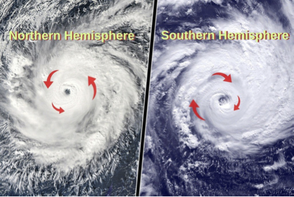
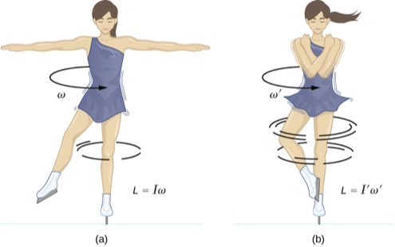

# Coriolis Force and Centrifugal Force

In high school geography, you learned about the **Coriolis effect**: for an observer *rotating together* with the earth, he/she will see an additional force called the **Coriolis force** exerted on all moving objects:

- If the object is moving in the *northern hemisphere*, the Coriolis force is towards the *right* of the object
- If the object is moving in the *southern hemisphere*, the Coriolis force is towards the *left* of the object

A famous example of the Coriolis effect is the spinning of cyclones. In northern hemisphere, the spinning of cyclones is always counter-clockwise; on the contrary, in the southern hemisphere, it is always clockwise.

   
*Spinning direction of cyclones in northern and southern hemisphere*

Now, after learning the matrix formulation of rotations, you are capable of explaining the origin of such a force. It is an example of **fictitious force**, which people introduce in in order to get the correct motion.

## The Rotating Coordinate System  (aka Rotating Reference Frame)

First, we want to make it clear what we mean by "an observer rotating together with the earth". For a moment, we forget the motion of the earth around the sun (i.e. treating the center of the earth as an inertial frame), and assume that the rotation axis is fixed.

Imagine two observers $K$ and $K'$ sitting at the center of the earth. $K$ is sitting *really still*, but $K'$ is *spinning* with the same angular velocity as the earth. Therefore, the earth appears to be static to $K'$, but $K$ will see a spinning earth. Evidently, $K'$ is not an inertial frame.

Mathematically, each observer has his/her own coordinate system, using the earth center as the origin. However, they uses different sets of basis vectors to measure the motion: those of $K$ are the good ol' constant $e_x,e_y,e_z$; but those of $K'$ is rotating around the spinning axis of the earth (we call it $n$; you can choose it to be the $z$-axis for simplicity, but we shall not do that until later). 

Thus, to obtain the coordinates used by $K'$ from those of $K$, we only need to do a rotation:

Rotate the basis vectors of $K$ around $n$-axis by an angle
$\alpha (t)$.

This is described by the rotation matrix $\mathcal{D}_n(t) = R_n(\alpha(t))$. Here $R_n(\alpha)$ is the same as the $R(\theta ,\varphi ,\alpha)$ to save writing.

Therefore, from the theory of change of basis, the position of the object observed by $K'$ is related to that observed by $K$ according to the following formula:

$$
\boldsymbol{r}'(t) = \mathcal{D}_n^{-1}(\alpha (t)) \boldsymbol{r}(t)
= R_n(-\alpha (t)) \boldsymbol{r}(t)
$$

Inversely, we have

$$
\boldsymbol{r}(t) 
= R_n(\alpha (t)) \boldsymbol{r}'(t)
$$

## The Velocity and Acceleration Observed in $K$

Now we go on with our problem: what are the fictitious forces in frame $K'$? We need to express all the quantities in $K$ again using quantities in $K'$. 

First, let us find the velocity of the object in the coordinate system of $K$ at some time instant $t_0$:

$$
\boldsymbol{v}(t_0)
= \frac{d\boldsymbol{r}(t_0)}{dt}
= \frac{dR_n(\alpha (t_0))}{dt}\boldsymbol{r}'(t_0)
+ R_n(\alpha (t_0))\boldsymbol{v}'(t_0)
$$

We know that (in the second step, we used the obvious fact that the order of all rotations along the *same axis* does not matter)

$$
\begin{aligned}
    R_n(\alpha(t))
    &= R_n(\alpha(t)-\alpha(t_0)) R_n(\alpha(t_0))
    \\
    &= R_n(\alpha(t_0)) R_n(\alpha(t)-\alpha(t_0))
\end{aligned}
$$

therefore

$$
\begin{aligned}
    \left[
        \frac{dR_n(\alpha(t))}{dt}
    \right]_{t=t_0}
    &= 
    R_n(\alpha(t_0))\left[
        \frac{d R_n(\alpha(t)-\alpha(t_0))}{dt}
    \right]_{t=t_0}
    \\
    &= R_n(\alpha(t_0)) \omega(t_0) 
\end{aligned}
$$

The final expression for the velocity is therefore (renaming all $t_0$ to $t$, and apply $\omega \boldsymbol{r} = \boldsymbol{\omega} \times \boldsymbol{r}$, where the first $\omega$ is the angular velocity *matrix*)

$$
\begin{aligned}
    \boldsymbol{v}(t)
    &= R_n(\alpha (t)) \,
    [\boldsymbol{\omega}(t)\times \boldsymbol{r}'(t)]
    + R_n(\alpha (t)) \boldsymbol{v}'(t)
    \\
    &=R_n(\alpha (t)) \,
    [\boldsymbol{\omega}(t) \times \boldsymbol{r}'(t) + \boldsymbol{v}'(t)]
\end{aligned}
$$

To find the acceleration, we differentiate once more:

$$
\begin{aligned}
    \boldsymbol{a}(t)
    &= \frac{d\boldsymbol{v}(t)}{dt}
    \\
    &= 
    R_n(\alpha (t)) \left[
        \frac{d\boldsymbol{\omega}(t)}{dt} \times \boldsymbol{r}'(t)
    \right]
    + \frac{dR_n(\alpha (t))}{dt} \, [
        \boldsymbol{\omega}(t) \times \boldsymbol{r}'(t)
    ]
    \\ &\quad
    + R_n(\alpha(t)) [
        \boldsymbol{\omega}(t)\times \boldsymbol{v}'(t)
    ]
    + \frac{dR_n(\alpha (t))}{dt} \boldsymbol{v}'(t)
    + R_n(\alpha (t))\boldsymbol{a}'(t)
    \\
    &= R_n(\alpha (t)) \, [
        \dot{\boldsymbol{\omega}}(t) \times \boldsymbol{r}'(t)
        + \boldsymbol{\omega}(t)\times \left(\boldsymbol{\omega}(t)\times \boldsymbol{r}'(t)\right)
        \\ &\qquad \qquad \qquad
        + 2\boldsymbol{\omega}(t)\times \boldsymbol{v}'(t)
        + \boldsymbol{a}'(t)
    ]
\end{aligned}
$$

Usually, after getting this general result, people simply set $t=0$, i.e. people are interested in the instant when the two coordinate system *coincides* ($\alpha(0) = 0$). Then $R_n \to 1$, and the velocity and the acceleration of the object simplify to

$$
\begin{aligned}
    \boldsymbol{v}(t_0)
    &= \boldsymbol{\omega}(t_0)\times \boldsymbol{r}'(t_0)
    + \boldsymbol{v}'(t_0)
    \\
    \boldsymbol{a}(t_0)
    &= 
    \dot{\boldsymbol{\omega}}(t_0) \times \boldsymbol{r}'(t_0)
    + \boldsymbol{\omega}(t_0)\times \left(\boldsymbol{\omega}(t_0)\times
    \boldsymbol{r}'(t_0)\right)
    \\ &\quad
    + 2\boldsymbol{\omega}(t_0)\times \boldsymbol{v}'(t_0)
    + \boldsymbol{a}'(t_0)
\end{aligned}
$$

*Remark*: In Wikipedia and most textbooks, these two results are obtained through some weird "operator" dealing with time derivatives in rotating frames. After going through the derivation above, you may try if you understand how they constructed that operator. 

## The (Fictitious) Forces Observed by $K'$

Now we choose the rotation axis to be the $z$-axis. The force observed by $K'$ is (omitting the 0 subscript of $t$)

$$
\begin{aligned}
    \boldsymbol{F}'(t)
    &= m \boldsymbol{a}'(t)
    \\
    &= m \boldsymbol{a}(t)
    - m \dot{\boldsymbol{\omega}}(t) \times \boldsymbol{r}'(t)
    \\
    & \qquad
    - m \boldsymbol{\omega}(t) \times 
    (\boldsymbol{\omega}(t) \times \boldsymbol{r}'(t))
    - 2m \boldsymbol{\omega}(t) \times \boldsymbol{v}'(t)
\end{aligned}
$$

The $\boldsymbol{F}(t)=m \boldsymbol{a}(t)$ term is the "real" force. Since the earth
is rotating at a constant angular velocity, there are two extra terms:

- **The Centrifugal Force**

    $$
    \boldsymbol{F}_{\text{cf}}=-m \boldsymbol{\omega}\times \left(\boldsymbol{\omega}\times \boldsymbol{r}'(t)\right)
    $$

    It is just the negative of the **centripetal force** (that's how it get its name).

- **The Coriolis Force**

    $$
    \boldsymbol{F}_{\text{cor}}=-2m \boldsymbol{\omega}\times \boldsymbol{v}'(t)
    $$

    This is the force that causes the effects you learned in high school
    geography. Applying the right-hand rule for the cross product, you can
    recover the properties of this force that you have learned in high
    school geography.

*Remark*: You may recognize that this relation has the same form as the on a charge in magnetic fields:

$$
\boldsymbol{F}=q\boldsymbol{v}\times \boldsymbol{B}=-q\boldsymbol{B}\times \boldsymbol{v}
$$

(by replacing $m$ with $q$, $2\boldsymbol{\omega}$ with $\boldsymbol{B}$) Does this hint some deep relation between the magnetic field and rotation? I don't know, but it cannot be a coincidence: past experience tells me that every "coincidence" in physics *must* have a reason.

## The Spinning Skater Problem

You have already encountered the classic "spinning skater" problem when learning the conservation of angular momentum.

Suppose that the skater is initially stretching out her arms and rotating at angular speed $\omega$. After she pulls her arms in, her moment of inertia around the rotation axis reduces from $I$ to $I'$. You know that, because of the conservation of angular momentum

$$
I \omega = I' \omega' 
\Rightarrow
\omega' = \frac{I}{I'} \omega >\omega
$$

But how to *understand* the increase in angular speed? It turns out that the rotating reference frame helps: **the Coriolis force exerts a torque that causes this increase**.

Let's see how it works with a toy model: two mass-points of mass $m$ connected by a rod of adjustable length.

*Two mass-points connected by a rod of adjustable length*

Suppose at $t=0$, the two masses are rotating around their center of mass (which we choose as the origin; the rotation of axis is the $z$-axis), and their separation is $2a$. The moment of inertia is $I=2m a^2$. 

Due to some internal mechanism, the rod shortens, and the two mass-points gain a *constant* radial component of velocity $v_r$ (constant) pointing towards the coordinate origin. Finally, the distance reduced to $2b<2a$ and the shortening stops. 

Now we go to the rotating reference frame to
see this procedure. First, the radial motion of the two masses are controlled by the rod, and is known to us. So interesting things can happen only in the tangential motion. The only tangential force is provided by the Coriolis force: its tangential component is given by

$$
(F_{\text{cor}})_t
= -2m \boldsymbol{\omega} \times \boldsymbol{v}_r
= 2m \omega  v_r
$$

(In addition, the *tangential* component of the velocity $\boldsymbol{v}_t$ gives the *radial* component of the Coriolis force)

The distance between the two points is given by

$$
2l(t)=2\left(a-v_rt\right)
$$

Then, the final time $t_0$ when the distance is $2b$ is

$$
t_0 = \frac{a-b}{v_r}
$$

The torque of the Coriolis force at time $t$ is

$$
\tau (t)
= 2\times (2m \omega v_r) (a - v_r t)
$$

The change in angular momentum in the rotating frame is

$$
\begin{aligned}
    \Delta L
    &= L(t_0)-L(0)
    \\
    &= \int_0^{t_0} \tau (t) \, dt=2m\left(a^2-b^2\right)\omega
\end{aligned}
$$

The new moment of inertia is $I'=2m b^2$, so the final angular velocity
in the rotational frame is

$$
\omega_f = \frac{L}{I'}
= \left( \frac{a^2}{b^2} - 1 \right) \omega
$$

Returning to the static reference frame, the final angular velocity is

$$
\omega' = \omega_f+\omega 
= \frac{a^2}{b^2} \omega 
= \frac{I}{I'}\omega
$$

Therefore, in our simple example, we have proved that it is the Coriolis
force (although it does not actually exists in inertial frames) that
increases the angular speed to the system.
