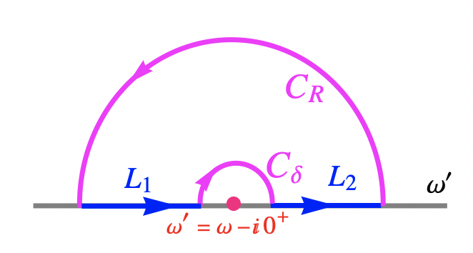

# Kramers-Krönig Relations

**Kramers-Krönig relations:**

$$
\begin{align*}
    \sigma_1(\omega) &= \frac{1}{\pi} \mathcal{P}
    \int_{-\infty}^\infty d\omega' \, 
    \frac{\sigma_2(\omega')}{\omega' - \omega}
    \\
    \sigma_2(\omega) &= - \frac{1}{\pi} \mathcal{P}
    \int_{-\infty}^\infty d\omega' \, 
    \frac{\sigma_1(\omega')}{\omega' - \omega}
\end{align*}
$$

 

*Proof*: Consider the integral

$$
f(\omega) = \oint_C d\omega' \,
\frac{\sigma(\omega')}{\omega' - \omega}
$$

with the following choice of integration path $C$:

Since there is no pole enclosed by $C$, we know that $f(\omega) = 0$. There is no contribution from $C_R$. Meanwhile, 

$$
\int_{C_\delta}d\omega' \,
\frac{\sigma(\omega')}{\omega' - \omega}
= \pi i \left[
    \operatorname{Res} \frac{\sigma(\omega')}{\omega' - \omega}
\right]_{\omega' = \omega}
= \pi i \sigma(\omega)
$$

The integration on the real line is

$$
\int_{L_1 + L_2} = \mathcal{P} 
\int_{-\infty}^\infty d\omega' \,
\frac{\sigma(\omega')}{\omega' - \omega}
$$

Thus

$$
\begin{align*}
    f(\omega) &= \pi i \sigma(\omega)
    + \mathcal{P} 
    \int_{-\infty}^\infty d\omega' \,
    \frac{\sigma(\omega')}{\omega' - \omega} = 0
    \\
    \Rightarrow \quad
    \sigma(\omega) &= \frac{1}{\pi i}
    \mathcal{P} 
    \int_{-\infty}^\infty d\omega' \,
    \frac{\sigma(\omega')}{\omega' - \omega}
\end{align*}
$$

The real and imaginary parts of this equation are the Kramers-Krönig relations. $\blacksquare$

Now we derive an alternative form of the relations using the properties

$$
\sigma_1(\omega) = \sigma_1(-\omega), \quad
\sigma_2(\omega) = -\sigma_2(-\omega)
$$

$$
\begin{align*}
    \sigma_1(\omega)
    &= \frac{1}{\pi} \mathcal{P}
    \int_{-\infty}^0 d\omega' \, 
    \frac{\sigma_2(\omega')}{\omega' - \omega}
    + \frac{1}{\pi} \mathcal{P}
    \int_0^\infty d\omega' \, 
    \frac{\sigma_2(\omega')}{\omega' - \omega}
    \\
    &= \frac{1}{\pi} \mathcal{P}
    \int_0^\infty d\omega' \, 
    \frac{\sigma_2(-\omega')}{-\omega' - \omega}
    + \frac{1}{\pi} \mathcal{P}
    \int_0^\infty d\omega' \, 
    \frac{\sigma_2(\omega')}{\omega' - \omega}
    \\
    &= \frac{1}{\pi} \mathcal{P}
    \int_0^\infty d\omega' \, 
    \frac{\sigma_2(\omega')}{\omega' + \omega}
    + \frac{1}{\pi} \mathcal{P}
    \int_0^\infty d\omega' \, 
    \frac{\sigma_2(\omega')}{\omega' - \omega}
    \\
    &= \frac{2}{\pi} \int_0^\infty d\omega' \,
    \frac{\omega' \sigma_2(\omega')}{\omega'^2 - \omega^2}
\end{align*}
$$

Similarly

$$
\begin{align*}
    \sigma_2(\omega)
    &= - \left[
        \frac{1}{\pi} \mathcal{P}
        \int_{-\infty}^0 d\omega' \, 
        \frac{\sigma_1(\omega')}{\omega' - \omega}
        + \frac{1}{\pi} \mathcal{P}
        \int_0^\infty d\omega' \, 
        \frac{\sigma_1(\omega')}{\omega' - \omega}
    \right]
    \\
    &= - \left[
        \frac{1}{\pi} \mathcal{P}
        \int_0^\infty d\omega' \, 
        \frac{\sigma_1(-\omega')}{-\omega' - \omega}
        + \frac{1}{\pi} \mathcal{P}
        \int_0^\infty d\omega' \, 
        \frac{\sigma_1(\omega')}{\omega' - \omega}
    \right]
    \\
    &= - \left[
        - \frac{1}{\pi} \mathcal{P}
        \int_0^\infty d\omega' \, 
        \frac{\sigma_1(\omega')}{\omega' + \omega}
        + \frac{1}{\pi} \mathcal{P}
        \int_0^\infty d\omega' \, 
        \frac{\sigma_1(\omega')}{\omega' - \omega}
    \right]
    \\
    &= - \frac{2\omega}{\pi} \int_0^\infty d\omega' \,
    \frac{\sigma_1(\omega')}{\omega'^2 - \omega^2}
\end{align*}
$$
