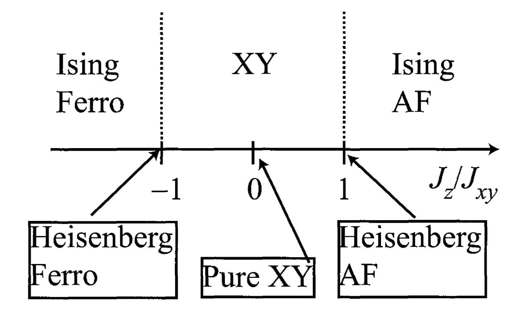

# The XXZ Spin Chain

Reference: 

- *Quantum Physics in One Dimension* by Thierry Giamarchi
- *Quantum Field Theory in Strongly Correlated Electronic Systems* by Naoto Nagaosa

**XXZ spin chain:** ($J_{xy} > 0$)

$$
H = J_{xy} \sum_{i=0}^{N-1} (
    S_i^x S_{i+1}^x + S_i^y S_{i+1}^y
) + J_z \sum_{i=0}^{N-1} S_i^z S_{i+1}^z
$$

 

The model name comes from the fact that the coupling coefficient in the $X$ and $Y$ directions are the same, but they are different from that in $Z$. 

## Mapping to Fermion Model

Using $S_i^\pm$ to represent the Hamiltonian, we have

$$
\begin{aligned}
    &S_i^x S_{i+1}^x + S_i^y S_{i+1}^y
    \\
    &= \frac{1}{4}(S_i^- + S_i^+)(S_{i+1}^- + S_{i+1}^+)
     - \frac{1}{4}(S_i^- - S_i^+)(S_{i+1}^- - S_{i+1}^+)
    \\
    &= \frac{1}{2}(S_i^- S_{i+1}^+ + S_i^+ S_{i+1}^-)
    = \frac{1}{2}(S_{i}^+ S_{i+1}^- + h.c.)
\end{aligned}
$$

Then

$$
H = \frac{J_{xy}}{2} \sum_{i=0}^{N-1} (
    S_{i}^+ S_{i+1}^- + h.c.
) + J_z \sum_{i=0}^{N-1} S_i^z S_{i+1}^z
$$

This is mapped by Jordan-Wigner transformation to

$$
H = \frac{J_{xy}}{2} \sum_{i=0}^{N-1} (
    c_i^\dagger c_{i+1} + h.c.
) + J_z \sum_{i=0}^{N-1} \left(n_i - \frac{1}{2}\right)
\left(n_{i+1} - \frac{1}{2}\right)
$$

For convenience, we use one more step of canonical transformation

$$
c_j \to (-1)^j c_j
$$

which does not affect the number operators $n_j$; but the hopping terms get an additional minus signs. Thus we finally obtain

**$t$-$V$ model of spinless fermion**

$$
\begin{aligned}
    H &= -t \sum_{i=0}^{N-1} (
        c_i^\dagger c_{i+1} + h.c.
    ) + V \sum_{i=0}^{N-1} \left(n_i - \frac{1}{2}\right)
    \left(n_{i+1} - \frac{1}{2}\right)
    \\
    \text{with} &\quad 
    t = \frac{J_{xy}}{2} > 0, \quad V = J_z
\end{aligned}
$$

 

## The Luttinger Liquid Phase

The XXZ chain is in the Luttinger liquid phase when

$$
-1 \le \frac{J_z}{J_{xy}} \le 1
\quad \text{or} \quad
-1 \le \frac{V}{2t} \le 1
$$

By comparison with Bethe ansatz exact solution, the Luttinger parameter (compactified radius) $K$ and the velocity $u$ can be determined as ($0 \le g \le 1$)

$$
\frac{J_z}{J_{xy}} = -\cos (\pi g)
\  \Rightarrow \  \left\{
\begin{aligned}
    K &= \frac{1}{2g} \\
    u &= \frac{1}{1-g} \sin(\pi(1-g)) \frac{J_{xy}}{2}
\end{aligned}
\right.
$$

To recast this result, 