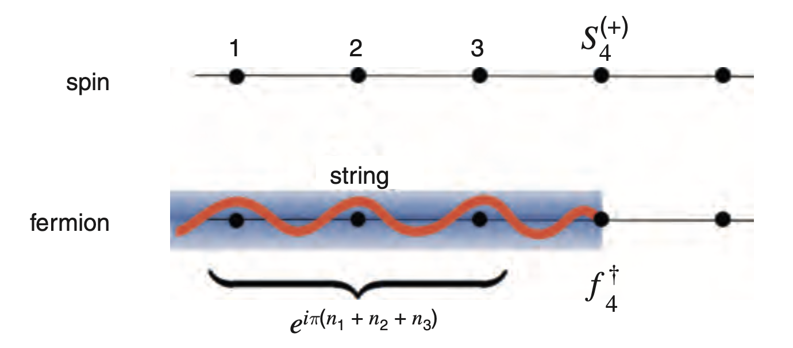

# Jordan-Wigner Transformation

## Mapping A Single Spin-1/2 to A Single Fermion

The up and down states of a *single* spin-1/2 site can be thought as the occupied and empty states of a *one*-particle (spinless) fermion states:

$$
\begin{align*}
    \text{(Up)} \quad 
    \ket{\uparrow} &\longleftrightarrow \ket{1} = c^\dagger \ket{0}
    &&\text{(Occupied)}
    \\
    \text{(Down)} \quad 
    \ket{\downarrow} &\longleftrightarrow \ket{0}
    &&\text{(Empty)}
\end{align*}
$$

Under these basis vectors, we define the ladder operators for the spin

$$
\begin{align*}
    S^+ &= \begin{bmatrix}
        0 & 1 \\
        0 & 0
    \end{bmatrix}
    = S^x + iS^y
    \\
    S^- &= \begin{bmatrix}
        0 & 0 \\
        1 & 0
    \end{bmatrix}
    = S^x - iS^y
\end{align*}
$$

where $\sigma^a \, (a = x,y,z)$ are Pauli matrices. We then have the following mapping for a single spin:

**A single spin and a single fermion:**

$$
S^z = c^\dagger c - \frac{1}{2}, \quad
S^+ = c^\dagger, \quad S^- = c
$$

 

Let us verify the (anti-)commutation relations: the spin operators satisfy

$$
\begin{align*}
    [S^a, S^b] &= i \epsilon^{abc} S^c
    \\
    \{S^a, S^b\} &= \frac{1}{2} \delta^{ab}
\end{align*} \qquad (a = x,y,z)
$$

Then we can also show that the ladder operators satisfy

$$
\{S^-, S^+\} = 1 \qquad
\{S^\pm, S^\pm\} = 0 \qquad
[S^+, S^-] = 2S_z 
$$

which is the same as the fermion operators:

$$
\begin{align*}
    \{c, c^\dagger\} &= 1 \qquad
    \{c, c\} = \{c^\dagger, c^\dagger\} = 0
    \\
    [c^\dagger, c] &= 2 c^\dagger c - \{c, c^\dagger\}
    = 2 \left(n - \frac{1}{2} \right)
\end{align*}
$$

## String/Kink Operator

Next, let us we try to generalize the above mapping to a 1D spin chain (with $N$ sites). Each site of the chain will correspond to an independent fermion. The naive mapping is

$$
S_j^+, S_j^-, S_j^z \longleftrightarrow 
c_j^\dagger, c_j, n_j - \tfrac{1}{2}
\qquad j = 1,...,N
$$

However, different fermion operators should *anti-commute*, while the spin operators at different sites *commute*:

$$
[S_i^{(\pm)}, S_j^{(\pm)}] = 0 \qquad
\{c_i^{(\dagger)}, c_j^{(\dagger)}\} = 0 \qquad (i \ne j)
$$

The bracket means we are referring to either $c^\dagger$ or $c$, and $S^+$ or $S^-$. One way to overcome this difficulty is to introduce a **string (kink) operator** to the fermion operators:

**The string operator for fermion:**

$$
F_j \equiv e^{i\phi_j}, \quad 
\phi_j = \pi \sum_{l=1}^{j-1} c_l^\dagger c_l \quad 
(\text{define} \ \phi_1 \equiv 0 \Rightarrow F_1 = 1)
$$

 

### Properties of the String

- Since $n_l \equiv c_l^\dagger c_l = 0,1$, one can easily see that $F_j = F_j^\dagger = F_j^{-1}$. 

- It is useful to derive an alternative expression for the string $F_j$:

    $$
    F_j \equiv \exp\bigg[
        i\pi \sum_{l=1}^{j-1} n_l
    \bigg]
    = \prod_{l=1}^{j-1} (-1)^{n_l}
    = \prod_{l=1}^{j-1} (1 - 2n_l)
    $$

    In the last step we have used the fact that $n_l$ can only be 0, 1 and therefore $(-1)^{n_l} = 1 - 2n_l$. 

- (Anti-)commutation relations with fermion operators

    $$
    \begin{align*}
        [F_j, c_l^{(\dagger)}] &= 0 \qquad j \le l \\
        \{F_j, c_l^{(\dagger)}\} &= 0 \qquad j > l
    \end{align*}
    $$

    ----

    *Proof*: 

    ----

## Jordan-Wigner Transformation

With the string operator, the complete mapping from spin to fermion is

**The Jordan-Wigner transformation:**

$$
S_j^+ = c_j^\dagger F_j = F_j c_j^\dagger, \quad 
S_j^- = c_j F_j = F_j c_j
\quad (j = 1,...,N)
$$

 

*Remark*: The expression of $S^z_j$ in terms of fermion operators is then (using $F_j^2 = 1$)

$$
\begin{align*}
    S^z_j &= S^+_j S^-_j - 1/2 = c_j^\dagger c_j - 1/2
\end{align*}
$$

 

Let us check that the introduction of the string operator indeed gives us the correct commutation relations of the fermion operators.

## Application to Heisenberg-like Spin Chain

Now we use Jordan-Wigner transformation to map the Hamiltonian $H^{A/P}$ of **Heisenberg-like models** to fermion Hamiltonian $H_F$. 

**Heisenberg-like spin chain:**

- Local Hamiltonian and $\mathbb{Z}_2$ generator

    $$
    \begin{gather*}
        H_j = J_x S^x_j S^x_{j+1} + J_y S^y_j S^y_{j+1}
        + J_z S^z_j S^z_{j+1} - h S^z_j, \quad
        Z = \textstyle{\prod_{j=1}^N} Z_j
    \end{gather*}
    $$

- APBC boundary term

    $$
    \begin{align*}
        H^A_N &= Z_1 H_N Z_1 \\
        &= - J_x S^x_N S^x_1 - J_y S^y_N S^y_1 
        + J_z S^z_j S^z_{j+1} - h S^z_N
    \end{align*}
    $$

 

*Remark*: Important special cases of Heisenberg-like models

- **(Isotropic) Heisenberg model**: $J_x = J_y = J_z, \ h = 0$
- **Transverse field Ising model**: $J_y = J_x = 0$
- **XY model**: $J_z = 0$
- **XXZ model**: $J_x = J_y, \ h = 0$

 

It is convenient to express $H_j$ in terms of $S^\pm$: 

$$
S_j^{\pm} = S_j^x \pm i S_j^y 
\, \Rightarrow \, \left\{
\begin{align*}
    S_j^x &= \frac{1}{2}(S_j^- + S_j^+)
    \\
    S_j^y &= \frac{i}{2}(S_j^- - S_j^+)
\end{align*}
\right.
$$

The first two terms of $H_j$ can then be written as

$$
\begin{align*}
    &\frac{J_x}{4} (S_j^- + S_j^+)(S_{j+1}^- + S_{j+1}^+)
    - \frac{J_y}{4}(S_j^- - S_j^+)(S_{j+1}^- - S_{j+1}^+)
    \\
    &= t(S_j^+ S_{j+1}^- + S_j^- S_{j+1}^+)
    + \Delta (S_j^+ S_{j+1}^+ + S_j^- S_{j+1}^-)
    \\
    &\boxed{
        = t(S_j^+ S_{j+1}^- + h.c.)
        + \Delta (S_j^+ S_{j+1}^+ + h.c.)
    }
    \\[1em]
    &\text{with} \qquad 
    t \equiv \frac{J_x + J_y}{4}, \quad
    \Delta \equiv \frac{J_x - J_y}{4}
\end{align*}
$$

The mapping of $S^z$-terms is the same for all boundary conditions:

$$
S^z_j \to n_j - 1/2
$$

Next we focus on the transformation of the $t,\Delta$-terms, which will be affected by the boundary condition. The following identity will be useful:

$$
F_j F_{j+1} 
= \prod_{l=1}^{j-1} (-1)^{n_l} \prod_{l'=1}^{j} (-1)^{n_{l'}}
= (-1)^{n_j}
$$

### Non-Boundary Terms

- **"Spin Hopping" $t$-Term**

    $$
    \begin{align*}
        S_j^+ S_{j+1}^-
        &= c_j^\dagger F_j c_{j+1} F_{j+1}
        = c_j^\dagger c_{j+1} F_j F_{j+1}
        \\
        &= c_j^\dagger c_{j+1} (-1)^{n_j}
        \\
        &= c_j^\dagger c_{j+1} \quad
        (\text{$\ne 0$ only when input $n_j = 0$})
    \end{align*}
    $$

    Combining with the h.c. term, we arrive at:

    $$
    S_j^+ S_{j+1}^- + h.c. = c_j^\dagger c_{j+1} + h.c.
    $$

- **"Spin Pairing" $\Delta$-Term**

    $$
    \begin{align*}
        S_j^+ S_{j+1}^+
        &= c_j^\dagger F_j c_{j+1}^\dagger F_{j+1}
        = c_j^\dagger c_{j+1}^\dagger F_j F_{j+1}
        \\
        &= c_j^\dagger c_{j+1}^\dagger (-1)^{n_j} 
        = c_j^\dagger c_{j+1}^\dagger
    \end{align*}
    $$

    The last equality follows from the same argument as for the previous term. Therefore (this term is related to the **$p$-wave superconductivity**)

    $$
    S_j^+ S_{j+1}^+ + h.c. = c_j^\dagger c_{j+1}^\dagger + h.c.
    $$

**Local non-boundary term of fermion theory:** ($j = 1,...,N-1$)

$$
\begin{align*}
    (H_F)_j &= t(c_j^\dagger c_{j+1} + h.c.)
    + \Delta (c_j^\dagger c_{j+1}^\dagger + h.c.) 
    \\ &\quad
    + J_z (n_j - \tfrac{1}{2}) (n_{j+1} - \tfrac{1}{2})
    - h (n_j - \tfrac{1}{2})
\end{align*} \quad 
$$

 

### The Boundary Term $H_N$

Since the spin chain contains only nearest neighbor interaction, the only boundary term is $H_N$, which must be transformed carefully:

$$
\begin{align*}
    H^P_N &= + t(S_N^+ S_1^- + h.c.)
    + \Delta (S_N^+ S_1^+ + h.c.) - h S_N^z
    \\
    H^A_N &= - t(S_N^+ S_1^- + h.c.)
    - \Delta (S_N^+ S_1^+ + h.c.) - h S_N^z
\end{align*}
$$

The $h$-term can be transformed ordinarily. We focus on the term appearing in $t, \Delta$-terms:

$$
S_N^+ S_1^{(\pm)} = c_N^\dagger F_N c_1^{(\dagger)} \cancel{F_1}
= c_N^\dagger F_N c_1^{(\dagger)}
$$

Introduce the the **fermion number parity** operator

$$
P \equiv (-1)^{n_\text{tot}} = \exp(i\pi n_\text{tot})
\quad \bigg( n_\text{tot} \equiv \sum_{l=1}^N n_l \bigg)
$$

Obviously $P^2 = 1$, so its eigenvalues are $\pm 1$ ($n_\text{tot}$ is even or odd). Then we express $F_N$ in terms of $P$:

$$
\begin{align*}
    F_N &= F_N (-1)^{2n_N} = P (-1)^{n_N} \\ \Rightarrow
    S_N^+ S_1^{(\pm)} &= c_N^\dagger P (-1)^{n_N} c_1^{(\dagger)}
    \\
    &= c_N^\dagger P c_1^{(\dagger)} \qquad 
    (\text{$\ne 0$ only when input $n_N = 0$})
    \\
    &= - c_N^\dagger c_1^{(\dagger)} P \qquad
    (\{P, c_j^{(\dagger)}\} = 0 \ \text{for any} \ j)
\end{align*}
$$

Now we *require* that the boundary term of the fermion theory $(H_F)_N$ has the same form as the non-boundary term:
    
$$
\begin{align*}
    (H_F)_N &= t(c_N^\dagger c_{N+1} + h.c.)
    + \Delta (c_N^\dagger c_{N+1}^\dagger + h.c.) 
    \\ &\quad
    + J_z (n_j - \tfrac{1}{2}) (n_{j+1} - \tfrac{1}{2})
    - h \left(n_N - \tfrac{1}{2} \right)
\end{align*}
$$

($c_{N+1}$ will be defined shortly) so that the fermion Hamiltonian for *both* PBC and APBC are the *same*:

$$
\begin{align*}
    H_F &= \sum_{j=1}^N \Big[
        t(c_j^\dagger c_{j+1} + h.c.)
        + \Delta (c_j^\dagger c_{j+1}^\dagger + h.c.) 
        \\ &\qquad \quad
        + J_z (n_j - \tfrac{1}{2}) (n_{j+1} - \tfrac{1}{2})
        - h (n_j - \tfrac{1}{2})
    \Big]
\end{align*}
$$

Then we need to define $c_{N+1}$ (i.e. choose the boundary condition for the fermion theory) as:

**Boundary condition of fermion theory:**

$$
\begin{array}{ccc}
    \text{Spin BC} & c_{N+1}^{(\dagger)}\ \text{Definition} & \text{Fermion BC}
    \\[4pt] \hline \\[-8pt]
    \text{Periodic} & -c_1^{(\dagger)} P & \begin{aligned}
        P = -1 & \Rightarrow \text{Periodic} \\
        P = +1 & \Rightarrow \text{Anti-Periodic}
    \end{aligned}
    \\[10pt] \hline \\[-8pt]
    \text{Anti-Periodic} & +c_1^{(\dagger)} P & \begin{aligned}
        P = -1 & \Rightarrow \text{Anti-Periodic} \\
        P = +1 & \Rightarrow \text{Periodic}
    \end{aligned}
\end{array}
$$

 

This leads to:

**Relation between the spin Hamiltonian and the fermion Hamiltonian:**

$$
\begin{align*}
    H^P &= \frac{1+P}{2} H_F^{(A)} + \frac{1-P}{2} H_F^{(P)}
    \\
    H^A &= \frac{1-P}{2} H_F^{(A)} + \frac{1+P}{2} H_F^{(P)}
\end{align*}
$$

where $H_F^{(A/P)}$ refers to $H_F$ with APBC/PBC. 

 
