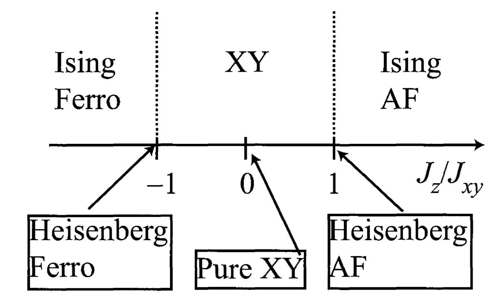

# The XXZ Spin Chain

**XXZ spin chain:**

- Local Hamiltonian and $\mathbb{Z}_2$ generator

    $$
    H_j = J_\perp (
        X_j X_{j+1} + Y_j Y_{j+1}
    ) + J_z Z_j Z_{j+1}, \quad
    Z = \textstyle{\prod_{j=1}^N} Z_j
    $$

    - When $J_\perp = J_z$, we get the isotropic **Heisenberg model**.
    - When $J_\perp = 0$, we get the **Ising model** (without magnetic field).

- APBC boundary term

    $$
    \begin{align*}
        H^A_N &= Z_1 H_N Z_1 \\
        &= Z_1 [
            J_\perp (X_N X_1 + Y_N Y_1) + J_z Z_N Z_1
        ] Z_1 \\
        &= -J_\perp (X_N X_1 + Y_N Y_1) + J_z Z_N Z_1
    \end{align*}
    $$

 

## Mapping to Fermion Model

Using $S_i^\pm$ to represent the Hamiltonian, we have

$$
\begin{align*}
    &S_i^x S_{i+1}^x + S_i^y S_{i+1}^y
    \\
    &= \frac{1}{4}(S_i^- + S_i^+)(S_{i+1}^- + S_{i+1}^+)
     - \frac{1}{4}(S_i^- - S_i^+)(S_{i+1}^- - S_{i+1}^+)
    \\
    &= \frac{1}{2}(S_i^- S_{i+1}^+ + S_i^+ S_{i+1}^-)
    = \frac{1}{2}(S_{i}^+ S_{i+1}^- + h.c.)
\end{align*}
$$

Then

$$
H = \frac{J_\perp}{2} \sum_{i=0}^{N-1} (
    S_{i}^+ S_{i+1}^- + h.c.
) + J_z \sum_{i=0}^{N-1} S_i^z S_{i+1}^z
$$

This is mapped by Jordan-Wigner transformation to

$$
H = \frac{J_\perp}{2} \sum_{i=0}^{N-1} (
    c_i^\dagger c_{i+1} + h.c.
) + J_z \sum_{i=0}^{N-1} \left(n_i - \frac{1}{2}\right)
\left(n_{i+1} - \frac{1}{2}\right)
$$

For convenience, we use one more step of canonical transformation

$$
c_j \to (-1)^j c_j
$$

which does not affect the number operators $n_j$; but the hopping terms get an additional minus signs. Thus we finally obtain

**$t$-$V$ model of spinless fermion**

$$
\begin{align*}
    H &= -t \sum_{i=0}^{N-1} (
        c_i^\dagger c_{i+1} + h.c.
    ) + V \sum_{i=0}^{N-1} \left(n_i - \frac{1}{2}\right)
    \left(n_{i+1} - \frac{1}{2}\right)
    \\
    \text{with} &\quad 
    t = \frac{J_\perp}{2} > 0, \quad V = J_z
\end{align*}
$$

 

## The Luttinger Liquid Phase

The XXZ chain is in the Luttinger liquid phase when

$$
-1 \le \frac{J_z}{J_\perp} \le 1
\quad \text{or} \quad
-1 \le \frac{V}{2t} \le 1
$$

By comparison with Bethe ansatz exact solution, the Luttinger parameter (compactified radius) $K$ and the velocity $u$ can be determined as ($0 \le g \le 1$)

$$
\frac{J_z}{J_\perp} = -\cos (\pi g)
\  \Rightarrow \  \left\{
\begin{align*}
    K &= \frac{1}{2g} \\
    u &= \frac{1}{1-g} \sin(\pi(1-g)) \frac{J_\perp}{2}
\end{align*}
\right.
$$

To recast this result, 