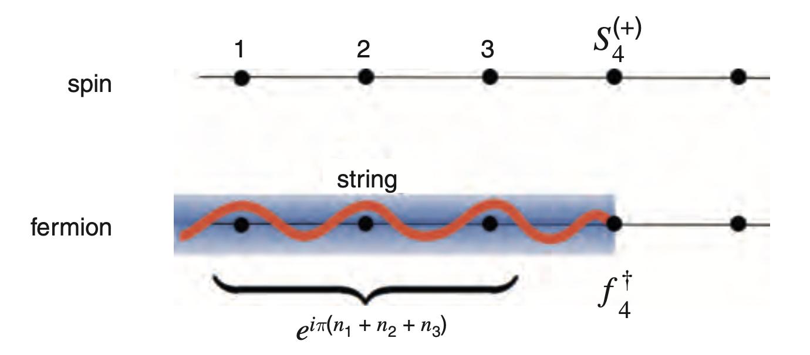

# Jordan-Wigner Transformation

## Similarity between Spin and Fermion Operators

The up and down states of a *single* spin-1/2 site can be thought as the occupied and empty states of a *one*-particle (spinless) fermion states:

$$
\begin{aligned}
    \text{(Up)} \quad 
    |\uparrow\rangle &\longleftrightarrow |1\rangle = c^\dagger |0\rangle
    &&\text{(Occupied)}
    \\
    \text{(Down)} \quad 
    |\downarrow\rangle &\longleftrightarrow |0\rangle
    &&\text{(Empty)}
\end{aligned}
$$

Under these basis vectors, 

$$
\begin{aligned}
    S^+ = c^\dagger &= \begin{bmatrix}
        0 & 1 \\
        0 & 0
    \end{bmatrix}
    = \frac{1}{2}(\sigma^x + i \sigma^y)
    = S^x + iS^y
    \\
    S^- = c &= \begin{bmatrix}
        0 & 0 \\
        1 & 0
    \end{bmatrix}
    = \frac{1}{2}(\sigma^x - i \sigma^y)
    = S^x - iS^y
\end{aligned}
$$

where $\sigma^a \, (a = x,y,z)$ are Pauli matrices. 

The $S^z$ operator can also be expressed using the fermion operators:

$$
\begin{aligned}
    S^z &= \frac{1}{2}\sigma^z = \frac{1}{2} \begin{bmatrix}
        1 & 0 \\
        0 & -1
    \end{bmatrix} 
    \\[1em]
    &= S^+ S^- - \tfrac{1}{2} 
    \\[0.5em]
    &\to c^\dagger c - \tfrac{1}{2}
    = n - \tfrac{1}{2}
\end{aligned}
$$

Let us also check that the (anti-)commutation relations: the spin operators satisfy

$$
\begin{aligned}
    [S^a, S^b] &= i \epsilon^{abc} S^c
    \\
    \{S^a, S^b\} &= \frac{1}{2} \delta^{ab}
\end{aligned} \qquad (a = x,y,z)
$$

Then we can also show that the ladder operators satisfy

$$
\{S^-, S^+\} = 1 \qquad
\{S^\pm, S^\pm\} = 0 \qquad
[S^+, S^-] = 2S_z 
$$

which is the same as the fermion operators:

$$
\begin{aligned}
    \{c, c^\dagger\} &= 1 \qquad
    \{c, c\} = \{c^\dagger, c^\dagger\} = 0
    \\
    [c^\dagger, c] &= 2 c^\dagger c - \{c, c^\dagger\}
    = 2 \left(n - \tfrac{1}{2} \right)
\end{aligned}
$$

## String Operator and Jordan-Wigner Transformation

Next, let us we try to generalize the above mapping to a 1D spin chain (with multiple sites). Each site of the chain will correspond to an independent fermion. The naive thinking is

$$
S_i^+, S_i^-, S_i^z \longleftrightarrow 
c_i^\dagger, c_i, n_i - \tfrac{1}{2}
\qquad i = 0,1,...,N-1
$$

However, there is one problem: the independent fermion operators *anti-commute*, while the spin operators  of different sites *commute*:

$$
[S_i^{(\pm)}, S_j^{(\pm)}] = 0 \qquad
\{c_i^{(\dagger)}, c_j^{(\dagger)}\} = 0 \qquad (i \ne j)
$$

The bracket means we are referring to either $c^\dagger$ or $c$, and $S^+$ or $S^-$. 

One way to overcome this difficulty is to introduce a **string operator** to the fermion operators. This leads to the **Jordan-Wigner transformation**

$$
\begin{aligned}
    S_i^z &= n_i - \tfrac{1}{2}
    \\
    S_i^+ &= c_i^\dagger e^{i \phi_i}
    \\
    S_i^- &= c_i e^{-i \phi_i}
\end{aligned} \qquad \text{where} \quad \left\{
\begin{aligned}
    S_i^{\pm} &= S_i^x \pm i S_i^y
    \\
    n_i &= c_i^\dagger c_i
    \\
    \phi_i &= \pi \textstyle{\sum_{j=0}^{i-1} n_j}
\end{aligned} \right.
$$

Here $e^{i\phi_i}$ is the required string operator; we also define $\phi_0 = 0$. We see that

$$
\text{spin = fermion$\times$string}
$$

The string operator has the following important properties: 

$$
\begin{aligned}
    \{e^{i \phi_j}, c_l^{(\dagger)}\} &= 0 \qquad j > l
    \\
    [e^{i \phi_j}, c_l^{(\dagger)}] &= 0 \qquad j \le l
\end{aligned}
$$

----

*Proof*: We first consider

$$
\{e^{i\pi n_j}, c_j\}
= e^{i\pi n_j} c_j + c_j e^{i\pi n_j}
$$

The first term is nonzero when $c_j$ acts on $|1\rangle$, but then $n_j = 0$; while in the second term, the $n_j$ acts first and get value 1. Thus

$$
\{e^{i\pi n_j}, c_j\}
= e^{i\pi 0} c_j + c_j e^{i\pi 1} = 0
$$

Similarly 

$$
\begin{aligned}
    \{e^{i\pi n_j}, c_j^\dagger\}
    &= e^{i\pi n_j} c_j^\dagger + c_j^\dagger e^{i\pi n_j}
    \\
    &= e^{i\pi 1} c_j^\dagger + c_j^\dagger e^{i\pi 0}
    = 0
\end{aligned}
$$

Meanwhile, for $i \ne j$

$$
[n_i, c_j^{(\dagger)}] = 
$$

----

## (Anti-)Commutation Relations

Let us check that the introduction of the string operator indeed gives us the correct commutation relations of the spin operators.

Starting from the fermion anti-commutation relation, we calculate (assume $j > k$)

$$
[S_j^{(\pm)}, S_k^{(\pm)}]
$$

## Boundary Condition of the Fermion Theory

Usually, we impose the **periodic boundary condition** on the spin chain

$$
S_N^a = S_0^a \qquad a = x,y,z
$$

Here $N$ is the number of spin sites. Under the Jordan-Wigner transformation 

$$
\begin{aligned}
    S_N^{(\pm)} &= c_N^{(\dagger)} e^{\pm i \phi_N}
    = c_N^{(\dagger)} \exp(\pm i \pi n_\text{tot})
    \\
    S_0^{(\pm)} &= c_0^{(\dagger)} e^{\pm i \phi_0}
    = c_0^{(\dagger)}
\end{aligned}
$$

Here $n_\text{tot} \equiv \sum_i n_i$ is the total number of fermions. Thus, depending on $n_\text{tot}$, the original spin theory is separated into *two sectors* of the fermion theory:

- The **even** sector with **anti-periodic** boundary condition
    
    $$
    n_\text{tot} = \text{even}
    \qquad
    c_N^{(\dagger)} = -c_0^{(\dagger)}
    $$

- The **odd** sector with **periodic** boundary condition
    
    $$
    n_\text{tot} = \text{odd}
    \qquad
    
    $$

The two boundary condition will alow different values of the lattice momentum $k$ in the fermion theory. The Fourier transform of the $c_i^{(\dagger)}$ operators gives ($a$ is the lattice spacing, and $x_j = ja$):

$$
\begin{aligned}
    c_k &= \frac{1}{\sqrt{N}} \sum_j 
    c_j e^{-i k x_j} \\
    c_k^\dagger &= \frac{1}{\sqrt{N}} \sum_j 
    c_j^\dagger e^{+i k x_j}
\end{aligned}
\, \Longleftrightarrow \,
\begin{aligned}
    c_j &= \frac{1}{\sqrt{N}} \sum_k 
    c_k e^{+i k x_j} 
    \\
    c_j^\dagger &= \frac{1}{\sqrt{N}} \sum_k
    c_k^\dagger e^{-i k x_j}
\end{aligned}
$$

where $j$ sums over the lattice sites, and $k$ sums over the reciprocal lattice in the 1st Brillouin zone (BZ). This transform is based on the following orthogonal and completeness relations:

$$
\begin{aligned}
    \sum_j e^{i (k - k') x_j} 
    &= N \delta_{k, k'}
    \\
    \sum_k e^{i k (x_i - x_j)} 
    &= N \delta_{i,j}
\end{aligned}
$$

Then, for the two boundary conditions:

- PBC: $c_{N} = c_0$

    $$
    e^{-ikNa} = 1
    \, \Rightarrow \, 
    kNa = 2\pi m \quad (m \in \mathbb{Z})
    $$

    Restricting the value of $k$ in 1st Brillouin zone, we have

    $$
    k = \frac{2\pi m}{Na} \qquad
    m \in \mathbb{Z} \cap 
    \left[-\frac{N}{2}, \frac{N}{2}\right]
    $$

- Anti-PBC: $c_{N} = -c_0$
    
    $$
    e^{-ikNa} = -1
    \, \Rightarrow \, 
    kNa = 2\pi \left(m + \frac{1}{2}\right) 
    \quad (m \in \mathbb{Z})
    $$

    Restricting the value of $k$ in 1st Brillouin zone, we have

    $$
    k = \frac{2\pi}{Na}
    \left(m + \frac{1}{2} \right) \qquad
    m \in \mathbb{Z} \cap 
    \left[-\frac{N}{2}, \frac{N}{2}\right]
    $$

## Appendix: Anti-Commutation Rules for $c_k^{(\dagger)}$

We now prove that

$$
\begin{aligned}
    \{c_k, c_k\} &= \{c_k^\dagger, c_k^\dagger\} = 0
    \\
    \{c_{-k}, c_{-k}\} &= \{c_{-k}^\dagger, c_{-k}^\dagger\} = 0
    \\
    \{c_k, c_{-k}^\dagger\} &= \{c_{-k}, c_k^\dagger\} = 0
    \\
    \{c_k, c_{k}^\dagger\} &= \{c_{-k}, c_{-k}^\dagger\} = 1
    \\
    \{c_{k}, c_{-k}\} &= \{c_{k}^\dagger, c_{-k}^\dagger\} = 0
\end{aligned}
$$