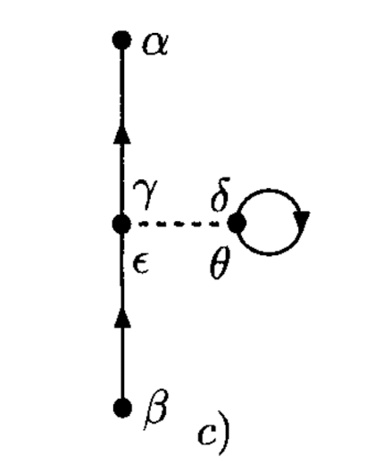

# Perturbative Expansion of  Correlation Functions

**Example: Two-Body Interactions**

In the following we illustrate the perturbative expansion of 2-point functions (Green's function, $n = 2$) 

$$
G_{\alpha \beta}(t - t')
\equiv \frac{-i}{\hbar}
\amp{\Psi_0}{T[a_\alpha(t) a^\dagger_\beta(t')]}{\Psi_0}
$$

using a Hamiltonian with two-body interactions (in interaction picture):

$$
\begin{aligned}
    V(t) = \frac{1}{2} \sum_{\gamma \delta \epsilon \theta}
    \amp{\gamma \delta}{V}{\epsilon \theta}
    a_\gamma^\dagger(t) a_\delta^\dagger(t)
    a_\theta(t) a_\epsilon(t)
\end{aligned}
$$

## Zeroth Order Term

The zeroth order term is just the Green's function in free system:

$$
G_{\alpha \beta}^{(0)} (t - t')
\equiv \frac{-i}{\hbar} 
\amp{0}{T[a_\alpha(t) a^\dagger_\beta(t')]}{0}
$$

We note that since $a_\alpha a^\dagger_\beta$ is already in normal order, the zeroth term is the same as the contraction:

$$
a^\bullet_\alpha(t) a^{\dagger \bullet}_\beta(t')
= i \hbar \, G_{\alpha \beta}^{(0)} (t - t')
$$

The application of Wick's theorem is then made simple.

## First Order Terms

*In the following time integrations, we suppress the limits $\pm (\infty - i\epsilon)$.*

$$
\begin{aligned}
    &G^{(1)}_{\alpha \beta}(t - t')
    \\
    &= \left(\frac{-i}{\hbar} \right)^2 \int dt_1 \,
    \amp{0}{T[V(t_1) a_\alpha(t) a^\dagger_\beta(t')]}{0}
    \\
    &= \frac{1}{2} \left(\frac{-i}{\hbar} \right)^2 
    \sum_{\gamma \delta \epsilon \theta} 
    \int dt_1 \, \amp{\gamma \delta}{V}{\epsilon \theta}
    \\ &\qquad \qquad \times
    \amp{0}{T[
        a_\gamma^\dagger(t_1^+) a_\delta^\dagger(t_1^+)
        a_\theta(t_1) a_\epsilon(t_1) 
        a_\alpha(t) a^\dagger_\beta(t')
    ]}{0}
\end{aligned}
$$

The notation $t_1^+$ is introduced to indicate the original order of operators in $V$. Now we can apply Wick's theorem: 

$$
T[AB...] = N[AB... + \text{sum of all possible contractions}]
$$

However, note that:

- In the sum of all possible contractions with normal ordering, only those with every operator contracted (*fully* contracted) can have nonzero vacuum expectation value;

- The only nonzero contraction is between an $a$ and an $a^\dagger$, which gives 
    
    $$
    a^\bullet_\alpha(t) a^{\dagger \bullet}_\beta(t')
    = iG_{\alpha \beta}^{(0)} (t - t')
    $$

With these observations, we obtain $3! = 6$ terms (omitting the time in intermediate steps for convenience)

$$
\begin{aligned}
    & \amp{0}{T[
        a_\gamma^\dagger(t_1^+) a_\delta^\dagger(t_1^+)
        a_\theta(t_1) a_\epsilon(t_1) 
        a_\alpha(t) a^\dagger_\beta(t')
    ]}{0} \\
    &= \sum_{\sigma \in S_3} \Big[
        a^{\dagger \bullet 1}_\gamma a^{\dagger \bullet 2}_\delta
        a^{\bullet \sigma(1)}_\theta a^{\bullet \sigma(2)}_\epsilon 
        a^{\bullet \sigma(3)}_\alpha a^{\dagger \bullet 3}_\beta
        + a^{\dagger \bullet 1}_\gamma a^{\dagger \bullet 2}_\delta
        a^{\bullet \sigma(3)}_\theta a^{\bullet \sigma(2)}_\epsilon 
        a^{\bullet \sigma(1)}_\alpha a^{\dagger \bullet 3}_\beta
    \Big]
    \\
    &= \underbrace{
        a^{\dagger \bullet 1}_\gamma a^{\dagger \bullet 2}_\delta
        a^{\bullet 1}_\theta a^{\bullet 2}_\epsilon 
        a^{\bullet 3}_\alpha a^{\dagger \bullet 3}_\beta
    }_{(b)}
    + \underbrace{
        a^{\dagger \bullet 1}_\gamma a^{\dagger \bullet 2}_\delta
        a^{\bullet 2}_\theta a^{\bullet 3}_\epsilon 
        a^{\bullet 1}_\alpha a^{\dagger \bullet 3}_\beta
    }_{(c)}
    \\ &\quad
    + \underbrace{
        a^{\dagger \bullet 1}_\gamma a^{\dagger \bullet 2}_\delta
        a^{\bullet 3}_\theta a^{\bullet 1}_\epsilon 
        a^{\bullet 2}_\alpha a^{\dagger \bullet 3}_\beta
    }_{(e)}
    + \underbrace{
        a^{\dagger \bullet 1}_\gamma a^{\dagger \bullet 2}_\delta
        a^{\bullet 3}_\theta a^{\bullet 2}_\epsilon 
        a^{\bullet 1}_\alpha a^{\dagger \bullet 3}_\beta
    }_{(d)}
    \\ &\quad
    + \underbrace{
        a^{\dagger \bullet 1}_\gamma a^{\dagger \bullet 2}_\delta
        a^{\bullet 2}_\theta a^{\bullet 1}_\epsilon 
        a^{\bullet 3}_\alpha a^{\dagger \bullet 3}_\beta
    }_{(a)}
    + \underbrace{
        a^{\dagger \bullet 1}_\gamma a^{\dagger \bullet 2}_\delta
        a^{\bullet 1}_\theta a^{\bullet 3}_\epsilon 
        a^{\bullet 2}_\alpha a^{\dagger \bullet 3}_\beta
    }_{(f)}
\end{aligned}
$$

Note that extra minus signs may occur when moving the pairs in a contraction together for fermions. Let us now evaluate each term explicitly, and associate each with a Feynman diagram (the rules will be summarized later):

$$
\quad \begin{aligned}
    &a^{\dagger \bullet 1}_\gamma a^{\dagger \bullet 2}_\delta
    a^{\bullet 2}_\theta a^{\bullet 1}_\epsilon 
    a^{\bullet 3}_\alpha a^{\dagger \bullet 3}_\beta
    = a^{\bullet 1}_\epsilon a^{\dagger \bullet 1}_\gamma 
    a^{\bullet 2}_\theta a^{\dagger \bullet 2}_\delta 
    a^{\bullet 3}_\alpha a^{\dagger \bullet 3}_\beta
    \\[1em]
    & \Rightarrow 
    \frac{i\hbar}{2} \sum_{\gamma \delta \epsilon \theta} 
    \int dt_1 \, \amp{\gamma \delta}{V}{\epsilon \theta}
    \\ &\qquad \qquad \times
    G^{(0)}_{\epsilon \gamma}(t_1 - t_1^+) \,
    G^{(0)}_{\theta \delta}(t_1 - t_1^+) \,
    G^{(0)}_{\alpha \beta}(t - t')
\end{aligned}
$$

 

$$
\quad \begin{aligned}
    &a^{\dagger \bullet 1}_\gamma a^{\dagger \bullet 2}_\delta
    a^{\bullet 1}_\theta a^{\bullet 2}_\epsilon 
    a^{\bullet 3}_\alpha a^{\dagger \bullet 3}_\beta
    = - a^{\bullet 1}_\theta a^{\dagger \bullet 1}_\gamma 
    a^{\bullet 2}_\epsilon a^{\dagger \bullet 2}_\delta 
    a^{\bullet 3}_\alpha a^{\dagger \bullet 3}_\beta
    \\[1em]
    & \Rightarrow 
    - \frac{i\hbar}{2} \sum_{\gamma \delta \epsilon \theta} 
    \int dt_1 \, \amp{\gamma \delta}{V}{\epsilon \theta}
    \\ &\qquad \qquad \times
    G^{(0)}_{\theta \gamma}(t_1 - t_1^+) \,
    G^{(0)}_{\epsilon \delta}(t_1 - t_1^+) \,
    G^{(0)}_{\alpha \beta}(t - t')
\end{aligned}
$$

 

$$
\quad \begin{aligned}
    &a^{\dagger \bullet 1}_\gamma a^{\dagger \bullet 2}_\delta
    a^{\bullet 2}_\theta a^{\bullet 3}_\epsilon 
    a^{\bullet 1}_\alpha a^{\dagger \bullet 3}_\beta
    = - a^{\bullet 1}_\alpha a^{\dagger \bullet 1}_\gamma 
    a^{\bullet 2}_\theta a^{\dagger \bullet 2}_\delta 
    a^{\bullet 3}_\epsilon a^{\dagger \bullet 3}_\beta
    \\[1em]
    & \Rightarrow 
    - \frac{i\hbar}{2} \sum_{\gamma \delta \epsilon \theta} 
    \int dt_1 \, \amp{\gamma \delta}{V}{\epsilon \theta}
    \\ &\qquad \qquad \times
    G^{(0)}_{\alpha \gamma}(t - t_1) \,
    G^{(0)}_{\theta \delta}(t_1 - t_1^+) \,
    G^{(0)}_{\epsilon \beta}(t_1 - t')
\end{aligned}
$$

 

### Equivalent Diagrams

### Fermion Loops and Minus Signs

### Normalization and Cancellation of Disconnected Diagrams

### In the Position Space

Let us focus on figure a) above, and change to the position space:

$$
\begin{aligned}
    \frac{i\hbar}{2} \sum_{\gamma \delta \epsilon \theta} 
    \int dt_1 \, \amp{\gamma \delta}{V}{\epsilon \theta}
    % \\ &\qquad \qquad \times
    G^{(0)}_{\epsilon \gamma}(t_1 - t_1^+) \,
    G^{(0)}_{\theta \delta}(t_1 - t_1^+) \,
    G^{(0)}_{\alpha \beta}(t - t')
\end{aligned}
$$

- **Conversion of $V$ amplitudes**

    $$
    \begin{aligned}
        \amp{\gamma \delta}{V}{\epsilon \theta}
        &\to \amp{
            \gamma, \mathbf{y}_1; 
            \delta, \mathbf{y}'_1
        }{V}{
            \epsilon, \mathbf{x}_1;
            \theta, \mathbf{x}'_1
        } \\
        &= \delta^3(\mathbf{y}_1 - \mathbf{x}_1) 
        \delta^3(\mathbf{y}'_1 - \mathbf{x}'_1)
        \delta_{\gamma \epsilon} \delta_{\delta \theta}
        V(\mathbf{x}_1, \mathbf{x}'_1)

        \\[0.6em]

        \sum_{\gamma \delta \epsilon \theta} 
        &\to \sum_{\gamma \delta \epsilon \theta} 
        \int d^3 y_1 \, d^3 y'_1 \, d^3 x_1 \, d^3 x'_1
    \end{aligned}
    $$

    The two spatial delta functions are immediately removed when summing over the $V$ amplitudes. 
    
- **Conversion of Green's functions (propagators)**
    
    We introduce a further integration over the time component of $x'_1 \equiv (t'_1, \mathbf{x}'_1)$, which allows us to write

    $$
    G^{(0)}_{\theta \delta}(t_1 - t_1^+)
    \to \int dt'_1 \, G^{(0)}_{\theta \delta}(t'_1 - t'^+_1) 
    \delta(t'_1 - t_1)
    $$

    Then we can write each Green's function using the 4-position:

    $$
    \begin{aligned}
        G^{(0)}_{\epsilon \gamma}(t_1 - t_1^+)
        &\to G^{(0)}_{\epsilon \gamma}
        (\mathbf{x}_1, \mathbf{y}_1; t_1 - t_1^+)
        \xrightarrow{\mathbf{y}_1 = \mathbf{x}_1}
        G^{(0)}_{\epsilon \gamma}(x_1, x_1)
        
        \\
        
        G^{(0)}_{\theta \delta}(t'_1 - t'^+_1)
        &\to G^{(0)}_{\theta \delta}
        (\mathbf{x}'_1, \mathbf{y}'_1; t'_1 - t'^+_1)
        \xrightarrow{\mathbf{y}'_1 = \mathbf{x}'_1}
        G^{(0)}_{\theta \delta}(x'_1, x'_1)
        
        \\
        
        G^{(0)}_{\alpha \beta}(t - t')
        &\to G^{(0)}_{\alpha \beta}(\mathbf{x}, \mathbf{x}'; t - t')
        = G^{(0)}_{\alpha \beta}(x, x')
    \end{aligned}
    $$

Finally, note that we can combine the remaining integrations (not cancelled by delta functions) into

$$
\int d^3 x_1 \, d^3 x'_1 \, dt_1 \, dt'_1
= \int d^4 x_1 \, d^4 x'_1
$$

Assembling these results together, we get

$$
\quad \begin{aligned}
    &\frac{i\hbar}{2} \int d^4 x_1 \, d^4 x'_1 \, 
    U_{\gamma \delta, \epsilon \theta}(x_1, x'_1)
    \\ &\qquad \qquad \times
    G^{(0)}_{\epsilon \gamma}(x_1, x_1) \,
    G^{(0)}_{\theta \delta}(x'_1, x'_1) \,
    G^{(0)}_{\alpha \beta}(x, x')
    \\[1em]
    &\text{with} \quad
    U_{\gamma \delta, \epsilon \theta}(x_1, x'_1)
    \equiv V(\mathbf{x}_1, \mathbf{x}'_1) \,
    \delta_{\gamma \epsilon} \delta_{\delta \theta} \,
    \delta(t_1 - t'_1)
\end{aligned}
$$

 

### In the Momentum Space

For translation-invariant systems, another useful choice of basis states is the momentum eigenstates. For diagram a) above:

## Summary: The Feynman Rules