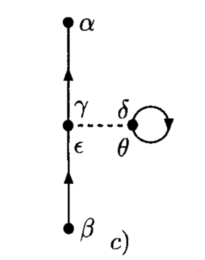
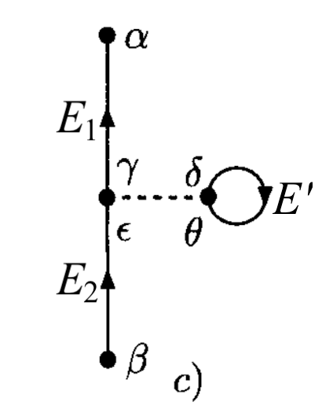
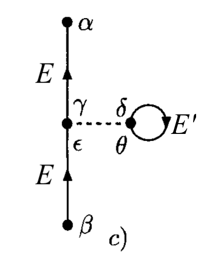

# Perturbative Expansion of  Correlation Functions

**Part 2: Energy Formulation**

## Fourier Transform of Time

In this part we Fourier transform the time to obtain the diagram rules in energy formulation. We first consider the first order direct term:

$$
\quad \begin{aligned}
    &G^{(\text{1D})}_{\alpha \beta}(t - t')
    \\
    &=
    - i\hbar \sum_{\gamma \delta \epsilon \theta} 
    \int dt_1 \, \amp{\gamma \delta}{V}{\epsilon \theta}
    \\ &\quad \times
    G^{(0)}_{\alpha \gamma}(t - t_1) \,
    G^{(0)}_{\theta \delta}(t_1 - t_1^+) \,
    G^{(0)}_{\epsilon \beta}(t_1 - t')
\end{aligned}
$$

 

We first express each free Green's function in the expression as

$$
G^{(0)}_{\alpha \beta}(t)
= \int \frac{dE}{2\pi} e^{-iEt} 
G^{(0)}_{\alpha \beta}(E)
$$

Then

$$
\quad \begin{aligned}
    &G^{(\text{1D})}_{\alpha \beta}(E)
    = \int d(t-t') e^{iE(t-t')} 
    G^{(\text{1D})}_{\alpha \beta}(t-t')
    \\
    &= - i\hbar \int d(t-t') e^{iE(t-t')} 
    \sum_{\gamma \delta \epsilon \theta} 
    \int dt_1 \, \amp{\gamma \delta}{V}{\epsilon \theta}
    \\ &\quad \times
    \int \frac{dE_1}{2\pi} e^{-iE_1(t - t_1)}
    G^{(0)}_{\alpha \gamma}(E_1)
    \\ &\quad \times
    \int \frac{dE'}{2\pi} e^{-iE' 0^-}
    G^{(0)}_{\theta \delta}(E')
    \\ &\quad \times
    \int \frac{dE_2}{2\pi} e^{-iE_2(t_1 - t')}
    G^{(0)}_{\epsilon \beta}(E_2)
\end{aligned}
$$

 

Here we introduced three energies for each Green's function (arrowed lines). First, the integration over $t_1$ gives energy conservation at vertices (on the arrowed lines)

$$
\int dt_1 \, e^{i(E_1 - E_2)t_1} = 2\pi \delta(E_1 - E_2)
$$

Then, after setting $E_2 = E_1$, the integration over $t - t'$ gives the energy conservation at the outgoing/incoming arrowed line:

$$
\begin{aligned}
    &\int d(t-t') e^{iE(t-t')} e^{-iE_1 t} 
    [e^{-iE_2(-t')}]_{E_2 = E_1} \\
    &= 2\pi \delta(E - E_1)
\end{aligned}
$$

Thus only the integration over the energy $E'$ (of the closed loop, or arrowed line whose two ends are connected by the interaction (e.g. in the exchange term)) remains:

$$
\quad \begin{aligned}
    &G^{(\text{1D})}_{\alpha \beta}(E)
    = \int d(t-t') e^{iE(t-t')} 
    G^{(\text{1D})}_{\alpha \beta}(t-t')
    \\
    &= - i\hbar 
    \sum_{\gamma \delta \epsilon \theta} 
    \amp{\gamma \delta}{V}{\epsilon \theta}
    \\ &\quad \times
    \int \frac{dE'}{2\pi} e^{-iE' 0^-}
    G^{(0)}_{\alpha \gamma}(E_1) \,
    G^{(0)}_{\theta \delta}(E') \,
    G^{(0)}_{\epsilon \beta}(E_2)
\end{aligned}
$$

 

*Remark*: In general, for each closed loop, or each arrowed lines with two ends connected by interaction, we will get an $e^{-iE' 0^-}$ factor. The limit can be achieved by extending the integral to a contour integral (going to the upper half plane):

$$
\begin{aligned}
    \int \frac{dE'}{2\pi} e^{-iE' 0^-}
    G^{(0)}_{\theta \delta}(E')
    = \oint_{C\uparrow} \frac{dE'}{2\pi} 
    G^{(0)}_{\theta \delta}(E')
\end{aligned}
$$

 

For the exchange term, there is no closed loop:

### Summary: Feynman Rules in Energy

## In Momentum-Energy Space

When using the energy formulation, one usually use the momentum states as the basis states. We demonstrate this conversion using the first order direct term.

