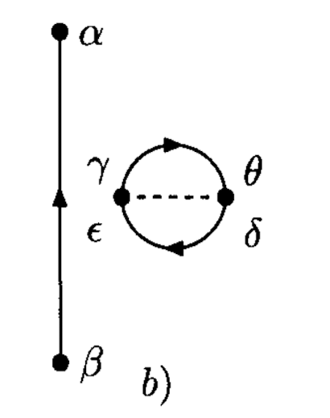

# Perturbative Expansion of  Correlation Functions

**Part 1: Time-Dependent Formulation**

In the following we illustrate the perturbative expansion of 2-point functions (Green's function, $n = 2$) 

$$
G_{\alpha \beta}(t - t')
\equiv \frac{-i}{\hbar}
\amp{\Psi_0}{T[a_\alpha(t) a^\dagger_\beta(t')]}{\Psi_0}
$$

using a Hamiltonian with two-body interactions (in interaction picture):

$$
\begin{aligned}
    V(t) = \frac{1}{2} \sum_{\gamma \delta \epsilon \theta}
    \amp{\gamma \delta}{V}{\epsilon \theta}
    a_\gamma^\dagger(t) a_\delta^\dagger(t)
    a_\theta(t) a_\epsilon(t)
\end{aligned}
$$

## Zeroth Order Term

The zeroth order term is just the Green's function in free system:

$$
G_{\alpha \beta}^{(0)} (t - t')
\equiv \frac{-i}{\hbar} 
\amp{0}{T[a_\alpha(t) a^\dagger_\beta(t')]}{0}
$$

We note that since $a_\alpha a^\dagger_\beta$ is already in normal order, the zeroth term is the same as the contraction:

$$
a^\bullet_\alpha(t) a^{\dagger \bullet}_\beta(t')
= i \hbar \, G_{\alpha \beta}^{(0)} (t - t')
$$

The application of Wick's theorem is then made simple.

## First Order Terms

*In the following time integrations, we suppress the limits $\pm (\infty - i\epsilon)$.*

$$
\begin{aligned}
    &G^{(1)}_{\alpha \beta}(t - t')
    \\
    &= \left(\frac{-i}{\hbar} \right)^2 \int dt_1 \,
    \amp{0}{T[V(t_1) a_\alpha(t) a^\dagger_\beta(t')]}{0}
    \\
    &= \frac{1}{2} \left(\frac{-i}{\hbar} \right)^2 
    \sum_{\gamma \delta \epsilon \theta} 
    \int dt_1 \, \amp{\gamma \delta}{V}{\epsilon \theta}
    \\ &\qquad \times
    \amp{0}{T[
        a_\gamma^\dagger(t_1^+) a_\delta^\dagger(t_1^+)
        a_\theta(t_1) a_\epsilon(t_1) 
        a_\alpha(t) a^\dagger_\beta(t')
    ]}{0}
\end{aligned}
$$

The notation $t_1^+$ is introduced to indicate the original order of operators in $V$. Now we can apply Wick's theorem: 

$$
T[AB...] = N[AB... + \text{sum of all possible contractions}]
$$

However, note that:

- In the sum of all possible contractions with normal ordering, only those with every operator contracted (*fully* contracted) can have nonzero vacuum expectation value;

- The only nonzero contraction is between an $a$ and an $a^\dagger$, which gives 
    
    $$
    a^\bullet_\alpha(t) a^{\dagger \bullet}_\beta(t')
    = iG_{\alpha \beta}^{(0)} (t - t')
    $$

With these observations, we obtain $3! = 6$ terms (omitting the time in intermediate steps for convenience)

$$
\begin{aligned}
    & \amp{0}{T[
        a_\gamma^\dagger(t_1^+) a_\delta^\dagger(t_1^+)
        a_\theta(t_1) a_\epsilon(t_1) 
        a_\alpha(t) a^\dagger_\beta(t')
    ]}{0} \\
    &= \sum_{\sigma \in S_3} \Big[
        a^{\dagger \bullet 1}_\gamma a^{\dagger \bullet 2}_\delta
        a^{\bullet \sigma(1)}_\theta a^{\bullet \sigma(2)}_\epsilon 
        a^{\bullet \sigma(3)}_\alpha a^{\dagger \bullet 3}_\beta
        + a^{\dagger \bullet 1}_\gamma a^{\dagger \bullet 2}_\delta
        a^{\bullet \sigma(3)}_\theta a^{\bullet \sigma(2)}_\epsilon 
        a^{\bullet \sigma(1)}_\alpha a^{\dagger \bullet 3}_\beta
    \Big]
    \\
    &= \underbrace{
        a^{\dagger \bullet 1}_\gamma a^{\dagger \bullet 2}_\delta
        a^{\bullet 1}_\theta a^{\bullet 2}_\epsilon 
        a^{\bullet 3}_\alpha a^{\dagger \bullet 3}_\beta
    }_{(b)}
    + \underbrace{
        a^{\dagger \bullet 1}_\gamma a^{\dagger \bullet 2}_\delta
        a^{\bullet 2}_\theta a^{\bullet 3}_\epsilon 
        a^{\bullet 1}_\alpha a^{\dagger \bullet 3}_\beta
    }_{(c)}
    \\ &\quad
    + \underbrace{
        a^{\dagger \bullet 1}_\gamma a^{\dagger \bullet 2}_\delta
        a^{\bullet 3}_\theta a^{\bullet 1}_\epsilon 
        a^{\bullet 2}_\alpha a^{\dagger \bullet 3}_\beta
    }_{(e)}
    + \underbrace{
        a^{\dagger \bullet 1}_\gamma a^{\dagger \bullet 2}_\delta
        a^{\bullet 3}_\theta a^{\bullet 2}_\epsilon 
        a^{\bullet 1}_\alpha a^{\dagger \bullet 3}_\beta
    }_{(d)}
    \\ &\quad
    + \underbrace{
        a^{\dagger \bullet 1}_\gamma a^{\dagger \bullet 2}_\delta
        a^{\bullet 2}_\theta a^{\bullet 1}_\epsilon 
        a^{\bullet 3}_\alpha a^{\dagger \bullet 3}_\beta
    }_{(a)}
    + \underbrace{
        a^{\dagger \bullet 1}_\gamma a^{\dagger \bullet 2}_\delta
        a^{\bullet 1}_\theta a^{\bullet 3}_\epsilon 
        a^{\bullet 2}_\alpha a^{\dagger \bullet 3}_\beta
    }_{(f)}
\end{aligned}
$$

Note that extra minus signs may occur when moving the pairs in a contraction together for fermions. Let us now evaluate each term explicitly, and associate each with a Feynman diagram (the rules will be summarized later):

$$
\quad \begin{aligned}
    &\text{Term} \ (a) \\
    &a^{\dagger \bullet 1}_\gamma a^{\dagger \bullet 2}_\delta
    a^{\bullet 2}_\theta a^{\bullet 1}_\epsilon 
    a^{\bullet 3}_\alpha a^{\dagger \bullet 3}_\beta
    = a^{\bullet 1}_\epsilon a^{\dagger \bullet 1}_\gamma 
    a^{\bullet 2}_\theta a^{\dagger \bullet 2}_\delta 
    a^{\bullet 3}_\alpha a^{\dagger \bullet 3}_\beta
    \\[1em]
    & \Rightarrow 
    \frac{i\hbar}{2} \sum_{\gamma \delta \epsilon \theta} 
    \int dt_1 \, \amp{\gamma \delta}{V}{\epsilon \theta}
    \\ &\quad \times
    G^{(0)}_{\epsilon \gamma}(t_1 - t_1^+) \,
    G^{(0)}_{\theta \delta}(t_1 - t_1^+) \,
    G^{(0)}_{\alpha \beta}(t - t')
\end{aligned}
$$

 

$$
\quad \begin{aligned}
    &\text{Term} \ (b) \\
    &a^{\dagger \bullet 1}_\gamma a^{\dagger \bullet 2}_\delta
    a^{\bullet 1}_\theta a^{\bullet 2}_\epsilon 
    a^{\bullet 3}_\alpha a^{\dagger \bullet 3}_\beta
    = - a^{\bullet 1}_\theta a^{\dagger \bullet 1}_\gamma 
    a^{\bullet 2}_\epsilon a^{\dagger \bullet 2}_\delta 
    a^{\bullet 3}_\alpha a^{\dagger \bullet 3}_\beta
    \\[1em]
    & \Rightarrow 
    - \frac{i\hbar}{2} \sum_{\gamma \delta \epsilon \theta} 
    \int dt_1 \, \amp{\gamma \delta}{V}{\epsilon \theta}
    \\ &\quad \times
    G^{(0)}_{\theta \gamma}(t_1 - t_1^+) \,
    G^{(0)}_{\epsilon \delta}(t_1 - t_1^+) \,
    G^{(0)}_{\alpha \beta}(t - t')
\end{aligned}
$$

 

$$
\quad \begin{aligned}
    &\text{Term} \ (c) \\
    &a^{\dagger \bullet 1}_\gamma a^{\dagger \bullet 2}_\delta
    a^{\bullet 2}_\theta a^{\bullet 3}_\epsilon 
    a^{\bullet 1}_\alpha a^{\dagger \bullet 3}_\beta
    = - a^{\bullet 1}_\alpha a^{\dagger \bullet 1}_\gamma 
    a^{\bullet 2}_\theta a^{\dagger \bullet 2}_\delta 
    a^{\bullet 3}_\epsilon a^{\dagger \bullet 3}_\beta
    \\[1em]
    & \Rightarrow 
    - \frac{i\hbar}{2} \sum_{\gamma \delta \epsilon \theta} 
    \int dt_1 \, \amp{\gamma \delta}{V}{\epsilon \theta}
    \\ &\quad \times
    G^{(0)}_{\alpha \gamma}(t - t_1) \,
    G^{(0)}_{\theta \delta}(t_1 - t_1^+) \,
    G^{(0)}_{\epsilon \beta}(t_1 - t')
\end{aligned}
$$

 

$$
\quad \begin{aligned}
    &\text{Term} \ (d) \\
    &a^{\dagger \bullet 1}_\gamma a^{\dagger \bullet 2}_\delta
    a^{\bullet 3}_\theta a^{\bullet 2}_\epsilon 
    a^{\bullet 1}_\alpha a^{\dagger \bullet 3}_\beta
    = a^{\bullet 1}_\alpha a^{\dagger \bullet 1}_\gamma 
    a^{\bullet 2}_\epsilon a^{\dagger \bullet 2}_\delta 
    a^{\bullet 3}_\theta a^{\dagger \bullet 3}_\beta
    \\[1em]
    & \Rightarrow 
    \frac{i\hbar}{2} \sum_{\gamma \delta \epsilon \theta} 
    \int dt_1 \, \amp{\gamma \delta}{V}{\epsilon \theta}
    \\ &\quad \times
    G^{(0)}_{\alpha \gamma}(t - t_1) \,
    G^{(0)}_{\epsilon \delta}(t_1 - t_1^+) \,
    G^{(0)}_{\theta \beta}(t_1 - t')
\end{aligned}
$$

 

$$
\quad \begin{aligned}
    &\text{Term} \ (e) \\
    &a^{\dagger \bullet 1}_\gamma a^{\dagger \bullet 2}_\delta
    a^{\bullet 3}_\theta a^{\bullet 1}_\epsilon 
    a^{\bullet 2}_\alpha a^{\dagger \bullet 3}_\beta
    = - a^{\bullet 1}_\epsilon a^{\dagger \bullet 1}_\gamma 
    a^{\bullet 2}_\alpha a^{\dagger \bullet 2}_\delta 
    a^{\bullet 3}_\theta a^{\dagger \bullet 3}_\beta
    \\[1em]
    & \Rightarrow 
    - \frac{i\hbar}{2} \sum_{\gamma \delta \epsilon \theta} 
    \int dt_1 \, \amp{\gamma \delta}{V}{\epsilon \theta}
    \\ &\quad \times
    G^{(0)}_{\epsilon \gamma}(t_1 - t_1^+) \,
    G^{(0)}_{\alpha \delta}(t - t_1) \,
    G^{(0)}_{\theta \beta}(t_1 - t')
\end{aligned}
$$

 

$$
\quad \begin{aligned}
    &\text{Term} \ (f) \\
    &a^{\dagger \bullet 1}_\gamma a^{\dagger \bullet 2}_\delta
    a^{\bullet 1}_\theta a^{\bullet 3}_\epsilon 
    a^{\bullet 2}_\alpha a^{\dagger \bullet 3}_\beta
    = a^{\bullet 1}_\theta a^{\dagger \bullet 1}_\gamma 
    a^{\bullet 2}_\alpha a^{\dagger \bullet 2}_\delta 
    a^{\bullet 3}_\epsilon a^{\dagger \bullet 3}_\beta
    \\[1em]
    & \Rightarrow 
    \frac{i\hbar}{2} \sum_{\gamma \delta \epsilon \theta} 
    \int dt_1 \, \amp{\gamma \delta}{V}{\epsilon \theta}
    \\ &\quad \times
    G^{(0)}_{\theta \gamma}(t_1 - t_1^+) \,
    G^{(0)}_{\alpha \delta}(t - t_1) \,
    G^{(0)}_{\epsilon \beta}(t_1 - t')
\end{aligned}
$$

 

### Fermion Loops and Minus Signs

From the figures we see that if the arrowed lines representing Green's function form a closed loop, then the expression will get a minus sign. This is in general true: the expression will get $(-1)^n$, where $n$ is the number of such loops. Of course, these signs are absent for boson systems. 

### Normalization and Cancellation of Disconnected Diagrams

It turns out that the normalization of $\ket{\Psi_0}$ will cancel the terms with *disconnected diagrams* (a) and (b). Therefore, the true $k$th order term of the Green's function with normalized $\ket{\Psi_0}$ is

$$
\begin{aligned}
    \frac{1}{k!} \left(\frac{-i}{\hbar}\right)^{k+1}
    &\int dt_1 \cdots dt_k \,
    \\ &\quad
    \amp{0}{T[
        V(t_1) \cdots V(t_k)
        a_\alpha(t) a_\beta^\dagger(t')
    ]}{0}_\text{connected}
\end{aligned}
$$

### Equivalent Diagrams

Among the remaining four diagrams, we can see that (c)(e), if without the labels, are (topologically) equivalent diagrams. Looking at the expressions they represent: 

$$
\begin{aligned}
    (c) &= - \frac{i\hbar}{2} \sum_{\gamma \delta \epsilon \theta} 
    \int dt_1 \, \amp{\gamma \delta}{V}{\epsilon \theta}
    \\ &\qquad \times
    G^{(0)}_{\alpha \gamma}(t - t_1) \,
    G^{(0)}_{\theta \delta}(t_1 - t_1^+) \,
    G^{(0)}_{\epsilon \beta}(t_1 - t')
    \\
    (e) &= - \frac{i\hbar}{2} \sum_{\gamma \delta \epsilon \theta} 
    \int dt_1 \, \amp{\gamma \delta}{V}{\epsilon \theta}
    \\ &\qquad \times
    G^{(0)}_{\alpha \delta}(t - t_1) \,
    G^{(0)}_{\epsilon \gamma}(t_1 - t_1^+) \,
    G^{(0)}_{\theta \beta}(t_1 - t')
    \\
    &= - \frac{i\hbar}{2} \sum_{\gamma \delta \epsilon \theta} 
    \int dt_1 \, \amp{\delta \gamma}{V}{\theta \epsilon}
    \\ &\qquad \times
    G^{(0)}_{\alpha \gamma}(t - t_1) \,
    G^{(0)}_{\theta \delta}(t_1 - t_1^+) \,
    G^{(0)}_{\epsilon \beta}(t_1 - t')
\end{aligned}
$$

But we know that $V$ has the symmetry property $V(i,j) = V(j,i)$, i.e.

$$
\amp{\gamma \delta}{V}{\epsilon \theta}
= \amp{\delta \gamma}{V}{\theta \epsilon}
$$

Thus (c) and (e) are in fact equal. The same argument applies to (d) and (f). Thus we can only draw diagrams (c),(d) and add an additional factor of 2, which exactly cancel the 1/2 from Taylor expansion. Such cancellation of the $1/n!$ factor holds at all orders. 

To summarize, the true first order terms are

**First order terms of Green's function:**

$$
\quad \begin{aligned}
    &\text{Direct term}
    \\
    &
    - i\hbar \sum_{\gamma \delta \epsilon \theta} 
    \int dt_1 \, \amp{\gamma \delta}{V}{\epsilon \theta}
    \\ & \times
    G^{(0)}_{\alpha \gamma}(t - t_1) \,
    G^{(0)}_{\theta \delta}(t_1 - t_1^+) \,
    G^{(0)}_{\epsilon \beta}(t_1 - t')
\end{aligned}
$$

 

$$
\quad \begin{aligned}
    &\text{Exchange term}
    \\[1em]
    &
    i\hbar \sum_{\gamma \delta \epsilon \theta} 
    \int dt_1 \, \amp{\gamma \delta}{V}{\epsilon \theta}
    \\ & \times
    G^{(0)}_{\alpha \gamma}(t - t_1) \,
    G^{(0)}_{\epsilon \delta}(t_1 - t_1^+) \,
    G^{(0)}_{\theta \beta}(t_1 - t')
\end{aligned}
$$

 

 

### Summary: Feynman Rules in Time

## In Position-Time Space

Now we demonstrate how to change to the position basis using the direct term:

$$
\begin{aligned}
    - i\hbar \sum_{\gamma \delta \epsilon \theta} 
    \int dt_1 \, \amp{\gamma \delta}{V}{\epsilon \theta}
    % \\ & \times
    G^{(0)}_{\alpha \gamma}(t - t_1) \,
    G^{(0)}_{\theta \delta}(t_1 - t_1^+) \,
    G^{(0)}_{\epsilon \beta}(t_1 - t')
\end{aligned}
$$

- **Conversion of $V$ amplitudes**

    $$
    \begin{aligned}
        \amp{\gamma \delta}{V}{\epsilon \theta}
        &\to \amp{
            \gamma, \mathbf{y}_1; 
            \delta, \mathbf{y}'_1
        }{V}{
            \epsilon, \mathbf{x}_1;
            \theta, \mathbf{x}'_1
        } \\
        &= \delta^3(\mathbf{y}_1 - \mathbf{x}_1) 
        \delta^3(\mathbf{y}'_1 - \mathbf{x}'_1)
        \delta_{\gamma \epsilon} \delta_{\delta \theta}
        V(\mathbf{x}_1, \mathbf{x}'_1)

        \\[0.6em]

        \sum_{\gamma \delta \epsilon \theta} 
        &\to \sum_{\gamma \delta \epsilon \theta} 
        \int d^3 y_1 \, d^3 y'_1 \, d^3 x_1 \, d^3 x'_1
    \end{aligned}
    $$

    The two spatial delta functions are immediately removed when summing over the $V$ amplitudes. 
    
- **Conversion of Green's function**
    
    We introduce a further integration over the time component of $x'_1 \equiv (t'_1, \mathbf{x}'_1)$, which allows us to write

    $$
    G^{(0)}_{\theta \delta}(t_1 - t_1^+)
    \to \int dt'_1 \, G^{(0)}_{\theta \delta}(t'_1 - t'^+_1) 
    \delta(t'_1 - t_1)
    $$

    Then we can write each Green's function using the 4-position:

    $$
    \begin{aligned}
        G^{(0)}_{\epsilon \gamma}(t_1 - t_1^+)
        &\to G^{(0)}_{\epsilon \gamma}
        (\mathbf{x}_1, \mathbf{y}_1; t_1 - t_1^+)
        \xrightarrow{\mathbf{y}_1 = \mathbf{x}_1}
        G^{(0)}_{\epsilon \gamma}(x_1, x_1)
        
        \\
        
        G^{(0)}_{\theta \delta}(t'_1 - t'^+_1)
        &\to G^{(0)}_{\theta \delta}
        (\mathbf{x}'_1, \mathbf{y}'_1; t'_1 - t'^+_1)
        \xrightarrow{\mathbf{y}'_1 = \mathbf{x}'_1}
        G^{(0)}_{\theta \delta}(x'_1, x'_1)
        
        \\
        
        G^{(0)}_{\alpha \beta}(t - t')
        &\to G^{(0)}_{\alpha \beta}(\mathbf{x}, \mathbf{x}'; t - t')
        = G^{(0)}_{\alpha \beta}(x, x')
    \end{aligned}
    $$

Finally, note that we can combine the remaining integrations (not cancelled by delta functions) into

$$
\int d^3 x_1 \, d^3 x'_1 \, dt_1 \, dt'_1
= \int d^4 x_1 \, d^4 x'_1
$$

Assembling these results together, we get

$$
\quad \begin{aligned}
    &\frac{i\hbar}{2} \int d^4 x_1 \, d^4 x'_1 \, 
    U_{\gamma \delta, \epsilon \theta}(x_1, x'_1)
    \\ &\qquad \times
    G^{(0)}_{\epsilon \gamma}(x_1, x_1) \,
    G^{(0)}_{\theta \delta}(x'_1, x'_1) \,
    G^{(0)}_{\alpha \beta}(x, x')
    \\[1em]
    &\text{with} \quad
    U_{\gamma \delta, \epsilon \theta}(x_1, x'_1)
    \equiv V(\mathbf{x}_1, \mathbf{x}'_1) \,
    \delta_{\gamma \epsilon} \delta_{\delta \theta} \,
    \delta(t_1 - t'_1)
\end{aligned}
$$

 
