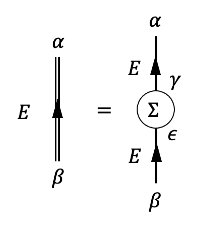

# Self-Energy

In energy formulation, each diagram in perturbation expansion if Green's function has the following property:
    

$$
\quad \begin{aligned}
    G_{\alpha \beta}(E)
    = \sum_{\gamma \epsilon}
    G^{(0)}_{\alpha \gamma}(E)
    \Sigma_{\gamma \epsilon}(E)
    G^{(0)}_{\epsilon \beta}(E)
\end{aligned}
$$

 

Here the *exact* propagator is represented by an arrowed *double*-line. The quantity $\Sigma(E)$ (although the $E$-dependence is not obvious in first order diagrams) is called the **self-energy**.

## Proper Self-Energy

## Dyson's Equation
