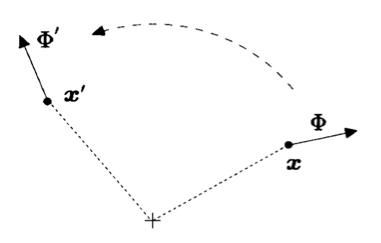

# Symmetry in Field Theory

## Continuous Symmetry

Our physical system is described by the following action depending on the fields and the *first-order* derivative of them:

$$
S=\int d^dx \mathcal{L}(\phi (x),\partial \phi (x))
$$

Now suppose we *move* the system to a new position (the amount of moving can be different for different parts) so that things originally at $x$ is now at $x'$ (*active view*). 

This is *not* due to change of the coordinate system (*passive view*). We can always put the change of
position in the form

$$
x\to x'(x)=x+\epsilon (x)
$$

Although we use the letter $\epsilon$, it is not necessarily a small quantity (nevertheless we shall soon make it so). 

At the same time, *the field will also be affected*: the new field at the new position $\phi' \left(x'\right)$ is some functional $\mathcal{F}$ of the old field at the old position $\phi (x)$

$$
\phi (x)\to \phi' \left(x'(x)\right)=\mathcal{F}(\phi (x))
$$

### Generators of Infinitesimal Transformation

Now consider . Assume that the transformation depends on some set of parameters $\left\{\omega_a\right\}$, i.e.

$$
x^{\mu} \to x^{\prime \mu}(x,\omega),
\quad
\phi (x)\to \phi' \left(x'(x)\right)=\mathcal{F}(\phi (x),\omega)
$$

$\omega =0$ corresponds to doing nothing:

$$
x^{\prime \mu}(x,0)=x^{\mu}, \mathcal{F}(\phi (x),0)=\phi (x)
$$

For infinitesimal transformations, the parameters are small. This means that all change in position and field can be approximated by terms linear in $\omega_a$:

$$
\begin{aligned}
    x^{\prime \mu}(x,\omega)
    & =x^{\mu}+\omega_a\frac{\partial x^{\prime \mu}}{\partial \omega_a}(x,0)
    \\
    \phi' \left(x'(x)\right)
    &= \phi' \left(x+\omega_a\frac{\partial x'}{\partial \omega_a}(x,0)\right)\\
    &= \mathcal{F}(\phi (x),\omega)=\phi (x)+\omega_a\frac{\partial \mathcal{F}}{\partial \omega_a}(\phi (x),0)
\end{aligned}
$$

The partial derivatives are evaluated at $\omega_a=0$.

The of the infinitesimal transformation is defined by the difference between the new and the old field *at the same position*:

$$
\phi' (x)-\phi (x)=-i \omega_aG_a\phi (x)
$$

The coefficient $-i$ is in consistent with the *active picture*of
transformations and produce *Hermitian* generators. For multi-component
fields, the generator may be a complicated object (not just a single
number).

The variation of the field is

$$
\begin{aligned}
    \phi' (x)-\phi (x)
    &=\phi \left(x-\omega_a\frac{\partial x'}{\partial \omega_a}(x,0)\right)
    \\ &\quad
    +\omega_a \frac{\partial \mathcal{F}}{\partial \omega_a} \left(
        \phi \left(x-\omega_a\frac{\partial x'}{\partial \omega_a}(x,0)\right), 0
    \right)
    -\phi (x)
\end{aligned}
$$

discarding terms of $O\left(\omega^2\right)$:

$$
\begin{aligned}
    \phi' (x)-\phi (x)
    &= -\omega_a\frac{\partial x^{\prime \mu}}{\partial \omega_a}(x,0)\frac{\partial \phi}{\partial x^{\mu}}(x)
    +\omega_a\frac{\partial
    \mathcal{F}}{\partial \omega_a}(\phi (x),0)
    \\
    &=-i \omega_aG_a\phi (x)
\end{aligned}
$$

Therefore, the generator is given by

$$
i G_a\phi (x)
= \frac{\partial x^{\prime \mu}}{\partial \omega_a}(x,0)\partial_{\mu} \phi (x)
- \frac{\partial \mathcal{F}}{\partial \omega_a}(\phi
(x),0)
$$

### Common Infinitesimal Transformation Generators on Scalar Fields

#### Rigid Translation

The translation is *defined* by its effect on the position:

$$
x^{\prime \mu}=x^{\mu}+\epsilon^{\mu}
$$

The amount of moving $\epsilon$ is the same for every parts of the
system, which plays the role of $\omega$. Then we obtain

$$
\frac{\partial x^{\prime \mu}}{\partial \epsilon^{\nu}}(x,0)=\delta_{\nu}^{\mu}
$$

*All fields* (no matter it is a scalar or a vector or anything) should not be affected by the rigid translation, i.e. the mapping $\mathcal{F}$ is *always* identity. Hence

$$
\phi' \left(x'\right)
=\mathcal{F}(\phi (x),\epsilon)=\phi (x) 
\Longrightarrow
\frac{\partial \mathcal{F}}{\partial \epsilon^{\mu}}(\phi (x),0)=0
$$

We obtain (using $P_{\mu}$ to denote the generators)

$i P_{\nu} \phi (x)=\delta_{\nu}^{\mu} \partial_{\mu} \phi (x)=\partial_{\nu} \phi (x)$

Thus, the corresponding generator (called the operator) is

$P_{\mu}=\frac{1}{i} \partial_{\mu}=-i \partial_{\mu}$

#### Lorentz Transformation

The Lorentz transformation is also *defined* by its effect on the
position:

$x^{\prime \mu}=\Lambda^{\mu}{}_{\nu}x^{\nu}$

Because of the invariance of the proper time

$ds^2=\eta_{\mu  \nu}dx^{\prime \mu}dx^{\prime \nu} \left(=\eta_{\mu  \nu} \Lambda^{\mu}{}_{\rho} \Lambda^{\nu}{}_{\sigma}dx^{\rho}dx^{\sigma
} \right)=\eta_{\rho  \sigma}dx^{\rho}dx^{\sigma}$

The coordinate transformation matrices $\Lambda$ must satisfy the
requirement

$\eta_{\mu  \nu} \Lambda^{\mu}{}_{\rho} \Lambda^{\nu}{}_{\sigma}=\eta_{\rho  \sigma}$

The infinitesimal Lorentz transformation matrix must be close to
identity, and can be written as

$\Lambda^{\mu}{}_{\nu}=\delta^{\mu}{}_{\nu}+\omega^{\mu}{}_{\nu}$

The coordinate transformation is therefore

$x^{\prime \mu}=x^{\mu}+\omega^{\mu}{}_{\sigma}x^{\sigma}=x^{\mu}+\eta^{\mu  \rho} \omega_{\rho  \sigma}x^{\sigma}$

The requirement
$\eta_{\mu  \nu} \Lambda^{\mu}{}_{\rho} \Lambda^{\nu}{}_{\sigma}=\eta_{\rho  \sigma}$
restrict the form of the matrix $\omega
_{\mu  \nu}$:

$\text{LHS}=\eta_{\mu  \nu} \left(\delta^{\mu}{}_{\rho}+\omega^{\mu}{}_{\rho} \right)\left(\delta^{\nu}{}_{\sigma}+\omega^{\nu}{}_{\sigma
} \right)=\left(\eta_{\nu  \rho}+\omega_{\nu  \rho} \right)\left(\delta^{\nu}{}_{\sigma}+\omega^{\nu}{}_{\sigma} \right)=\eta_{\rho  \sigma
}+\omega_{\rho  \sigma}+\omega_{\sigma  \rho}+O\left(\omega^2\right)$

$\Longrightarrow \text{     } \omega_{\rho  \sigma}=- \omega_{\sigma  \rho}$

i.e. $\omega_{\mu  \nu}$ *is* *antisymmetric*. Therefore, when we
calculate the derivative $\partial x^{\prime \mu}/\partial
\omega_{\rho  \sigma}$, we will get two terms and a factor of 1/2:

$\frac{\partial x^{\prime \mu}}{\partial \omega_{\rho  \sigma}}(x,0)=\frac{\partial}{\partial \omega_{\rho  \sigma}} \left(x^{\mu}+\frac{1}{2} \eta
^{\mu  \rho} \omega_{\rho  \sigma}x^{\sigma}+\underbrace{\frac{1}{2} \eta^{\mu  \sigma} \omega_{\sigma  \rho}x^{\rho}}_{\text{rename} \sigma
 \text{and} \rho} \right)\\
=\frac{\partial}{\partial \omega_{\rho  \sigma}} \left(x^{\mu}+\frac{1}{2} \eta^{\mu  \rho} \omega_{\rho  \sigma}x^{\sigma}-\frac{1}{2} \eta
^{\mu  \sigma} \omega_{\rho  \sigma}x^{\rho} \right)=\frac{1}{2} \left(\eta^{\mu  \rho}x^{\sigma}-\eta^{\mu  \sigma}x^{\rho} \right)$

By definition of a *scalar* field, it should be invariant under Lorentz
transformation, i.e.

$\phi' \left(x'\right)=\mathcal{F}(\phi (x),\epsilon)=\phi (x) \Longrightarrow  \frac{\partial \mathcal{F}}{\partial \omega_a}(\phi (x),0)=0$

Now we find the generator (denoted $L^{\rho  \sigma}$)

$i L^{\rho  \sigma} \phi (x)=\frac{\partial x^{\prime \mu}}{\partial \omega_{\rho  \sigma}}(x,0) \partial_{\mu} \phi (x)=\frac{1}{2} \left(\eta
^{\mu  \rho}x^{\sigma}-\eta^{\mu  \sigma}x^{\rho} \right)\partial_{\mu} \phi (x)\\
=\frac{1}{2} \left(x^{\sigma} \partial^{\rho}-x^{\rho} \partial^{\sigma} \right)\phi (x)$

Because of the anti-symmetry of the $\omega$ matrix, we slightly modify
the left-hand side to include an additional factor of 1/2:

$\frac{1}{2}i L^{\rho  \sigma} \phi (x)=\frac{1}{2} \left(x^{\sigma} \partial^{\rho}-x^{\rho} \partial^{\sigma} \right)\phi (x)$

We finally obtain the corresponding generator (called the (orbital))

$L^{\rho  \sigma}=i \left(x^{\rho} \partial^{\sigma}-x^{\sigma} \partial^{\rho} \right)$

It is also anti-symmetric, as expected.

#### Scaling (Dilation)

A scaling in the position means

$x^{\prime \mu}=\alpha  x^{\mu}$

where $\alpha$ is the constant scaling factor, serving as the parameter
$\omega$.

$i G_a\phi (x)=\frac{\partial x^{\prime \mu}}{\partial \omega_a}(x,0)\partial_{\mu} \phi (x)-\frac{\partial \mathcal{F}}{\partial \omega_a}(\phi
(x),0)$

Then we easily find

$\frac{\partial x^{\prime \mu}}{\partial \alpha}=x^{\mu}$

For a scalar field invariant under scaling, we again have
$\partial \mathcal{F}/\partial \alpha =0$. Denoting the scaling
generator by $D$ (for "dilation"), we obtain

$i D \phi (x)=x^{\mu} \partial_{\mu} \phi (x)$

Therefore

$D=-i x^{\mu} \partial_{\mu}$

#### Special Conformal Transformation (SCT)

The finite SCT is defined as

$x^{\prime \mu}=\frac{x^{\mu}-b^{\mu}x^2}{1-2b\cdot x+b^2x^2}$

The parameters are the vector $b^{\mu}$. Then we evaluate the
derivative (which is somewhat complicated)

$\frac{\partial x^{\prime \nu}}{\partial b^{\mu}}=\frac{\partial}{\partial b^{\mu}} \left(\frac{x^{\nu}-b^{\nu}x^2}{1-2b^{\rho}x_{\rho}+g_{\rho
 \sigma}b^{\rho}b^{\sigma}x^2} \right)\\
=\frac{1}{\left(1-2b\cdot x+b^2x^2\right)^2} \left(-\delta_{\mu}^{\nu}x^2\left(1-2b\cdot x+b^2x^2\right)-\left(x^{\nu}-b^{\nu}x^2\right)\left(-2\delta
_{\mu}^{\rho}x_{\rho}+g_{\rho  \sigma} \left(\delta_{\mu}^{\rho}b^{\sigma}+b^{\rho} \delta_{\mu}^{\sigma} \right)x^2\right)\right)\\
=-\frac{\delta_{\mu}^{\nu}x^2}{1-2b\cdot x+b^2x^2}-\frac{\left(x^{\nu}-b^{\nu}x^2\right)\left(-2x_{\mu}+2b_{\mu}x^2\right)}{\left(1-2b\cdot
x+b^2x^2\right)^2} \\
\\
\overset{b=0}{\rightarrow}-\delta_{\mu}^{\nu}x^2+2x^{\nu}x_{\mu}$

Denote the SCT generator by $K_{\mu}$. For scalar field, we then have

$i K_{\mu} \phi (x)=\frac{\partial x^{\prime \nu}}{\partial b^{\mu}}(x,0)\partial_{\nu} \phi (x)=-\delta_{\mu}^{\nu}x^2+2x^{\nu}x_{\mu}$

Thus

$K_{\mu}=-i \left(2x_{\mu}x^{\nu} \partial_{\nu}-x^2\partial_{\mu} \right)$

Conserved Charge
----------------

The associated with the current $j_a$ is defined as

$$
Q_a=\int d^{d-1}x \, j_a^0
$$

The integration is carried in the spatial part only. We verify that its time ($x^0$) derivative indeed vanishes:

$$
\frac{dQ_a}{dx^0}
= \int d^{d-1}x \, (\partial_0 j_a^0)
=-\int d^{d-1}x \, (\partial_i j_a^i)
$$

In the second equality we used $\partial_{\mu}j_a^{\mu}=0$. 

Gauss' Theorem then converts the integral to a surface integral at infinity, which gives zero provided that the current vanished sufficiently rapidly as $x\to \infty$.

## Correlation Functions and Ward Identity

The is defined by the "mean value" of a product of the field at different places

$$
\langle 
    \phi \left(x_1\right) \cdots  \phi \left(x_n\right)
\rangle 
=\frac{1}{Z} \int [d\phi] \,
\phi(x_1) \cdots \phi(x_n)
\exp (-S[\phi])
$$

Here $Z$ is the "vacuum" functional

$$
Z=\int [d\phi] \exp (-S[\phi])
$$

If the system is symmetric under some transformation, *the correlation function at the same place should be invariant*:

$$
\begin{aligned}
    \langle
        \phi \left(x_1^{\prime} \right) \cdots  \phi \left(x_n^{\prime} \right)
    \rangle 
    &= \langle 
        \phi'(x_1^{\prime}) \cdots  \phi'(x_n^{\prime})
    \rangle 
    \\
    &=\langle 
        \mathcal{F}(\phi(x_1)) \cdots  \mathcal{F}(\phi(x_n))
    \rangle
\end{aligned}
$$

Now we use a single letter $X$ to represent the expression
$\phi(x_1) \cdots  \phi(x_n)$. Then

$$
\langle X' \rangle =\langle X \rangle
$$

We also assume that *the integration measure is invariant* under the
local transformation described by the parameters $\omega_a(x)$:

$$
[d\phi] = [d\phi']
$$

The new correlation is

$$
\begin{aligned}
    \left\langle X'\right\rangle 
    &= \frac{1}{Z} \int \left[d\phi' \right] 
    X'\exp \left(-S'\left[\phi' \right]\right)
    \\
    &= \frac{1}{Z} \int [d\phi] \,
    X'\exp \left(-S'\left[\phi
    '\right]\right)
    \\
    &= \frac{1}{Z} \int [d\phi]
    (X+\delta  X)
    \exp \left(
        -S[\phi]-\int d^dx \omega_a(x)\partial_{\mu}j_a^{\mu} 
    \right)
    \\
    &\simeq \frac{1}{Z} \int [d\phi](X+\delta  X)
    \exp (-S[\phi]) \left(
        1 - \int d^dx \omega_a(x)\partial_{\mu}j_a^{\mu} 
    \right)
    \\
    &\simeq \langle X \rangle 
    + \langle \delta X \rangle 
    \\ &\qquad
    - \frac{1}{Z} \int [d\phi] \, X 
    \exp (-S[\phi]) \left(
        \int d^dx \omega_a(x)\partial_{\mu}j_a^{\mu} 
    \right)
\end{aligned}
$$

Then, because $\left\langle X'\right\rangle =\langle X\rangle$

$$
\begin{aligned}
    \langle \delta  X\rangle 
    &=\frac{1}{Z} \int [d\phi]X \exp (-S[\phi])\left(\int d^dx \omega_a(x)\partial_{\mu}j_a^{\mu} \right)
    \\
    &=\frac{1}{Z} \int d^dx \,
    \omega_a(x)\int [d\phi]X\partial_{\mu}j_a^{\mu} \exp (-S[\phi])
    \\
    &=\int d^dx \, \omega_a(x) \,
    \partial_{\mu} \left(\frac{1}{Z} \int [d\phi]X j_a^{\mu} \exp (-S[\phi])\right)
    \\
    &=\int d^dx \, \omega_a(x) \, 
    \partial_{\mu} \left\langle
    X j_a^{\mu} \right\rangle
\end{aligned}
$$

Meanwhile, we can directly write down the $\langle \delta  X\rangle$ using the generators

$$
\begin{aligned}
    \delta  X
    &=\sum_{k=1}^n \phi \left(x_1\right) \cdots  
    \left(-i G_a\omega_a\left(x_k\right)\phi \left(x_k\right)\right) 
    \cdots \phi \left(x_n\right)
    \\
    &= -i\int d^dx \, 
    \delta^{(d)} (x - x_k)\,
    \omega_a(x)
    \sum_{k=1}^n \left[\phi \left(x_1\right) \cdots  \left(G_a\phi \left(x_k\right)\right) \cdots  \phi \left(x_n\right)\right]
\end{aligned}
$$

Now we obtain the so-called **Ward identity**

$$
\begin{aligned}
    &\partial_{\mu} \left\langle j_a^{\mu} \phi \left(x_1\right) \cdots  \phi \left(x_n\right)\right\rangle 
    \\
    &= -i\int d^dx \sum_{k=1}^n 
    \delta^{(d)} \left(x-x_k\right)\left\langle
    \phi \left(x_1\right) \cdots 
    \left(G_a\phi \left(x_k\right)\right) 
    \cdots \phi \left(x_n\right)\right\rangle
\end{aligned}
$$

### Ward Identity for Translation

## Conserved Charge as Transformation Generators

Recall the definition of the conserved charge associated with
$\omega_a$

$$
Q_a(x^0)=\int d^{d-1}x \, j_a^0
$$

Let 

$$
Y=\phi \left(x_2\right) \cdots  \phi \left(x_n\right)
$$ 

Note that it does not include the field at $x_1$, distinguishing it from the quantity $X$. 

Then we integrate both sides of the Ward identity with
respect to $x_1$, in a volume bounded by two surfaces $x_1^0=t_{\pm}$:

$$
\text{LHS}=\int_{t_-}^{t_+}dx_1^0\int d^{d-1}x_1\partial_{\mu} \left\langle j_a^{\mu} \phi \left(x_1\right)Y\right\rangle
$$

This can be converted (by Gauss' Theorem) to an integral on the two boundary surfaces :

$$
\text{LHS}=\left\langle Q_a\left(t_+\right)\phi \left(x_1\right)Y\right\rangle -\left\langle Q_a\left(t_-\right)\phi \left(x_1\right)Y\right\rangle
$$
