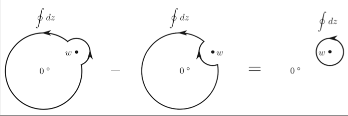

## Radial Quantization

### From Cylinder to Complex Plane 

Consider a CFT *compactified on a cylinder*. The axial direction of the
cylinder represents time $t=x^0$. We can use the following mapping to
map the system to the complex plane:

$$
z=e^{x^0+i x^1}
$$

Then constant $t$ points map to a *circle* centered at the origin: the
*radial direction* represent the time.

   
*Radial quantization*

### Asymptotic States

We assume the existence of a vacuum state $|0\rangle$ upon which a Hilbert space is constructed by application of creation
operators (or their likes).

In free-field theories, the *vacuum* may be defined as the state
annihilated by the *positive frequency part* of the field.

For an *interacting* field $\phi$, we assume that *the Hilbert space is
the same as for a free field*, except that the actual energy eigenstates
are different.

#### "In" State

Suppose then that the interaction is slowly turned off as
$t\to \pm \infty$ and that the *asymptotic* field

$$
\phi_{\text{in}} \propto \lim_{t\to -\infty} \phi(t,x)
$$

is *free*. Within radial quantization, this asymptotic field reduces to
a single operator, which, upon acting on $|0\rangle$ creates a single
asymptotic "in" state:

$$
|\phi_{\text{in}} \rangle 
= \lim_{z,\bar{z} \to 0} 
\phi(z, \bar{z}) |0\rangle
$$

#### "Out" State

### Radial Ordering

After the mapping from cylinder to complex plane, the time ordering (later time to earlier time) becomes a (farther to closer to the origin). Explicitly

$$
\mathcal{R} \phi_1(z)\phi_2(w)=
\begin{cases}
    \phi_1(z)\phi_2(w), & |z|>|w| \\
    \pm \phi_2(w)\phi_1(z), & |z|<|w| \\
\end{cases}
$$

Here the $+$ sign is for bosons, and the $-$ sign is for fermions.

Let $a(z), b(z)$ be two holomorphic fields, and define two operators

$$
A=\oint dz a(z), \quad
B=\oint dz b(z)
$$

the integration path being any circle around the origin. Now we **claim** that

$$
\oint_0 dz [a(z),b(w)]=\oint_w dz [\mathcal{R} a(z)b(w)]
$$

Then we can integrate over $w$ to obtain

$$
[A,B] = \oint_0 dw \oint_w dz \, [\mathcal{R} a(z)b(w)]
$$

the subscript $0,w$ means circular paths centered at $0,w$. In the
following, we shall always assume radial ordering and omit the
$\mathcal{R}$ notation.

*Proof*:

We first evaluate the integral over $z$.

   
*Deformation of integration path*

$$
\begin{aligned}
    \oint_w dz a(z)b(w)
    &=\oint_{|z|>|w|} dz a(z)b(w)-\oint_{|z|<|w|} dz b(w) a(z)
    \\
    &=\oint_0 dz [a(z),b(w)]
\end{aligned}
$$

Then, after integration over $w$, we immediately obtain

$$
\begin{aligned}
    \oint_0 dw \oint_0 dz [a(z),b(w)]
    &= \left[\oint_0 dz a(z), \oint_0 dw b(w)\right]
    \\
    & = [A,B] 
    \qquad \blacksquare
\end{aligned}
$$