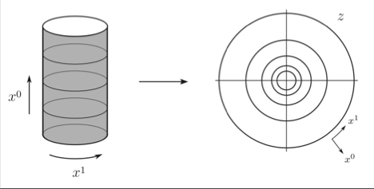

# Radial Quantization

## From Cylinder to Complex Plane 

A CFT can be compactified on a *cylinder*: the axial direction of the cylinder represents time $t=x^0$. We can map the system to the *complex plane* by:

$$
z=e^{x^0+i x^1}
$$

Then constant $t$ (or $x^0$) points map to a *circle* centered at the origin: the *radial direction* represent the time.

   
*Radial quantization*

## Asymptotic States

We assume the existence of a vacuum state $|0\rangle$ upon which a Hilbert space is constructed by application of creation
operators (or their likes).

In free-field theories, the *vacuum* may be defined as the state
annihilated by the *positive frequency part* of the field.

For an *interacting* field $\phi$, we assume that *the Hilbert space is
the same as for a free field*, except that the actual energy eigenstates
are different.

### In-State

Suppose then that the interaction is slowly turned off as
$t\to \pm \infty$ and that the *asymptotic* field

$$
\phi_{\text{in}} \propto \lim_{t\to -\infty} \phi(t,x)
$$

is *free*. Within radial quantization, this asymptotic field reduces to
a single operator, which, upon acting on $|0\rangle$ creates a single
asymptotic "in" state:

$$
|\phi_{\text{in}} \rangle 
= \lim_{z,\bar{z} \to 0} 
\phi(z, \bar{z}) |0\rangle
$$

## Hermitian Conjugate of Fields

$$
\phi^\dagger(z, \bar{z})
= \bar{z}^{-2h}z^{-2\bar{h}} 
\phi \left(\frac{1}{\bar{z}}, \, \frac{1}{z} \right)
$$

$$
\langle \phi_{\text{out}} | 
= | \phi_{\text{in}} \rangle^\dagger
$$

## Laurent Mode Expansion of the Fields

## Around the Origin

A field $\phi(z, \bar{z})$ of conformal dimensions
$(h, \bar{h})$ can be expanded as a Laurent series around the
origin 0:

$$
\phi(z, \bar{z})
= \sum_{m,n}
z^{-m-h} \bar{z}^{-n-\bar{h}} \phi_{m,n}
$$

Using the Cauchy Integral Formula, the modes are

$$
\phi_{m,n} = 
\frac{1}{2 \pi i} \oint dz \, z^{m+h-1} 
\frac{1}{2 \pi i} \oint d\bar{z} \, \bar{z}^{n+\bar{h}-1} \phi(z, \bar{z})
$$

Taking the Hermitian conjugate of the field:

$$
\phi^\dagger(z, \bar{z})
= \sum_{m,n}
\bar{z}^{-m-h} z^{-n-\bar{h}} \phi_{m,n}^\dagger
$$

Meanwhile, we have for the Hermitian conjugate

$$
\begin{aligned}
    \phi^\dagger(z, \bar{z})
    &= \bar{z}^{-2h}z^{-2\bar{h}} 
    \phi \left(\frac{1}{\bar{z}}, \, \frac{1}{z} \right)
    \\
    &=\bar{z}^{-2h}z^{-2\bar{h}} 
    \sum_{m,n}
    \bar{z}^{m+h} z^{n+\bar{h}} \phi_{m,n} 
    \\
    &= \sum_{m,n}
    \bar{z}^{m-h} z^{n-\bar{h}} \phi_{m,n}
\end{aligned}
$$

Now we find that

$$
\phi_{-m,-n} = \phi_{m,n}^\dagger
$$

## Around Any Point 

For simplicity, we now focus on holomorphic fields depending only on $z$. It is possible to expand around an arbitrary point $w$, instead of the origin:

$$
\begin{aligned}
    \phi(z) 
    &= \sum_n (z-w)^{-n-h} \phi_n(w), 
    \\
    \phi_n(w)
    &=\frac{1}{2 \pi i} \oint_w dz \, z^{n+h-1} \phi(z)
\end{aligned}
$$
