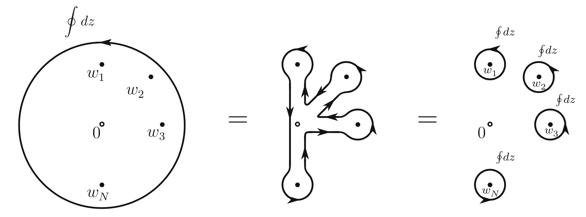

# Conformal Ward Identity

The **conformal Ward identity** states that

$$
\begin{aligned}
    &\langle T(z) \phi_1 \cdots \phi_N\rangle
    = \sum_{i=1}^N \left[
        \frac{h_i}{(z-w_i)}
        + \frac{1}{z-w_i} \partial_{w_i}
    \right] \langle \phi_1 \cdots \phi_N\rangle
    \\[1.5em]
    &\text{where} \qquad
    \phi_i \equiv \phi_i(w_i, \bar{w}_i),
    \quad i = 1, ..., N
\end{aligned}
$$

----

*Proof*:

 
<i>Deformation of contour integrals</i>

$$
\begin{aligned}
    \oint \frac{dz}{2\pi i} 
    &\epsilon(z) \Big[
        \langle T(z) \phi_1 \cdots \phi_N\rangle
        \\
        &- \sum_{i=1}^N \left[
            \frac{h_i}{(z-w_i)}
            + \frac{1}{z-w_i} \partial_{w_i}
        \right] \langle \phi_1 \cdots \phi_N\rangle
    \Big] = 0
\end{aligned}
$$

----
