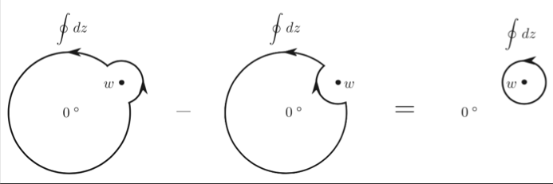

# Normal Ordering

From the general form of the OPE (with regular terms) of two operators $A,B$

$$
A(z)B(w)
= \sum_{n=-\infty}^N 
\frac{\{A B\}_n (w)}{(z - w)^n} \quad
(N\in \mathbb{N})
$$

we *define* the **normal ordered product** of $A(w),B(w)$ as

$$
N[A B](w)=\{A B\}_0(w)
$$

There are several ways to write this expression more concretely.

## Contour Integration

$$
N[AB](w) = 
\frac{1}{2 \pi i} \oint_w \frac{dz}{z-w} A(z) B(w)
$$

Here *radial ordering* is implicitly assumed in the integral.

*Proof*: By direct verification

$$
\begin{aligned}
    \text{RHS}
    &= \sum_{n=-\infty}^N \frac{1}{2 \pi i} 
    \oint_w dz \frac{\{A B\}_n(w)}{(z-w)^{n+1}}
    \\
    &= \sum_{n=-\infty}^N \frac{1}{n!} \left[
        \frac{d^n}{dz^n} (\{AB\}_n(w))
    \right]_{z=w}
\end{aligned}
$$

Only the $n=0$ term survives, since the expression to be taken the derivative to $z$ is dependent of $w$ only. Then

$$
\text{RHS} = \{A B\}_0(w)
\equiv N[AB](w)
\quad \blacksquare
$$

## Mode Expansion

We Laurent expand the normal ordered product around the origin as

$$
N[AB](w)=\sum_n  w^{-n-h_A-h_B} N[AB]_n
$$

Then the modes $N[AB]_n$ are found to be

$$
N[AB]_n
= \sum_{m \le -h_A} A_m B_{n-m}
+ \sum_{m > -h_A} B_{n-m} A_m
$$

*Proof*:

   
*Deformation of integration path*

$$
\begin{aligned}
    &N[AB](w)
    =\frac{1}{2 \pi i} \oint_w\frac{dz}{z-w}A(z)B(w)
    \\
    &
    =\frac{1}{2 \pi i} 
    \oint_{|z|>|w|} \frac{dz}{z-w}A(z)B(w)
    - \frac{1}{2 \pi i} 
    \oint_{|z|<|w|} \frac{dz}{z-w}B(w)A(z)
\end{aligned}
$$

Now we evaluate the two terms separately. First, expand $A(z)$ and
$B(w)$ around the same point $x$:

$$
\begin{aligned}
    A(z) &= \sum_m (z-x)^{-m - h_A} A_m(x)\\
    B(w) &= \sum_p (w-x)^{-p - h_B} B_p(x)
\end{aligned}
$$

- For 1st term:

    We further impose the requirement $|z|>|x|>|w|$ so that we can also expand the $1/(z-w)$ factor in the integrals as

    $$
    \begin{aligned}
        \frac{1}{z-w} 
        &= \frac{1}{(z-x)-(w-x)}
        \\
        &= \frac{1}{(z-x)} \left(
            1 - \frac{w-x}{z-x} 
        \right)^{-1}
        \\
        &=\sum_{l\ge 0} \frac{(w-x)^l}{(z-x)^{l+1}}
    \end{aligned}
    $$

    Then

    $$
    \begin{aligned}
        \text{1st term}
        &\equiv \frac{1}{2 \pi i} 
        \oint_{|z|>|w|} \frac{dz}{z-w} A(z) B(w)\\
        &= \sum_{m,p} \sum_{l\ge 0} 
        \frac{1}{2 \pi i} \oint_{|z|>|w|} dz 
        \frac{(w-x)^{l-p-h_B} A_m(x) B_p(x)}
            {(z-x)^{m+h_A+l+1}}
    \end{aligned}
    $$

    In this integral, the only singular point in the integration path is $x$. By the Residue Theorem, only the term with $m+h_A+l+1=1$ contributes. 
    
    Since $l\ge 0$, the summation range of $m$ is now $m\le -h_A$:

    $$
    \text{1st term}
    =\sum_{p} \sum_{m\le -h_A} 
    (w-x)^{-m-p-h_A-h_B} A_m(x) B_p(x)
    $$

- For term 2:

    Now $|w|>|x|>|z|$, thus the $1/(z-w)$ factor should be expanded as

    $$
    \begin{aligned}
        \frac{1}{z-w}
        &= -\frac{1}{(w-x)-(z-x)}
        \\
        &= -\frac{1}{(w-x)} \left(1-\frac{z-x}{w-x} \right)^{-1}
        \\
        &=-\sum_{l\ge 0} \frac{(z-x)^l}{(w-x)^{l+1}}
    \end{aligned}
    $$

    Then

    $$
    \begin{aligned}
        &\text{2nd term} \equiv
        -\frac{1}{2 \pi i} 
        \oint_{|z|<|w|} \frac{dz}{z-w} B(w) A(z)
        \\
        &=\sum_{m,p} \sum_{l\ge 0} \frac{1}{2 \pi i} \oint_{|z|<|w|}dz \frac{(w-x)^{-l-1-p-h_B}B_p(x)A_m(x)}{(z-x)^{m+h_A-l}}
    \end{aligned}
    $$

    Only the term with $m+h_A-l=1$ contributes. Then the summation range of $m$ becomes $m\ge -h_A+1$, or $m>-h_A$:

    $$
    \text{2nd term} 
    = \sum_{p} \sum_{m > -h_A} 
    (w-x)^{-m-p-h_A-h_B} B_p(x) A_m(x)
    $$

Collect the two terms:

$$
\begin{aligned}
    N[AB](w)
    &= \sum_{p} \sum_{m\le -h_A} (w-x)^{-m-p-h_A-h_B}A_m(x)B_p(x)
    \\ &\qquad
    + \sum_{p} \sum_{m>-h_A} (w-x)^{-m-p-h_A-h_B}B_p(x)A_m(x)
\end{aligned}
$$

Define $n=m+p$, and change summation over $p$ to over $n$, then

$$
\begin{aligned}
    &N[AB](w)
    = \sum_{n} \sum_{m\le -h_A} (w-x)^{-n-h_A-h_B} A_m(x) B_{n-m}(x)
    \\ &\qquad
    + \sum_{n} \sum_{m>-h_A} (w-x)^{-n-h_A-h_B} B_{n-m}(x) A_m(x)
    \\
    &=\sum_n (w-x)^{-n-h_A-h_B} 
    \\ &\qquad \times
    \left(
        \sum_{m\le -h_A} A_m(x) B_{n-m}(x)
        + \sum_{m>-h_A} B_{n-m}(x) A_m(x)
    \right) 
    \quad \blacksquare
\end{aligned}
$$

## Useful Corollaries

The *derivative* of a field $\partial \phi$ has the following Laurent expansion

$$
\begin{aligned}
    \partial \phi(z)
    &= \partial \sum_n z^{-n-h} \phi_n
    \\
    &= \sum_n (-n-h) z^{-n-(h+1)} \phi_n
\end{aligned}
$$

This means $\partial \phi$ has conformal dimension $h+1$, with Laurent modes related to those of $\phi$ by

$$
(\partial \phi)_n = (-n-h) \phi_n
$$

Therefore

$$
\begin{aligned}
    &N[A (\partial B)]_n
    \\
    &= \sum_{m \le -h_A} A_m (\partial B)_{n-m}
    + \sum_{m > -h_A} (\partial B)_{n-m} A_m
    \\
    &= \sum_{m \le -h_A} (-n+m-h_B) A_m B_{n-m}
    \\ &\qquad
    + \sum_{m > -h_A} (-n+m-h_B)B_{n-m} A_m
    \\[2em]
    &N[(\partial A) B]_n
    \\
    &= \sum_{m \le -h_{\partial A}} (\partial A)_m B_{n-m}
    + \sum_{m > -h_{\partial A}} B_{n-m} (\partial A)_m
    \\
    &= \sum_{m \le -h_A - 1} (-m-h_A)A_m B_{n-m}
    \\ &\qquad
    + \sum_{m > -h_A - 1} (-m-h_A) B_{n-m} A_m
\end{aligned}
$$
