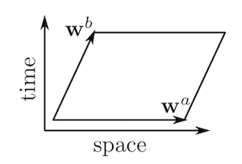
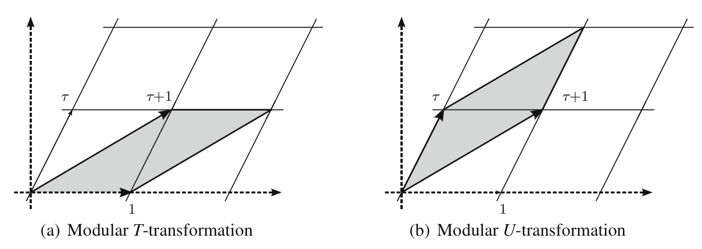

## Conformal Field Theory on Torus

### Modular Parameter

A **torus** may be defined by specifying two *linearly independent lattice vectors* on the plane and *identifying points* that differ by an integer combination of these vectors. 

On the complex plane, these lattice vectors may be represented by two *complex* numbers $\omega_1$ and $\omega_2$, called the **periods** of the lattice. Usually we take the space and time directions to run along the real and imaginary axes, respectively. Then $\omega_1$ is always a positive real number.

   
*The periods of the lattice*

The properties of CFT on the torus should be independent of the *scale* of the lattice. Thus the relevant parameter should be 

$$
\tau = \omega_2 / \omega_1
$$

called the **modular parameter**. 

### Partition Function

Recall that the *finite* time evolution and spatial translation are done by the operators

$$
\begin{aligned}
    U(t) &= \exp (-iHt) 
    \xrightarrow{\text{Euclidean}} 
    \exp(-\tau H)
    \\
    T(x) &= \exp(-ipx)
    \xrightarrow{\text{Euclidean}} 
    \exp(+p x)
\end{aligned}
$$

Therefore, the operator that translates the system parallel to the period $\omega_2$ over a distance $a$ in *Euclidean* spacetime is

$$
\exp \left[
    - H \frac{a \, \text{Im} \, \omega_2}{|\omega_2|}
    + P \frac{a \, \text{Re} \, \omega_2}{|\omega_2|}
\right]
$$

where $H, P$ are the Hamiltonian and the total momentum of the theory.

If we regard $a$ as the lattice spacing, then the above translation takes us from one row in the lattice to the next. 

If the lattice contains $m$ rows in one period along $\omega_2$ (i.e. $|\omega_2| = m a$), then the partition function should be the translation operator along the full period $\omega_2$:

$$
Z(\omega_1, \omega_2) = \text{Tr} \, 
\exp \left[
    - H \, \text{Im} \, \omega_2
    + P \, \text{Re} \, \omega_2
\right]
$$

By regarding the torus as a *cylinder of infinite length* (with circumference $L = \omega_1$), we can express $H, P$ in terms of the Virasoro generators:

$$
H = \frac{2\pi}{\omega_1} \left( L_0 + \bar{L}_0 - \frac{c}{12} \right), 
\quad
P = \frac{2\pi i}{\omega_1} (L_0 - \bar{L}_0)
$$

Then

$$
\begin{aligned}
    Z &= \text{Tr}\, \exp 2\pi \left[
        - \left( L_0 + \bar{L}_0 - \frac{c}{12} \right) \text{Im} \, \tau
        + i \, (L_0 - \bar{L}_0) \, \text{Re} \, \tau
    \right]
    \\
    &= \text{Tr}\, \exp 2\pi i \left[
        \tau (L_0 - c/24)
        - \bar{\tau} (\bar{L}_0 - c/24)
    \right]
\end{aligned}
$$

Here $\bar{\tau}$ is the complex conjugate of $\tau$. To simplify writing, we define

$$
q \equiv \exp 2\pi i \tau \quad
(\bar{q} = \exp -2 \pi i \bar{\tau})
$$

Finally

$$
Z(\tau) = \text{Tr} \, ( 
    q^{L_0 - c/24}  \bar{q}^{\bar{L}_0 - c/24}
)
$$

It depends on the ratio $\tau$ only, as expected. 

### Modular Invariance

Let two periods $\omega'_{1,2}$ describe the *same* lattice on torus as $\omega_{1,2}$. Since the points $\omega'_1$ and $\omega'_2$ also belong to the lattice, they must be expressible as integer combinations of $\omega_1$ and $\omega_2$:

$$
\begin{pmatrix}
    \omega'_1 \\ \omega'_2
\end{pmatrix}
= \begin{pmatrix}
    a & b \\
    c & d
\end{pmatrix}
\begin{pmatrix}
    \omega_1 \\ \omega_2
\end{pmatrix} \quad
\begin{array}{c}
    a,b,c,d \in \mathbb{Z}\\
    ad - bc = 1
\end{array}
$$

i.e. the transformation matrix should belong to the group $SL(2,\mathbb{Z})$.

Under this transformation, we can verify that the modular parameter becomes

$$
\tau \to \tau' = \frac{a\tau + b}{c\tau + d}
$$

Since the physics only depends on $\tau$, we are free to flip the sign of all the four parameters. Therefore, the physical theory should be invariant under the **modular group (Möbius group)**

$$
PSL(2,\mathbb{Z}) \equiv SL(2,\mathbb{Z}) / \mathbb{Z}_2
$$

i.e. matrices in $SL(2,\mathbb{Z})$ only differing by a sign change are identified. 

### Generators of Modular Group

   
*Basic modular transformations*

The modular group is generated (proof is not easy) by the following two transformations (called the **Dehn twists**)

$$
\begin{aligned}
    T &= \begin{pmatrix}
        1 & 1 \\
        0 & 1
    \end{pmatrix}: 
    \tau \to \tau + 1
    \\ \\
    U &= \begin{pmatrix}
        1 & 0 \\
        1 & 1
    \end{pmatrix}: 
    \tau \to \frac{\tau}{\tau + 1}
\end{aligned}
$$

In practice, we usually use another generator $S$ instead of $U$:

$$
S = \begin{pmatrix}
    0 & -1 \\
    1 & 0
\end{pmatrix}: \tau \to -\frac{1}{\tau}
$$

They satisfy the relation

$$
S = U T^{-1} U, \quad (ST)^3 = S^2 = 1
$$

*Remark*: If we calculate using the matrices, we will find

$$
(ST)^3 = S^2 = \begin{pmatrix}
    -1 & 0 \\
    0 & -1
\end{pmatrix} = -1 \quad \text{(?)}
$$

However, do not forget that we are restricting the calculation in the group $PSL(2,\mathbb{Z})$, where we identify matrices differing by a sign change. Thus $-1$ is the same as $1$. 

### Fundamental Domain