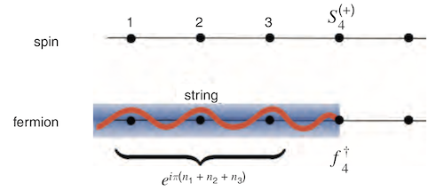

# Jordan-Wigner Transformation

For (1 + 1)-dimensional spin-1/2 systems, we can map the spin operators to *fermion operators* via the **Jordan-Wigner transformation**:

$$
\begin{aligned}
    S_i^z &= n_i - \tfrac{1}{2}
    \\
    S_i^+ &= c_i^\dagger e^{i \phi_i}
    \\
    S_i^- &= c_i e^{-i \phi_i}
\end{aligned} \qquad \text{where} \quad \left\{
\begin{aligned}
    S_i^{\pm} &= S_i^x \pm i S_i^y
    \\
    n_i &= c_i^\dagger c_i
    \\
    \phi_i &= \pi \textstyle{\sum_{l < j} n_i}
\end{aligned} \right.
$$

The operator $e^{i\phi_i}$ is the **string operator**. We see that

   
**spin $=$ fermion $\times$ string**

## (Anti-)Commutation Relations

From the (anti-)commutation relations of the spin operators

$$
[S_i^a, S_i^b] = i \epsilon^{abc} S_i^c
$$