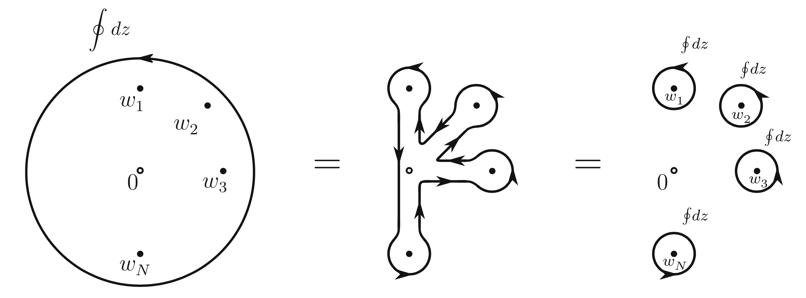

# Conformal Ward Identity

Consider the action of $T(z)$ on the $N$-point correlation function ($\phi_i \equiv \phi_i(w_i, \bar{w}_i)$): 

$$
\delta \expect{\phi_1 \cdots \phi_n}
= -\frac{1}{2\pi i} \oint_w \epsilon (z) R[T(z) \phi_1 \cdots \phi_n]
+ \text{anti-chiral}
$$

We first focus on the first (chiral) term: with the following deformation of contour 

we obtain (the original contour must enclose all the $w$'s of each field)

$$
\begin{aligned}
    &\oint \frac{dz}{2\pi i} \, \epsilon(z) T(z)
    \phi_1 \cdots \phi_N
    \\
    &= \sum_{i=1}^N \phi_1 \cdots \left(
        \oint_{w_i} \frac{dz}{2\pi i} 
        \epsilon(z) T(z) \phi_i
    \right) \cdots \phi_N
\end{aligned}
$$

When deriving the OPE, we have shown that ($\delta_\epsilon$ simply means the change of $\phi$ due to the chiral $\epsilon(z)$, thus the anti-chiral part is zero)

$$
\begin{aligned}
    \delta_\epsilon \phi
    &= \oint_w dz \, \epsilon (z) T(z) \phi(w,\bar{w})
    \\
    &= \oint_w dz \, \epsilon (z) \left[
        \frac{1}{(z-w)^2} h 
        + \frac{1}{z-w} \p_w 
    \right] \phi(w,\bar{w})
\end{aligned}
$$

Therefore

$$
\begin{aligned}
    &\oint \frac{dz}{2\pi i} \, \epsilon(z) T(z)
    \phi_1 \cdots \phi_N
    \\
    &= \sum_{i=1}^N \phi_1 \cdots \left(
        \oint_{w_i} \frac{dz}{2\pi i} 
        \epsilon (z) \left[
            \frac{1}{(z-w_i)^2} h_i 
            + \frac{1}{z-w_i} \p_{w_i} 
        \right] \phi_i
    \right) \cdots \phi_N
\end{aligned}
$$

Finally, we average this over the field configurations, and swap this average with the contour integral, leading to the local equality

**Conformal Ward identity:**

$$
\begin{aligned}
    &\expect{T(z) \phi_1(w_1,\bar{w}_1) 
    \cdots \phi_N(w_N,\bar{w}_N)}
    \\
    & \quad
    = \sum_{i=1}^N \left[
        \frac{1}{(z-w_i)^2} h_i 
        + \frac{1}{z-w_i} \p_{w_i} 
    \right] \expect{
        \phi_1(w_1,\bar{w}_1) \cdots \phi_N(w_N,\bar{w}_N)
    }
\end{aligned}
$$

 
