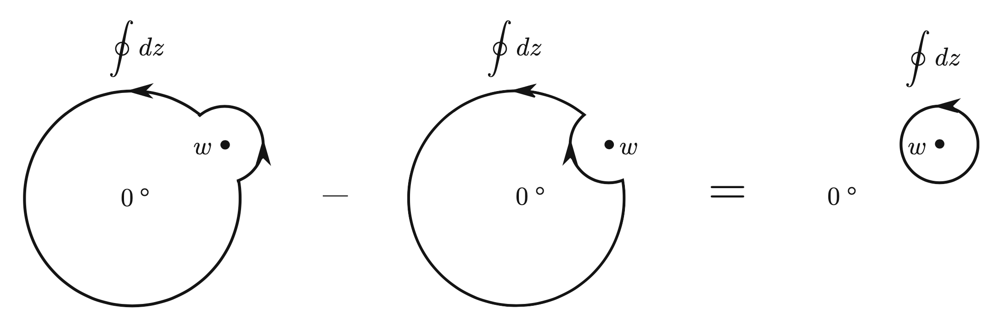

# Radial Quantization

In practice, one often introduce periodic boundary condition (PBC) on $x^1$, i.e. put the system onto a cylinder with circumference (period) $L$ (which is usually chosen as $2\pi$):

$$
\phi(x^0, x^1) = \phi(x^0, x^1 + N L), \quad
N \in \Z
$$

Of course, one can still use the old complex variables

$$
z = x^0 + ix^1, \quad
\bar{z} = x^0 - ix^1
$$

But due to the PBC, such a complexification has lots of redundancy. However, one can "explode" one period of the cylinder to the whole complex plane by introducing another conformal transformation:

**Mapping from cylinder to plane:**

$$
\begin{align*}
    z \mapsto w = e^{\omega z} \\
    \bar{z} \mapsto \bar{w} = e^{\omega \bar{z}}
\end{align*} \quad
(\omega \equiv 2\pi/L)
$$

 

The time direction $x^0$ now becomes the *radial direction* on $\C$, hence the name **radial quantization**. In particular:

- $x^0 = -\infty$ is mapped to $w = 0$
- $x^0 = +\infty$ is mapped to $w = \infty$
- Circles centered at $w = 0$ represent constant $x^0$

Translations on the cylinder are mapped to

- Time translation $x^0 \mapsto x^0 + a$ 
    becomes *scaling* $w \mapsto e^{\omega a} w$
- Space translation $x^1 \mapsto x^1 + b$ 
    becomes *rotation* $w \mapsto e^{i \omega b} w$

*Notation Notes*: After the mapping to the complex plane, we can define another set of real variables

$$
w = y^0 + iy^1, \quad
\bar{w} = y^0 - iy^1
$$

The mapping $(x^0,x^1) \mapsto (y^0,y^1)$ is just the description of the conformal transformation $z\mapsto w$ in real coordinates. One can then temporarily forget that we start from the cylinder and just focus on the theory defined on the plane. 

In the derivations below, we shall add a superscript $\text{cyl}$ for fields defined on the cylinder depending on $z, \bar{z} = x^0 \pm ix^1$.

 

## Radial Ordering

After the mapping from cylinder to complex plane, the time ordering (later time to earlier time) becomes a **radial ordering** (farther to closer to the origin). Explicitly (here $z,w$ are plane coordinates)

$$
R [\phi_1(z)\phi_2(w)] =
\begin{cases}
    \phi_1(z)\phi_2(w), & |z|>|w| \\
    \pm \phi_2(w)\phi_1(z), & |z|<|w| \\
\end{cases}
$$

Here the $+$ sign is for bosons, and the $-$ sign is for fermions.

Below we derive a theorem relating commutators and radial-ordered products. 

**Theorem:** Let $a(z), b(z)$ be two chiral fields having no singularities except possibly at the origin; $w$ is an arbitrary nonzero point on the complex plane. Then

$$
\oint_0 dz [a(z),b(w)]
= \oint_w dz \,R [a(z) b(w)]
$$

The subscript $0,w$ means paths enclosing $0,w$ respectively.

 

*Proof*: With the following deformation of the integration path:

$$
\oint_{|z|>|w|} dz - \oint_{|z|<|w|} dz
= \oint_w dz
$$

$$
\begin{align*}
    \text{RHS}
    &=\oint_{|z|>|w|} dz \, a(z) b(w)
    - \oint_{|z|<|w|} dz \, b(w) a(z)
    \\
    &=\oint_0 dz \, [a(z),b(w)]
    \qquad \blacksquare
\end{align*}
$$

**Corollary:** Define two operators

$$
A=\oint dz \, a(z), \quad
B=\oint dz \, b(z)
$$

Then 

$$
[A,B] = \oint_0 dw \oint_w dz \, R [a(z) b(w)]
$$

 

*Proof*:

$$
\begin{align*}
    \text{RHS}
    &= \oint_0 dw \oint_0 dz \, [a(z),b(w)]
    \\
    &= \left[\oint_0 dz \, a(z), \oint_0 dw \, b(w)\right]
    \\
    & = [A,B] 
    \qquad \blacksquare
\end{align*}
$$