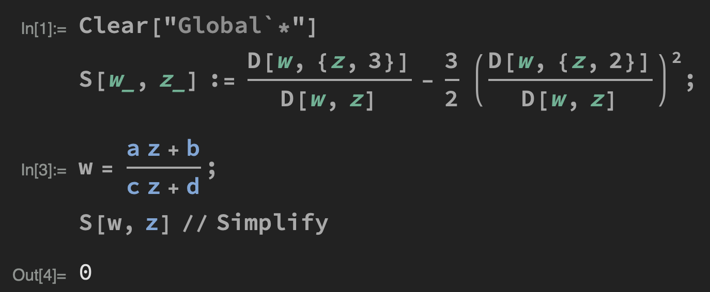

# Operator Product Expansion:  Energy-Momentum Tensor

Having seen the OPE of $T(z)$ with primary fields, let us turn to the OPE of the energy-momentum tensor $T(z)$ with itself. The result *turns out* (few introductory texts will give a rigorous proof) to have the general form

**Operator product expansion:  Energy-momentum tensors with itself**

- Chiral

    $$
    T(z)T(w) 
    = \frac{c/2}{(z-w)^4} + \frac{2T(w)}{(z-w)^2}
    + \frac{\p T(w)}{z-w} + \cdots
    $$

    where $c$ is called the **central charge** and $|z|>|w|$.

- The OPE of $\bar{T}(\bar{z}) \bar{T}(\bar{w})$ has a similar form (but may have a different central charge $\bar{c}$), but the OPE of $T(z) \bar{T}(\bar{w})$ contains only regular terms. 

 

These claims will be justified in the example of *massless free boson* in Part 5. 

*Remark*: Comparing with

$$
\begin{align*}
    T(z) \phi(w,\bar{w})
    &= \frac{1}{(z-w)^2} h \phi(w,\bar{w})
    \\ &\quad 
    + \frac{1}{z-w} \p_w \phi(w,\bar{w})
    + \cdots
\end{align*}
$$

we see that central charge term indicates that $T(z)$ and $\bar{T}(\bar{z})$ are not primary fields. The appearance of a nonzero $c$ is called the **conformal anomaly** (the word **anomaly** refers to things not exist in the classical theory).

 

## The Virasoro Algebra

We expand the energy-momentum tensor at the origin: since $T$ has conformal dimension 2, we write

$$
\begin{align*}
    T(z)
    &= \sum_n z^{-n-2} L_n, \quad 
    L_n = \frac{1}{2 \pi i} \oint dz \, 
    z^{n+1} T(z)
    \\
    \bar{T}(\bar{z})
    &= \sum_n \bar{z}^{-n-2} \bar{L}_n, \quad
    \bar{L}_n = \frac{1}{2 \pi i} \oint d\bar{z} \, 
    \bar{z}^{n+1} \bar{T}(\bar{z})
\end{align*}
$$

To see the meaning of $L_n, \bar{L}_n$, we expand infinitesimal conformal transformation $\epsilon (z)$ at the origin:

$$
\epsilon(z) 
= \sum_n  z^{n+1} \epsilon_n, \quad
\epsilon_n 
= \frac{1}{2 \pi i} \oint dz \,
z^{-n-2} \epsilon (z)
$$

and consider the conserved charge of conformal transformation (for simplicity, keep chiral terms only)

$$
\begin{align*}
    Q_{\epsilon}
    &= -\frac{1}{2 \pi i} \oint dz \, T(z)\epsilon (z)
    \\
    &= -\frac{1}{2 \pi i} \oint dz 
    \sum_n  z^{-n-2} L_n
    \sum_m  z^{m+1} \epsilon_m
    \\
    &= -\frac{1}{2 \pi i} \sum_{n,m} \oint dz \, 
    z^{-(n-m)-1}L_n\epsilon_m
    \\
    &= -\sum_{n,m} \frac{1}{(n-m)!} \frac{d^{n-m}}{dz^{n-m}} (L_n\epsilon_m)
    \\
    &= - \sum_n \epsilon_n L_n
\end{align*}
$$

Thus we see that the modes $L_n$ can be interpreted as generators of conformal transformations (and so do $\bar{L}_n$). The algebra of the generators $L_n,\bar{L}_n$ is found to be 

**Virasoro algebra**:

$$
\begin{align*}
    [L_n, L_m]
    &= (n-m)L_{n+m}
    + \frac{c}{12} n (n^2 - 1) \delta_{n+m, 0} 
    \\[1em]
    [\bar{L}_n, \bar{L}_m]
    &= (n-m) \bar{L}_{n+m}
    + \frac{c}{12} n (n^2 - 1) \delta_{n+m, 0}
    \\[1em]
    [L_n, \bar{L}_m] &= 0
\end{align*}
$$

 

*Proof*: 

- For $[L_n, L_m]$, recall that

    $$
    [A,B] = \oint_0 dw \oint_w dz \, a(z)b(w)
    $$

    we obtain

    $$
    \begin{align*}
        [L_n, L_m]
        &= \frac{1}{(2 \pi i)^2} \left[
            \oint dz \, z^{n+1} T(z),
            \oint dw \, w^{m+1} T(w)
        \right]
        \\
        &= \frac{1}{(2 \pi i)^2} 
        \oint_0 dw \, w^{m+1} 
        \oint_w dz \, z^{n+1} 
        \underbrace{T(z)T(w)}_{\text{use OPE}} 
        \\
        &= \frac{1}{(2 \pi i)^2} 
        \oint_0 dw \, w^{m+1} 
        \oint_w dz \, z^{n+1} 
        \\ &\qquad
        \left[
            \frac{c/2}{(z-w)^4}
            + \frac{2T(w)}{(z-w)^2}
            + \frac{\p_w T(w)}{z-w}
            + \cdots
        \right]
    \end{align*}
    $$

    Integrate over $z$ using Cauchy Integral Formula

    $$
    \begin{align*}
        &\frac{1}{2 \pi i} \oint_w dz \, z^{n+1} 
        \left[
            \frac{c/2}{(z-w)^4}
            + \frac{2T(w)}{(z-w)^2}
            + \frac{\p_w T(w)}{z-w}
            + \cdots
        \right]
        \\
        &= \frac{1}{3!} \left[
            \frac{d^3}{dz^3} (z^{n+1} c/2)
        \right]_{z=w}
        \\ &\qquad
        + \frac{1}{1!} \left[
            \frac{d}{dz} (2z^{n+1} T(w))
        \right]_{z=w}
        + \left[
            z^{n+1} \p_wT(w)
        \right]_{z=w} 
        \\
        &= \frac{c}{12} n (n^2 - 1) w^{n-2}
        + 2(n + 1) w^n T(w)
        + w^{n+1} \p_w T(w)
    \end{align*}
    $$

    Then complete the integration over $w$

    $$
    \begin{align*}
        &[L_n, L_m]
        = \frac{1}{2 \pi i} \oint_0 dw
        \Bigg[
            \frac{c}{12} n (n^2 - 1) w^{m+n-1}
            \\ & \qquad \qquad
            + 2(n+1)w^{m+n+1}T(w)
            + \underbrace{w^{m+n+2} \p_w T(w)}_{\text{integrate by parts}} 
        \Bigg]
        \\
        &= \frac{1}{2 \pi i} \oint_0 \, dw \Bigg[
            \frac{c}{12}n(n^2 - 1) w^{m+n-1}
            \\ &\qquad \qquad 
            + 2 (n + 1) w^{m+n+1} T(w)
            - (m+n+2) w^{m+n+1} T(w)
        \Bigg]
        \\[1em]
        &= \frac{c}{12}n(n^2 - 1) \frac{1}{1!} 
        \left[\frac{d}{dw} \left(w^{m+n+1} \right)\right]_{w=0}
        \\ &\qquad \qquad
        + 2(n+1) L_{m+n}
        - (m+n+2) L_{m+n} 
        \\[1em]
        &= \frac{c}{12} n (n^2 - 1) \delta_{m+n, 0}
        + (n-m) L_{m+n}
    \end{align*}
    $$

- $[\bar{L}_n, \bar{L}_m]$ can be found in the same way using the OPE of $\bar{T} (\bar{z})$ with itself.

- Finally, from $T(z)\bar{T} \left(\bar{w} \right)\sim 0$, we have $[L_n, \bar{L}_m]=0$. $\blacksquare$

*Remark*: 

- The algebra of $L_{-1}, L_0, L_1$ (and also their anti-chiral counterparts) is closed, and the same as the (classical) Witt algebra for $l_{-1}, l_0, l_1$. 
 
- The Virasoro algebra can be obtained from the Witt algebra by an operation called the **central extension** (Blumenhagen and Plauschinn 2.1.3). From this point of view, the central charge is in fact an *operator* that commute with any object in the algebra; by Schur's lemma, it then must be proportional to identity. Thus it reduces to a number.

 

## Transformation of the Energy-Momentum Tensor

Let us first consider an infinitesimal transformation 

$$
z \mapsto w = z + \epsilon(z)
$$

which will generate the transformation of $T(z)$ according to the rule for quasi-primary fields:

$$
\delta_\epsilon T(w) 
= -\frac{1}{2 \pi i} \oint dz \, \epsilon (z) 
R[T(z) T(w)]
$$

Plug in the OPE of the energy-momentum tensor and apply Cauchy integral formula:

$$
\begin{align*}
    \delta_\epsilon T(w) 
    &= -\frac{1}{2 \pi i} \oint dz \, \epsilon (z) 
    \left[
        \frac{c/2}{(z-w)^4} + \frac{2T(w)}{(z-w)^2}
        + \frac{\p_w T(w)}{z-w}
    \right]
    \\
    &= -\frac{c}{12} \partial_w^3 \epsilon(w)
    - 2T(w) \partial_w \epsilon(w) - \epsilon(w) \partial_wT(w)
\end{align*}
$$

One can verify that the finite version of this transformation is (the Yellow Book 5.4.1)

**Energy-momentum tensor under conformal transformation $z \mapsto w$**:

$$
T'(w) = \left(\frac{\partial w}{\partial z}\right)^{-2} 
\left (
    T(z) - \frac{c}{12} S(w, z)
\right)
$$

where $S(w,z)$ is called the **Schwarzian derivative**:

$$
S(w,z) = \frac{\partial_z^3 w}{\partial_z w}
- \frac{3}{2} \left(
    \frac{\partial_z^2 w}{\partial_z w}
\right)^2
$$

 

It turns out that for global conformal transformations

$$
w = \frac{az + b}{cz + d} \quad (ad - bc = 1)
$$

the Schwarzian derivative is zero.

 <i>which can be verified by brute force.</i>

 

Then we have confirmed that $T(z)$ has conformal dimension $(h,\bar{h}) = (2,0)$. 

## Hamiltonian and Momentum on the Cylinder

Previously, we have seen that time and space translation on the cylinder is mapped to scaling and rotation on the plane. Then one will expect that the Hamiltonian and momentum on the cylinder is given by

$$
H \propto L_0 + \bar{L}_0, \quad
P \propto i(L_0 - \bar{L}_0)
$$

However, the appearance of $c$ (and $\bar{c}$) will slightly modify these expression. To get the exact expressions of $H$ and $P$, one can integrate the corresponding energy-momentum tensor component on the cylinder (the extra minus sign is due to the choice to work in Euclidean formalism): 

$$
H = -\int_{0}^{L} dx^1 T_{00}^\text{cyl}, \quad
P = -\int_{0}^{L} dx^1 T_{01}^\text{cyl}
$$

Let us go to the complex coordinates $z, \bar{z} = x^0 \pm ix^1$. First, we have seen in Part 2 that ($T_{10}$ has been secretly changed to $T_{01}$ because $T_{\mu \nu}$ is symmetric)

$$
\begin{align*}
    T_{z z}^\text{cyl}
    &= -\frac{1}{2\pi} T^\text{cyl}(z)
    = \frac{1}{2} (T^\text{cyl}_{00}-i T^\text{cyl}_{01})
    \\[1em]
    T_{\bar{z} \bar{z}}^\text{cyl}
    &= -\frac{1}{2\pi} \bar{T}^\text{cyl}(\bar{z})
    = \frac{1}{2} (T^\text{cyl}_{00}+i T^\text{cyl}_{01})
\end{align*}
$$

Then

$$
\begin{align*}
    T^\text{cyl}_{00} &= -\frac{1}{2\pi} (T^\text{cyl}(z) + \bar{T}^\text{cyl}(\bar{z}))
    \\[1em]
    T^\text{cyl}_{01} &= -\frac{i}{2\pi} (T^\text{cyl}(z) - \bar{T}^\text{cyl}(\bar{z}))
\end{align*}
$$

For the integration, we transform as before ($w, \bar{w}$ are the plane coordinates)

$$
\begin{align*}
    \text{Chiral: } &\quad &
    \int_0^L dx^1 
    \to \frac{1}{i \omega} \oint \frac{1}{w} dw 
    \\
    \text{Anti-Chiral: } &\quad &
    \int_0^L dx^1 
    \to \frac{1}{i \omega} \oint \frac{1}{\bar{w}} d\bar{w} 
\end{align*}
$$

Then we need to convert $T^\text{cyl}(z)$ to $T(w)$ (and the anti-chiral counterpart) defined on the plane. The coordinate transformation from $w$ back to $z = \omega^{-1} \ln w$ gives

$$
\begin{align*}
    T_\text{cyl}(z) 
    &= \left(\frac{\partial z}{\partial w}\right)^{-2} 
    \left (
        T(w) - \frac{c}{12} S(z, w)
    \right)
    \\
    &= \omega^2 \left(
        w^2 T(w) - \frac{c}{24}
    \right)
\end{align*}
$$

We obtain (with Laurent expansion of $T(w)$ on the plane)

$$
\begin{align*}
    H &= \frac{\omega}{2\pi i} \oint dw \,
    \left( w T(w) - \frac{c}{24w} \right) 
    + \text{anti-chiral}
    \\
    &= \frac{\omega}{2\pi i} \oint dw \,
    \left(
        \sum_n \frac{L_n}{w^{n+1}}
        - \frac{c}{24 w}
    \right) + \text{anti-chiral}
    
    \\[1.5em]
    
    P &= \frac{i\omega}{2\pi i} \oint dw \,
    \left( w T(w) - \frac{c}{24w} \right) 
    - \text{anti-chiral}
    \\
    &= \frac{i \omega}{2\pi i} \oint dw \,
    \left(
        \sum_n \frac{L_n}{w^{n+1}}
        - \frac{c}{24 w}
    \right) - \text{anti-chiral}
\end{align*}
$$

Applying Cauchy integral formula, we obtain

**Hamiltonian on the cylinder:**

$$
H = \omega \left(
    L_0 + \bar{L}_0 - \frac{c + \bar{c}}{24} 
\right), \quad
\omega \equiv \frac{2\pi}{L}
$$

**Momentum on the cylinder:**

$$
P = i \omega \left(
    L_0 - \bar{L}_0 - \frac{c - \bar{c}}{24}
\right), \quad
\omega \equiv \frac{2\pi}{L}
$$

 

### Physical Meaning of the Central Charge

Let us calculate the vacuum expectation value of $T^\text{cyl}$ (with $\expect{T} = 0$ on the plane):

$$
\expect{T^\text{cyl}} = -\frac{c \omega^2}{24}
= -\frac{c\pi^2}{6 L^2}
$$

which goes to 0 as $L \to \infty$. According to the Yellow Book 5.4.2:

>  <i>
> $c$ describes the way a specific system reacts to macroscopic length scales introduced, for instance, by boundary conditions. 
> </i>  
