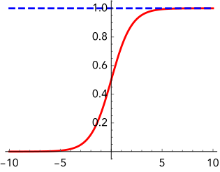

# Logistic Regression (Classification)

## Hypothesis Function

In (binary) **logistic regression**, the examples $y^i \, (i = 0, 1, ..., m-1)$ can only take a *discrete* set of values, usually chosen as 0 and 1.

The logistic regression hypothesis is defined as:

$$ h(x) = g(\theta^\mathsf{T} x)$$

where function $g$ is the **sigmoid function** defined as: 

$$
g(z) = \frac{1}{1+e^{-z}}
$$

which looks like this:

The function $h(x)$ is interpreted as the *probability* that the outcome $y$ will be equal to 1, given the values of the features $x$:

$$
h(x) = P(\, y = 1 \mid x \,)
$$

## Cost Function and Its Gradient 

The cost function in logistic regression is defined differently from linear regression (summation over $i$ is implied by Einstein rule):

$$
\begin{aligned}
    J(\theta) 
    &= - \frac{1}{m} \sum_{i=0}^{m-1} \left[
        y^i \ln h^i
        + ( 1 - y^i) \ln (1 - h^i) 
    \right]
    \\
    &= - \frac{1}{m} \left[
        y^\mathsf{T} \ln h 
        + (1 - y)^\mathsf{T} \ln (1 - h)
    \right]
\end{aligned}
$$

Here $h^i \equiv h(x^i)$. In the last line, the number 1 in the second line stands for the $m$-dimensional vector

$$
1 = (1, 1, ..., 1)^\mathsf{T}
$$

The gradient of the cost function is found to be:

$$ 
\begin{aligned}
    \frac{\partial J(\theta)}{\partial \theta_a} 
    &= - \frac{1}{m} \sum_{i=0}^{m-1}
    \frac{\partial}{\partial \theta_a} \left[
        y^i \ln h^i
        + (1 - y^i) \ln (1 - h^i) 
    \right]
    \\
    &= - \frac{1}{m} \sum_{i=0}^{m-1} \left[
        y^i \frac{\partial}{\partial \theta_a} 
        \ln h^i
        + (1 - y^i) \frac{\partial}{\partial \theta_a} 
        \ln (1 - h^i) 
    \right]
    \\
    &= - \frac{1}{m} \sum_{i=0}^{m-1} \left[
        \frac{y^i}{h^i}
        + \frac{-(1 - y^i)}{1 - h^i}
    \right] \frac{\partial h^i}{\partial \theta_a} 
    \\
    &= \frac{1}{m} \sum_{i=0}^{m-1} 
    \frac{h^i - y^i}{h^i (1 - h^i)}
    \frac{\partial h^i}{\partial \theta_a} 
\end{aligned}
$$

Using the following property of the sigmoid function

$$
\frac{dg}{dz} = g(z) (1 - g(z))
$$

the derivative $\partial h^i / \partial \theta_a$ is found to be

$$
\begin{aligned}
    \frac{\partial h^i}{\partial \theta_a} 
    &= \frac{d g}{d z}
    \frac{\partial z}{\partial \theta_a} 
    \qquad (z \equiv \theta^\mathsf{T} x^i = X_{ij} \theta_j)
    \\
    &= g(z) (1 - g(z)) X_{ia}
    \\
    &= h^i (1 - h^i) X_{ia}
\end{aligned}
$$

Therefore

$$
\frac{\partial J(\theta)}{\partial \theta_a} 
= \frac{1}{m} \sum_{i=0}^{m-1} 
(h^i - y^i) X_{ia}
$$

In matrix form:

$$
\nabla J = \frac{1}{m} X^\mathsf{T} (h - y)
$$

which happens to be similar to that in linear regression. We then apply gradient descent to minimize $J(\theta)$, and thus find the optimal parameters $\theta$.
