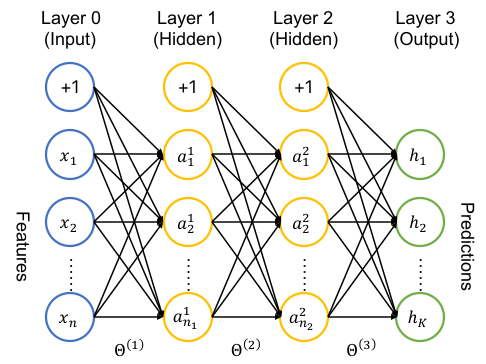

# Back Propagation

**Back propagation** (or shortly **backprop**) is an efficient method of calculating the gradient of the cost function of a neural network. 

Consider the network for multi-class classification, where the activation functions of all units are the sigmoid function:

$$
g(z) = \frac{1}{1 + e^{-z}}
$$

The cost function (with regularization) is defined as (we simply write $h_k^i \equiv h_k(x^i)$ to represent the $k$th component of the $i$th prediction)

$$
\begin{aligned}
    J(\Theta) &= -\frac{1}{m} 
    \sum_{k=1}^K \sum_{i=0}^{m-1}\left[
        y_k^i \ln h_k^i
        + (1-y_k^i) \ln (1 - h_k^i)
    \right]
    \\[1.5em] &\quad 
    + \frac{\lambda}{2m} 
    \sum_{l=1}^L \sum_{i=1}^{n_l} \sum_{j=0}^{n_{l-1}}
    (\Theta_{ij}^{l})^2
\end{aligned}
$$

The first part is just the sum of cost functions of each binary classification (of class $k$ or not). The second part is the sum of the square of each $\Theta^{l}$ elements. Here $L$ is the number of layers (not counting the input layer) in the network. 

We now calculate the derivative of $J(\Theta)$ with respect to each of the parameters 

$$
\Theta_{ij}^{l} \qquad
\begin{aligned}
    i &= 1, 2, ..., n_l \\
    j &= 0, 1, ..., n_{l-1}
\end{aligned}
$$

$$
\frac{\partial J}{\partial \Theta_{ab}^l}
= \frac{1}{m} \sum_{k=1}^K \sum_{i=0}^{m-1}
\frac{h_k^i - y_k^i}{h_k^i (1 - h_k^i)}
\frac{\partial h_k^i}{\partial \Theta_{ab}^l}
+ \frac{\lambda}{m} \Theta_{ab}^l
$$

Again, when calculating $\partial h_k^i / \partial \Theta_{ab}^{l}$we will use the following property of the sigmoid function:

$$
g'(z) \equiv \frac{dg}{dz} = g(z) (1 - g(z))
$$

Let $a^{li}$ be the activation of the $l$th layer corresponding to the $i$th sample feature ($l = 1,2,...,L$). For concreteness, we set $L=3$ (two hidden layers and the output layer). We first consider 

$$
\begin{aligned}
    \frac{\partial h_k^i}{\partial \Theta_{ab}^3}
    &= \frac{\partial}{\partial \Theta_{ab}^3}
    g\left(
        \sum_{j=0}^{n_2} \Theta_{kj}^3 a_j^{2,i}
    \right)
    \\
    &= g' \left(
        \sum_{j=0}^{n_2} \Theta_{kj}^3 a_j^2
    \right)
    \frac{\partial}{\partial \Theta_{ab}^3}
    \left(
        \sum_{j=0}^{n_2} \Theta_{kj}^3 a_j^2
    \right)
    \\
    &= h_k (1 - h_k) \delta_{ak} a_b^2
\end{aligned}
$$

