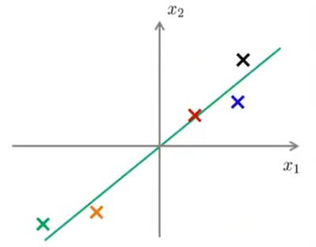
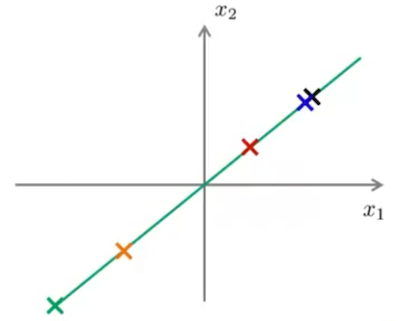

# Dimensionality Reduction

In machine learning problems, some features may be highly *linearly* correlated that they approximately lie in a *lower-dimensional flat surface* in the feature space. For example, in the figure below, the feature space is 2-dimensional (i.e. there are 2 features), while the examples approximately lie on a 1-dimensional straight line (not a curve: we said "flat" surface). 

 <i>The original examples</i>

In order to speed up model training or reduce memory usage, we may *orthogonally* (the meaning of this word will be made clear later) project the original features into that lower-dimensional surface (see the figure below). The number of features is then reduces to the dimension of that surface. This process is called the **dimensionality reduction**. 

 <i>The approximated examples</i>

The mostly used *linear* algorithm to do this is called the **Principal Component Analysis (PCA)**, which we describe below. 

## Reformulation of the Problem

Let us now convert what is said above to mathematical expressions. Suppose we have $M$ examples of $N$-dimensional features; the $i$th example is denoted by

$$
x^a = (x^a_1, x^a_2, ..., x^a_n)^\mathsf{T} \in \mathbb{R}^N \qquad
a = 1,2,...,M
$$

Or, using the $N$-dimensional standard basis vectors $e_j \, (j=1,...,N)$:

$$
x^a = x^a_j e_j
$$

What we want to find is a *flat* surface of $K$ dimensions ($K \le N$) that minimizes the sum of the *(squared) distance* to each feature point. In other words, the optimization cost function is

$$
J = \sum_{a=1}^M (\text{distance of } x^a \text{ to the flat surface})^2
$$

## Explicit Expression of the Cost Function

To simplify things, we shall perform feature scaling so that the average of each feature is moved to 0; then it is reasonable that the origin $(0,...,0)$ will be included in this surface. The surface can then be described by $K$ orthonormal basis vectors

$$
u_1, u_2, ..., u_k \in \mathbb{R}^N
\qquad u_i \cdot u_j = \delta_{ij}
$$ 

so that every point $z$ in that surface can be expressed as ($z_j, z'_j$ are the components of $z$ under the basis $\{e_j\}, \{u_j\}$ respectively)

$$
z = z_j e_j = z'_j u_j
$$

The two sets of basis vectors are related by a linear map

$$
u_j = u_{ij} e_i
$$

The collection of $\{u_{ij}\}$ forms an $N\times K$ matrix $U$. We emphasize that $U$ is in general not invertible, since it is not a square matrix.

Then $z$ in the standard basis is

$$
z = (u_{ij} z'_j) e_i
$$

i.e. the components under the standard basis are 

$$
z_i = u_{ij} z'_j 
\quad \text{or} \quad
z = U z'
$$

*Notational Remark*: 

- The column vector $z$ is $N$-dimensional, under the $\{e_j\}$ basis; it serves as an *approximation* of the original features, *without* reduction of dimensionality. It will also be denoted as $x_\text{approx}$. 

- The column vector $z'$ is $K$-dimensional, under the $\{u_j\}$ basis; its components are the *new* features with smaller dimensions.

 

Since the $\{u_j\}$ basis is orthonormal, the components $u_{ij}$ should satisfy

$$
\begin{aligned}
    u_i \cdot u_j
    &= (u_{ki} e_k) \cdot (u_{lj} e_l)
    \\
    &= u_{ki} u_{lj} \delta_{kl}
    \\
    &= u_{ki} u_{kj} = \delta_{ij}
\end{aligned}
\quad \text{or} \quad
\begin{gathered}
    U^\mathsf{T} U = 1_{K \times K}
    \\
    \text{(left orthogonal)}
\end{gathered}
$$

Each example $x$ will be *orthogonally* projected onto a point $z$ of this plane by (we temporarily suppress the example label):

$$
\begin{aligned}
    z &= (x \cdot u_j) u_j
    \\
    &= (x_k u_{kj}) u_{ij} e_i
    \\
    &= (u_{ij} u_{kj} x_k) e_i
\end{aligned}
\quad \text{or} \quad
z = U U^\mathsf{T} x
$$

Here we have used $u_i^2 = 1$. Then the $K$ new features are

$$
z' = U^\mathsf{T} z = U^\mathsf{T} x
$$

Now we can explain what *orthogonally* means: the vector $x - z$ is *orthogonal* to the surface, or equivalently $z$. Mathematically, we can verify that

$$
\begin{aligned}
    (x - z) \cdot z 
    &= x^\mathsf{T} z - z^\mathsf{T} z
    \\
    &= x^\mathsf{T} U U^\mathsf{T} x 
    - x^\mathsf{T} U (U^\mathsf{T} U) U^\mathsf{T} x
    \\
    &= x^\mathsf{T} U U^\mathsf{T} x - x^\mathsf{T} U U^\mathsf{T} x = 0
\end{aligned}
$$

The distance between $x$ and $z$ is now the same as the distance $l$ between $x$ and the plane:

$$
\begin{aligned}
    l^2 &= (x - z)^2
    \\
    &= (x - z)^\mathsf{T} x \qquad ((x - z) \cdot z = 0)
    \\
    &= (x^\mathsf{T} - x^\mathsf{T} U U^\mathsf{T}) x
    \\
    &= x^2 - (U^\mathsf{T} x)^2
\end{aligned}
$$

*Remark*: When $K = N$, the matrix $U$ will be completely orthogonal:

$$
U^\mathsf{T} U = U U^\mathsf{T} = 1_{N \times N}
$$

then $l^2 = 0$ as expected, since $x$ is already *in* the $N$-dimensional space, and then $z = x$. 

 

Finally, we obtain the explicit expression of the cost function:

$$
\begin{aligned}
    J(U) &= \frac{1}{M} \sum_{a=1}^M (l^a)^2
    \\
    &= \frac{1}{M} \sum_{a=1}^M 
    [(x^a)^2 - (U^\mathsf{T} x^a)^2]
\end{aligned}
$$

## Minimizing the Cost Function

We now minimize the cost function with respect to the choice of the orthonormal basis vectors $\{u_j\}$, i.e. the orthonormal matrix $U$. To make the cost function looks better, let us introduce the $N \times N$ **covariance matrix**

$$
\begin{aligned}
    \Sigma_{ij} 
    &\equiv \frac{1}{M} \sum_{a=1}^M 
    (x^a_i - \bar{x}_i) (x^a_j - \bar{x}_j)
    \\
    &= \frac{1}{M} x^a_i x^a_j
\end{aligned}
$$

In matrix notation:

$$
C = \frac{1}{M} \sum_{a=1}^M x^a (x^a)^\mathsf{T}
$$

Here we used $\bar{x}_i = 0 \, (i = 1,...,N)$ due to feature rescaling. Then the cost function becomes

$$
\begin{aligned}
    J(U) &= \frac{1}{M} \sum_{a=1}^M (
        x^a_i x^a_i
        - x^a_i u_{ij} u_{kj} x^a_k
    )
    \\
    &= \frac{1}{M} \sum_{a=1}^M (
        x^a_i x^a_i
        - u^\mathsf{T}_{ji} x^a_i x^a_k u_{kj} 
    )
    \\
    &= \operatorname{Tr} (C)
    - \operatorname{Tr} (U^\mathsf{T} C U)
\end{aligned}
$$

Define 

$$
\Lambda = U^\mathsf{T} C U
$$

It is clear that we need to *maximize* $\operatorname{Tr} \Lambda$. This maximization can be solved by **eigenvalue decomposition** of $C$. 

Notice that the matrix $C$ has two nice properties:

- $C$ is *symmetric*
    
    This means that its eigenvalues are all *real*, and the corresponding eigenvectors form an $N$-dimensional *orthonormal basis*. Then $C$ can be diagonalized by an *orthogonal matrix* $U \in \mathbb{R}^{N\times N}$; the columns of $U$ are exactly those eigenvectors:

    $$
    U^\mathsf{T} C U = \Lambda
    $$

    The matrix $\Lambda \in \mathbb{R}^{N \times N}$ is diagonal, with the eigenvalues of $C$ as its diagonal elements. 

- $C$ is *(semi-)positive-definite*

    This can be shown by direct verification: for any $x \in \mathbb{R}^n$, we have

    $$
    \begin{aligned}
        x^\mathsf{T} C x
        &= \frac{1}{M} x_i x^a_i x^a_j x_j
        \\
        &= \frac{1}{M} \sum_{a=1}^M (x \cdot x^a)^2
        \ge 0
    \end{aligned}
    $$

    Then all eigenvalues of $C$ are *non-negative*, and we can arrange the columns of $U$ so that the diagonal elements of $\tilde{\lambda}$ is sorted into descending order. 

To maximize $\operatorname{Tr}\Lambda$, we should use set $U$ to be the *first $K$ eigenvectors* of $\Lambda$, so that $\Lambda$ will have the *largest $K$ eigenvalues* of $C$ as its diagonal elements. 

Since the trace of a matrix is equal to the sum of all eigenvalues, the minimal value of $J$ can be written in terms of the eigenvalues:

$$
\begin{aligned}
    J_\text{min} &= \sum_{i=1}^{N} \lambda_i 
    - \sum_{i=1}^K \lambda_i
    \\
    &= \sum_{i=K+1}^N \lambda_i
\end{aligned}
$$

*Remark*: Since $C$ is symmetric and positive-definite, the orthogonal matrix $U$ and the eigenvalue spectrum $\lambda$ can also be found using **singular value decomposition** (which is more numerically stable)

$$
C = U S V^\mathsf{T}
$$

(Since $C$ is real, we write $V^\mathsf{T}$ instead of $V^\dagger$) 

The singular value spectrum $S$ will be same as the eigenvalue spectrum $\Lambda$, and $V$ will turn out to be the same as $U$. We then keep only the first $K$ columns of $U$, and the first $K$ singular values in $S$. 

 

## Summary of the Algorithm

**Dimensionality Reduction by Principal Component Analysis**

*Notations*: 

- $N$: The original number of features
- $M$: The number of examples
- $K$: The desired reduced feature dimension ($K \le N$)
- $x^a$: The $a$th example (treated as *column* vector)

*Algorithm*:

- Construct the covariance matrix
    
    $$
    C = \frac{1}{M} 
    \sum_{a=1}^M x^a (x^a)^\mathsf{T} 
    \in \mathbb{R}^{N \times N}
    $$

- Use singular value decomposition to find the orthonormal basis vectors describing the lower dimensional feature space
    
    $$
    C = U S V^\mathsf{T}
    $$

- Keep the first $K$ columns of $U$ only.

    $$
    U \in \mathbb{R}^{N \times K} \qquad
    U^\mathsf{T} U = 1_{K \times K}
    $$

- The new features with smaller dimension are
    
    $$
    z'^a = U^\mathsf{T} x \in \mathbb{R}^K
    $$

- The approximated original features are
    
    $$
    x^a_\text{approx} \equiv z^a
    = U z'^a \in \mathbb{R}^N
    $$

 

## Appendix: Lagrange Multiplier Method

The standard calculus way to minimize $J$ is to introduce the Lagrange multiplier to incorporate the orthonormal condition $U^\mathsf{T} U = 1$ into the extremum problem. A new cost function is defined as

$$
\begin{aligned}
    J(U, \lambda) 
    &= \frac{1}{M} \sum_{a=1}^M 
    [(x^a)^2 - (U^\mathsf{T} x^a)^2]
    \\ &\quad
    + \sum_{i=1}^{K} \sum_{j=1}^{K} 
    \lambda_{ij} [(U^\mathsf{T} U)_{ij} - \delta_{ij}]
    \\
    &= \frac{1}{M} (
        x^a_i x^a_i
        - x^a_i u_{ij} u_{kj} x^a_k
    ) \\[1em] &\quad
    + \lambda_{ij}(
        u_{ki} u_{kj} - \delta_{ij}
    )
\end{aligned}
$$

Let us call the collection of $\lambda_{ij}$ as the matrix  $\Lambda \in \mathbb{R}^{K \times K}$. Notice that $U^\mathsf{T} U$ is a *symmetric* matrix, thus some of the constraints are redundant. To remove this redundancy, we require that the matrix $\Lambda$ is also symmetric:

$$
\lambda_{ij} = \lambda_{ji}
$$

The optimal $U$ corresponds to

$$
\begin{aligned}
    \frac{\partial J}{\partial \lambda_{ij}} &= 0
    \quad \text{with} \quad \begin{aligned}
        i &= 1,...,N
        \\ j &= 1,...,i
    \end{aligned}
    \\[1em]
    \frac{\partial J}{\partial u_{mn}} &= 0 
    \quad \text{with} \quad \begin{aligned}
        m &= 1,...,N
        \\ n &= 1,...,K
    \end{aligned}
\end{aligned}
$$

The $\lambda$ derivatives simply restate $U^\mathsf{T} U = 1$. New things come from the $u$ derivatives:

$$
\begin{aligned}
    \frac{\partial J}{\partial u_{mn}}
    &= -\frac{2}{M} x^a_m x^a_i u_{in} 
    + u_{mi} \lambda_{ni}
    + u_{mi} \lambda_{in}
    \\
    &= -2 \left(
        \frac{1}{M} x^a_m x^a_i u_{in} 
        - u_{mi} \lambda_{in}
    \right)
    = 0
\end{aligned}
$$

Using the covariance matrix $C$, this can be expressed as

$$
\Sigma_{mi} u_{in} - u_{mi} \lambda_{in} = 0
$$

or in matrix notation

$$
C U = U \Lambda
$$

Multiply on the left by $U^\mathsf{T}$:

$$
U^\mathsf{T} C U = \Lambda
$$

Thus we see that the Lagrange multipliers $\Lambda$ is the same as the matrix $\Lambda$ defined earlier.
