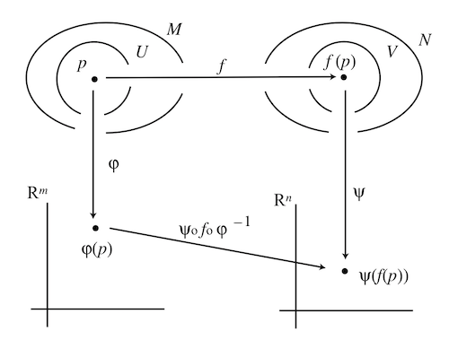

## The Calculus on Manifolds

### Differentiable Maps

   
*Coordinate representation of map between two manifolds*

*Definition*:

Let $f$ be a map from an $m$-dimensional manifold $M$ to an $n$-dimensional manifold $N$.   
Let $p$ be a point in $M$, which is mapped to $f(p) \in N$.

- **Coordinate representation of $f$ at $p$**: the map from the *coordinate* of $p$ to the *coordinate* of $f(p)$. 

    Mathematically, let $(U,\varphi)$ be a chart containing $p$, and $(V, \psi)$ be a chart containing $f(p)$. The coordinate representation of $f$ is (read from right to left)

    $$ \psi \circ f \circ \varphi^{-1}: \mathbb{R}^m \rightarrow \mathbb{R}^n $$

    *Remark*: if $f$ is a *function* (i.e. $N = \mathbb{R}^n$, so that $\psi = \text{id}_V$), the coordinate representation is simply $f \circ \varphi^{-1}$.

- **Differentiability (smoothness) of $f$ at $p$**: if the coordinate representation of $f$ is differentiable (in the usual sense) at the coordinate $\varphi(p)$, we say $f$ is **differentiable at $p$**.

- **Diffeomorphism**: if the coordinate representation of $f$ has a *smooth* inverse, then $f$ is called a **diffeomorphism** between $M$ and $N$.
    
    - **Diffeomorphic manifolds**: if we can find a diffeomorphism between two manifolds, then they are **diffeomorphic** to each other. 
    
    - **Diffeomorphism group $\text{Diff}(M)$**: the group containing all diffeomorphism $f: M \rightarrow M$.

    *Remark*:
    
    - The dimension of two diffeomorphic manifolds must be the same;
    - The diffeomorphic relation is an *equivalence relation*.

### Vectors

