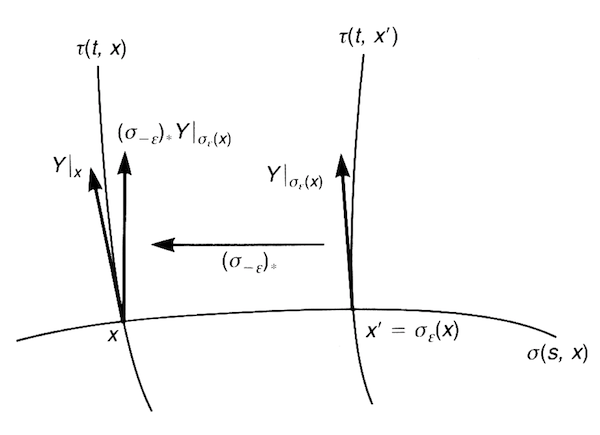
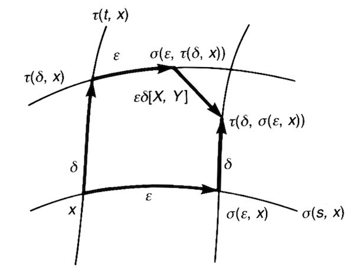

## Flows and Lie Derivative

### Flows

*Definition*: Let $V$ be a vector field defined on an manifold $M$. 

- **Integral curve of $V$**: A curve whose tangent vector at each point on it is the same as $V$ at that point.

    Mathematically, let the (coordinates of) points on the curve be $x(t)$, and the vector field be $V$. Then 

    $$
    \frac{dx^\mu(t)}{dt} = V^\mu(x(t))
    $$

    *Another notation*:

    If it is known that the curve will pass point $x_0$ at $t = 0$, we shall write the points on the curve as $\sigma(t,x_0)$. The condition of the tangent vectors then becomes

    $$
    \frac{d}{dt}\sigma^\mu(t, x_0) = 
    V^\mu (\sigma(t, x_0))
    $$

    with the *initial condition* $\sigma(0, x_0) = x_0$.

- **Flow generated by $V$ passing point $x$**: a map $\sigma: \mathbb{R} \times M \rightarrow M$ which satisfies the following rules

    1. Initial condition (pass through $x$ at $t = 0$)

        $$
        \sigma(0, x) = x
        $$

    2. Shift of initial condition

        $$
        \sigma(t, \sigma(s, x)) = \sigma(t+s, x)
        $$

    3. Tangent vectors are everywhere given by $V$

        $$
        \frac{d}{dt}\sigma^\mu(t, x) = 
        V^\mu (\sigma(t, x))
        $$

----

*Theorem*: (**Existence of Flow**)

For any point $x \in M$ and a vector field $V \in \mathfrak{X}(M)$, there exists a flow generated by $V$ passing $X$. This follows from the existence of solution of the related differential equations. 

----

*Example*: $M = \mathbb{R}^2, \, V(\mathbf{r}) = -y \partial_x + x \partial_y \quad \mathbf{r} \equiv (x,y)$

From $V(\mathbf{r})$, we read $V^1 = -y, V^2 = x$. The differential equations for the flow $\sigma$ are

$$
\frac{d}{dt} \sigma^1(t,\mathbf{r}) = -\sigma^2(t,\mathbf{r}), \quad
\frac{d}{dt} \sigma^2(t,\mathbf{r}) = \sigma^1(t,\mathbf{r})
$$

Substitute the second eq to the first one:

$$
\begin{aligned}
    \frac{d^2}{dt^2} \sigma^2(t) = -\sigma^2(t)
    &\Rightarrow
    \sigma^2(t) = A \cos t + B \sin t
    \\ &\Rightarrow
    \sigma^1(t) = -A \sin t + B \cos t
\end{aligned}
$$

Let the initial condition be $\sigma(0, \mathbf{r}) = \mathbf{r}$, then we can determine $A, B$:

$$
\sigma^1(0) = B = x, \quad
\sigma^2(0) = A = y
$$

Finally we obtain the flow

$$
\sigma(t, \mathbf{r}) = (x \cos t - y \sin t, \, y \cos t + x \sin t)
$$

which is a circle around the origin. 

### One-parameter Group of Transformations

*Definition*:

- **One-parameter group of transformations**: the group of flows at all *given* times.

    $$
    \sigma_t(x) \equiv \sigma(t,x): M \rightarrow M
    $$

    *Remark*: the maps $\sigma_t$ are a diffeomorphism from $M$ to itself.

    **Group structure**:

    - **Product**: 

        $$
        \sigma(t, \sigma(s, x)) = \sigma(t+s, x)
        \Rightarrow
        \sigma_t \circ \sigma_s = \sigma_{t+s}
        $$
    
    - **Identity**: $\sigma_0$
    
    - **Inverse**: $(\sigma_t)^{-1} = \sigma_{-t}$

    *Remark*: the group *locally* looks like the additive group $\mathbb{R}$ (e.g. in the chart containing point $x$). 

- **Infinitesimal generator of the transformation $\sigma_t$**: the *vector field* that generates the flow $\sigma(t,x)$.

    *Remark*: This name comes from the expansion for $\sigma_\epsilon$ with infinitesimal $\epsilon$

    $$
    \sigma^\mu(\epsilon,x) = \sigma^\mu(0, x) + \epsilon \frac{d}{dt} \sigma^\mu(0,x)
    $$

    Recall that
    
    $$
    \sigma(0, x) = x, \quad
    \frac{d}{dt}\sigma^\mu(t, x) = 
        V^\mu (\sigma(t, x))
    $$

    Thus we obtain 

    $$
    \sigma_\epsilon^\mu(x) \equiv \sigma^\mu(\epsilon,x) = x^\mu + \epsilon V^\mu(x)
    $$

----

*Theorem*: (**Exponentiation of vector field**)

The flow map $\sigma(t,x)$ can be obtained from the vector field $V$ that generates it via *exponentiation*:

$$
\sigma_t^\mu(x) \equiv \sigma^\mu(t,x) = \exp(t V) x^\mu
$$

*Proof*:

Expand $\sigma(t,x)$ as a Taylor series with respect to $t$:

$$
\begin{aligned}
    \sigma^\mu(t,x) &= \sigma^\mu(0, x) 
    + t \left. \frac{d}{ds} \sigma^\mu(s,x) \right|_{s=0}
    \\ &\quad 
    + \frac{t^2}{2!} \left. \frac{d^2}{ds^2} \sigma^\mu(s=0,x) \right|_{s=0}
    + \cdots
    \\
    &= \left. \left(1 + t \frac{d}{ds} + \frac{t^2}{2!} \frac{d^2}{ds^2} + \cdots \right) \sigma^\mu(s,x) \right|_{s=0}
    \\
    &= \exp \left. \left(t \frac{d}{ds} \right) \sigma^\mu(s,x) \right|_{s=0}
\end{aligned}
$$

Using the fact that $V$ is the tangent vector of the flow

$$
\begin{aligned}
    \frac{d}{ds}\sigma^\mu(s, x) = 
    V^\mu (\sigma(s, x))
    &\Rightarrow
    \left. \frac{d}{ds}\sigma^\mu(s, x) \right|_{s=0}
    = V^\mu (x)
\end{aligned}
$$

Thus we can make the identification of operators

$$
\left. \frac{d}{ds}  \right|_{s=0} \equiv V(x)
$$

and finally obtain $\sigma^\mu(t,x) = \exp(tV) x^\mu$.

----

*Example*: $M = \mathbb{R}^2, \, V(\mathbf{r}) = -y \partial_x + x \partial_y \quad \mathbf{r} \equiv (x,y)$

From $V(\mathbf{r})$, we read $V^1 = -y, V^2 = x$. Let the initial condition be $\sigma(0, \mathbf{r}) = \mathbf{r}$.

$$
\Rightarrow
$$

Finally we obtain the flow

$$
\sigma(t, \mathbf{r}) = (x \cos t - y \sin t, \, y \cos t + x \sin t)
$$

the same as the result obtained from solving differential equations. 

### Lie Derivatives

#### Introduction

Let $X, Y$ be two vector fields, generating flows $\sigma(t,x), \tau(t,x)$ respectively:

$$
\begin{aligned}
    \frac{d\sigma^\mu(s,x)}{ds} &= X^\mu(\sigma(s,x))
    \\
    \frac{d\tau^\mu(t,x)}{dt} &= Y^\mu(\tau(t,x))
\end{aligned}
$$

Consider two nearby points $x$ and $x^\prime \equiv \sigma_\epsilon(x)$ on the flow $\sigma(s,x)$. We want to compare the values of $Y$ at these two points:

$$
Y|_x \in T_x M, \quad 
Y|_{\sigma_\epsilon(x)} \in T_{\sigma_\epsilon(x)} M
$$

   
*Comparing tangent vectors at two points along a flow*

To do this, we shall first bring $Y|_{\sigma_\epsilon(x)}$ to $T_x M$ by the *pushforward* of $\sigma_{-\epsilon}$ (which maps $x^\prime$ to x)

$$
(\sigma_{-\epsilon})_*: 
T_{\sigma_\epsilon(x)} M \rightarrow T_x M
$$

and compare the difference

$$
(\sigma_{-\epsilon})_* Y|_{\sigma_\epsilon(x)}
- Y|_x
$$

*Definition*: 

- **Lie derivative of $Y$ along the flow $\sigma$ of $X$**

    We have three equivalent definitions:

    - (*Default*) Compare $Y$ at $x$ and $\sigma_{\epsilon}(x)$, and bring $Y|_{\sigma_{\epsilon}(x)}$ to $x$ using $(\sigma_{-\epsilon})_*$ 

        $$
        \mathcal{L}_X Y \equiv
        \lim_{\epsilon \rightarrow 0}
        \frac{1}{\epsilon} [
            (\sigma_{-\epsilon})_* Y|_{\sigma_\epsilon(x)}
            - Y|_x
        ]
        $$

    - Compare $Y$ at $\sigma_{-\epsilon}(x)$ and $x$, and bring $Y|_{\sigma_{-\epsilon}(x)}$ to $x$ using $(\sigma_\epsilon)_*$

        $$
        \mathcal{L}_X Y \equiv
        \lim_{\epsilon \rightarrow 0}
        \frac{1}{\epsilon} [
            Y|_x - (\sigma_\epsilon)_* Y|_{\sigma_{-\epsilon}(x)}
        ]
        $$
    
    - Compare $Y$ at $x$ and $\sigma_{\epsilon}(x)$, and bring $Y|_x$ to $\sigma_\epsilon(x)$ using $(\sigma_\epsilon)_*$
        
        $$
        \mathcal{L}_X Y \equiv
        \lim_{\epsilon \rightarrow 0}
        \frac{1}{\epsilon} [
            Y|_{\sigma_\epsilon(x)}
            - (\sigma_\epsilon)_* Y|_x
        ]
        $$
    
#### Component Form of Lie Derivative

Assign a chart $(U, \varphi)$ near $x$. Recall that for infinitesimal $\epsilon$

$$
\sigma_\epsilon^\mu(x) = x^\mu + \epsilon X^\mu(x)
$$

Then we can express $Y|_{\sigma_\epsilon(x)}$ as

$$
\begin{aligned}
    Y|_{\sigma_\epsilon(x)}
    &= Y^\mu(\sigma_\epsilon(x)) \partial_\mu|_{\sigma_\epsilon(x)}
    \\
    &= Y^\mu(x + \epsilon X|_x) \partial_\mu|_{x + \epsilon X}
    \\
    &\simeq [Y^\mu(x) + \epsilon X^\nu(x) \partial_\nu Y^\mu(x)] \partial_\mu|_{x+\epsilon X}
\end{aligned}
$$

i.e. the components of $Y$ at $\sigma_\epsilon(x)$ are

$$
Y^\mu(\sigma_\epsilon(x))
= Y^\mu(x) + \epsilon X^\nu(x) \partial_\nu Y^\mu(x)

$$

By definition of pushforward,

$$
[(\sigma_{-\epsilon})_* Y|_{\sigma_\epsilon(x)}]^\mu
= Y^\lambda(\sigma_\epsilon(x)) \frac{\partial y^\mu}{\partial x^\lambda}
$$

where $y$ is the coordinate of $\sigma_{-\epsilon}(x)$

$$
y^\mu = x^\mu - \epsilon X^\mu(x)
$$

Then

$$
\begin{aligned}
    &[(\sigma_{-\epsilon})_* Y|_{\sigma_\epsilon(x)}]^\mu
    \\ &= 
    [Y^\lambda(x) + \epsilon X^\nu(x) \partial_\nu Y^\lambda(x)] \,
    \partial_\lambda[x^\mu - \epsilon X^\mu(x)]
    \\ &=
    [Y^\lambda(x) + \epsilon X^\nu(x) \partial_\nu Y^\lambda(x)] \,
    [\delta_\lambda^\mu - \epsilon \partial_\lambda X^\mu(x)]
    \\ &=
    Y^\mu(x) + \epsilon \underbrace{[
        X^\nu(x) \partial_\nu Y^\mu(x)
        - Y^\lambda(x) \partial_\lambda X^\mu(x)
    ]}_\text{Lie derivative} + O(\epsilon^2)
\end{aligned}
$$

Now we have shown that

$$
[\mathcal{L}_X Y]^\nu = 
X^\mu \partial_\mu Y^\nu
- Y^\mu \partial_\mu X^\nu
$$

### Lie Bracket

*Definition*:

- **Lie bracket $[X, Y]$**: a *vector field* whose action on functions $f \in \mathcal{F}(M)$ is given by

    $$
    [X,Y][f] = X[Y[f]] - Y[X[f]]
    $$

#### Component form

By definition

$$
X[Y[f]] - Y[X[f]]
= X^\mu \partial_\mu Y^\nu \partial_\nu f
- Y^\mu \partial_\mu X^\nu \partial_\nu f
$$

from which we read the components of $[X,Y]$

$$
[X, Y]^\nu = X^\mu \partial_\mu Y^\nu 
- Y^\mu \partial_\mu X^\nu
$$

*Remark*: We have now proved that

$$
[X, Y] = \mathcal{L}_X Y
$$

#### Properties of Lie Bracket

- **Bilinearity**
- **Anti-symmetry**
- **Jacobi identity**

#### Geometric Meaning

   
*Lie bracket measures the failure of the closure of parallelograms*

