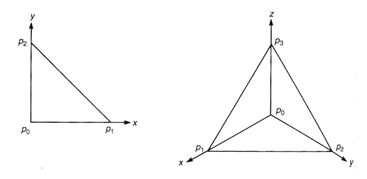

## Stokes' Theorem

### Preliminary: Integration or $r$-forms in $\mathbb{R}^r$

*Definition*:

- **Standard $r$-simplex in $\mathbb{R}^r$**: an *oriented* $r$-simplex $\bar{\sigma}_r = (p_0 p_1 ... p_r)$, which is an $r$-dimensional object in $\mathbb{R}^r$ constructed from the following $r+1$ "standard" points

    $$
    \begin{aligned}
        p_0 &= (0, 0, ..., 0) &\quad &\text{(the origin)}\\
        p_1 &= (0, 1, ..., 0) \\
        &\vdots \\
        p_r &= (0, 0, ..., 1)
        &\quad &\text{(unit vector of each axis)}
    \end{aligned}
    $$

    By general definition of simplexes, the coordinates inside an standard $r$-simplex are

    $$
    \bar{\sigma}_r = \left\{
        (x^1, ..., x^r) \in \mathbb{R}^r 
        \mid
        x^\mu \ge 0, \, 
        \sum_{\mu=1}^r x^\mu \le 1
    \right\}
    $$

    *Example*: Standard 2- and 3-simplex

    

       
    *Standard 2-simplex (triangle, left) and 3-simplex (tetrahedron, right)*

    

- **Integration of $r$-form on the standard $r$-simplex**

    A general $r$-form in $\mathbb{R}^n$ is

    $$
    \omega = a(x) \, dx^1 \wedge \cdots \wedge dx^r
    = a(x) \, dx^1 \cdots dx^r
    $$

    Then *define*

    $$
    \int_{\bar{\sigma}_r} \omega \equiv
    \int_{\bar{\sigma}_r} a(x) dx^1 \cdots dx^r
    $$

### Chain, Cycle, Boundary on Manifolds

*Definition*: 

|Object|Symbol|
|-:|:-|
|An $r$-simplex in $\mathbb{R}^r$|$\sigma_r$|
|An $m$-dimensional manifold|$M$|

Let $f: \sigma_r \rightarrow M$ be a smooth map ($f$ needs not be invertible).

- **Singular $r$-simplex in $M$**: the image $s_r \equiv f(\sigma_r)$

    *Remark*: The name "singular" is due to:
    
    - The singular simplexes does *not* provide a *triangulation* of $M$.
    - *Geometric independence of points makes no sense* in a manifold.

- **$r$-Chain in $M$**: A *formal* linear combination of all singular $r$-simplexes in $M$

    $$
    c_r = \sum_{i} a_i s_{r,i}, \quad 
    a_i \in \mathbb{R}
    $$

    Note that we are using real-valued coefficients (instead of integers only).
    
    - **$r$-Chain group $C_r(M)$**: the group consisting of all $r$-chains on $M$

- **Boundary in $M$**: the image of the boundary of an $r$-simplex in $\mathbb{R}^r$, i.e.

    $$
    \partial s_r \equiv f(\partial \sigma_r)
    $$

    $\partial s_r$ is called an **$(r-1)$-boundary**. 

    - **Boundary map**: a linear map on chains

        $$
        \partial : C_r(M) \rightarrow C_{r-1}(M), \quad
        \partial c_r = \sum_i a_i \partial s_{r,i}
        $$

        *Remark*: The general result $\partial^2 = 0$ (a boundary has no boundary) still holds here.

    - **$r$-Boundary group $B_r(M)$**: the group consisting of all $r$-boundaries in $M$

- **$r$-Cycle in $M$**: an $r$-chain in $M$ that has no boundary (i.e. $\partial c_r = 0$)
    
    - **$r$-Cycle group $Z_r(M)$**: the group consisting of all $r$-cycles in $M$

- **(Singular) Homology group $H_r(M)$**:
    
    $$
    H_r(M) \equiv Z_r(M) / B_r(M)
    $$

    *Remark*: The *singular* homology group is often isomorphic to another group called the **simplicial homology group**.

### Integration on $r$-Chain

For integration of an $r$-form $\omega$ over a general $r$-chain $c = \sum_i a_i s_{r,i}$ in $M$, we define

$$
\int_c \omega \equiv \sum_i a_i \int_{s_{r,i}} \omega
$$

Now we reduced the problem to integration on a single $r$-simplex. We define

$$
\int_{s_r} \omega \equiv \int_{\sigma_r} f^* \omega
$$

where $f$ is a smooth map from a region *containing* $\sigma_r$ to $M$ (sometimes simply written as $f: \sigma_r \rightarrow M$), and $f^*$ is the corresponding pullback from $r$-forms in $M$ to $r$-forms in $\mathbb{R}^r$. 

----

*Theorem*: (**Stokes' theorem**)

Let $\omega$ be an $(r-1)$-form, and $c$ be an $r$-chain in $M$. Then

$$
\int_c d \omega = \int_{\partial c} \omega
$$

*Proof*:

The integration over $c, \partial c$ can be separated to

$$
\begin{aligned}
    \int_c d\omega &= \sum_i a_i \int_{s_{r,i}} d\omega
    \\
    \int_{\partial c} \omega &= \sum_i a_i \int_{\partial s_{r,i}} d\omega
\end{aligned}
$$

Then it suffices to prove that on a single simplex, we have

$$
\int_{s_r} d \omega = \int_{\partial s_r} \omega
$$

By definition of integration on a single simplex,

$$
\begin{aligned}
    \int_{s_r} d \omega 
    &= \int_{\sigma_r} f^* d \omega
    = \int_{\sigma_r} d(f^* \omega)
    \\
    \int_{\partial s_r} \omega 
    &= \int_{\partial \sigma_r} f^* \omega 
\end{aligned}
$$

where $f: \sigma_r \rightarrow M$. Then $\psi \equiv f^* \omega$ is a general $(r-1)$-form in $\mathbb{R}^r$, and we only need to prove

$$
\int_{\sigma_r} d \psi = \int_{\partial \sigma_r} \psi
$$

An $(r-1)$-form in $\mathbb{R}^r$ has the general form

$$
\psi = \sum_\mu a_\mu(x) \, dx^1 \wedge \cdots \wedge \cancel{dx^\mu} \wedge \cdots \wedge dx^r
$$

Since integration is distributive, we only need to prove for one term (say the $\mu = r$ term). Then we can set

$$
\begin{aligned}
    \psi &= a(x) \, dx^1 \wedge \cdots \wedge dx^{r-1}
    \\
    d\psi &= \partial_r a(x) \, dx^r \wedge dx^1 \wedge \cdots \wedge dx^{r-1}
    \\
    &= (-1)^{r-1} \partial_r a(x) dx^1 \wedge \cdots \wedge dx^{r-1} \wedge dx^r
\end{aligned}
$$

----

### Usual Vector Calculus Theorems

- 0-forms: **Gradient** integration on curves
    
    $$
    \begin{aligned}
        \omega_0 &= f(\mathbf{r}) \\ \Rightarrow
        d \omega_0 &=
        \partial_x f \, dx
        + \partial_y f \, dy
        + \partial_z f \, dz
        \equiv \nabla f \cdot d \mathbf{r}
    \end{aligned}
    $$

    This reduce to the usual differential of a function, corresponding to **gradient** $\nabla f(\mathbf{r})$. 

- 1-forms: **Curl**

    $$
    \begin{aligned}
        \omega_1 &= \omega_x(\mathbf{r}) dx + \omega_y(\mathbf{r}) dy + \omega_z(\mathbf{r}) dz
        \\ \Rightarrow
        d\omega_1 &= (
            \partial_y \omega_x dy \wedge dx 
            + \partial_z \omega_x dz \wedge dx
        ) \\ &\quad + (
            \partial_x \omega_y dx \wedge dy
            + \partial_z \omega_y dz \wedge dy
        ) \\ &\quad + (
            \partial_x \omega_z dx \wedge dz
            + \partial_y \omega_z dy \wedge dz
        ) \\
        &= (\partial_y \omega_z - \partial_z \omega_y) dy \wedge dz
        \\ &\quad + 
        (\partial_z \omega_x - \partial_x \omega_z) dz \wedge dx +
        (\partial_x \omega_y - \partial_y \omega_x) dx \wedge dy
    \end{aligned}
    $$

    The three components correspond to the **curl** $\nabla \times \boldsymbol{\omega}$ of a usual vector field $\boldsymbol{\omega} \equiv (\omega_x, \omega_y, \omega_z)$.

- 2-forms: **Divergence**

    $$
    \begin{aligned}
        \omega_2 &= 
        \omega_{xy}(\mathbf{r}) \, dx \wedge dy 
        + \omega_{yz}(\mathbf{r}) \, dy \wedge dz
        + \omega_{zx}(\mathbf{r}) \, dz \wedge dx
        \\ \Rightarrow
        d\omega_2 &= 
        \partial_z \omega_{xy} \, dz \wedge dy \wedge dx 
        \\ &\quad + 
        \partial_x \omega_{yz} \, dx \wedge dy \wedge dz
        +
        \partial_y \omega_{zx} \,dy \wedge dz \wedge dx
        \\
        &= (\partial_x \omega_{yz} + \partial_y \omega_{zx} + \partial_z \omega_{xy}) \, dx \wedge dy \wedge dz
    \end{aligned}
    $$

    The coefficient corresponds to the **divergence** $\nabla \cdot \boldsymbol{\omega}$ of a usual vector field $\boldsymbol{\omega} \equiv (\omega_{yz}, \omega_{zx}, \omega_{xy})$.

- 3-forms: 

    $$
    \omega_3 = 
    \omega_{xyz}(\mathbf{r}) \, dx \wedge dy \wedge dz
    \, \Rightarrow \,
    d\omega_3 = 0
    $$

*Corollary*: Theorems in usual vector calculus $(M = \mathbb{R}^3)$

- **Stokes' theorem** 
    
    From 1-form $\omega = \omega_\mu(\mathbf{r}) \, dx^\mu$, we construct a usual vector field $\boldsymbol{\omega} = (\omega_1, \omega_2, \omega_3)$. Then
    
    $$
    \begin{aligned}
        \int_S
        \boldsymbol{\omega}
    \end{aligned}
    $$

    where . 

- **Gauss' theorem** (for 2-form)
