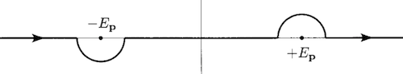

# Causality in Klein-Gordon Theory

## The Propagator

The **propagator** $D(x-y)$ is defined as the amplitude for a particle to propagate from $y$ to $x$ (in spacetime):

$$
\begin{aligned}
    D(x-y) &\equiv 
    \langle \mathbf{x}|e^{-i H(x^0 - y^0)}|\mathbf{y} \rangle
    \\
    &= \langle 0 | \phi(x) \phi(y) | 0 \rangle
\end{aligned}
$$

Using the expansion

$$
\begin{aligned}
    \phi(x) 
    &= \int \frac{d^{d-1} p}{(2\pi)^{d-1}} 
    \frac{1}{\sqrt{2 E_\mathbf{p}}} [
        a_\mathbf{p} e^{ipx} 
        + a^\dagger_\mathbf{p} e^{-ipx}
    ]
    \\[1em] \text{with} \quad
    p^0 &= \sqrt{m^2 + \mathbf{p}^2} = E_\mathbf{p}
\end{aligned}
$$

and noting that only the terms $\langle 0 | a_\mathbf{p} a_\mathbf{q}^\dagger |0\rangle = (2\pi)^3 \delta^3 (\mathbf{p-q})$ survives, we are left with

$$
\begin{aligned}
    D(x-y) &= \langle 0 | \phi(x) \phi(y) | 0 \rangle
    \\
    &= \int \frac{d^3 p}{(2\pi)^3} \left.
    \frac{1}{2E_\mathbf{p}} e^{-ip(x-y)}
    \right|_{p^0 = E_\mathbf{p}}
\end{aligned}
$$

## Measuring the Field at Two Places

We calculate 

$$
\begin{aligned}
    [\phi(x), \phi(y)]
    &= \int \frac{d^3p}{(2\pi)^3} \frac{d^3 q}{(2\pi)^3}
    \frac{1}{\sqrt{2E_\mathbf{p} \cdot 2 E_\mathbf{q}}}
    \\ &\qquad \times
    [
        a_\mathbf{p} e^{ipx} 
        + a^\dagger_\mathbf{p} e^{-ipx}, 
        a_\mathbf{q} e^{iqx} 
        + a^\dagger_\mathbf{q} e^{-iqx}
    ]
\end{aligned}
$$

Using the commutators

$$
\begin{aligned}
    [a_\mathbf{p}, a^\dagger_{\mathbf{p}'}]
    &= (2\pi)^3 \delta^3(\mathbf{p} - \mathbf{p}')
    \\
    [a_\mathbf{p}, a_{\mathbf{p}'}]
    &= [a^\dagger_\mathbf{p}, a^\dagger_{\mathbf{p}'}]
    = 0
\end{aligned}
$$

we obtain

$$
\begin{aligned}
    [\phi(x), \phi(y)]
    &= \int \frac{d^3p}{(2\pi)^3} \frac{1}{2E_\mathbf{q}}
    (e^{-ip(x-y)} - e^{ip(x-y)})
    \\
    &= D(x - y) - D(y - x)
\end{aligned}
$$

We see that the commutator $[\phi(x), \phi(y)]$ is a *c*-number, so it is equal to $\langle 0 | [\phi(x),\phi(y)] | 0 \rangle$. 

## The Retarded Propagator

Assume that $x^0 > y^0$, we obtain

$$
\begin{aligned}
    &\langle 0 | [\phi(x),\phi(y)] | 0 \rangle
    \\
    &= D(x - y) - D(y - x)
    \\
    &= \int \frac{d^3p}{(2\pi)^3} \frac{1}{2E_\mathbf{p}}
    \left. [e^{-ip(x-y)} - e^{ip(x-y)}]
    \right|_{p^0 = E_\mathbf{p}}
    \\
    &= \int \frac{d^3p}{(2\pi)^3} \left[
        \left. \frac{e^{-ip(x-y)}}{2E_\mathbf{p}}
        \right|_{p^0 = E_\mathbf{p}}
        - \left. \frac{e^{-ip(x-y)}}{2E_\mathbf{p}} 
        \right|_{p^0 = -E_\mathbf{p}}
    \right]
\end{aligned}
$$

In the second term, we have make the change of variable $p \to -p$, which does not cause additional minus signs since the the integration range is even.

The two terms in the square bracket can be regarded as *the residue of the complex contour integration over $p^0$*, of the following integrand with poles at $p^0 = \pm E_\mathbf{p}$: (the spatial part $e^{-i \mathbf{p} \cdot \mathbf{x-y}}$ is just a irrelevant constant factor in this integration)

$$
\begin{aligned}
    &\int \frac{dp^0}{2\pi i}
    \frac{e^{-ip(x-y)}}{p^2 - m^2}
    \qquad \left( \,
        p^2 - m^2 = (p^0)^2 - E_\mathbf{p}^2
    \, \right)
    \\[1.2em]
    &= \int \frac{dp^0}{2\pi i}
    \frac{e^{-ip(x-y)}}{2 E_\mathbf{p}} \left(
        \frac{1}{p^0 - E_\mathbf{p}} 
        - \frac{1}{p^0 + E_\mathbf{p}}
    \right)
\end{aligned}
$$

However, how the contour passes by the poles should be carefully chosen. First, the factor $e^{-ip^0(x^0-y^0)}$ will determine how the contour closes:

- When $x^0 - y^0 < 0$ (so that when $p^0 \to i\infty$ the factor vanishes), the contour closes in the **upper** half plane (to ensure that the integration over the large circle vanishes, and thus does not affect the true integration of $p^0$ over $(-\infty, +\infty)$)
- When $x^0 - y^0 > 0$, the contour closes in the **lower** half plane

Now that we assumed that $x^0 - y^0 > 0$. In order for the contour to enclose both poles, we make the shift

$$
E_\mathbf{p} \to E_\mathbf{p} - i \epsilon, \quad
-E_\mathbf{p} \to -E_\mathbf{p} - i \epsilon, \quad
$$

Therefore

$$
\begin{aligned}
    D_R(x - y) 
    &= \theta(x^0 - y^0)
    \langle 0 | [\phi(x), \phi(y)] | 0 \rangle
    \\
    &= \int \frac{d^4 p}{(2\pi)^4}
    \frac{
        i e^{-i p(x - y)}
    }{
        p^2 - m^2
    }
\end{aligned}
$$

It is a Green's function of the Klein-Gordon EOM:

$$
(\partial^2 + m^2) D_R(x-y)
= -i \delta^4 (x-y)
$$

## The Feynman Propagator

We calculate the time-ordered product

$$
\begin{aligned}
    &\langle 0 | T[\phi(x) \phi(y)] | 0 \rangle
    \\
    &= \langle 0 | \phi(x) \phi(y) | 0 \rangle \theta(x^0 - y^0)
    + \langle 0 | \phi(x) \phi(y) | 0 \rangle \theta(y^0 - x^0)
    \\
    &= D(x - y) \theta(x^0 - y^0)
    + D(y - x) \theta(y^0 - x^0)
    \\
    &= \int \frac{d^3 p}{(2\pi)^3} \left[
        \frac{e^{-ip(x-y)}}{2E_\mathbf{p}} \theta(x^0 - y^0)
        + \frac{e^{ip(x-y)}}{2E_\mathbf{p}} \theta(y^0 - x^0)
    \right]_{p^0 = E_\mathbf{p}}
    \\
    &= \int \frac{d^3 p}{(2\pi)^3} \left[
        \left.
        \frac{e^{-ip(x-y)}}{2E_\mathbf{p}} \theta(x^0 - y^0)
        \right|_{p^0 = E_\mathbf{p}}
        \right. \\ & \qquad \qquad \qquad \left.
        + \left.
        \frac{e^{-ip(x-y)}}{2E_\mathbf{p}} \theta(y^0 - x^0)
        \right|_{p^0 = -E_\mathbf{p}}
    \right]
\end{aligned}
$$

Again, in the second term we change $p \to -p$. These two terms can be expressed as the residue of the following $p^0$ integration along the path shown above:

$$
\begin{aligned}
    &\lim_{\epsilon \to 0+} \int \frac{dp^0}{2\pi}
    \frac{i e^{-ip(x-y)}}{2 E_\mathbf{p}} \left(
        \frac{1}{p^0 - (E_\mathbf{p} - i \epsilon)} 
        - \frac{1}{p^0 + (E_\mathbf{p} - i \epsilon)}
    \right)
    \\
    &\sim \lim_{\epsilon \to 0+} \int \frac{dp^0}{2\pi}
    \frac{
        i e^{-ip(x-y)}
    }{
        p^2 - m^2 + i\epsilon
    }
\end{aligned}
$$

The second line is to be understood as

$$
\begin{aligned}
    &\frac{1}{p^2 - m^2 + i\epsilon}
    = \frac{1}{(p^0)^2 - (E_\mathbf{p}^2 - i\epsilon)}
    \\
    &= \frac{1}{2E_\mathbf{p}} \left[
        \frac{1}{p^0 - \sqrt{E_\mathbf{p}^2 - i\epsilon}}
        - \frac{1}{p^0 + \sqrt{E_\mathbf{p}^2 - i\epsilon}}
    \right]
    \\
    &\sim \frac{1}{2E_\mathbf{p}} \left[
        \frac{1}{p^0 - E_\mathbf{p}(1-i\epsilon/2E_\mathbf{p}^2)}
        - \frac{1}{p^0 + E_\mathbf{p}(1-i\epsilon/2E_\mathbf{p}^2)}
    \right]
\end{aligned}
$$

which indicates the same pole structure as the first line. 

- When $x^0 < y^0$, the contour closes in the **upper** half plane, enclosing only the pole $-E_\mathbf{p} + i \epsilon$ in **counter-clockwise** direction.

    $$
    \begin{aligned}
        &\int \frac{dp^0}{2\pi}
        \frac{i e^{-ip(x-y)}}{2 E_\mathbf{p}} \left(
            \cancel{\frac{1}{p^0 - E_\mathbf{p}} }
            - \frac{1}{p^0 + E_\mathbf{p}}
        \right)
        \\
        &= \left. \frac{e^{-ip(x-y)}}{2 E_\mathbf{p}} 
        \right|_{p^0 = -E_\mathbf{p}}
    \end{aligned}
    $$

- When $x^0 > y^0$, the contour closes in the **lower** half plane, enclosing only the pole $E_\mathbf{p} - i \epsilon$ in **clockwise** direction (producing an additional minus sign).

    $$
    \begin{aligned}
        &\int \frac{dp^0}{2\pi}
        \frac{i e^{-ip(x-y)}}{2 E_\mathbf{p}} \left(
            \frac{1}{p^0 - E_\mathbf{p}} 
            - \cancel{\frac{1}{p^0 + E_\mathbf{p}}}
        \right)
        \\
        &= \left. \frac{e^{-ip(x-y)}}{2 E_\mathbf{p}} 
        \right|_{p^0 = E_\mathbf{p}}
    \end{aligned}
    $$

Therefore, we finally obtain

$$
\begin{aligned}
    D_F(x - y)
    &\equiv \langle 0 | T[\phi(x) \phi(y)] |0 \rangle
    \\
    &= \lim_{\epsilon \to 0+}
    \int \frac{d^4 p}{(2\pi)^4}
    \frac{
        i e^{-i p(x - y)}
    }{
        p^2 - m^2 + i \epsilon
    }
\end{aligned}
$$

This is sometimes simply denoted by $D_{xy}$. We can verify that it is also a Green's function of the Klein-Gordon EOM:

$$
(\partial^2 + m^2) D_F(x-y)
= -i \delta^4 (x-y)
$$
