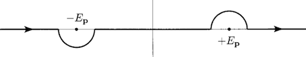

# Causality in Klein-Gordon Theory

## The Propagator

The **propagator** $D(x-y)$ is defined as the amplitude for a particle to propagate from $y$ to $x$ (in spacetime). Naturally, we require $x^0 > y^0$:

$$
\begin{align*}
    D(x-y) &\equiv 
    \langle \mathbf{x}|e^{-i H(x^0 - y^0)}|\mathbf{y} \rangle
    \\
    &= \langle 0 | \phi(x) \phi(y) | 0 \rangle
\end{align*}
$$

Using the expansion

$$
\begin{align*}
    \phi(x) 
    &= \int \frac{d^3 p}{(2\pi)^3} 
    \frac{1}{\sqrt{2 E_\mathbf{p}}} [
        a_\mathbf{p} e^{-ipx} 
        + a^\dagger_\mathbf{p} e^{ipx}
    ]
    \\[1em] \text{with} \quad
    p^0 &= \sqrt{m^2 + \mathbf{p}^2} = E_\mathbf{p}
\end{align*}
$$

We obtain

$$
\begin{align*}
    \phi(x) \phi(y)
    &= \int \frac{d^3 p}{(2\pi)^3} 
    \frac{d^3 q}{(2\pi)^3} 
    \frac{1}{\sqrt{2 E_\mathbf{p} 2 E_\mathbf{q}}} 
    \\ &\qquad \quad [
        a_\mathbf{p} e^{-ipx} 
        + a^\dagger_\mathbf{p} e^{ipx}
    ][
        a_\mathbf{q} e^{-iqy} 
        + a^\dagger_\mathbf{q} e^{iqy}
    ]
    \\
    &= \int \frac{d^3 p}{(2\pi)^3} 
    \frac{d^3 q}{(2\pi)^3} 
    \frac{1}{\sqrt{2 E_\mathbf{p} 2 E_\mathbf{q}}} 
    \\ &\qquad \quad [
        a_\mathbf{p} a_\mathbf{q} e^{i(-px-qy)}
        + a_\mathbf{p} a^\dagger_\mathbf{q} e^{i(-px+qy)}
        \\ &\qquad \quad
        + a^\dagger_\mathbf{p} a_\mathbf{q} e^{i(px-qy)}
        + a^\dagger_\mathbf{p} a^\dagger_\mathbf{q} e^{i(px+qy)}
    ]
\end{align*}
$$

Noting that only the terms $\langle 0 | a_\mathbf{p} a_\mathbf{q}^\dagger |0\rangle = (2\pi)^3 \delta^3 (\mathbf{p-q})$ survives, we are left with

$$
\begin{align*}
    D(x-y) &= \langle 0 | \phi(x) \phi(y) | 0 \rangle
    \\
    &= \int \frac{d^3 p}{(2\pi)^3} \left.
    \frac{1}{2E_\mathbf{p}} e^{-ip(x-y)}
    \right|_{p^0 = E_\mathbf{p}}
\end{align*}
$$

## The Feynman Propagator

We calculate the time-ordered product

$$
\begin{align*}
    &\langle 0 | T[\phi(x) \phi(y)] | 0 \rangle
    \\
    &= \langle 0 | \phi(x) \phi(y) | 0 \rangle \theta(x^0 - y^0)
    + \langle 0 | \phi(y) \phi(x) | 0 \rangle \theta(y^0 - x^0)
    \\
    &= D(x - y) \theta(x^0 - y^0)
    + D(y - x) \theta(y^0 - x^0)
    \\
    &= \int \frac{d^3 p}{(2\pi)^3} \left[
        \frac{e^{-ip(x-y)}}{2E_\mathbf{p}} \theta(x^0 - y^0)
        + \frac{e^{ip(x-y)}}{2E_\mathbf{p}} \theta(y^0 - x^0)
    \right]_{p^0 = E_\mathbf{p}}
    \\
    &= \int \frac{d^3 p}{(2\pi)^3} \left[
        \left.
        \frac{e^{-ip(x-y)}}{2E_\mathbf{p}} \theta(x^0 - y^0)
        \right|_{p^0 = E_\mathbf{p}}
        \right. \\ & \qquad \qquad \qquad \left.
        + \left.
        \frac{e^{-ip(x-y)}}{2E_\mathbf{p}} \theta(y^0 - x^0)
        \right|_{p^0 = -E_\mathbf{p}}
    \right]
\end{align*}
$$

In the second term we change $p \to -p$. These two terms can be expressed as the residue of the following $p^0$ integration along the path shown in the figure:

$$
\begin{align*}
    &\lim_{\epsilon \to 0+} \int \frac{dp^0}{2\pi}
    \frac{i e^{-ip(x-y)}}{2 E_\mathbf{p}} \left(
        \frac{1}{p^0 - (E_\mathbf{p} - i \epsilon)} 
        - \frac{1}{p^0 + (E_\mathbf{p} - i \epsilon)}
    \right)
    \\
    &\sim \lim_{\epsilon \to 0+} \int \frac{dp^0}{2\pi}
    \frac{
        i e^{-ip(x-y)}
    }{
        p^2 - m^2 + i\epsilon
    }
\end{align*}
$$

- When $x^0 < y^0$, the contour closes in the **upper** half plane, so that 
    
    $$
    \lim_{p \to +i\infty} e^{-ip^0(x^0-y^0)} = 0
    $$
    
    And the integration on the large circle is zero. Then the path of $p^0$ encloses only the pole $-E_\mathbf{p} + i \epsilon$ in **counter-clockwise** direction.

    $$
    \begin{align*}
        &\int \frac{dp^0}{2\pi}
        \frac{i e^{-ip(x-y)}}{2 E_\mathbf{p}} \left(
            \cancel{\frac{1}{p^0 - E_\mathbf{p}} }
            - \frac{1}{p^0 + E_\mathbf{p}}
        \right)
        \\
        &= 2\pi i\left. \frac{-ie^{-ip(x-y)}}{2 E_\mathbf{p}} 
        \right|_{p^0 = -E_\mathbf{p}}
        \\
        &= \left. \frac{e^{-ip(x-y)}}{2 E_\mathbf{p}} 
        \right|_{p^0 = -E_\mathbf{p}} \theta(y^0 - x^0)
    \end{align*}
    $$

- When $x^0 > y^0$, the contour closes in the **lower** half plane, so that 
    
    $$
    \lim_{p \to -i\infty} e^{-ip^0(x^0-y^0)} = 0
    $$

    Then the path of $p^0$ encloses only the pole $E_\mathbf{p} - i \epsilon$ in **clockwise** direction (producing an additional minus sign).

    $$
    \begin{align*}
        &\int \frac{dp^0}{2\pi}
        \frac{i e^{-ip(x-y)}}{2 E_\mathbf{p}} \left(
            \frac{1}{p^0 - E_\mathbf{p}} 
            - \cancel{\frac{1}{p^0 + E_\mathbf{p}}}
        \right)
        \\
        &= -2\pi i \left. \frac{ie^{-ip(x-y)}}{2 E_\mathbf{p}} 
        \right|_{p^0 = E_\mathbf{p}}
        \\
        &= \left. \frac{e^{-ip(x-y)}}{2 E_\mathbf{p}} 
        \right|_{p^0 = E_\mathbf{p}} \theta(y^0 - x^0)
    \end{align*}
    $$

Therefore, we finally obtain

$$
\begin{align*}
    D_F(x - y)
    &\equiv \langle 0 | T[\phi(x) \phi(y)] |0 \rangle
    \\
    &= \lim_{\epsilon \to 0+}
    \int \frac{d^4 p}{(2\pi)^4}
    \frac{
        i e^{-i p(x - y)}
    }{
        p^2 - m^2 + i \epsilon
    }
\end{align*}
$$

This is sometimes simply denoted by $D_{xy}$. The integration variable can also be changed to $-p$ to yield

$$
D_F(x - y)
= \lim_{\epsilon \to 0+}
\int \frac{d^4 p}{(2\pi)^4}
\frac{
    i e^{+i p(x - y)}
}{
    p^2 - m^2 + i \epsilon
}
$$

This is more consistent with the convention of Fourier transform. We can verify that it is a Green's function of the Klein-Gordon EOM:

$$
(\partial^2 + m^2) D_F(x-y)
= -i \delta^4 (x-y)
$$

----

*Verify*:

$$
\begin{align*}
    &(\partial^2 + m^2) D_F(x-y)
    \\
    &= \lim_{\epsilon \to 0+} \int \frac{d^4 p}{(2\pi)^4}
    \frac{
        (\pm ip)^2 + m^2
    }{
        p^2 - m^2 + i \epsilon
    } i e^{\pm i p(x - y)}
    \\
    &= -i \int \frac{d^4 p}{(2\pi)^4}
    e^{\pm i p(x - y)}
    = -i \delta^4 (x-y) \quad \blacksquare
\end{align*}
$$

----
