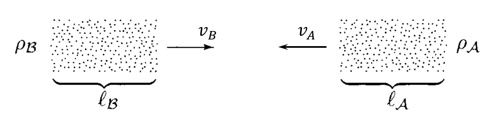
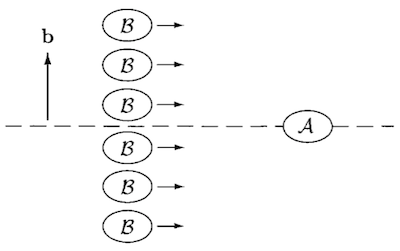

# Appendix A:   Alternative Derivation of *S*-Matrix

## The Cross Section

Consider a target of particles of type $A$ moving with velocity $v_A$, with density $\rho_A$ (particles per unit volume). We then shoot at it a bunch of particles of type $B$, with number density $\rho_B$ and velocity $v_B$ (parallel to $v_A$; this is always the case if we go to the center-of-mass frame).

Let $l_A$ and $l_B$ be the lengths of the bunches of particles that will collide each other. We assume that 

- the cross-sectional area $A$ common to the two bunches
- the particle beams have constant density across the cross section $A$. 

The number of particles of $A, B$ that will be involved in scattering is given by

$$
N_A = \rho_A l_A A, \quad
N_B = \rho_B l_B A
$$

If each particle $B$ will encounter all particles $A$ (or vice versa, equivalently), this maximum number of scattering events happening per unit area of the beam cross section will be

$$
\frac{N_A N_B}{A}
$$

The **cross section $\sigma$** is just defined as the the proportionality factor between the actual number of scattering events (happening everywhere) and the maximum number of events per unit area of the beam cross section:

$$
\text{Number of events} = \sigma \frac{N_A N_B}{A}
$$

We see that $\sigma$ has the dimension of an area. 

### Differential Cross Section

If we only consider events that results in a certain differential elements in the space of final events (e.g. given final momentum), the number of events will be infinitesimal:

$$
\text{Number of events} \propto d^3 p_1 \cdots d^3 p_n
$$

Then we need to use the **differential cross section**

$$
\frac{d\sigma}{d^3 p_1 \cdots d^3 p_n}
$$

## Calculation of Cross Section

Due to the new relativistic normalization of the momentum eigenstates, a wave packet representing some desired state $|\phi\rangle$ is expressed as

$$
|\phi\rangle = \int \frac{d^3k}{(2\pi)^3} 
\frac{1}{\sqrt{2 E_\mathbf{k}}} \phi(\mathbf{k}) |\mathbf{k}\rangle
$$

where $|\mathbf{k}\rangle$ is the one-particle momentum eigenstates in the *interacting* theory. Since in free theory $\langle \mathbf{k} | \mathbf{k} \rangle = 2E_\mathbf{k}$, we have

$$
\langle \phi | \phi \rangle = 1 
\, \Leftrightarrow \,
\int \frac{d^3k}{(2\pi)^3} |\phi(\mathbf{k})|^2 = 1
$$

Let us now consider the scattering between the target $|\phi_A\rangle$ and an incoming wave packet $|\phi_B(\mathbf{b})\rangle$ with **impact parameter** $\mathbf{b}$. 

The probability that packets $B$ coming from the small area $d^2b$ near $\mathbf{b}$ are scattered to $n$ particles whose momenta are in a small region $d^3 p_1 \cdots d^3 p_n$ is (the factor of $1/2E_f$ is due to normalization)

$$
\mathcal{P}(\mathbf{b}) \, d^2 b
= \left[
    \prod_{f=1}^n \frac{d^3 p_f}{(2\pi)^3} \frac{1}{2E_f}
\right] 
|\langle \mathbf{p}_1 ... \mathbf{p}_n|
\phi_A \phi_B(\mathbf{b}) \rangle|^2
$$

The in-state $|\phi_A \phi_B(\mathbf{b}) \rangle$ can be expressed in terms of the input momenta as

$$
\begin{align*}
    |\phi_A \phi_B(\mathbf{b}) \rangle
    &= \int \frac{d^3 k_A}{(2\pi)^3} \frac{d^3 k_B}{(2\pi)^3} 
    \frac{
        \phi_A(\mathbf{k}_A) \cdot
        \phi_B(\mathbf{k}_B) e^{-i \mathbf{k}_B \cdot \mathbf{b}}
    }{
        \sqrt{(2E_A) (2E_B)}
    } |\mathbf{k}_A \mathbf{k}_B \rangle
    \\
    &= \left[
        \prod_{i=A,B} \int \frac{d^3 k_i}{(2\pi)^3}
        \frac{\phi_i(\mathbf{k}_i)}{\sqrt{2E_i}}
    \right]
    e^{-i \mathbf{k}_B \cdot \mathbf{b}}
    |\{ \mathbf{k}_i \} \rangle
    \\[2em]
    \text{with} \quad
    E_i &= \sqrt{m_i^2 + \mathbf{k}_i^2} \qquad
    (i = A, B)
\end{align*}
$$

The $e^{-i \mathbf{k}_B \cdot \mathbf{b}}$ factor accounts for the spatial translation. We integrate over $\mathbf{b}$ to obtain the total number of scattering events that results in $d^3 p_1 \cdots d^3 p_n$

$$
dN = n_B \int d^2 b \, \mathcal{P}(\mathbf{b})
$$

where $n_B$ is the area density of $B$ beam (assumed to be constant). The cross section is thus

$$
\begin{align*}
    d\sigma &= \frac{dN}{n_B N_A} \xrightarrow{N_A = 1}
    \int d^2 b \, \mathcal{P}(\mathbf{b})
    \\
    &= \left[
        \prod_{f=1}^n \frac{d^3 p_f}{(2\pi)^3} \frac{1}{2E_f}
    \right] 
    \\ & \qquad \times
    \int d^2 b \left[
        \prod_{i=A,B} \int \frac{d^3 k_i}{(2\pi)^3} 
        \frac{\phi_i(\mathbf{k}_i)}{\sqrt{2E_i}}
        \int \frac{d^3 k'_i}{(2\pi)^3} 
        \frac{\phi^*_i(\mathbf{k}'_i)}{\sqrt{2E'_i}}
    \right]
    \\ &\qquad \times
    e^{i (\mathbf{k}'_B - \mathbf{k}_B) \cdot \mathbf{b}}
    \langle \{\mathbf{p}_f\} |\{\mathbf{k}_i\} \rangle
    \langle \{\mathbf{p}_f\} |\{\mathbf{k}'_i\} \rangle^*
\end{align*}
$$

We simplify this integral as follows:

- First integrate over $\mathbf{b}$: denote the component of $\mathbf{k}$ within the plane of $\mathbf{b}$ as $k^{xy}$ (since it is *perpendicular* to $v$), then

    $$
    \begin{align*}
        \int d^2b \, e^{i (\mathbf{k}'_B - \mathbf{k}_B) \cdot \mathbf{b}}
        &= \int d^2b \, e^{i (k'^{xy}_B - k^{xy}_B) \cdot b}
        \\
        &= (2\pi)^2 \delta^2(k'^{xy}_B - k^{xy}_B)
    \end{align*}
    $$

    Here we choose $\mathbf{b}$ to be in the $xy$-plane, and $v$ to be along $z$. This delta function then knocks out the integration over $k'^x_i, k'^y_i \, (i = A,B)$ by requiring

    $$
    k'^x_i = k^x_i, \quad
    k'^y_i = k^y_i \quad (i = A, B)
    $$

- If we only want non-trivial events, the final two amplitudes can be expressed in terms of $\mathcal{M}$ (dropping the 1 corresponding to forward scattering):

    $$
    \begin{align*}
        \langle \{\mathbf{p}_f\} |\{\mathbf{k}_i\} \rangle
        &= i 
        \mathcal{M}(\{k_i\} \to \{p_f\})
        (2\pi)^4 \delta^4(\textstyle{\sum p_f - \sum k_i})
        \\
        \langle \{\mathbf{p}_f\} |\{\mathbf{k}'_i\} \rangle^*
        &= -i 
        \mathcal{M}^*(\{k'_i\} \to \{p_f\})
        (2\pi)^4 \delta^4(\textstyle{\sum p_f - \sum k'_i})
    \end{align*}
    $$

    We then knock out integrations over $\mathbf{k}'_i$:

    $$
    \begin{align*}
        I = &\left[
            \prod_{i=A,B} \int \frac{d^3 k'_i}{(2\pi)^3} 
            \frac{\phi^*_i(\mathbf{k}'_i)}{\sqrt{2E'_i}}
        \right]
        (2\pi)^2 \delta^2(k'^{xy}_B - k^{xy}_B)
        \\ &\quad
        \times (-i) 
        \mathcal{M}^*(\{k'_i\} \to \{p_f\})
        (2\pi)^4 \delta^4(\textstyle{\sum p_f - \sum k'_i})
    \end{align*}
    $$

    To simplify writing, we use $f(\mathbf{k}')$ to represents things besides the $\delta$ functions that depend on $\mathbf{k}'_A, \mathbf{k}'_B$: 

    $$
    f(\mathbf{k}') \equiv
    (-i) \mathcal{M}^*(\{k'_i\} \to \{p_f\})
    \prod_{i=A,B} \frac{\phi^*_i(\mathbf{k}'_i)}{\sqrt{2E'_i}}
    $$

    Cancel the $2\pi$ factors and $k'^{x,y}_B$ integrals:

    $$
    I = \int d^3 k'_A d k'^z_B
    \left[
        f(\mathbf{k}') \,
        \delta^4(\textstyle{\sum p_f - \sum k'_i})
    \right]_{k'^{xy}_B = k^{xy}_B}
    $$

    Use the delta function of $z$-direction to knock out $k'^z_B$:

    $$
    \begin{align*}
        I &= \int d^3 k'_A \,
        [
            f(\mathbf{k}') \,
            \delta(\textstyle{\sum E_f - \sum E'_i})
            \\ &\qquad \times
            \delta^2(\textstyle{\sum p^{xy}_f - \sum k'^{xy}_i})
        ]_{
            k'^{x,y}_B = k^{x,y}_B, \,
            k'^z_B = \sum p_f^z - k'^z_A
        }
        \\
        &= \int d^3 k'_A \,
        [
            f(\mathbf{k}') \,
            \delta(
                \sqrt{m_A^2 + \mathbf{k}'^2_A}
                + \sqrt{m_B^2 + \mathbf{k}'^2_B}
                - \textstyle{\sum E_f}
            )
            \\ &\qquad \times
            \delta^2(\textstyle{\sum p^{xy}_f - \sum k'^{xy}_i})
        ]_{
            k'^{xy}_B = k^{xy}_B, \,
            k'^z_B = \sum p_f^z - k'^z_A
        }
        \\
        &= \int d k'^z_A \,
        [
            f(\mathbf{k}') \,
            \delta(
                \sqrt{m_A^2 + \mathbf{k}'^2_A}
                \\ &\qquad 
                + \sqrt{m_B^2 + \mathbf{k}'^2_B}
                - \textstyle{\sum E_f}
            )
        ]_{
            k'^{xy}_B = k^{xy}_B, \,
            k'^z_B = \sum p_f^z - k'^z_A, \,
            k'^{xy}_A = \sum p_f^{xy} - k'^{xy}_B
        }
    \end{align*}
    $$

- Focus on the last delta function:

    $$
    \delta(
        \sqrt{m_A^2 + \mathbf{k}'^2_A}
        + \sqrt{m_B^2 + \mathbf{k}'^2_B}
        - \textstyle{\sum E_f}
    )
    $$

    Now we have expressed $k'^{xy}_A$ and the whole $\mathbf{k}'_B$ as functions of $k'^z_A$: 

    $$
    \begin{align*}
        k'^{xy}_B &= k^{xy}_B \quad
        &\text{(independent of $k'^z_A$)}
        \\
        k'^z_B &= \sum p_f^z - k'^z_A
        \\
        k'^{xy}_A &= \sum p_f^{xy} - k^{xy}_B \quad
        &\text{(independent of $k'^z_A$)}
    \end{align*}
    $$

    Then we can apply the mathematical theorem

    $$
    \delta(f(x)) = \sum_a \frac{\delta(x - x_a)}{|f'(x_a)|}
    $$

    (where $x_a$ are zeros of $f(x)$). The $k'^z_A$ derivative of the argument of the delta function is (the minus sign comes from the chain rule when finding $d k'^z_B / d k'^z_A$)

    $$
    \frac{k'^z_A}{E'_A} 
    - \frac{k'^z_B}{E'_B} 
    \equiv v'_A - v'_B
    $$

    where $v'_A, v'_B$ are velocities of $A, B$ in the lab reference frame. Here we used the relation between the momentum and the energy.
    
    Due to the extra delta function $\delta^4(\textstyle{\sum p_f - \sum k_i})$, we may safely pick the zeros of $\sum E_f - \sum E'_i$ as

    $$
    k'^z_i =  k_i^z \qquad (i = A,B)
    $$

- Finally, we knock out the integration over $k'^z_A$ and obtain

    $$
    I = \frac{f(\mathbf{k})}{|v_A - v_B|}
    = \frac{(-i)}{|v_A - v_B|} 
    \mathcal{M}^*(\{k_i\} \to \{p_f\})
    \prod_{i=A,B} \frac{\phi^*_i(\mathbf{k}_i)}{\sqrt{2E_i}}
    $$

    evaluated at $\mathbf{k}'_i = \mathbf{k}_i$. Now we are only left with the integrals over $\mathbf{k}_i$:

    $$
    \begin{align*}
        d \sigma
        &= \left[
            \prod_{f=1}^n \frac{d^3 p_f}{(2\pi)^3} \frac{1}{2E_f}
        \right] 
        \int \frac{d^3 k_A}{(2\pi)^3} \frac{d^3 k_B}{(2\pi)^3}
        (2\pi)^4
        \delta^4(\textstyle{\sum p_f - \sum k_i})
        \\ & \qquad \times 
        \frac{
            |\mathcal{M}(\{k_i\} \to \{p_f\})|^2
        }{|v_A - v_B|}
        \frac{|\phi_A(\mathbf{k}_A)|^2}{2E_A}
        \frac{|\phi_B(\mathbf{k}_B)|^2}{2E_B}
        \\[1em]
        &\text{where} \quad
        E_{A,B} = k_{A,B}^0 = \sqrt{m^2 + \mathbf{k}_{A,B}^2}
    \end{align*}
    $$

To simplify further, we exploit the properties of a wave packet that it is *sharply* peaked as some "average" momentum $\mathbf{p}_A, \mathbf{p}_B$, and other things in the integral are *smooth* functions (i.e. they does not change much) of $\mathbf{k}_A, \mathbf{k}_B$. Thus we can approximate the integral as

$$
\begin{align*}
    d \sigma
    &= \left[
        \prod_{f=1}^n \frac{d^3 p_f}{(2\pi)^3} \frac{1}{2E_f}
    \right] 
    \frac{
        |\mathcal{M}(p_A,p_B \to \{p_f\})|^2
    }{2E_A 2E_B|v_A - v_B|}
    \int \frac{d^3 k_A}{(2\pi)^3} \frac{d^3 k_B}{(2\pi)^3}
    \\ & \qquad \times
    (2\pi)^4 \delta^4(\textstyle{k_A + k_B - \sum p_f}) 
    |\phi_A(\mathbf{k}_A)|^2
    |\phi_B(\mathbf{k}_B)|^2
    \\[0.2em]
    & \quad 
    \left( \begin{align*}
        &\text{This step uses the smoothness}
        \\
        &\text{Note that $E_{A,B}, v_{A,B}$ now does not depend on $p_f$}
    \end{align*} \right)
    \\[1em]
    &= \frac{1}{2E_A 2E_B|v_A - v_B|}
    \left[
        \prod_{f=1}^n \frac{d^3 p_f}{(2\pi)^3} \frac{1}{2E_f}
    \right] 
    \\ &\qquad \times
    |\mathcal{M}(p_A,p_B \to \{p_f\})|^2
    (2\pi)^4 \delta^4(\textstyle{p_A + p_B - \sum p_f}) 
    \\[0.2em]
    & \quad \left( \begin{align*}
        &\text{This step uses the sharpness of $\phi(\mathbf{k_A})$ and $\phi(\mathbf{k_B}$)}
        \\
        &\text{i.e. treat them similarly to the delta function}
    \end{align*} \right)
    \\[1em]
    &\text{where} \quad
    E_{A,B} = p_{A,B}^0 = \sqrt{m^2 + \mathbf{p}_{A,B}^2}
\end{align*}
$$

### The Lorentz-Invariant Phase Space

In the result of $d\sigma$ above, we pick out the Lorentz invariant structure

$$
d\Pi_n 
\equiv
\left[
    \prod_{f=1}^n \frac{d^3 p_f}{(2\pi)^3} \frac{1}{2E_f}
\right] 
(2\pi)^4 \delta^4(\textstyle{\sum p_i - \sum p_f}) 
$$

It is called the **Lorentz invariant $n$-body phase space element**. Then we can simply write

$$
d\sigma 
= \frac{|\mathcal{M}(p_A,p_B \to \{p_f\})|^2}{2E_A 2E_B|v_A - v_B|}
d\Pi_n
$$
