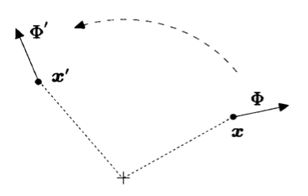

# Continuous Symmetry Transformations

## Continuous Symmetry

Our physical system is described by the following action depending on the fields and the *first-order* derivative of them:

$$
S=\int d^dx \,
\mathcal{L}(\phi (x),\partial \phi (x))
$$

Now suppose we *move* the system to a new position (the amount of moving can be different for different parts) so that things originally at $x$ is now at $x'$ (*active view*). 

This is *not* due to change of the coordinate system (*passive view*). We can always put the change of
position in the form

$$
x\to x'(x)=x+\epsilon (x)
$$

Although we use the letter $\epsilon$, it is not necessarily a small quantity (nevertheless we shall soon make it so). 

At the same time, *the field will also be affected*: the new field at the new position $\phi' \left(x'\right)$ is some functional $F$ of the old field at the old position $\phi (x)$

$$
\phi (x)\to \phi' \left(x'(x)\right)=F(\phi (x))
$$

   
*Transformation of field and coordinates*

