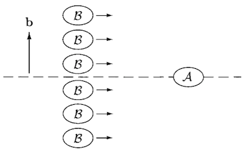

# The *S*-Matrix

## The Cross Section

Consider a target, at rest, of particles of type $A$, with density $\rho_A$ (particles per unit volume). We then shoot at it a bunch of particles of type $B$, with number density $\rho_B$ and velocity $v$.

Let $l_A$ and $l_B$ be the lengths of the bunches of particles. Then we expect the total number of scattering events (or scattering events of any particular desired type) to be proportional to $\rho_A, \rho_B, l_A, l_B$ and the cross-sectional area $A$ common to the two bunches. We also assume that the particle beams have constant density across the cross section $A$. 

The **cross section $\sigma$** is just defined as the total number of scattering events divided by all of these quantities:

$$
\sigma \equiv \frac{
    \text{Number of events}
}{
    \rho_A \rho_B l_A l_B A
}
$$

How to calculate the number of events? The numbers of particles of $A$ and $B$ involved are

$$
N_A = \rho_A l_A A, \quad
N_B = \rho_B l_B A
$$

Then

$$
\text{Number of events} = \frac{\sigma N_A N_B}{A}
$$

### Differential Cross Section

If we only consider events that results in a certain differential elements in the space of final events (e.g. given final momentum), the number of events will be infinitesimal:

$$
\text{Number of events} \propto d^3 p_1 \cdots d^3 p_n
$$

Then we need to use the **differential cross section**

$$
\frac{d\sigma}{d^3 p_1 \cdots d^3 p_n}
$$

## The $S$-Matrix

Let $|\psi,t\rangle$ be the Schrödinger picture state at time $t$; its Heisenberg picture counterpart is simply denoted by $|\psi\rangle$.

The *free* states at $t = \pm \infty$ are called **asymptotic states**. The **$S$-matrix** describes the amplitude to go from $t = -\infty$ to $t = +\infty$:

$$
S_{fi} 
= \langle f|S|i \rangle
\equiv \langle f, + \infty | i,-\infty \rangle
$$

For free theory, $S = 1$. Thus for a general theory, we write

$$
S = 1 + i T
$$

where $T$ is the **transfer matrix**. Since $S$ should vanish unless the total 4-momentum is conserved, we normalize $T$ as

$$
\textstyle
i T = i \mathcal{M}
(2\pi)^4 \delta^4(\sum p_f - \sum p_i)
$$

where $\mathcal{M}$ is called the **invariant matrix element**. Now we can extract the "non-trivial" part of the $S$-matrix:

$$
\textstyle
\langle f|i T|i \rangle
= i \langle f|\mathcal{M}|i \rangle
(2\pi)^4 \delta^4(\sum p_f - \sum p_i)
$$

### Calculation of $\sigma$ from $\mathcal{M}$

Due to the new relativistic normalization of the momentum eigenstates, a wave packet representing some desired state $|\phi\rangle$ is expressed as

$$
|\phi\rangle = \int \frac{d^3k}{(2\pi)^3} 
\frac{1}{\sqrt{2 E_\bold{k}}} \phi(\bold{k}) |\bold{k}\rangle
$$

where $|\bold{k}\rangle$ is the one-particle momentum eigenstates in the *interacting* theory. Since in free theory $\langle \bold{k} | \bold{k} \rangle = 2E_\bold{k}$, we have

$$
\langle \phi | \phi \rangle = 1 
\, \Leftrightarrow \,
\int \frac{d^3k}{(2\pi)^3} |\phi(\bold{k})|^2 = 1
$$

Let us now consider the scattering between the target $|\phi_A\rangle$ and an incoming wave packet $|\phi_B(\bold{b})\rangle$ with **impact parameter** $\bold{b}$. 

The probability that packets $B$ coming from the small area $d^2b$ near $\bold{b}$ are scattered to $n$ particles whose momenta are in a small region $d^3 p_1 \cdots d^3 p_n$ is (the factor of $1/2E_f$ is due to normalization)

$$
\mathcal{P}(\bold{b}) \, d^2 b
= \left[
    \prod_{f=1}^n \frac{d^3 p_f}{(2\pi)^3} \frac{1}{2E_f}
\right] 
|\langle \bold{p}_1 ... \bold{p}_n|
\phi_A \phi_B(\bold{b}) \rangle|^2
$$

The in-state $|\phi_A \phi_B(\bold{b}) \rangle$ can be expressed in terms of the input momenta as

$$
\begin{aligned}
    |\phi_A \phi_B(\bold{b}) \rangle
    &= \int \frac{d^3 k_A}{(2\pi)^3} \frac{d^3 k_B}{(2\pi)^3} 
    \frac{
        \phi_A(\bold{k}_A) \cdot
        \phi_B(\bold{k}_B) e^{-i \bold{k}_B \cdot \bold{b}}
    }{
        \sqrt{(2E_A) (2E_B)}
    } |\bold{k}_A \bold{k}_B \rangle
    \\
    &= \left[
        \prod_{i=A,B} \int \frac{d^3 k_i}{(2\pi)^3}
        \frac{\phi_i(\bold{k}_i)}{\sqrt{2E_i}}
    \right]
    e^{-i \bold{k}_B \cdot \bold{b}}
    |\{ \bold{k}_i \} \rangle
    \\[2em]
    \text{with} \quad
    E_i &= \sqrt{m_i^2 + \bold{k}_i^2} \qquad
    (i = A, B)
\end{aligned}
$$

The $e^{-i \bold{k}_B \cdot \bold{b}}$ factor accounts for the spatial translation. We integrate over $\bold{b}$ to obtain the total number of scattering events that results in $d^3 p_1 \cdots d^3 p_n$

$$
dN = n_B \int d^2 b \, \mathcal{P}(\bold{b})
$$

where $n_B$ is the area density of $B$ beam (assumed to be constant). The cross section is thus

$$
\begin{aligned}
    d\sigma &= \frac{dN}{n_B N_A} \xrightarrow{N_A = 1}
    \int d^2 b \, \mathcal{P}(\bold{b})
    \\
    &= \left[
        \prod_{f=1}^n \frac{d^3 p_f}{(2\pi)^3} \frac{1}{2E_f}
    \right] 
    \\ & \qquad \times
    \int d^2 b \left[
        \prod_{i=A,B} \int \frac{d^3 k_i}{(2\pi)^3} 
        \frac{\phi_i(\bold{k}_i)}{\sqrt{2E_i}}
        \int \frac{d^3 k'_i}{(2\pi)^3} 
        \frac{\phi^*_i(\bold{k}'_i)}{\sqrt{2E'_i}}
    \right]
    \\ &\qquad \times
    e^{i (\bold{k}'_B - \bold{k}_B) \cdot \bold{b}}
    \langle \{\bold{p}_f\} |\{\bold{k}_i\} \rangle
    \langle \{\bold{p}_f\} |\{\bold{k}'_i\} \rangle^*
\end{aligned}
$$

First integrate over $\bold{b}$: denote the component of $\bold{k}$ within the plane of $\bold{b}$ as $k^{xy}$ (since it is *perpendicular* to $v$), then

$$
\begin{aligned}
    \int d^2b \, e^{i (\bold{k}'_B - \bold{k}_B) \cdot \bold{b}}
    &= \int d^2b \, e^{i (k'^{xy}_B - k^{xy}_B) \cdot b}
    \\
    &= (2\pi)^2 \delta^2(k'^{xy}_B - k^{xy}_B)
\end{aligned}
$$

Here we choose $\bold{b}$ to be in the $xy$-plane, and $v$ to be along $z$. This delta function then knocks out the integration over $k'^x_i, k'^y_i \, (i = A,B)$ by requiring

$$
k'^x_i = k^x_i, \quad
k'^y_i = k^y_i \quad (i = A, B)
$$

If we only want non-trivial events, the final two amplitudes can be expressed in terms of $\mathcal{M}$ (dropping the 1 corresponding to forward scattering):

$$
\begin{aligned}
    \langle \{\bold{p}_f\} |\{\bold{k}_i\} \rangle
    &= i 
    \mathcal{M}(\{k_i\} \to \{p_f\})
    (2\pi)^4 \delta^4(\textstyle{\sum p_f - \sum k_i})
    \\
    \langle \{\bold{p}_f\} |\{\bold{k}'_i\} \rangle^*
    &= -i 
    \mathcal{M}^*(\{k'_i\} \to \{p_f\})
    (2\pi)^4 \delta^4(\textstyle{\sum p_f - \sum k'_i})
\end{aligned}
$$

We then knock out integrations over $\bold{k}'_i$:

$$
\begin{aligned}
    I = &\left[
        \prod_{i=A,B} \int \frac{d^3 k'_i}{(2\pi)^3} 
        \frac{\phi^*_i(\bold{k}'_i)}{\sqrt{2E'_i}}
    \right]
    (2\pi)^2 \delta^2(k'^{xy}_B - k^{xy}_B)
    \\ &\quad
    \times (-i) 
    \mathcal{M}^*(\{k'_i\} \to \{p_f\})
    (2\pi)^4 \delta^4(\textstyle{\sum p_f - \sum k'_i})
\end{aligned}
$$

To simplify writing, we use $f(\bold{k}')$ to represents things besides the $\delta$ functions that depend on $\bold{k}'_A, \bold{k}'_B$: 

$$
f(\bold{k}') \equiv
(-i) \mathcal{M}^*(\{k'_i\} \to \{p_f\})
\prod_{i=A,B} \frac{\phi^*_i(\bold{k}'_i)}{\sqrt{2E'_i}}
$$

Cancel the $2\pi$ factors and $k'^{x,y}_B$ integrals:

$$
I = \int d^3 k'_A d k'^z_B
\left[
    f(\bold{k}') \,
    \delta^4(\textstyle{\sum p_f - \sum k'_i})
\right]_{k'^{xy}_B = k^{xy}_B}
$$

Use the delta function of $z$-direction to knock out $k'^z_B$:

$$
\begin{aligned}
    I &= \int d^3 k'_A \,
    [
        f(\bold{k}') \,
        \delta(\textstyle{\sum E_f - \sum E'_i})
        \\ &\qquad \times
        \delta^2(\textstyle{\sum p^{xy}_f - \sum k'^{xy}_i})
    ]_{
        k'^{x,y}_B = k^{x,y}_B, \,
        k'^z_B = \sum p_f^z - k'^z_A
    }
    \\
    &= \int d^3 k'_A \,
    [
        f(\bold{k}') \,
        \delta(
            \sqrt{m_A^2 + \bold{k}'^2_A}
            + \sqrt{m_B^2 + \bold{k}'^2_B}
            - \textstyle{\sum E_f}
        )
        \\ &\qquad \times
        \delta^2(\textstyle{\sum p^{xy}_f - \sum k'^{xy}_i})
    ]_{
        k'^{xy}_B = k^{xy}_B, \,
        k'^z_B = \sum p_f^z - k'^z_A
    }
    \\
    &= \int d k'^z_A \,
    [
        f(\bold{k}') \,
        \delta(
            \sqrt{m_A^2 + \bold{k}'^2_A}
            \\ &\qquad 
            + \sqrt{m_B^2 + \bold{k}'^2_B}
            - \textstyle{\sum E_f}
        )
    ]_{
        k'^{xy}_B = k^{xy}_B, \,
        k'^z_B = \sum p_f^z - k'^z_A, \,
        k'^{xy}_A = \sum p_f^{xy} - k'^{xy}_B
    }
\end{aligned}
$$

Focus on the last delta function:

$$
\delta(
    \sqrt{m_A^2 + \bold{k}'^2_A}
    + \sqrt{m_B^2 + \bold{k}'^2_B}
    - \textstyle{\sum E_f}
)
$$

Now we have expressed $k'^{xy}_A$ and the whole $\bold{k}'_B$ as functions of $k'^z_A$: 

$$
\begin{aligned}
    k'^{xy}_B &= k^{xy}_B \quad
    &\text{(independent of $k'^z_A$)}
    \\
    k'^z_B &= \sum p_f^z - k'^z_A
    \\
    k'^{xy}_A &= \sum p_f^{xy} - k^{xy}_B \quad
    &\text{(independent of $k'^z_A$)}
\end{aligned}
$$

Then we can apply the mathematical theorem

$$
\delta(f(x)) = \sum_a \frac{\delta(x - x_a)}{|f'(x_a)|}
$$

(where $x_a$ are zeros of $f(x)$). The $k'^z_A$ derivative of the argument of the delta function is (the minus sign comes from the chain rule when finding $d k'^z_B / d k'^z_A$)

$$
\frac{k'^z_A}{E'_A} 
- \frac{k'^z_B}{E'_B} 
\equiv v'_A - v'_B
$$

where $v'_A, v'_B$ are velocities of $A, B$ in the lab reference frame. Due to the extra delta function $\delta^4(\textstyle{\sum p_f - \sum k_i})$, we may safely pick the zeros of $\sum E_f - \sum E'_i$ as

$$
k'^z_i =  k_i^z \qquad (i = A,B)
$$

Finally, we knock out the integration over $k'^z_A$ and obtain

$$
I = \frac{f(\bold{k})}{|v_A - v_B|}
= \frac{(-i)}{|v_A - v_B|} 
\mathcal{M}^*(\{k_i\} \to \{p_f\})
\prod_{i=A,B} \frac{\phi^*_i(\bold{k}_i)}{\sqrt{2E_i}}
$$

evaluated at $\bold{k}'_i = \bold{k}_i$. Now we are only left with the integrals over $\bold{k}_i$:

$$
\begin{aligned}
    d \sigma
    &= \left[
        \prod_{f=1}^n \frac{d^3 p_f}{(2\pi)^3} \frac{1}{2E_f}
    \right] 
    \int \frac{d^3 k_A}{(2\pi)^3} \frac{d^3 k_B}{(2\pi)^3}
    (2\pi)^4
    \delta^4(\textstyle{\sum p_f - \sum k_i})
    \\ & \qquad \times 
    \frac{
        |\mathcal{M}(\{k_i\} \to \{p_f\})|^2
    }{|v_A - v_B|}
    \frac{|\phi_A(\bold{k}_A)|^2}{2E_A}
    \frac{|\phi_B(\bold{k}_B)|^2}{2E_B}
    \\[1em]
    &\text{where} \quad
    E_{A,B} = k_{A,B}^0 = \sqrt{m^2 + \bold{k}_{A,B}^2}
\end{aligned}
$$

To simplify further, we exploit the properties of a wave packet that it is sharply peaked as some "average" momentum $\bold{p}_A, \bold{p}_B$, and other things in the integral are *smooth* functions of $\bold{k}_A, \bold{k}_B$. Thus we can approximate the integral as

$$
\begin{aligned}
    d \sigma
    &= \left[
        \prod_{f=1}^n \frac{d^3 p_f}{(2\pi)^3} \frac{1}{2E_f}
    \right] 
    \frac{
        |\mathcal{M}(p_A,p_B \to \{p_f\})|^2
    }{2E_A 2E_B|v_A - v_B|}
    \int \frac{d^3 k_A}{(2\pi)^3} \frac{d^3 k_B}{(2\pi)^3}
    \\ & \qquad \times
    (2\pi)^4 \delta^4(\textstyle{k_A + k_B - \sum p_f}) 
    |\phi_A(\bold{k}_A)|^2
    |\phi_B(\bold{k}_B)|^2
    \\[1em]
    &\text{where} \quad
    E_{A,B} = p_{A,B}^0 = \sqrt{m^2 + \bold{p}_{A,B}^2}
\end{aligned}
$$

## Differential Cross Section in CM Frame