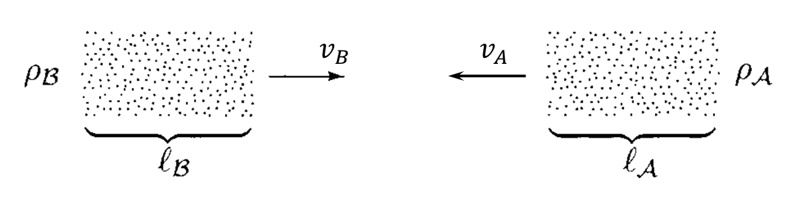

# Cross Section

Consider a target of particles of type $A$ moving with velocity $v_A$, with density $\rho_A$ (particles per unit volume). We then shoot at it a bunch of particles of type $B$, with number density $\rho_B$ and velocity $v_B$ (parallel to $v_A$; this is always the case if we go to the center-of-mass frame).

Particles $B$ will be scattered by particles $A$. Let $N_B$ be the number of incoming $B$ particles per unit area of the beam cross section, and $N$ be the number of scattered $B$ particles per unit area. The **cross section** of scattering is defined as

$$
\sigma = \frac{N}{N_B} = \frac{N}{\Phi T}
$$

where $\Phi$ is the flux (number of incoming particles per unit cross-section area per unit time) of $B$, and $T$ is the experiment time. 

If we are only interested in the particles $B$ (with number $dN$) that falls in a small region of (say) the phase space $d\Pi$, we also use the **differential cross section**

$$
d\sigma = \frac{dN}{N_B} = \frac{dN}{\Phi T}
$$

Practically, we shall focus on $2 \to n$ scattering.  

## *S*-Matrix and Scattering Probability

Let $|\psi,t\rangle$ be the Schrödinger picture state at time $t$; its Heisenberg picture counterpart is simply denoted by $|\psi\rangle$.

The *free* states at $t = \pm \infty$ are called **asymptotic states**. The **$S$-matrix** describes the amplitude to go from $t = -\infty$ to $t = +\infty$:

$$
S_{fi} 
= \langle f|S|i \rangle
\equiv \langle f, + \infty | i,-\infty \rangle
$$

For free theory, $S = 1$. Thus for a general theory, we write

$$
S = 1 + i T
$$

where $T$ is the **transfer matrix**. Since $S$ should vanish unless the total 4-momentum is conserved, we normalize $T$ as

$$
\textstyle
i T = i \mathcal{M}
(2\pi)^4 \delta^4(\sum p_f - \sum p_i)
$$

where $\mathcal{M}$ is called the **invariant matrix element**. Now we can extract the "non-trivial" part of the $S$-matrix:

$$
i T_{fi}
= i \mathcal{M}_{fi} (2\pi)^4 
\delta^4(\textstyle{\sum p_f - \sum p_i})
$$

With $S$-matrix, the probability $dP$ that a particle $B$ will be scattered into $|f\rangle$ *and* fall in the momentum phase space $d\Pi$ (momentum states are uniformly distributed) is given by the product

$$
dP = \frac{|S_{fi}|^2}{
    \langle f|f \rangle
    \langle i|i \rangle
} d\Pi
$$

The denominator simply normalizes the states and $S$-matrix elements. The phase space element is integrated all over the space:

$$
d\Pi = \int_\text{space} 
\prod_{j=1}^n \frac{d^3x \, d^3p}{(2\pi)^3}
= \prod_{j=1}^n \left[
    \frac{V}{(2\pi)^3} d^3 p
\right]
$$

where $V$ is the space volume in which the experiment is performed. 

With the finite volume (and the experiment time $T$), using

$$
\int \frac{d^3p}{(2\pi)^3} f(\mathbf{p})
\to \frac{1}{V} \sum_\mathbf{p} f(\mathbf{p})
$$

the space delta functions can be regulated to

$$
\delta^3(\mathbf{p} - \mathbf{p}') 
\to \frac{V}{(2\pi)^3} \delta_{\mathbf{p} \mathbf{p}'}
$$

and therefore

$$
\delta^3(0) \to \frac{V}{(2\pi)^3}, \quad
\delta^4(0) \to \frac{TV}{(2\pi)^4}
$$

With $dP$, the differential cross section can be expressed as

$$
d\sigma = 
$$