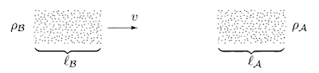

# Cross Section

## The Cross Section

Consider a target, at rest, of particles of type $A$, with density $\rho_A$ (particles per unit volume). We then shoot at it a bunch of particles of type $B$, with number density $\rho_B$ and velocity $v$.

Let $l_A$ and $l_B$ be the lengths of the bunches of particles. Then we expect the total number of scattering events (or scattering events of any particular desired type) to be proportional to $\rho_A, \rho_B, l_A, l_B$ and the cross-sectional area $A$ common to the two bunches. We also assume that the particle beams have constant density across the cross section $A$. 

The **cross section $\sigma$** is just defined as the total number of scattering events divided by all of these quantities:

$$
\sigma \equiv \frac{
    \text{Number of events}
}{
    \rho_A \rho_B l_A l_B A
}
$$

How to calculate the number of events? The numbers of particles of $A$ and $B$ involved are

$$
N_A = \rho_A l_A A, \quad
N_B = \rho_B l_B A
$$

Then

$$
\text{Number of events} = \frac{\sigma N_A N_B}{A}
$$

### Differential Cross Section

If we only consider events that results in a certain differential elements in the space of final events (e.g. given final momentum), the number of events will be infinitesimal:

$$
\text{Number of events} \propto d^3 p_1 \cdots d^3 p_n
$$

Then we need to use the **differential cross section**

$$
\frac{d\sigma}{d^3 p_1 \cdots d^3 p_n}
$$

## The $S$-Matrix

Let $|\psi,t\rangle$ be the Schrödinger picture state at time $t$; its Heisenberg picture counterpart is simply denoted by $|\psi\rangle$.

The *free* states at $t = \pm \infty$ are called **asymptotic states**. The **$S$-matrix** describes the amplitude to go from $t = -\infty$ to $t = +\infty$:

$$
S_{fi} 
= \langle f|S|i \rangle
\equiv \langle f, + \infty | i,-\infty \rangle
$$

For free theory, $S = 1$. Thus for a general theory, we write

$$
S = 1 + i T
$$

where $T$ is the **transfer matrix**. Since $S$ should vanish unless the total 4-momentum is conserved, we normalize $T$ as

$$
T = (2\pi)^4 \delta^4(\textstyle{\sum p}) \mathcal{M}
\qquad
\textstyle{\sum p} \equiv \textstyle{\sum p_f - \sum p_i}
$$

where $\mathcal{M}$ is called the **invariant matrix element**. Now we can extract the "non-trivial" part of the $S$-matrix:

$$
\langle f|i T|i \rangle
= i (2\pi)^4 \delta^4(\textstyle{\sum p}) 
\langle f|\mathcal{M}|i \rangle
$$

### Calculation of $\sigma$ from $\mathcal{M}$

