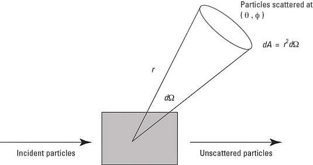

# Cross Section

## The $S$-Matrix

Let $|\psi,t\rangle$ be the Schrödinger picture state at time $t$; its Heisenberg picture counterpart is simply denoted by $|\psi\rangle$.

The *free* states at $t = \pm \infty$ are called **asymptotic states**. The **$S$-matrix** describes the amplitude to go from $t = -\infty$ to $t = +\infty$:

$$
S_{fi} 
= \langle f|S|i \rangle
\equiv \langle f, + \infty | i,-\infty \rangle
$$

For free theory, $S = 1$. Thus for a general theory, we write

$$
S = 1 + i T
$$

where $T$ is the **transfer matrix**. Since $S$ should vanish unless the total 4-momentum is conserved, we normalize $T$ as

$$
T = (2\pi)^4 \delta^4(\textstyle{\sum p}) \mathcal{M}
\qquad
\textstyle{\sum p} \equiv \textstyle{\sum p_f - \sum p_i}
$$

Now we can extract the "non-trivial" part of the $S$-matrix:

$$
\langle f|i T|i \rangle
= i (2\pi)^4 \delta^4(\textstyle{\sum p}) 
\langle f|\mathcal{M}|i \rangle
$$

## The Cross Section

Let 

- $dN$ be the number of particles scattered per unit time through the solid angle element $\Omega$ to $\Omega + d\Omega$;
- $\Phi$ be the number of incoming particles per unit time per unit area of the beam cross section (the beam is assumed *uniform*). This quantity is like the flux of particles.

The we use the **cross section** (which has dimensions of *area*) to describe the scattering process:

$$
d \sigma = \frac{dN}{\Phi}
$$

Now let us consider $2 \to n$ scattering:

$$
p_1 + p_2 \to \{p_j\}
$$

in the *center-of-mass frame*. In this frame, 1 and 2 are heading towards each other with velocity $v_1 > 0$ and $v_2 < 0$ (parallel). Within unit time, 

The number $dN$ can be related to the *probability* $dP$ of scattering: