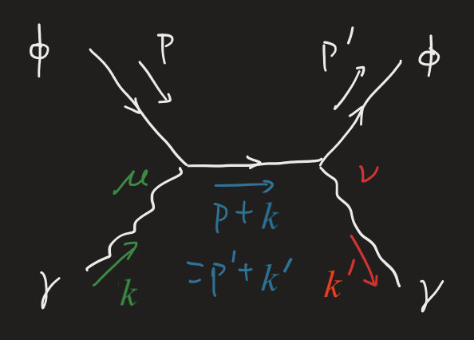
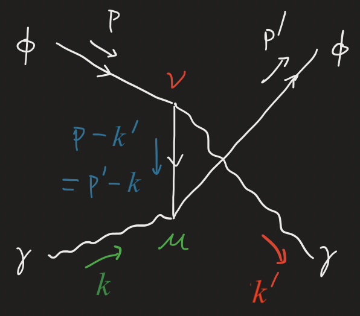
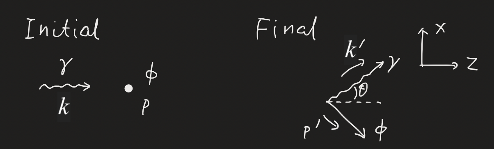

# Elementary Processes of Scalar QED

## Compton Scattering

The **compton scattering** refers to the scattering of an incoming photon $\gamma$ by an "electron" $\phi$ at rest (in the lab frame). For a moment, we go into an arbitrary frame, and call the momenta of the incoming $\phi, \gamma$ as $p, q$, and the momenta of the outgoing $\phi, \gamma$ as $p', q'$. The scattering process is described as

$$
\phi(p) + \gamma(q) \to \phi(p') + \gamma(q')
$$

In the following calculation, the charge of a $\phi$ particle $(Q)$ will be made explicit. 

### Invariant Amplitude $\mathcal{M}$

In scalar QED, Compton scattering involves the following 3 diagrams at the lowest order:

- The seagull diagram
    
    

    
    

    $$
    i \mathcal{M}_4 = 2i (eQ)^2 g^{\mu \nu} \epsilon_\mu(q) \epsilon'^*_\nu(q')
    $$

- The s-channel diagram
    
    

    
    

    $$
    \begin{aligned}
        i \mathcal{M}_s 
        &= \color{green} \epsilon_\mu(q) \cdot
        ieQ[p + (p+q)]^\mu 
        \\ & \quad \times
        \color{darkcyan}
        \frac{i}{(p+q)^2 - m^2}
        \\ & \quad \times
        \color{red}
        ieQ [(p'+q') + p']^\nu \epsilon'^*_\nu(q')
    \end{aligned}
    $$

    We can simplify a little bit using the on-shell conditions of the incoming $\phi, \gamma$:

    $$
    p^2 = m^2 \qquad
    q^2 = 0
    $$

    Then

    $$
    \begin{aligned}
        (p+q)^2 - m^2 
        &= p^2 + q^2 + 2p\cdot q - m^2
        \\
        &= 2p \cdot q
    \end{aligned}
    $$

    Therefore

    $$
    \begin{aligned}
        i \mathcal{M}_s 
        &= -i(eQ)^2 
        \epsilon_\mu(q) \epsilon'^*_\nu(q')
        \frac{(2p+q)^\mu (2p'+q')^\nu}{2p\cdot q}
    \end{aligned}
    $$

- The u-channel diagram

    

    
    

    Then

    $$
    \begin{aligned}
        i \mathcal{M}_u 
        &= \color{green} \epsilon_\mu(q) \cdot
        ieQ[(p'-q) + p']^\mu 
        \\ & \quad \times
        \color{darkcyan}
        \frac{i}{(p-q')^2 - m^2}
        \\ & \quad \times
        \color{red}
        ieQ [p + (p-q')]^\nu \epsilon'^*_\nu(q')
    \end{aligned}
    $$

    Again, using the on-shell conditions of the incoming/outgoing $\phi, \gamma$, we have

    $$
    \begin{aligned}
        (p-q')^2 - m^2 
        &= p^2 + q'^2 - 2p\cdot q' - m^2
        \\
        &= -2p \cdot q'
    \end{aligned}
    $$

    Therefore

    $$
    \begin{aligned}
        i \mathcal{M}_u 
        &= i(eQ)^2 
        \epsilon_\mu(q) \epsilon'^*_\nu(q')
        \frac{(2p'-q)^\mu (2p-q')^\nu}{2p\cdot q'}
    \end{aligned}
    $$

The total amplitude $\mathcal{M}$ is the sum of these 3 terms:

$$
\begin{aligned}
    i \mathcal{M}
    &= i (\mathcal{M}_4 + \mathcal{M}_s + \mathcal{M}_u)
    \\
    &= i(eQ)^2 
    \epsilon_\mu(q) \epsilon'^*_\nu(q') T^{\mu \nu}    
\end{aligned}
$$

where

$$
\begin{aligned}
    T^{\mu \nu} 
    &= 2 g^{\mu \nu} - A^{\mu \nu} + B^{\mu \nu}
    \\
    A^{\mu \nu} 
    &= \frac{(2p+q)^\mu (2p'+q')^\nu}{2p\cdot q}
    \\
    B^{\mu \nu}
    &= \frac{(2p'-q)^\mu (2p-q')^\nu}{2p\cdot q'}
\end{aligned}
$$

### Side Note: Ward Identity

The Ward identity implies that if we impose the constraints

$$

$$

### Polarization Averaged Amplitude

What goes into the differential cross section is the *sum* of the squared norm $|\mathcal{M}|^2$ for *each* configuration of polarization $\epsilon, \epsilon'$, but *averaged* over the *incoming* polarization $\epsilon$ (*two* linearly independent choices). Mathematically, this refers to (note that $T^{\mu \nu}$ is real)

$$
\begin{aligned}
    \frac{1}{2} \sum_{\epsilon, \epsilon'} 
    |\mathcal{M}|^2
    &= \frac{(eQ)^4}{2} \sum_{\epsilon, \epsilon'} 
    (\epsilon_\mu \epsilon'^*_\nu T^{\mu \nu})
    (\epsilon^*_\rho \epsilon'_\sigma T^{\rho \sigma})
\end{aligned}
$$

It turns out that we can make the following substitution (details in the next part)

$$
\sum_{\epsilon} \epsilon_\mu \epsilon^*_\nu
\to -g_{\mu \nu}, \quad
\sum_{\epsilon'} \epsilon'_\mu \epsilon'^*_\nu
\to -g_{\mu \nu}
$$

Then

$$
\begin{aligned}
    \frac{1}{2} \sum_{\epsilon, \epsilon'} 
    |\mathcal{M}|^2
    &= \frac{(eQ)^4}{2} 
    g_{\mu \rho} g_{\sigma \nu}
    T^{\mu \nu} T^{\rho \sigma}
    \\
    &= \frac{(eQ)^4}{2} T^{\mu \nu} T_{\mu \nu}
\end{aligned}
$$

Let us evaluate the scalar $T^{\mu \nu} T_{\mu \nu}$:

$$
\begin{aligned}
    T^{\mu \nu} T_{\mu \nu}
    &= (2 g^{\mu \nu} - A^{\mu \nu} + B^{\mu \nu})
    (2 g_{\mu \nu} - A_{\mu \nu} + B_{\mu \nu})
    \\
    &= A^{\mu \nu} A_{\mu \nu} + B^{\mu \nu} B_{\mu \nu}
    - 2 A^{\mu \nu} B_{\mu \nu}
    \\ &\quad
    - 4{A^\mu}_\mu + 4{B^\mu}_\mu 
    + 4 \underbrace{\delta^\mu_\mu}_{=4}
\end{aligned}
$$

These terms can all be simplified a little by the following measures: 

- on-shell conditions

    $$
    p^2 = p'^2 = m^2, \quad
    q^2 = q'^2 = 0
    $$

- express $p'$ using momentum conservation

    $$
    p' = p + q - q'
    $$

Let us now tackle the terms one by one:

$$
\begin{aligned}
    bala
\end{aligned}
$$

Finally:

$$
\begin{aligned}
    \frac{1}{2} \sum_{\text{pol.}} 
    |\mathcal{M}|^2
    &= 2(eQ)^4 \bigg[
        2 + 2m^2 \left(
            \frac{1}{p\cdot q} - \frac{1}{p\cdot q'}
        \right)
        \\ & \qquad \qquad \quad
        + m^4 \left(
            \frac{1}{p\cdot q} - \frac{1}{p\cdot q'}
        \right)^2
    \bigg]
\end{aligned}
$$

### Lorentz Invariant Phase Space

To find the differential cross section, we shall return to the lab frame. Let the scattering angle of the photon be $\theta$, and choose the coordinate system as shown below. Then

$$
\def \arraystretch{1.5}
\begin{array}{l|l}
    \text{Initial Momentum} & \text{Final Momentum} \\
    \hline
    q^\mu = \omega(1,0,0,1) & q'^\mu = \omega'(1,\sin \theta,0,\cos \theta)
    \\
    p^\mu = (m,0,0,0) & 
    \begin{aligned}
        p'^\mu &= (p+q-q')^\mu
        \\
        &= (m+\omega - \omega', -\omega' \sin \theta, 0, \omega - \omega' \cos \theta)
    \end{aligned}
\end{array}
$$

Here $\omega, \omega'$ are the frequencies (energies) of the incoming and scattered photon. To find $\omega'$, we use

$$
p'^2 = m^2 
\, \Rightarrow \, 
\omega' = \frac{\omega}{1 + (\omega/m)(1 - \cos \theta)}
$$

Now let us evaluate the Lorentz invariant phase space $d\Pi_2$ that weill appear in the differential cross section. By definition

$$
\begin{aligned}
    \int d\Pi_2 
    &= \int \frac{d^3 p'}{(2\pi)^3} \frac{1}{2E'_\phi}
    \frac{d^3 q'}{(2\pi)^3} \frac{1}{2E'_\gamma}
    (2\pi)^4 \delta^4(p'+q'-p-q)
    \\
    &= \int \frac{d^3 q'}{(2\pi)^3} 
    \frac{1}{4 E'_\gamma E'_\phi}
    (2\pi) \delta(
        E'_\phi + E'_\gamma - E_\phi - E_\gamma
    )
    \\
    &= \int \frac{\omega'^2 d\omega' d\Omega}{(2\pi)^3} 
    \frac{1}{4 \omega' E'_\phi}
    (2\pi) \delta(
        E'_\phi + E'_\gamma - m - \omega
    )
\end{aligned}
$$

Here we changed to spherical polar coordinates, using the fact that momentum $\mathbf{q}'$ has magnitude $\omega'$. To deal with the delta function, let us express $E'_\phi, E'_\gamma$ as functions of $\omega'$:

$$
\begin{aligned}
    E'_\gamma &= \omega'
    \\[0.5em]
    E'_\phi &= \sqrt{|\mathbf{p}'|^2 + m^2}
    \\
    &= \sqrt{(-\omega' \sin \theta)^2 + (\omega - \omega' \cos \theta)^2 + m^2}
    \\
    &= \sqrt{m^2 + \omega^2 + \omega'^2 - 2\omega \omega' \cos \theta}
\end{aligned}
$$

Note that we cannot use energy conservation to express $E'_\phi$; but momentum conservation is fine, since we have already imposed this when removing the spatial part of the delta function. Then 

$$
\begin{aligned}
    &\int d\omega' \delta(E'_\phi + E'_\gamma - m - \omega)
    \\
    &\to \left[
        \frac{\partial}{\partial \omega'}
        (E'_\phi + E'_\gamma - m - \omega)
    \right]^{-1}
    \\
    &= \left[
        \frac{\omega' - \omega \cos \theta}{E'_\phi}
        + 1
    \right]^{-1}
    \\
    &= \frac{E'_\phi}{\omega' - \omega \cos \theta + E'_\phi}
    \quad (E'_\phi = m + \omega - \omega')
\end{aligned}
$$

Now we remove the last delta function and impose energy conservation:

$$
\begin{aligned}
    \int d\Pi_2 
    &= \int d\Omega \frac{\omega'^2 }{(2\pi)^3} 
    \frac{1}{4 \omega' E'_\phi}
    (2\pi) \frac{E'_\phi}{\omega' - \omega \cos \theta + E'_\phi}
    \bigg|_{E'_\phi = m + \omega - \omega'}
    \\
    &= \frac{1}{16 \pi^2} \int d\Omega
    \frac{\omega'}{m + \omega(1-\cos \theta)}
    \\
    &= \frac{1}{16 \pi^2} \int d\Omega \frac{\omega'^2}{m \omega}
\end{aligned}
$$

### Differential Cross Section

### Low Energy Limit: Thompson Scattering

## Pair Annihilation

The **pair annihilation** refers to the production of two photons $\gamma$ by the annihilation of the "electron"-"positron" pair $\phi$ and $\bar{\phi}$. Let the momenta of the incoming $\phi, \bar{\phi}$ as $p, p'$, and the momenta of the outgoing photons $\gamma$ as $q, q'$. The annihilation process is described as

$$
\phi(p) + \bar{\phi}(p') \to \gamma(q) + \gamma(q')
$$

### Invariant Amplitude $\mathcal{M}$

Pair annihilation involves the following 3 diagrams (to the lowest order):

The amplitudes for each diagram are found to be (used on-shell conditions to simplify the denominator)

$$
\begin{aligned}
    i\mathcal{M}_4
    &= i (eQ)^2 \epsilon^*_\mu(q) \epsilon'^*_\nu(q') 2g_{\mu \nu}
    \\[1em]
    i \mathcal{M}_t
    &= \color{green}\epsilon^*_\mu(q)
    ieQ[p + (p-q)]^\mu
    \\ &\quad \color{darkcyan} \times \frac{i}{(p-q)^2 - m^2}
    \color{red} \times ieQ[(q'-p') - p']^\nu \epsilon'^*_\nu(q')
    \\ &= -i (eQ)^2 \epsilon^*_\mu(q) \epsilon'^*_\nu(q')
    \frac{(2p-q)^\mu (2p'-q')^\nu}{2p\cdot q}
    \\[1em]
    i \mathcal{M}_u
    &= \color{green}\epsilon^*_\mu(q)
    ieQ[(q-p')-p']^\mu
    \\ &\quad \color{darkcyan} \times \frac{i}{(p-q')^2 - m^2}
    \color{red} \times ieQ[p + (p-q')]^\nu \epsilon'^*_\nu(q')
    \\ &= -i (eQ)^2 \epsilon^*_\mu(q) \epsilon'^*_\nu(q')
    \frac{(2p'-q)^\mu (2p-q')^\nu}{2p\cdot q'}
\end{aligned}
$$

### Side Note: Crossing Symmetry

We discover that the polarization averaged amplitude can be obtained from that of Compton scattering by the replacement

$$
p \to p, \quad p' \to -p', \quad
q \to -q, \quad q' \to q'
$$

Therefore

$$
\begin{aligned}
    \frac{1}{2}\sum_{\text{pol.}} |\mathcal{M}|^2
    &= 2(eQ)^4 \bigg[
        2 - 2m^2 \left(
            \frac{1}{p\cdot q} + \frac{1}{p\cdot q'}
        \right)
        \\ & \qquad \qquad \quad
        + m^4 \left(
            \frac{1}{p\cdot q} + \frac{1}{p\cdot q'}
        \right)^2
    \bigg]
\end{aligned}
$$

The relation between these two scattering processes $\phi(p) \gamma(q) \to \phi(p') \gamma(q')$ and $\phi(p) \bar{\phi}(p') \to \gamma(q) \gamma(q')$ is called **crossing symmetry**. In general, the *S*-matrix for any process involving a particle with momentum $p$ in the initial state is equal to the *S*-matrix for an otherwise identical process but with an *antiparticle* of momentum $-p$ in the final state:

$$
\mathcal{M}(\phi(p) \cdots \to \cdots)
= \mathcal{M}(\cdots \to \cdots \bar{\phi}(-p))
$$

### Lorentz Invariant Phase Space

To find the differential cross section, we go to the CM frame. Let the scattering angle of the photons be $\theta$, and choose the coordinate system as shown below. Then

$$
\def \arraystretch{1.5}
\begin{array}{l|l}
    \text{Initial Momentum} & \text{Final Momentum} \\
    \hline
    p^\mu = (E,0,0,p) & 
    q^\mu = \omega(1, \sin\theta, 0, \cos\theta)
    \\
    p'^\mu = (E,0,0,-p) & 
    \begin{aligned}
        q'^\mu &= (p + p' -q)^\mu
        \\ &= (2E - \omega, -\omega \sin\theta, 0, -\omega \cos\theta)
    \end{aligned}
\end{array}
$$

Here $E$ is the energy of the incoming $\phi, \bar{\phi}$, and $\omega'$ is the energy of the photons. The momentum magnitude $p$ is determined by

$$
E^2 - p^2 = m^2 \, \Rightarrow \,
p \equiv |\mathbf{p}| = \sqrt{E^2 - m^2}
$$

Although by energy conservation we know that $\omega = E$, we shall not use it right now. 

$$
\begin{aligned}
    \int d\Pi_2 
    &= \int \frac{d^3 q}{(2\pi)^3} \frac{1}{2E_\gamma}
    \frac{d^3 q'}{(2\pi)^3} \frac{1}{2E'_\gamma}
    (2\pi)^4 \delta^4(q + q' - p - p')
    \\
    &= \int \frac{d^3 q}{(2\pi)^3} 
    \frac{1}{4 E_\gamma E'_\gamma}
    (2\pi) \delta(
        E_\gamma + E'_\gamma - E_\phi - E_{\bar{\phi}}
    )
    \\
    &= \int \frac{\omega^2 d\omega d\Omega}{(2\pi)^3} 
    \frac{1}{4 \omega E'_\gamma}
    (2\pi) \delta(
        E_\gamma + E'_\gamma - 2E
    )
\end{aligned}
$$

When going to spherical polar coordinates we used $|\mathbf{q}| = \omega$. To deal with the delta function, let us express $E_\gamma, E'_\gamma$ as functions of $\omega$:

$$
E_\gamma = \omega,
\quad
E'_\gamma = |\mathbf{q}'|
= \omega
$$

Then

$$
\begin{aligned}
    \int d\omega \, \delta(E_\gamma + E'_\gamma - 2E) 
    &\to \left[
        \frac{\partial}{\partial \omega}
        (E_\gamma + E'_\gamma - 2E) 
    \right]^{-1}
    \\
    &= \frac{1}{2} \quad (\omega = E)
\end{aligned}
$$

Remove the last delta function and impose energy conservation:

$$
\begin{aligned}
    \int d\Pi_2 
    &= \int d\Omega \frac{\omega^2}{(2\pi)^3} 
    \frac{1}{4 \omega E'_\gamma}
    (2\pi) \frac{1}{2}
    \bigg|_{E'_\gamma = \omega = E}
    \\
    &= \frac{1}{32\pi^2} \int d\Omega
\end{aligned}
$$

### Differential Cross Section

Again, start from the formula

$$
d\sigma 
= \frac{1}{2E_\phi 2E_{\bar{\phi}}|v_{\phi} - v_{\bar{\phi}}|}
\frac{1}{2}\sum_{\text{pol.}}|\mathcal{M}|^2
d\Pi_2
$$

In the CM frame, the relative velocity can be simplified as

$$
\begin{aligned}
    |v_\phi - v_{\bar{\phi}}| &= \left|
        \frac{|\mathbf{p}_\phi|}{E_\phi}
        + \frac{|\mathbf{p}_{\bar{\phi}}|}{E_{\bar{\phi}}}
    \right|
    \\
    &= \frac{p (E_\phi + E_{\bar{\phi}})}{E_\phi E_{\bar{\phi}}} 
    \quad (p \equiv |\mathbf{p}_\phi|)
    \\
    &= p \frac{2E}{E_\phi E_{\bar{\phi}}}
    \quad (E_\text{CM} = 2E)
\end{aligned}
$$

## Pair Creation

The **pair annihilation** refers to the production of electron-position pair $\phi$ and $\bar{\phi}$ by a high-energy photon pair $\gamma\gamma$. Let the momenta of the incoming photon pair as $q, q'$, and the momenta of the produced electron-positron pair as $p, p'$. The creation process is described as

$$
\gamma(q) + \gamma(q') \to \phi(p) + \bar{\phi}(p')
$$

### Invariant Amplitude $\mathcal{M}$

Pair creation involves the following 3 diagrams (to the lowest order):

The polarization averaged amplitude can be obtained by the same replacement as in the pair annihilation case. 

### Lorentz Invariant Phase Space

To find the differential cross section, we go to the CM frame. Let the scattering angle of the electron be $\theta$, and choose the coordinate system as shown below. Then

$$
\def \arraystretch{1.5}
\begin{array}{l|l}
    \text{Initial Momentum} & \text{Final Momentum} \\
    \hline
    p^\mu = \omega(1,0,0,1) & 
    q^\mu = (E, p\sin\theta, 0, p\cos\theta)
    \\
    p'^\mu = \omega(1,0,0,-1) & 
    \begin{aligned}
        q'^\mu &= (p + p' -q)^\mu
        \\ &= (2\omega - a, -p\sin\theta, 0, -p\cos\theta)
    \end{aligned}
\end{array}
$$

### Differential Cross Section
