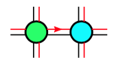

# Contraction of Grassmann Tensors: <br>Calculation Method

*Program implementation: `gtensor.tensordot`*

## Contraction of One Pair of Axis

Now we consider the contraction between two Grassmann tensors $\mathbf{A}(\theta) \mathbf{B}(\eta)$ of any pair of axes. 

Let $A$ have $r$ axes, and $B$ have $s$ axes. The contraction of the $a$th axis of $A$ and the $b$th axis of $B$ is defined as

$$
\begin{aligned}
    &[\mathbf{A} \mathbf{B}]_{i_1 ... \cancel{i_a} ... i_r, j_1 ... \cancel{j_b} ... j_s}^{m_1 ... \cancel{m_a} ... m_r, n_1 ... \cancel{n_b} ... n_s} 
    \\
    &\equiv \sum_{m_a,n_b} \sum_{i_a,j_b} 
    \int g_{\theta_a \eta_b} \delta_{i_a j_b}
    \mathbf{A}(\theta)_{i_1 ... i_r}^{m_1 ... m_r} 
    \mathbf{B}(\eta)_{j_1 ... j_s}^{n_1 ... n_s} 
    \\
    &= \sum_{m_a,n_b} \sum_{i_a,j_b} \int g_{\theta_a \eta_b} \delta_{i_a j_b}
    A_{i_1 ... i_r}^{m_1 ... m_r} 
    B_{j_1 ... j_s}^{n_1 ... n_s} 
    \theta_1^{m_1} ... \theta_r^{m_r} 
    \eta_1^{n_1} ... \eta_s^{n_s}
\end{aligned}
$$

The contracted axes should have the same dimension, i.e.

$$
\dim{i_a} = \dim{j_b}, \quad \forall m_a, n_b
$$

The factor $g$ is the Grassmann metric. In analogy, the Kronecker delta $\delta_{i_a j_b}$ can be regarded as the "metric" for contraction of the normal indices.

### Reorder the Grassmann Variables

Now we bring $\theta_a, \eta_b$ to the next of $g_{\theta_a \eta_b}$ for integration: 

$$
\begin{aligned}
    &[\mathbf{A} \mathbf{B}]_{i_1 ... \cancel{i_a} ... i_r, j_1 ... \cancel{j_b} ... j_s}^{m_1 ... \cancel{m_a} ... m_r, n_1 ... \cancel{n_b} ... n_s} 
    \\
    &= \sum_{m_a,n_b} \sum_{i_a,j_b} (-1)^{P(p(a,b) | \{m, n\})}
    \int g_{\theta_a \eta_b} \theta_a^{m_a} \eta_b^{n_b}
    \\
    &\quad \times \delta_{i_a j_b}
    A_{i_1 ... i_r}^{m_1 ... m_r} 
    B_{j_1 ... j_s}^{n_1 ... n_s} 
    \theta_1^{m_1} ... \cancel{\theta_a^{m_a}} ...\theta_r^{m_r} 
    \eta_1^{n_1} ... \cancel{\eta_b^{n_b}} ...\eta_s^{n_s}
\end{aligned}
$$

----

**Meaning of $P(p(a,b) | \{m, n\})$:**

- $p(a,b)$ denotes the permutation required to bring $\theta_a, \eta_b$ to the front of the sequence of Grassmann variables (in order to be integrated out with $g_{\theta_a \eta_b}$);
- During this process, only exchange with non-vanishing Grassmann variable (i.e. the corresponding Grassmann index = 1) will produce a minus sign; thus we only consider *the permutation restricted to nonzero Grassmann indices* (a **sub-permutation**, denoted by $p(a,b)|\{m,n\}$)
- The number $P(p(a,b) | \{m,n\})$ stands for the parity of this **sub-permutation**.

----

### Perform Grassmann Integration

The Grassmann integral can be evaluated to

$$
\int g_{\theta_a \eta_b} \theta_a^{m_a} \eta_b^{n_b} = (-1)^{m_a} \delta_{m_a n_b}
$$

*Proof*: (subscripts $a,b$ are omitted)

- When $m = n = 0$

$$
\begin{aligned}
    \int g_{\theta \eta} 
    &\equiv \int d\theta d\eta e^{-\theta \eta}
    = \int d\theta d\eta (1 - \theta \eta)
    \\
    &= \int d\theta d\eta (-\theta \eta)
    = \int d\theta d\eta (\eta \theta) = 1
\end{aligned}
$$

- When $m = n = 1$

$$
\begin{aligned}
    \int g_{\theta \eta} \theta \eta 
    &\equiv \int d\theta d\eta e^{-\theta \eta} \theta \eta 
    = \int d\theta d\eta (1 - \theta \eta) \theta \eta
    \\
    &= \int d\theta d\eta (\theta \eta)
    = \int d\theta d\eta (-\eta \theta) = -1
\end{aligned}
$$

- When $m = 0, n = 1$ (proof is similar when $m = 1, n = 0$)

$$
\begin{aligned}
    \int g_{\theta \eta} \eta 
    &\equiv \int d\theta d\eta e^{-\theta \eta} \eta 
    = \int d\theta d\eta (1 - \theta \eta) \eta
    \\
    &= \int d\theta d\eta (\eta)
    = \int d\theta (1) = 0  \qquad \blacksquare
\end{aligned}
$$

Therefore, we can finally write the contraction result as

$$
\begin{aligned}
    &[\mathbf{A} \mathbf{B}]_{i_1 ... \cancel{i_a} ... i_r, j_1 ... \cancel{j_b} ... j_s}^{m_1 ... \cancel{m_a} ... m_r, n_1 ... \cancel{n_b} ... n_s} 
    \\
    &= \sum_{m_a,n_b} \sum_{i_a,j_b} (-1)^{P(p(a,b) |\{m, n\})} (-1)^{m_a}
    \delta_{m_a n_b} \delta_{i_a j_b}
    \\ &\quad \times
    A_{i_1 ... i_r}^{m_1 ... m_r} 
    B_{j_1 ... j_s}^{n_1 ... n_s} 
    \theta_1^{m_1} ... \cancel{\theta_a^{m_a}} ...\theta_r^{m_r} 
    \eta_1^{n_1} ... \cancel{\eta_b^{n_b}} ...\eta_s^{n_s}
\end{aligned}
$$

### Contracting with $g_{\eta \theta}$

Instead of $g_{\theta \eta}$ in the definition of contraction above, we may also use $g_{\eta \theta}$. Then the Grassmann integral used in contraction is found to be

$$
\int g_{\eta \theta} \theta^m \eta^n \equiv 
\int d\eta d\theta e^{-\theta \eta} \theta^m \eta^n = \delta_{m n}
$$

without the $(-1)^m$ factor. We can then summarize the two cases as

$$
\begin{aligned}
    &[\mathbf{A} \mathbf{B}]_{i_1 ... \cancel{i_a} ... i_r, j_1 ... \cancel{j_b} ... j_s}^{m_1 ... \cancel{m_a} ... m_r, n_1 ... \cancel{n_b} ... n_s} 
    \\
    &= \sum_{m_a,n_b} \sum_{i_a,j_b} (-1)^{P(a,b; \{m, n\})} g_{ab}^{m_a}
    \delta_{m_a n_b} \delta_{i_a j_b}
    \\ &\quad \times
    A_{i_1 ... i_r}^{m_1 ... m_r} 
    B_{j_1 ... j_s}^{n_1 ... n_s} 
    \theta_1^{m_1} ... \cancel{\theta_a^{m_a}} ...\theta_r^{m_r} 
    \eta_1^{n_1} ... \cancel{\eta_b^{n_b}} ...\eta_s^{n_s}
\end{aligned}
$$

with

$$
g_{ab} = 
\begin{cases}
    -1, &\text{using } g_{\theta_a \eta_b}\\
    +1, &\text{using } g_{\eta_b \theta_a}
\end{cases}
$$

### Special Case: $a = r, b = 1$

The Kronecker delta in the formula of contraction enforces that $m_a = n_b$. Then we notice that $P(p(r,1) | \{m,n\}) = 1$ always holds when $m_r = n_1$, which makes it convenient to calculate the special case when the last axis of $A$ is contracted with the first axis of $B$:

$$
\begin{aligned}
    &[\mathbf{A} \mathbf{B}]_{i_1 ... i_{r-1}, j_2 ... j_s}^{m_1 ... m_{r-1}, n_2 ... n_s} \\
    &= \sum_{m,i} g_{r1}^{m}
    A_{i_1 ... i_{r-1}, i}^{m_1 ... m_{r-1}, m} 
    B_{i, j_2 ... j_s}^{m, n_2 ... n_s} 
    \theta_1^{m_1} ... \theta_{r-1}^{m_{r-1}} 
    \eta_2^{n_2} ... \eta_s^{n_s}
\end{aligned}
$$

Remark: the case $g_{r1}=1$ reduces to *ordinary tensor contraction*, which makes it easy to generalize *tensor decompositions* to Grassmann tensors. 

### Graphical Representation

<center>

  
*Graphical representation of Grassmann tensor contraction*

</center>

In the graphical representation, the contraction of two tensors $A, B$ is indicated by a *double*-line connecting two circles representing $A, B$, respectively: 

- The black line is contraction of normal indices

- The red line *with arrow* is contraction of Grassmann indices; the arrow represent which $g$ we are using:

  - When using $g_{a b} = +1$: arrow from $A$ to $B$
  - When using $g_{a b} = -1$: arrow from $B$ to $A$

The lines corresponding to free axes *does not carry arrows* (arrows on these axes have no definite meaning). 

## Contraction of Multiple Pairs of Axes

The generalization to contraction of multiple pairs of axes is straightforward. The contraction the $a,c,...$th axes of $A$ with the $b,d,...$th axes of $B$ is defined as

$$
\begin{aligned}
    &[\mathbf{A} \mathbf{B}]_{i_1 ... \cancel{i_a} ... \cancel{i_c} ... i_r, j_1... \cancel{j_b} ... \cancel{j_d} ... j_s}^{m_1 ... \cancel{m_a} ... \cancel{m_c} ... m_r, n_1 ... \cancel{n_b} ... \cancel{n_d} ... n_s}
    \\
    & \equiv
    \sum_{m_a,n_b} \sum_{m_c,n_d} \cdots 
    \sum_{i_a,j_b} \sum_{i_c,j_d} \cdots
    \\ &\quad 
    \int g_{\theta_a \eta_b} \delta_{i_a j_b} 
    \int g_{\theta_c \eta_d} \delta_{i_c j_d}\cdots
    \mathbf{A}(\theta)_{i_1 ... i_r}^{m_1 ... m_r} 
    \mathbf{B}(\eta)_{j_1 ... j_s}^{n_1 ... n_s} 
    \\
    &= \sum_{m_a,n_b} \sum_{m_c,n_d} \cdots 
    \sum_{i_a,j_b} \sum_{i_c,j_d} \cdots
    (-1)^{P(p(a,b,c,d,...) | \{m, n\})}
    \\ &\quad \times
    \int g_{...} \theta_a^{m_a} \eta_b^{n_b}
    \int g_{...} \theta_c^{m_c} \eta_d^{n_d} \cdots
    \delta_{i_a j_b} \delta_{i_c j_d} \cdots
    A_{i_1 ... i_r}^{m_1 ... m_r} 
    B_{j_1 ... j_s}^{n_1 ... n_s} 
    \\ &\quad \times
    \theta_1^{m_1} \cdots \cancel{\theta_a^{m_a}} \cdots \cancel{\theta_c^{m_c}} \cdots \theta_r^{m_r} 
    \eta_1^{n_1} \cdots \cancel{\eta_b^{n_b}} \cdots \cancel{\eta_d^{m_d}} \cdots \eta_s^{n_s}
    \\
    &= \sum_{m_a,n_b} \sum_{m_c,n_d} \cdots \sum_{i_a,j_b} \sum_{i_c,j_d} \cdots
    (-1)^{P(p(a,b,c,d,...) | \{m, n\})} 
    \\ &\quad \times
    g_{ab}^{m_a} g_{cd}^{m_c} \cdots
    \delta_{m_a n_b} \delta_{m_c n_d} \cdots
    \delta_{i_a j_b} \delta_{i_c j_d} \cdots
    A_{i_1 ... i_r}^{m_1 ... m_r} 
    B_{j_1 ... j_s}^{n_1 ... n_s} 
    \\ &\quad \times
    \theta_1^{m_1} \cdots \cancel{\theta_a^{m_a}} \cdots \cancel{\theta_c^{m_c}} \cdots \theta_r^{m_r} 
    \eta_1^{n_1} \cdots \cancel{\eta_b^{n_b}} \cdots \cancel{\eta_d^{m_d}} \cdots \eta_s^{n_s}
\end{aligned}
$$

Notes about notation: 

- In the Grassmann integrals, the metric $g_{...}$ is either $g_{\theta \eta}$ or $g_{\eta \theta}$; after integration, they become $g_{ab}, g_{cd}, ... = \pm 1$;
- $p(a,b,c,d,...)$ is the permutation to bring $\theta_a^{m_a} \eta_b^{n_b} \theta_c^{m_c} \eta_d^{n_d} \cdots$ to the front of the sequence $\theta_1^{m_1} \cdots \theta_r^{m_r} \eta_1^{n_1} \cdots \eta_s^{n_s}$. Again, we only consider the parity of $p$ restricted to Grassmann numbers with nonzero Grassmann index (denoted $p(a,b,c,d,...)|\{m,n\}$). 

Since the Grassmann metric only contains the product *two* Grassmann variables, they commute with each other. Thus, the contraction order (i.e. which pair is to be contracted first, second, etc.) does not affect the result. 

### Parity of Contraction Result

Let the parity of $A, B$ be $P(A), P(B)$ respectively, then

$$
\begin{aligned}
    &P(A B) 
    \equiv \left[ 
        \sum_{k \ne a,c,...} m_k + \sum_{l \ne b,d,...} n_l
    \right] \pmod{2} \\
    &= [P(A) + P(B) - (m_a+n_b) - (m_c+n_d) - \cdots] \pmod{2}
\end{aligned}
$$

But in the formula of contraction, the Kronecker deltas enforce $m_a=n_b, m_c=n_d$, etc. Thus $m_a+n_b, m_c+n_d, \cdots = 0, 2$, and

$$ P(A B) = P(A) + P(B) $$

regardless of the choice of the Grassmann metric. 

### Transpose to Simplify Contraction

In order to get rid of the $(-1)^P$ factor in the contraction formula, we can first **transpose** both tensors, so that the pairs of axes to be contracted will be put at a more convenient position. 

----

#### **Transposition of Grassmann Tensors**

*Program implementation: `gtensor.transpose`*

Let $p \equiv (a,b,...)$ be a permutation of axes of a tensor $\mathbf{T}(\theta)$. The transposed tensor $\mathbf{T}^\prime$ are related to the old tensor $\mathbf{T}$ by

$$
\mathbf{T}^\prime (\theta)_{i_a i_b ...}^{n_a n_b ...}
=
\mathbf{T}(\theta)_{i_1 i_2 ...}^{n_1 n_2 ...}
$$

i.e.

$$
{(T^\prime)}_{i_a i_b ...}^{n_a n_b ...} \theta_a^{n_a} \theta_b^{n_b} \cdots
=
T_{i_1 i_2 ...}^{n_1 n_2 ...} \theta_1^{n_1} \theta_2^{n_2} \cdots
$$

Note that due to the anti-commutativity of Grassmann numbers, the tensor elements $T$ may acquire sign changes:

$$
{(T^\prime)}_{i_a i_b ...}^{n_a n_b ...} 
=
(-1)^{P(p | \{n\})} T_{i_1 i_2 ...}^{n_1 n_2 ...}
$$

where $P(p | \{n\})$ is the parity of the sub-permutation of nonzero Grassmann indices $\{n\}$. 

To improve program efficiency, the $(-1)^P$ signs are stored in the member `_gSign` of the class `GTensor`, which can be absorbed into the `_blocks` using the method `absorb_sign` if needed.

----

The various Kronecker deltas enforce that $m_a = n_b, m_c = n_d, ...$ (suppose there are $q$ such pairs). Under this constrain, we can show that (recall that $A$ has $r$ axes, and $B$ has $s$ axes)

$$
P(p(r,1; r-1,2; ...; r-q+1, q) \mid \{m, n\}) = 1
$$

always holds. Thus we can:

- In $A$, transpose axes $a,c,...$ to position $r,r-1,...,r-q+1$
- In $B$, transpose axes $b,d,...$ to position $1,2,...,q$

and then apply the result

$$
\begin{aligned}
    &[\mathbf{A} \mathbf{B}]_{i_1 ... i_{r-q}, j_{q+1} ... j_s}^{m_1 ... m_{r-q}, n_{q+1} ... n_s}
    \\
    &= \sum_{m_r,n_1} \cdots \sum_{m_{r-q+1},n_q} 
    \sum_{i_r,j_1} \cdots \sum_{i_{r-q+1},j_q} 
    g_{r,1}^{n_1} g_{r-1,2}^{n_2} \cdots g_{r-q+1,q}^{n_q}
    \\ &\quad \times
    \delta_{m_r,n_1} \delta_{m_{r-1},n_2} \cdots \delta_{m_{r-q+1},n_q} 
    \delta_{i_r,j_1} \delta_{i_{r-1},j_2} \cdots \delta_{i_{r-q+1},j_q} 
    \\ &\quad \times
    A_{i_1 ... i_r}^{m_1 ... m_r} 
    B_{j_1 ... j_s}^{n_1 ... n_s} 
    \theta_1^{m_1} ... \theta_{r-q}^{m_{r-q}} 
    \eta_{q+1}^{n_{q+1}} ...\eta_s^{n_s}
    \\
    &= \sum_{n_1, ..., n_q} \sum_{j_1, ..., j_q}
    g_{r,1}^{n_1} g_{r-1,2}^{n_2} \cdots g_{r-q+1,q}^{n_q}
    \\ &\quad \times
    A_{i_1 ... i_{r-q}, j_q ... j_1}^{m_1 ... m_{r-q}, n_q ... n_1} 
    B_{j_1 ... j_q, j_{q+1} ... j_s}^{n_1 ... n_q, n_{q+1} ... n_s} 
    \theta_1^{m_1} ... \theta_{r-q}^{m_{r-q}} 
    \eta_{q+1}^{n_{q+1}} ...\eta_s^{n_s}
\end{aligned}
$$

### Merge Axes to be Contracted

*Program implementation: `gtensor.merge_axes`*

To calculate the contraction of pairs of consecutive axes, if the Grassmann metrics are the *same* for all pairs, we can **merge** those axes to be contracted. The contraction is reduced to contraction over this single pair of axes, using the *same* Grassmann metric. 

The first $q$ axes of $B$ to be contracted can be [merged as usual](axis_merging.md), and we obtain

$$
B_{j_1 ... j_q, j_{q+1} ... j_s}^{n_1 ... n_q, n_{q+1} ... n_s} 
\rightarrow
B_{J, j_{q+1} ... j_s}^{N, n_{q+1} ... n_s} 
$$

However, the last $q$ axes to be contracted in $A$ are in *reversed order* compared to that in $B$. To overcome this difficulty, we just merge these axes in reversed order (enabled by the option `order = -1` for the corresponding group of axes). 

## Change Grassmann Metric

*Program Implementation: `gtensor.flip_gSign`*

If the Grassmann metrics are not the same for all pairs of axes to be contracted (e.g. the situation shown below), we cannot merge these axes directly: we should first modify the tensors so that the metrics can then be the same. 

```


```

In the contraction

$$
\begin{aligned}
    &[\mathbf{A} \mathbf{B}]_{i_1 ... \cancel{i_a} ... \cancel{i_c} ... i_r, j_1... \cancel{j_b} ... \cancel{j_d} ... j_s}^{m_1 ... \cancel{m_a} ... \cancel{m_c} ... m_r, n_1 ... \cancel{n_b} ... \cancel{n_d} ... n_s}
    \\
    &= \sum_{m_a,n_b} \cdots \sum_{i_a,j_b} \cdots
    (-1)^{P(p(a,b,c,d,...) | \{m, n\})} 
    \\ &\quad \times
    g_{ab}^{m_a} g_{cd}^{m_c} \cdots
    \delta_{m_a n_b} \cdots
    \delta_{i_a j_b} \cdots
    A_{i_1 ... i_r}^{m_1 ... m_r} 
    B_{j_1 ... j_s}^{n_1 ... n_s} 
    \\ &\quad \times
    \theta_1^{m_1} \cdots \cancel{\theta_a^{m_a}} \cdots \cancel{\theta_c^{m_c}} \cdots \theta_r^{m_r} 
    \eta_1^{n_1} \cdots \cancel{\eta_b^{n_b}} \cdots \cancel{\eta_d^{m_d}} \cdots \eta_s^{n_s}
\end{aligned}
$$

if we want to change $g_{ab}$ to $-g_{ab}$, we can cancel the extra minus signs by modifying (say) $A$ to (the string of Grassmann variables is unchanged)

$$
\tilde{A}_{i_1 ... i_r}^{m_1 ... m_r}
\equiv (-1)^{m_a}
A_{i_1 ... i_r}^{m_1 ... m_r}
$$

then

$$
\begin{aligned}
    &[\mathbf{A} \mathbf{B}]_{i_1 ... \cancel{i_a} ... \cancel{i_c} ... i_r, j_1... \cancel{j_b} ... \cancel{j_d} ... j_s}^{m_1 ... \cancel{m_a} ... \cancel{m_c} ... m_r, n_1 ... \cancel{n_b} ... \cancel{n_d} ... n_s}
    \\
    &= \sum_{m_a,n_b} \cdots \sum_{i_a,j_b} \cdots
    (-1)^{P(p(a,b,c,d,...) | \{m, n\})} 
    \\ &\quad \times
    (-g_{ab})^{m_a} g_{cd}^{m_c} \cdots
    \delta_{m_a n_b} \cdots
    \delta_{i_a j_b} \cdots
    \tilde{A}_{i_1 ... i_r}^{m_1 ... m_r} 
    B_{j_1 ... j_s}^{n_1 ... n_s} 
    \\ &\quad \times
    \theta_1^{m_1} \cdots \cancel{\theta_a^{m_a}} \cdots \cancel{\theta_c^{m_c}} \cdots \theta_r^{m_r} 
    \eta_1^{n_1} \cdots \cancel{\eta_b^{n_b}} \cdots \cancel{\eta_d^{m_d}} \cdots \eta_s^{n_s}
\end{aligned}
$$

In general, if we want to change the Grassmann metric corresponding to the contraction involving axes $a,b,...$ of a tensor $\mathbf{T}$, we modify it to

$$
\mathbf{\tilde{T}}_{i_1 ... i_r}^{n_1 ... n_r}
\equiv (-1)^{n_a + n_b + ...} 
\mathbf{T}_{i_1 ... i_r}^{n_1 ... n_r}
$$

----

#### **Technical details**

To improve efficiency, we do not directly change the whole `_blocks`, but storing the $(-1)$ factors in the class member `_gSign`; the minus sign is absorbed into the `_blocks` only when needed.

By definition, the following lines of code (contraction of the `i`th axis of tensor `A` and the `j`th axis of tensor `B`) are equivalent:

```python    
# g = +1 or -1
C = gt.tensordot(A, B, (i, j, g))
C = gt.tensordot(A.flip_gSign(i), B, (i, j, -g))
C = gt.tensordot(A, B.flip_gSign(j), (i, j, -g))
C = gt.tensordot(A.flip_gSign(i), B.flip_gSign(j), (i, j, g))
```

#### Default Choice of Grassmann Metric

In the operation of flipping the Grassmann sign

$$
\mathbf{\tilde{T}}_{i_1 ... i_r}^{n_1 ... n_r}
\equiv (-1)^{n_a + n_b + ...} 
\mathbf{T}_{i_1 ... i_r}^{n_1 ... n_r}
$$

the choice of $\mathbf{T}$ is a little bit arbitrary (we can equally treat $\mathbf{\tilde{T}}$ as the "reference tensor"). To keep track with the change, we shall pick a **default choice** of the reference tensor $\mathbf{T}$. 

----
