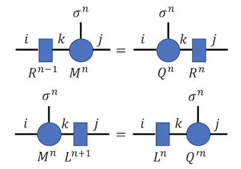
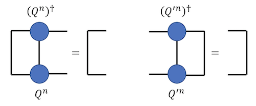
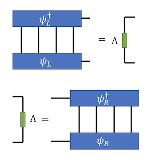
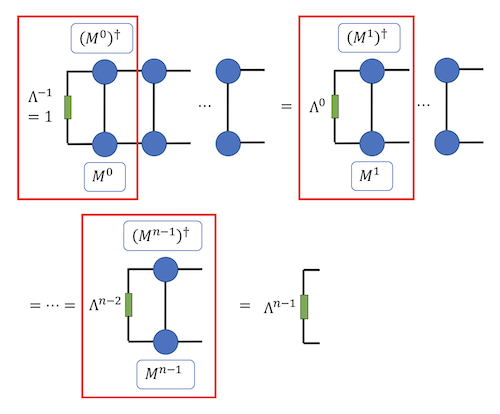
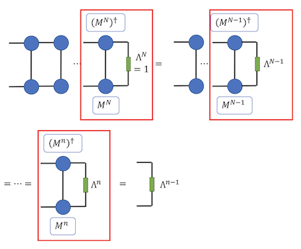

<style>
    .katex {
        font-size: 1.1em;
    }
</style>

# Canonical Form of Matrix Product State

**General Form of Matrix Product State (MPS):**

(*We start counting from 0, i.e. using the computer convention*)

- Open boundary condition (OBC, with $N+1$ sites)

    ```
        (physical index)
        σ0      σ1      σ2          σN
        |       |       |           |
        M0------M1------M2---....---MN
            a0      a1     a2    a[N-1]
            (virtual link)
    ```

    $$
    |\psi \rangle
    = \sum_{\{\sigma\}} \sum_{a_1, ...}
    M_{a_0}^{0,\sigma_0}
    M_{a_0 a_1}^{1, \sigma_1} \cdots
    M_{a_{N-1}}^{N, \sigma_N}
    | \sigma_0 ... \sigma_N \rangle
    $$

- Periodic boundary condition (PBC, with period of $N+1$ sites)
    
    ```
            σ0      σ1      σ2          σN
        aN  |       |       |           |   aN
        |---M0------M1------M2---....---MN---|
        |       a0      a1     a2    a[N-1]  |
        |------------------------------------|
    ```

    $$
    |\psi \rangle
    = \sum_{\{\sigma\}} \sum_{a_1, ...}
    M_{a_N a_0}^{0,\sigma_0}
    M_{a_0 a_1}^{1, \sigma_1} \cdots
    M_{a_{N-1} a_N}^{N, \sigma_N}
    | \sigma_0 ... \sigma_N \rangle
    $$

    The OBC-MPS is *mathematically equal* to an PBC-MPS with $\dim a_N = 1$. 

## The Canonical Form

### Projectors for Open Boundary MPS

We first consider an OBC-MPS, and construct objects called the **projectors** on each virtual link in the MPS. 

First, starting from the formal definitions

$$
R^{-1} = 1, \quad L^{N+1} = 1
$$

we to obtain $R^0, ..., R^{N}$ and $L^N, ..., L^0$ by successive QR and LQ decompositions

<center>

   
*The QR and LQ decomposition*

</center>

$$
\begin{aligned}
    R^{n-1}_{ik} M^{n,\sigma_n}_{kj}
    = C^{n,\sigma_n}_{ij}
    \to C^n_{(i \sigma_n)j}
    = Q^n_{(i \sigma_n)k} R^n_{kj}
    &\to
    Q^{n,\sigma_n}_{ik} R^n_{kj}
    \\
    M^{n,\sigma_n}_{ik} L^{n+1}_{kj}
    = C'^{n,\sigma_n}_{ij}
    \to C'^n_{i, (\sigma_n j)}
    = L^n_{ik} Q'^n_{k (\sigma_n j)}
    &\to
    L^n_{ik} Q'^{n,\sigma_n}_{kj}
\end{aligned}
$$

Or using the shorthand (omitting the physical index and use matrix notation)

$$
R^{n-1} M^n = Q^n R^n \qquad
M^n L^{n+1} = L^n Q'^n \quad
(n = 0,...,N)
$$

Thus the matrix $R^n$ (or $L^n$) is placed to the **R**ight (or **L**eft) of the $n$th site. The matrices (in general not square) $Q, Q'$ are **unitary** in the sense that the following contractions gives *identity*:

<center>

   
*Unitarity of $Q, Q'$ tensors*

</center>

Example: $N = 3$

- QR: Starting from $R^{-1} = 1$, find $R^0,R^1,R^2$ successively

    ```
            |        |        |        |
    --R[-1]-0---R0---1---R1---2---R2---3--R3----
    ```

- LQ: Starting from $L^0 = 1$, find $L^3,L^2,L^1$ successively

    ```
            |        |        |        |
    ---L0---0---L1---1---L2---2---L3---3---L4---
    ```


After obtaining all the $R, L$ matrices, at the link connecting $M^n$ and $M^{n+1}$, we perform SVD on $R^n L^{n+1}$:

```
        |                   |
    ..--n---R[n]---L[n+1]---n+1--..
            |_____________|
                 ↓ svd
                u * s * vh
```

$$
R^n L^{n+1} = U^n \Lambda^n (V^n)^\dagger
\quad (n = -1,...,N)
$$

where $\Lambda^n$ is the diagonal matrix of singular value spectrum. Since $R^n L^{n+1}$ is a square matrix, $U, V$ are well-defined unitary matrices, i.e.

$$
U^\dagger = U^{-1}, \quad V^\dagger = V^{-1}
$$

Then in the link between $M^n, M^{n+1}$, we insert an identity:

$$
(R^n)^{-1} R^n L^{n+1} (L^{n+1})^{-1}
= (R^n)^{-1} U^n \Lambda^n (V^\dagger)^n (L^{n+1})^{-1}
$$

from which we define the "projectors" $P_a, P_b$:

```
        |                     |
    ..--n---A[n])---(B[n+1]---n+1--..
```

$$
\begin{aligned}
    P_a^n &= (R^n)^{-1} U^n \sqrt{\Lambda^n}
    \\
    P_b^{n+1} &= \sqrt{\Lambda^n} (V^\dagger)^n (L^{n+1})^{-1}
\end{aligned}
$$

To avoid calculation of inverse matrix, we use

$$
(R^n L^{n+1})^{-1} = (L^{n+1})^{-1} (R^n)^{-1} 
= V^n \frac{1}{\Lambda^n} (U^n)^\dagger
\\ \Rightarrow 
\left\{ \begin{aligned}
    (R^n)^{-1} &= L^{n+1} V^n \frac{1}{\Lambda^n} (U^n)^\dagger
    \\
    (L^{n+1})^{-1} &= V^n \frac{1}{\Lambda^n} (U^n)^\dagger R^n
\end{aligned}
\right.
$$

Finally,

$$
\begin{aligned}
    P_a^n &= L^{n+1} V^n \frac{1}{\sqrt{\Lambda^n}}
    \\
    P_b^{n+1} &= \frac{1}{\sqrt{\Lambda^n}} (U^n)^\dagger R^n
\end{aligned}
$$

and we combine them with the original $M^n$:

$$
M^{n,\sigma_n} \to 
\tilde{M}^{n, \sigma_n} = P_b^n M^{n,\sigma_n} P_a^n 
$$

### The Canonical Form

The new matrices $\tilde{M}^{n, \sigma_n}$ can be expressed in terms of the unitary matrices $U, V, Q, Q'$ and the singular value spectrum $\Lambda$: (in the following derivation, we omit the physical index $\sigma_n$; it is clear which matrix it belongs to)

$$
\begin{aligned}
    \tilde{M}^n 
    &= P_b^n M^n P_a^n
    \\
    &= \frac{1}{\sqrt{\Lambda^{n-1}}} (U^{n-1})^\dagger 
    \underbrace{R^{n-1} M^n}_{Q^n R^n}
    L^{n+1} V^n \frac{1}{\sqrt{\Lambda^n}}
    \\
    &= \frac{1}{\sqrt{\Lambda^{n-1}}} (U^{n-1})^\dagger Q^n 
    \underbrace{R^n L^{n+1}}_{U^n \Lambda^n (V^n)^\dagger}
    V^n \frac{1}{\sqrt{\Lambda^n}}
    \\
    &= \frac{1}{\sqrt{\Lambda^{n-1}}} (U^{n-1})^\dagger Q^n 
    U^n \Lambda^n 
    \underbrace{(V^n)^\dagger V^n}_{\text{identity}}
    \frac{1}{\sqrt{\Lambda^n}}
    \\
    &= \frac{1}{\sqrt{\Lambda^{n-1}}} (U^{n-1})^\dagger Q^n 
    U^n \sqrt{\Lambda^n}
\end{aligned}
$$

Similarly

$$
\begin{aligned}
    \tilde{M}^n 
    &= P_b^n M^n P_a^n
    \\
    &= \frac{1}{\sqrt{\Lambda^{n-1}}} (U^{n-1})^\dagger R^{n-1} 
    \underbrace{M^n L^{n+1}}_{L^n Q'^n}
    V^n \frac{1}{\sqrt{\Lambda^n}}
    \\
    &= \frac{1}{\sqrt{\Lambda^{n-1}}} (U^{n-1})^\dagger 
    \underbrace{R^{n-1} L^n}_{U^{n-1} \Lambda^{n-1} (V^{n-1})^\dagger}
    Q'^n V^n \frac{1}{\sqrt{\Lambda^n}}
    \\
    &= \frac{1}{\sqrt{\Lambda^{n-1}}} 
    \underbrace{(U^{n-1})^\dagger U^{n-1}}_{\text{identity}}
    \Lambda^{n-1} (V^{n-1})^\dagger
    Q'^n V^n \frac{1}{\sqrt{\Lambda^n}}
    \\
    &= \sqrt{\Lambda^{n-1}} (V^{n-1})^\dagger
    Q'^n V^n \frac{1}{\sqrt{\Lambda^n}}
\end{aligned}
$$

Then we discover that $\tilde{M}$'s satisfy the so-called left and right **canonical conditions**:

- Left canonical condition:

    <center>

    

    </center>

    $$
    \sum_{k,\sigma_n} \tilde{M}_{ki}^{n,\sigma_n} \Lambda^{n-1}_k (\tilde{M}^{n,\sigma_n}_{kj})^*
    = \delta_{ij} \Lambda^n_i
    \quad
    (n=0,...,N; \, \Lambda^{-1} = 1)
    $$

- Right canonical condition:
    
    <center>

    

    </center>

    $$
    \sum_{k,\sigma_n} \tilde{M}_{ik}^{n,\sigma_n} \Lambda^{n}_k (\tilde{M}^{n,\sigma_n}_{jk})^*
    = \delta_{ij} \Lambda^{n-1}_i 
    \quad
    (n=0,...,N; \, \Lambda^N = 1)
    $$

If the matrices $M$ in an MPS satisfy the canonical conditions, we say that the MPS is in the **canonical form**. 

### Infinite MPS and PBC-MPS

An infinite MPS invariant under $(N+1)$-site translation (iMPS) or a PBC-MPS has the property that

$$
M^n = M^{n+N+1} \qquad \forall \, n \in \mathbb{Z}
$$

The canonical conditions are the same as an open boundary MPS. However, due to periodicity, the matrix $R^{-1}$ will be identified with $R^N$, and $L^{N+1}$ with $L^0$. Therefore, in order to obtain the matrices $R,L$ for projector construction, we need to perform QR and LQ decomposition over the MPS iteratively until convergence is reached. 

Example: $N = 3$

```
            |        |        |        |
    |--(R3)-0---R0---1---R1---2---R2---3--R3---|
    |__________________________________________|

            |        |        |        |
    |---L0--0---L1---1---L2---2---L3---3-(L0)--|
    |__________________________________________|
```

## Truncation of Bond Dimension

### Direct Truncation of Singular Value Spectrum

Suppose that we want to approximate the MPS with another one which has the same virtual link dimension except the link between the $(n-1)$th and the $n$th matrix. This is similar to the problem of [low-rank approximation of matrices](https://en.wikipedia.org/wiki/Singular_value_decomposition#Low-rank_matrix_approximation), which is done by SVD.

We perform SVD at the link to be approximated:

$$
\begin{aligned}
    \psi^{(\sigma_0,...,\sigma_{n-1})(\sigma_n,...,\sigma_N)}
    &= \sum_{i} (U)^{\sigma_0,...,\sigma_{n-1}}_i
    \Lambda_i
    (V^\dagger)^{\sigma_n,...,\sigma_N}_i
    \\
    &= \sum_{i} (\psi_L)^{\sigma_0,...,\sigma_{n-1}}_i
    (\psi_R)^{\sigma_n,...,\sigma_N}_i
\end{aligned}
$$

Here we absorbed the spectrum $\Lambda$ into the left and right parts of the MPS:

$$
\psi_L = U \sqrt{\Lambda}, \quad
\psi_R = \sqrt{\Lambda} V^\dagger
$$

Due to the unitary properties of $U, V^\dagger$, we know that $\psi_L, \psi_R$ satisfy the conditions

<center>

   
*In this figure $N=7, n=4$*

</center>

The number of nonzero singular values is the dimension of the original MPS. To approximate, simply keep the largest several singular values. This minimizes the Frobenius norm of the difference between the original MPS and the approximated MPS (the cost function). 

<center>

   
*The cost function for single link approximation by SVD*   
*(Thicker line means larger link dimension; $D' > D$)*

</center>

The truncation is made easy if we use the canonical form of the MPS: due to the canonical conditions, we discover that

<center>





</center>

Therefore, **the singular value spectrum $\Lambda$ obtained from SVD of the whole MPS at link between $M^{n-1}$ and $M^n$, is the same as the spectrum $\Lambda^{n-1}$ obtained from SVD of $R^{n-1} L^n$**. Then, truncation can be directly performed during the SVD to obtain the the projectors on that link.

We can proceed for all links to obtain further (although not optimal) approximations, corresponding the the cost function as the sum of Frobenius norms of the difference between the original MPS and another one which *only one virtual link* approximated.

### Iterative Approach

We may use a better, more *global* cost function, i.e. the Frobenius norm of the original MPS and another one with *all* virtual links approximated. This applies to iMPS and PBC-MPS as well. 

<center>

   
*The cost function for iterative approximation*   

</center>

We minimize this cost function *iteratively*: 

- First minimize it with respect to $M^{0}$: it turns out we can obtain the optimal $M^{0}$ by solving the following linear equation

    <center>

       
    *Obtaining optimal $M^{i}$; in this figure $i=2$ (the circled site)*

    </center>

- After obtaining $M^{0}$, we do the same for $M^{1}, M^{2}, ...$ over and over again until the cost function converges to an acceptable small value (absolute error $10^{-5}$ or smaller seems to be good enough; can be $10^{-8}$ to $10^{-10}$ for some simple models such as Ising model)