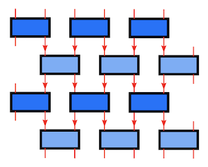

# Trotter Gate: <br>Fermion Models without Spin

## Basis States

For models without spin, the choice of basis states on each site is very simple: they are just the empty state $|0_i\rangle$ and the filled state $|1_i\rangle$. The completeness relation is

$$
|0_i\rangle \langle 0_i|
+ |1_i\rangle \langle 1_i| = 1_i
$$

If we use the coherent state

$$
\begin{aligned}
    |\eta_i\rangle &\equiv 
    (1 - \eta_i c_i^\dagger) |0\rangle
    = |0_i\rangle - \eta_i |1_i\rangle
    \\
    \langle \eta_i| &\equiv
    \langle 0|(1 - c_i \bar{\eta}_i)
    = \langle 0_i| - \langle 1_i | \bar{\eta}_i
\end{aligned}
$$

we have the (over-)completeness relation (resolution of identity)

$$
\int d \bar{\eta}_i d \eta_i \, 
e^{- \bar{\eta}_i \eta_i}
|\eta_i\rangle \langle \eta_i| 
= 
\int g_{\bar{\eta}_i \eta_i}
|\eta_i\rangle \langle \eta_i| 
= 1_i
$$

where the factor $g$ is the **Grassmann metric**, defined as

$$
g_{\theta \eta} \equiv d\theta d\eta e^{-\theta \eta}
$$

where $\theta, \eta$ are two Grassmann numbers. Since any power higher than 1 of a Grassmann number vanishes, the exponential $e^{-\theta \eta}$ is in fact the same as $1 - \theta \eta$. 

*Proof*:

$$
\begin{aligned}
    \text{LHS} &=
    \int d \bar{\eta}_i d \eta_i \, 
    (1 - \bar{\eta}_i \eta_i) \\ & \qquad
    (
        |0_i\rangle \langle 0_i|
        - \eta_i |1_i\rangle \langle 0_i|
        - |0_i\rangle \langle 1_i| \bar{\eta}_i
        + \eta_i |1_i\rangle \langle 1_i| \bar{\eta}_i
    )
    \\ &=
    \int d \bar{\eta}_i d \eta_i \,
    (
        \eta_i |1_i\rangle \langle 1_i| \bar{\eta}_i
        - \bar{\eta}_i \eta_i |0_i\rangle \langle 0_i|
    )
    \\ &=
    \int d \bar{\eta}_i d \eta_i \,
    (
        \eta_i \bar{\eta}_i |1_i\rangle \langle 1_i| 
        + \eta_i \bar{\eta}_i |0_i\rangle \langle 0_i|
    )
    \\ &=
    |0_i\rangle \langle 0_i|
    + |1_i\rangle \langle 1_i| = \text{RHS}
    \qquad \blacksquare
\end{aligned}
$$

## Imaginary Time Evolution and Trotter Gate

Now we consider (1+1)d systems (using PBC) whose Hamiltonian consists of nearest-neighbor interactions only:

$$
H = \sum_i H_{i, i+1}
$$

The propagator of imaginary time evolution is

$$
\langle \eta^\prime | e^{-\beta H} | \eta \rangle
$$

where we used the shorthand (suppose there are $N$ sites in the system)

$$
| \eta \rangle \equiv 
| \eta_1, ..., \eta_N \rangle, \quad
\langle \eta^\prime | \equiv
\langle \eta_1^\prime, ..., \eta_N^\prime|
$$

The resolution of identity on this $N$-site system can be directly generalized from the single-site relation

$$
\int g_{\bar{\eta} \eta}
|\eta\rangle \langle \eta| 
= 1, \quad
g_{\bar{\eta} \eta} \equiv
\prod_{i} g_{\bar{\eta}_i \eta_i}
$$

Now we can insert $(M-1)$ identities to separate the evolution into $M$ (a large number) slices, each corresponding to evolution by imaginary time $\epsilon \equiv \beta / M$:

$$
\begin{aligned}
    &\langle \eta^\prime | e^{-\beta H} | \eta \rangle
    =
    \langle \eta^\prime | 
    e^{-\epsilon H} 1 e^{-\epsilon H} 1 ... 1 e^{-\epsilon H}
    | \eta \rangle
    \\
    &= 
    \int 
    \langle \eta^M | e^{-\epsilon H} | \eta^{M-1} \rangle
    g_{\bar{\eta}^{M-1} \eta^{M-1}} \cdots 
    \\ & \qquad \qquad \cdots
    g_{\bar{\eta}^2 \eta^2}
    \langle \eta^2 | e^{-\epsilon H} | \eta^1 \rangle
    g_{\bar{\eta}^1 \eta^1}
    \langle \eta^1 | e^{-\epsilon H} | \eta^0 \rangle
\end{aligned}
$$

where $|\eta^k\rangle$ is the state after $k$ evolution layers, and $\eta^0 \equiv \eta, \eta^M \equiv \eta^\prime$. 

Each layer of evolution can further be separated to 

$$
\begin{aligned}
    &\langle \eta^{l+1} | e^{-\epsilon H} | \eta^{l} \rangle 
    =
    \langle \eta^{l+1} | e^{-\epsilon (H_e+H_o)} | \eta^{l} \rangle 
    \\ &\xrightarrow[\text{decomposition}]{\text{Trotter}}
    \langle \eta^{l+1} | e^{-\epsilon H_e} e^{-\epsilon H_o} | \eta^{l} \rangle 
    \\ &\xrightarrow[\text{relabel layers}]{\text{insert identity}}
    \int
    \langle \eta^{2k+2} | e^{-\epsilon H_e} | \eta^{2k+1} \rangle
    g_{\bar{\eta}^{2k+1} \eta^{2k+1}}
    \langle \eta^{2k+1}|e^{-\epsilon H_o} | \eta^{2k} \rangle 
\end{aligned}
$$

where

$$
H_e = \sum_{i \text{ even}} H_{i, i+1}, \quad
H_o = \sum_{i \text{ odd}} H_{i, i+1}
$$

Then each layer of evolution involves $H_e$ or $H_o$ only. The terms in $H_e$ (or $H_o$) obviously commute, then we can proceed further and write

$$
\begin{aligned}
    \langle \eta^{n+1} | e^{-\epsilon H_e} | \eta^{n} \rangle
    &= \prod_{i \text{ even}}
    \langle \eta_{i}^{n+1} \eta_{i+1}^{n+1} | 
    e^{-\epsilon H_{i, i+1}} | 
    \eta_{i}^{n} \eta_{i+1}^{n} \rangle
    \\
    \langle \eta^{n+1} | e^{-\epsilon H_o} | \eta^{n} \rangle
    &= \prod_{i \text{ odd}}
    \langle \eta_{i}^{n+1} \eta_{i+1}^{n+1} | 
    e^{-\epsilon H_{i, i+1}} | 
    \eta_{i}^{n} \eta_{i+1}^{n} \rangle
\end{aligned}
$$

Now we obtain the most basic element in the propagator - the tensor element of the two-site **Trotter gate** evolving from state $|\eta\rangle$ to state $|\theta\rangle$:

$$
\langle \theta_i \theta_{i+1} | 
e^{-\epsilon H_{i, i+1}} | 
\eta_i \eta_{i+1} \rangle
$$

Finally the complete decomposition of the propagator into the Trotter gates is (let $\mathcal{M} = 2M$)

$$
\begin{aligned}
    &\langle \eta^\prime | e^{-\beta H} | \eta \rangle
    \\ 
    &= \int
    \left( 
        \prod_{i \text{ even}}
        \langle \eta_{i}^{\mathcal{M}} \eta_{i+1}^{\mathcal{M}} | 
        e^{-\epsilon H_{i, i+1}} | 
        \eta_{i}^{\mathcal{M}-1} \eta_{i+1}^{\mathcal{M}-1} \rangle
    \right)
    g_{\bar{\eta}^{\mathcal{M}-1} \eta^{\mathcal{M}-1}}
    \\ & \qquad \quad
    \left( 
        \prod_{i \text{ odd}}
        \langle \eta_{i}^{\mathcal{M}-1} \eta_{i+1}^{\mathcal{M}-1} | 
        e^{-\epsilon H_{i, i+1}} | 
        \eta_{i}^{\mathcal{M}-2} \eta_{i+1}^{\mathcal{M}-2} \rangle
    \right)
    g_{\bar{\eta}^{\mathcal{M}-2} \eta^{\mathcal{M}-2}}
    \cdots 
    \\ & \qquad \cdots 
    \left( 
        \prod_{i \text{ even}}
        \langle \eta_{i}^{2} \eta_{i+1}^{2} | 
        e^{-\epsilon H_{i, i+1}} | 
        \eta_{i}^{1} \eta_{i+1}^{1} \rangle
    \right)
    g_{\bar{\eta}^1 \eta^1}
    \\ & \qquad \qquad
    \left( 
        \prod_{i \text{ odd}}
        \langle \eta_{i}^{1} \eta_{i+1}^{1} | 
        e^{-\epsilon H_{i, i+1}} | 
        \eta_{i}^{0} \eta_{i+1}^{0} \rangle
    \right)
    \\
\end{aligned}
$$

Graphically:

<center>

   
*Trotter gate network of spinless fermion systems <br>with only nearest-neighbor interactions*

</center>

*Remark*:   
The Trotter gate can be obtained from the Hamiltonian gate

$$
\langle \theta_i \theta_{i+1} | H_{i,i+1} | \eta_i \eta_{i+1} \rangle
$$

via direct exponentiation (first diagonalize, then exponentiate). 

## Tensor Elements of Trotter Gate

The two-site gate can be represented by a set of numbers (a tensor) $T$ by the relation

$$
\begin{aligned}
    \langle \theta_i \theta_{i+1} | H_{i,i+1} | \eta_i \eta_{i+1} \rangle 
    &= \sum_{m,n=0,1} T^{m_{i+1} m_i n_i n_{i+1}} 
    \bar{\theta}_{i+1}^{m_{i+1}} \bar{\theta}_i^{m_i} 
    \eta_i^{n_i} \eta_{i+1}^{n_{i+1}} 
    \\
    &\equiv \sum_{m,n=0,1} \mathbf{T}(\bar{\theta},\eta)^{m_{i+1} m_i n_i n_{i+1}}
    \qquad
\end{aligned}
$$

where we also defined $\mathbf{T}$ which absorbs the Grassmann numbers. The concept of such an object will be discussed in detail [elsewhere](../GTensor/contraction_motiv.md). The exponents of the Grassmann numbers $(m_{i+1}, m_i, n_i, n_{i+1})$ are called the **Grassmann indices** of the tensor $\mathbf{T}$.

We intentionally put the $\bar{\theta}$'s in reversed order of that of $\eta$'s, so that the construction of *identity operator* will be simple (see below); this corresponds to the following gate axis order (counter-clockwise, start counting from 1):

```
    i   i+1     (Site)
    2   1
    |___|
    |   |
    3   4
```

### The Identity Gate

The expression
    
$$
\langle \theta_i \theta_{i+1} | \eta_i \eta_{i+1} \rangle
= \langle \theta_i \theta_{i+1} | 1 | \eta_i \eta_{i+1} \rangle
$$

is the **identity gate** on the two sites. Its tensor elements can be found by definition of the coherent states

$$
\begin{aligned}
    | \eta_i \eta_{i+1} \rangle
    &= (1 - \eta_i c_i^\dagger) (1 - \eta_{i+1} c_{i+1}^\dagger) |0\rangle
    \\
    \langle \theta_i \theta_{i+1} |
    &= \langle 0| (1 - c_{i+1} \bar{\theta}_{i+1})(1 - c_i \bar{\theta}_i)
\end{aligned}
$$

then (the vacuum-to-vacuum constrain keeps terms with the same number of the creation and the annihilation operators at the same site)

$$
\begin{aligned}
    &\langle \theta_i \theta_{i+1} | \eta_i \eta_{i+1} \rangle
    \\
    &= \langle 0| (1 - c_{i+1} \bar{\theta}_{i+1})(1 - c_i \bar{\theta}_i) (1 - \eta_i c_i^\dagger) (1 - \eta_{i+1} c_{i+1}^\dagger) |0\rangle
    \\
    &= \langle 0| 1 + (-c_{i+1} \bar{\theta}_{i+1})(-\eta_{i+1} c_{i+1}^\dagger) 
    + (-c_i \bar{\theta}_i)(-\eta_i c_i^\dagger)
    \\
    & \qquad \quad
    + (-c_{i+1} \bar{\theta}_{i+1})(-c_i \bar{\theta}_i)(-\eta_i c_i^\dagger)(-\eta_{i+1} c_{i+1}^\dagger) |0\rangle
    \\
    &= 1 + \bar{\theta}_{i+1} \eta_{i+1} + \bar{\theta}_i \eta_i + \bar{\theta}_{i+1} \bar{\theta}_i \eta_i \eta_{i+1} 
\end{aligned}
$$

Now we see that the identity operator has the following nonzero tensor elements:

<center>

| Site<br>$i$ | Site<br>$i+1$ | Grassmann index | Element |
| :---------: | :-----------: | :-------------: | :-----: |
|   Filled    |    Filled     |   `(1,1,1,1)`   |    1    |
|   Filled    |     Empty     |   `(0,1,1,0)`   |    1    |
|    Empty    |    Filled     |   `(1,0,0,1)`   |    1    |
|    Empty    |     Empty     |   `(0,0,0,0)`   |    1    |

</center>

This result is quite intuitive: 
- **The Grassmann indices are the number of fermions at each state**;
- The identity gate has unit amplitude, preserving the number of particles at each site.

## Example 1: (1 + 1)D Spinless $t$-$V$ Model

### With Explicit Particle-Hole Symmetry

The two-site Hamiltonian is 

$$
\begin{aligned}
    H_{i,i+1} &= -t (c_i^\dagger c_{i+1} + c_{i+1}^\dagger c_i) 
    + V \left(n_i - \frac{1}{2}\right)\left(n_{i+1} - \frac{1}{2}\right)
    \\[1em] &\quad
    - \frac{\mu}{2} \left[
        \left(n_i - \frac{1}{2} \right)
        + \left(n_{i+1} - \frac{1}{2} \right)
    \right]
\end{aligned}
$$

The $(n - 1/2)$ trick is introduced to explicitly show the *particle-hole* symmetry at half-filling ($\langle n_i \rangle = 1/2$, corresponding to $\mu = 0$). 

The tensor elements can be directly obtained from reading the Hamiltonian (when there is *no constant terms*) by using the physical meaning of the Grassmann indices. However, recalling the axis order:

```
    i   i+1     (Site)
    1   0
    |___|
    |   |
    2   3
```

we emphasize that in order to obtain the correct signs, we need to put the fermion operators in each term in the following order:

$$
c_{i+1}^\dagger, c_i^\dagger, c_i, c_{i+1}
$$

For example, the $n_i n_{i+1}$ term should be written as

$$
n_i n_{i+1} = c_i^\dagger c_i c_{i+1}^\dagger c_{i+1}
= c_{i+1}^\dagger c_i^\dagger c_i c_{i+1}
$$

where we used the anti-commutators $\{c_i,c_{i+1}^\dagger\} = \{c_i^\dagger,c_{i+1}^\dagger\} = 0$.

- Tight-binding Term

    $$
    H_{tb} = -t (c_i^\dagger c_{i+1} + c_{i+1}^\dagger c_i) 
    $$

    <center>

    |         Term          | Grassmann index | Element |
    | :-------------------: | :-------------: | :-----: |
    | $c_i^\dagger c_{i+1}$ |   `(0,1,0,1)`   |  $-t$   |
    | $c_{i+1}^\dagger c_i$ |   `(1,0,1,0)`   |  $-t$   |

    </center>

- On-site Interaction

    $$
    \begin{aligned}
        H_V 
        &= V \left(n_i - \frac{1}{2}\right)\left(n_{i+1} - \frac{1}{2}\right)
        \\
        &= V n_i n_{i+1} - \frac{V}{2}(n_i + n_{i+1}) + \frac{V}{4}
    \end{aligned}
    $$

    The first two terms are 

    <center>

    | Site<br>$i$ | Site<br>$i+1$ | Grassmann index |                  Element                  |
    | :---------: | :-----------: | :-------------: | :---------------------------------------: |
    |   Filled    |    Filled     |   `(1,1,1,1)`   |      $V(1)(1)-\frac{V}{2}(1+1) = 0$       |
    |   Filled    |     Empty     |   `(0,1,1,0)`   | $V(1)(0)-\frac{V}{2}(1+0) = -\frac{V}{2}$ |
    |    Empty    |    Filled     |   `(1,0,0,1)`   | $V(0)(1)-\frac{V}{2}(0+1) = -\frac{V}{2}$ |
    |    Empty    |     Empty     |   `(0,0,0,0)`   |      $V(0)(0)-\frac{V}{2}(0+0) = 0$       |

    </center>

    Then we directly add $\frac{V}{4} \times 1$ to it.

- Chemical Potential Terms

    $$
    \begin{aligned}
        H_\mu &= - \frac{\mu}{2} \left[
            \left(n_i - \frac{1}{2} \right)
            + \left(n_{i+1} - \frac{1}{2} \right)
        \right]
        \\
        &= -\frac{\mu}{2} (n_i + n_{i+1}) + \frac{\mu}{2}
    \end{aligned}
    $$

    The first term gives

    <center>

    | Site<br>$i$ | Site<br>$i+1$ | Grassmann index |                Element                 |
    | :---------: | :-----------: | :-------------: | :------------------------------------: |
    |   Filled    |    Filled     |   `(1,1,1,1)`   |      $-\frac{\mu}{2}(1+1) = -\mu$      |
    |   Filled    |     Empty     |   `(0,1,1,0)`   | $-\frac{\mu}{2}(1+0) = -\frac{\mu}{2}$ |
    |    Empty    |    Filled     |   `(1,0,0,1)`   | $-\frac{\mu}{2}(0+1) = -\frac{\mu}{2}$ |
    |    Empty    |     Empty     |   `(0,0,0,0)`   |       $-\frac{\mu}{2}(0+0) = 0$        |

    </center>

    Then we directly add $+\frac{\mu}{2} \times 1$ to it.

To summarize, the nonzero elements are

<center>

| Grassmann indices |            Element            |
| :---------------: | :---------------------------: |
|    `(0,1,0,1)`    |             $-t$              |
|    `(1,0,1,0)`    |             $-t$              |
|    `(0,1,1,0)`    |            $-V/4$             |
|    `(1,0,0,1)`    |            $-V/4$             |
|    `(1,1,1,1)`    | $-\frac{\mu}{2} + \frac{V}{4}$ |
|    `(0,0,0,0)`    | $\frac{\mu}{2} + \frac{V}{4}$  |

</center>

### Without Explicit Particle-Hole Symmetry

An alternative form of the $t$-$V$ model is obtained by replacing $n - \tfrac{1}{2}$ with $n$:

$$
\begin{aligned}
    H_{i,i+1} &= 
    -t (c_i^\dagger c_{i+1} + c_{i+1}^\dagger c_i) 
    + V n_i n_{i+1}
    - \frac{\mu}{2} (n_i + n_{i+1})
    \\ &=
    -t (c_i^\dagger c_{i+1} + c_{i+1}^\dagger c_i) 
    + V c_{i+1}^\dagger c_i^\dagger c_i c_{i+1}
    - \frac{\mu}{2} (n_i + n_{i+1})
\end{aligned}
$$

This gate has 5 nonzero elements (directly obtained from the Hamiltonian)

<center>

| Grassmann indices | Element  |
| :---------------: | :------: |
|    `(0,1,0,1)`    |   $-t$   |
|    `(1,0,1,0)`    |   $-t$   |
|    `(0,1,1,0)`    | $-\mu/2$ |
|    `(1,0,0,1)`    | $-\mu/2$ |
|    `(1,1,1,1)`    | $V-\mu$  |

</center>

When $\mu = V/2$, we obtain the same gate tensor elements as the above $(n-1/2)$ trick. 

## Example 2: (1 + 1)D Interacting Kitaev Chain

This model is built upon the $t$-$V$ model (the form with $n - \tfrac{1}{2}$) by adding a new term ($p$-wave superconducting pairing potential, with parameter $\Delta$): 

$$
\begin{aligned}
    H_{i,i+1} = H_{i,i+1}^{tV}
    - \Delta(
        c_i^\dagger c_{i+1}^\dagger
        + c_{i+1} c_i
    )
\end{aligned}
$$

To return to $t$-$V$ model, simply set $\Delta = 0$. The new terms due to the $p$-wave potential are as follows:

$$
H_{\Delta} 
= -\Delta(c_i^\dagger c_{i+1}^\dagger + c_{i+1} c_i)
= +\Delta(c_{i+1}^\dagger c_i^\dagger + c_i c_{i+1})
$$

<center>

|             Term              | Grassmann index |  Element  |
| :---------------------------: | :-------------: | :-------: |
| $c_i^\dagger c_{i+1}^\dagger$ |   `(1,1,0,0)`   | $+\Delta$ |
|         $c_{i+1} c_i$         |   `(0,0,1,1)`   | $+\Delta$ |

</center>

*Verify*:

$$
\begin{aligned}
    &\langle \theta_i \theta_{i+1} | \eta_i \eta_{i+1} \rangle H_\Delta(\bar{\theta},\eta)
    \\
    &= -\Delta
    (
        1 + \bar{\theta}_{i+1} \eta_{i+1} + \bar{\theta}_i \eta_i + \bar{\theta}_{i+1} \bar{\theta}_i \eta_i \eta_{i+1}
    ) (
        \bar{\theta}_i \bar{\theta}_{i+1}
        + \eta_{i+1} \eta_i
    )
    \\
    &= -\Delta (
        \bar{\theta}_i \bar{\theta}_{i+1}
        + \eta_{i+1} \eta_i
    )
    \\
    &= \Delta(
        \bar{\theta}_{i+1} \bar{\theta}_i 
        + \eta_i \eta_{i+1} 
    )
\end{aligned}
$$

Here we see that the sign change is due to our choice of axis order of the gate. 