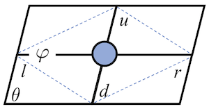
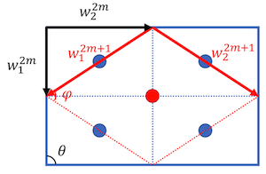
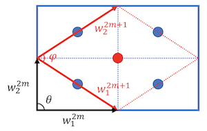
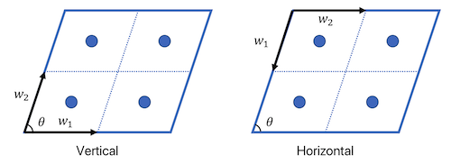
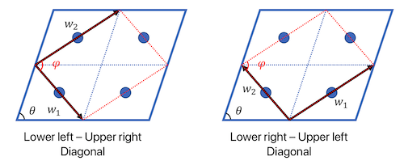

# Transfer Matrices:  Relation to Conformal Field Theory

## Eigenvalues and CFT

For CFT on a torus, the partition function is

$$
Z = \text{Tr}\, \exp 2\pi \left[
    - \left( L_0 + \bar{L}_0 - \frac{c}{12} \right) \operatorname{Im} \, \tau
    + i \, (L_0 - \bar{L}_0) \, \operatorname{Re} \, \tau
\right]
$$

where $\tau$ is the **modular parameter** of the spacetime. The general expression for $\tau$ of a patch of $w \times h$ parallelogram tensor network is

$$
\tau = \frac{v h}{w} e^{i \theta}
\xrightarrow{\theta = \pi/2} i \frac{v h}{w}
$$

where $v$ is the **lattice velocity**, describing an anisotropy of the space and the time directions. 

Usually we choose the transfer matrix without spatial translation, so that $\theta = \pi/2$. This can be taken for granted for quantum models. 

For a general transfer matrix, the eigenvalues $\lambda_i$ (labelled in descending order of absolute value) are related to the scaling dimension $\Delta_i$, central charge $c$, and spin $s_i$ by

$$
\lambda_i = \exp \left[
    -2 \pi \operatorname{Im}(\tau) \left(
        \Delta_i - \frac{c}{12}
    \right) + 2 \pi i \operatorname{Re}(\tau) s_i
\right]
$$

Usually the eigenvalues $\lambda_i$ are determined *up to a constant factor*, due to some hidden normalization process in the algorithm. To remove this normalization, we note that since $\Delta_0 = 0, s_0 = 0$

$$
\lambda_0 = \exp \left[
    -2 \pi \operatorname{Im}(\tau) \left(
        - \frac{c}{12}
    \right)
\right]
$$

Therefore

$$
\frac{\lambda_i}{\lambda_0}
= \exp \left[
    -2 \pi \operatorname{Im}(\tau) \Delta_i
    + 2 \pi i \operatorname{Re}(\tau) s_i
\right]
$$

Then we can obtain $\Delta_i, s_i$ once we know $\tau$:

$$
\Delta_i = -\frac{1}{2\pi \operatorname{Im}\tau} 
\ln \left| \frac{\lambda_i}{\lambda_0} \right|
\qquad
s_i = \frac{1}{2\pi \operatorname{Re}\tau} 
\operatorname{Arg}\frac{\lambda_i}{\lambda_0}
$$

## Change of Modular Parameter under RG

Consider the transform of $\tau$ of one tensor under one RG step for square lattice. The $(2m)$th step will keep the network orientation unchanged, but $(2m+1)$st step will rotate the network clockwise, so that

$$
\begin{align*}
    w_1^{2m+1} &= w_1^{2m} - w_2^{2m} 
    \\[0.5em]
    w_2^{2m+1} &= w_1^{2m} + w_2^{2m} 
\end{align*}
\qquad
(m = 0, 2, 4, ...)
$$

    
*Transform of $\tau^h$*

   
*Transform of $\tau^v$*

These apply to both the vertical TM and the horizontal TM. Therefore, $\tau$ (for vertical TM) transforms to

$$
\tau^{2m+1} = \frac{w_2^{2m+1}}{w_1^{2m+1}}
= \frac{1 + \tau^{2m}}{1 - \tau^{2m}}
$$

Recall that (for the horizontal TM) $\tau^{2m} = iw/vh$; then

$$
\tau^{2m+1} 
= \frac{vh + iw}{vh - iw}
\, \Rightarrow \, \left\{ \begin{align*}
    \operatorname{Re} \tau^{2m+1} 
    &= \frac{(vh)^2 - w^2}{(vh)^2 + w^2}
    \\
    \operatorname{Im} \tau^{2m+1}
    &= \frac{2vhw}{(vh)^2 + w^2}
\end{align*}
\right.
$$

## Finding the Modular Parameter

For "good" models not affected by finite size effects (one notable exception being the XY model with transverse field), we can use the following four TMs of the same size $w \times h$ (usually $w = h = 2$ will be enough) to obtain $\tau$: 

- For the vertical and horizontal transfer matrices

    

    

    

    $$
    \begin{align*}
        \tau^v 
        &= \frac{vh}{w} e^{i\theta}, &\qquad
        \Delta_i 
        &= - \frac{1}{2\pi} \frac{w}{v h \sin \theta}
        \ln \frac{|\lambda^v_i|}{|\lambda^v_0|}
        \\
        \tau^h 
        &= \frac{w}{vh} e^{i(\pi - \theta)}, &\qquad
        \Delta_i 
        &= - \frac{1}{2\pi} \frac{v h}{w \sin \theta} 
        \ln \frac{|\lambda^h_i|}{|\lambda^h_0|}
    \end{align*}
    $$

    Therefore

    $$
    \left( \frac{w}{vh} \right)^2 
    = \frac{\ln |\lambda_i^h / \lambda_0^h|}{\ln |\lambda_i^v / \lambda_0^v|}
    \equiv \xi_1^2
    $$

    from which can obtain $v$.

- For the two diagonal transfer matrices (denoted by $ld$ and $rd$)
    
    

    

    

    
    For the lower-left to upper-right TM, we have

    $$
    \begin{align*}
        |w_1|^2 &= \Big( \frac{w}{2} \Big)^2
        + \Big(\frac{vh}{2}\Big)^2
        - 2 \frac{w}{2} \frac{vh}{2} \cos \theta
        \\
        |w_2|^2 &= \Big(\frac{w}{2}\Big)^2
        + \Big( \frac{vh}{2} \Big)^2
        - 2 \frac{w}{2} \frac{vh}{2} \cos (\pi - \theta)
    \end{align*}
    $$

    Thus we obtain similarly

    $$
    \frac{w^2 + (vh)^2 - 2vhw \cos \theta}
    {w^2 + (vh)^2 + 2vhw \cos \theta}
    = \frac{\ln |\lambda_i^{rd} / \lambda_0^{rd}|}
    {\ln |\lambda_i^{ld} / \lambda_0^{ld}|}
    \equiv \xi_2^2
    $$

    from which we obtain

    $$
    \cos \theta = \frac{(1-\xi_2^2)(1+\xi_1^2)}{2\xi_1 (1+\xi_2^2)}
    $$

To save labor, we note that for quantum models, the angle $\theta$ can usually be safely assumed to be $\pi/2$ at even RG steps. 

## Finding $v$ Using Horizontal TM Only

For "bad" models whose vertical TM is severely affected by the finite size effect, we may use the horizontal TM only to fit the lattice velocity $v$.

$$
\Delta_i = -\frac{1}{2\pi \operatorname{Im}\tau} 
\ln \left| \frac{\lambda_i}{\lambda_0} \right|
\qquad
s_i = \frac{1}{2\pi \operatorname{Re}\tau} 
\operatorname{Arg}\frac{\lambda_i}{\lambda_0}
$$

## Finding the Central Charge

The central charge can be determined from two transfer matrices along different directions, and *of the same size* (i.e. $w \times h$), so that we can get rid of the normalization factor of the tensors. From both the vertical and the horizontal transfer matrices (we select $vh \ne w$ so that $\tau^v \ne \tau^h$)

$$
\begin{align*}
    \ln |\lambda^h_0| 
    &= 2 \pi \operatorname{Im}(\tau^h) \frac{c}{12}
    \\
    \ln |\lambda^v_0| 
    &= 2 \pi \operatorname{Im}(\tau^v) \frac{c}{12}
\end{align*}
$$

we obtain

$$
\ln \frac{|\lambda^h_0|}{|\lambda^v_0|}
= \frac{\pi c}{6} \operatorname{Im}(\tau^h - \tau^v)
$$

and therefore

$$
c = \frac{6}{\pi \operatorname{Im}(\tau^h - \tau^v)}
\ln \frac{|\lambda^h_0|}{|\lambda^v_0|}
$$
