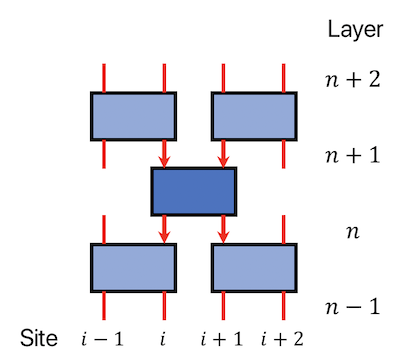

# Contraction of Grassmann Tensors:  Motivation for Definition

## Motivation: Inserting Identities 

We start from the simplest case where we want to insert an identity between the product of two fermion operators $A$ and $B$.

## Grassmann Tensors

In general, a **Grassmann tensor** $\mathbf{T}(\theta)_{i_1 i_2 ...}^{n_1 n_2 ...}$ has the components

$$
\mathbf{T}(\theta)_{i_1 i_2 ...}^{n_1 n_2 ...} = T_{i_1 i_2 ...}^{n_1 n_2 ...} \theta_1^{n_1} \theta_2^{n_2}...
$$

- $\theta_1, \theta_2 ...$ are *anti-commuting* **Grassmann numbers**
- the exponents $n_1, n_2 ... = 0 \text{ or } 1$ are called **Grassmann indices**
- $i_1, i_2, ...$ are called **normal indices**; the dimension $\dim{i_k}$ in general will *depend on* $n_k$ (Note)
- each $T^{n_1 n_2 ...}$ are normal (complex or real) tensors

----

**Note: Notation of the normal indices**

To avoid clutter in notations, unless in situations where accurate notation is needed, we shall not use complicated symbols like $i_k[n_k]$ to show the dependence on $n_k$ explicitly.

----

### Parity

In physical applications, the Grassmann tensor has a definite **parity** $P(T)$:

- All elements with $\sum_a n_a = 0 \pmod{2}$ vanish: **odd-parity** ($P(T) = 1$)
- All elements with $\sum_a n_a = 1 \pmod{2}$ vanish: **even-parity** ($P(T) = 0$)

### Graphical Representation

Grassmann tensors are represented by blocks (or circles, etc); its axes are *double*-lines connecting to this block (instead of single lines for ordinary tensors). 

## Trotter Gate Network as Grassmann Tensor Network

### Case 1: Spinless Fermion Systems

 <i>A portion of the Trotter gate network</i>

We focus on a portion (let us call it $A$) of the propagator of the spinless $t$-$V$ model:

$$
\begin{aligned}
    A \equiv \int 
    &\langle 
        \xi_{i-1} \xi_{i} | 
        e^{-\epsilon H_{i-1, i}} | 
        \theta_{i-1} \theta_{i} 
    \rangle
    \langle 
        \xi_{i+1} \xi_{i+2} | 
        e^{-\epsilon H_{i+1, i+2}} | 
        \theta_{i+1} \theta_{i+2} 
    \rangle
    \\
    &g_{\bar{\theta}_i \theta_i}
    g_{\bar{\theta}_{i+1} \theta_{i+1}}
    \langle 
        \theta_{i} \theta_{i+1} | 
        e^{-\epsilon H_{i, i+1}} | 
        \eta_{i} \eta_{i+1} 
    \rangle
    g_{\bar{\eta}_i \eta_i}
    g_{\bar{\eta}_{i+1} \eta_{i+1}}
    \\
    &\langle 
        \eta_{i-1} \eta_{i} | 
        e^{-\epsilon H_{i-1, i}} | 
        \zeta_{i-1} \zeta_{i} 
    \rangle
    \langle 
        \eta_{i+1} \eta_{i+2} | 
        e^{-\epsilon H_{i+1, i+2}} | 
        \zeta_{i+1} \zeta_{i+2} 
    \rangle
\end{aligned}
$$

To save writing, we have renamed the states in each evolution layer to

$$
\begin{aligned}
    |\eta^{n-1} \rangle \rightarrow |\zeta\rangle &, \quad
    |\eta^n \rangle \rightarrow |\eta\rangle \\
    |\eta^{n+1} \rangle \rightarrow |\theta\rangle &, \quad
    |\eta^{n+2} \rangle \rightarrow |\xi\rangle
\end{aligned}
$$

Since $e^{-\epsilon H_{i, i+1}}$ has spatial translational symmetry (i.e. independent of the site position $i$), each Trotter gate is related to the same Grassmann tensor $\mathbf{T}$ (up to a difference of the names of the Grassmann numbers):

$$
\begin{aligned}
    \langle 
        \theta_i \theta_{i+1} | e^{-\epsilon H_{i, i+1}} | \eta_i \eta_{i+1} 
    \rangle 
    &=
    \sum_{n=0,1} T^{\bar{n}_{i+1} \bar{n}_i n_i n_{i+1}} 
    \bar{\theta}_{i+1}^{\bar{n}_{i+1}} 
    \bar{\theta}_i^{\bar{n}_i} 
    \eta_i^{n_i} \eta_{i+1}^{n_{i+1}} 
    \\ &
    \equiv \sum_{n=0,1} 
    \mathbf{T}(\bar{\theta},\eta)^{\bar{n}_{i+1} \bar{n}_i n_i n_{i+1}}
    \qquad
\end{aligned}
$$

Then $A$ can be expressed in terms of $T$:

$$
\begin{aligned}
    A \equiv \sum_{m,n,p} \int 
    &
    \mathbf{T}(\bar{\xi},\theta)^{\bar{m}_i \bar{m}_{i-1} m_{i-1} m_i}
    \mathbf{T}(\bar{\xi},\theta)^{\bar{m}_{i+2} \bar{m}_{i+1} m_{i+1} m_{i+2}}
    \\ & \times
    g_{\bar{\theta}_i \theta_i}
    g_{\bar{\theta}_{i+1} \theta_{i+1}}
    \mathbf{T}(\bar{\theta},\eta)^{\bar{n}_{i+1} \bar{n}_i n_i n_{i+1}}
    g_{\bar{\eta}_i \eta_i}
    g_{\bar{\eta}_{i+1} \eta_{i+1}}
    \\ & \times
    \mathbf{T}(\bar{\eta},\zeta)^{\bar{p}_i \bar{p}_{i-1} p_{i-1} p_i}
    \mathbf{T}(\bar{\eta},\zeta)^{\bar{p}_{i+2} \bar{p}_{i+1} p_{i+1} p_{i+2}}
\end{aligned}
$$

In particular, we pick out the terms

$$
\begin{aligned}
    &\mathbf{A}(\bar{\xi},\zeta)^{
        (\bar{m}_{i} \bar{m}_{i-1} m_{i-1} \bar{m}_{i+2} \bar{m}_{i+1} m_{i+2})
        (\bar{p}_{i-1} p_{i-1} p_i \bar{p}_{i+2} p_{i+1} p_{i+2})
    }
    \\ &
    \equiv \sum_{m_i,m_{i+1}} \sum_{n} 
    \sum_{\bar{p}_i, \bar{p}_{i+1}} \int 
    \mathbf{T}(\bar{\xi},\theta)^{\bar{m}_i \bar{m}_{i-1} m_{i-1} m_i}
    \mathbf{T}(\bar{\xi},\theta)^{\bar{m}_{i+2} \bar{m}_{i+1} m_{i+1} m_{i+2}}
    \\ & \qquad \times
    g_{\bar{\theta}_i \theta_i}
    g_{\bar{\theta}_{i+1} \theta_{i+1}}
    \mathbf{T}(\bar{\theta},\eta)^{\bar{n}_{i+1} \bar{n}_i n_i n_{i+1}}
    g_{\bar{\eta}_i \eta_i}
    g_{\bar{\eta}_{i+1} \eta_{i+1}}
    \\ & \qquad \times
    \mathbf{T}(\bar{\eta},\xi)^{\bar{p}_i \bar{p}_{i-1} p_{i-1} p_i}
    \mathbf{T}(\bar{\eta},\xi)^{\bar{p}_{i+2} \bar{p}_{i+1} p_{i+1} p_{i+2}}
\end{aligned}
$$

The summation over the rest $m, \bar{m}, p, \bar{p}$ will be assigned to the evaluation of other parts of the gate network. 

In the integration, $\bar{\eta}_1, \eta_1$ are treated as independent variables. Thus nothing prevents us to rename the integration variables:

$$
\begin{aligned}
    A = \sum_{m,n} \int
    &T^{m_1 m_2 m_3 m_4} 
    \bar{\theta}_1^{m_1} \bar{\theta}_2^{m_2} 
    \theta_3^{m_3} \theta_4^{m_4}
    \\ &\times g_{\bar{\eta}_1 \theta_3}
    T^{n_1 n_2 n_3 n_4} 
    \bar{\eta}_1^{n_1} \bar{\eta}_2^{n_2} 
    \eta_3^{n_3} \eta_4^{n_4}
\end{aligned}
$$

This motivates us to define the **contraction** of the 3rd axis of the first $T$ and the 1st axis of the second $T$.

