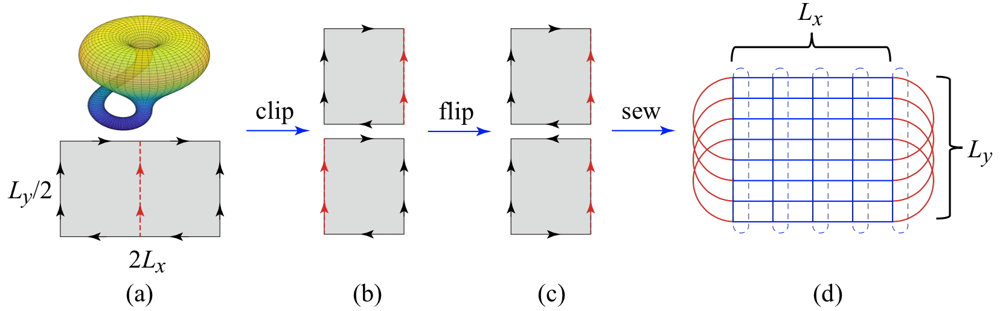

## Transfer Matrix on Klein Bottle

In the following, we define

```
            2   3
            ↓   ↓               1
        5 → A → B → 1           ↓
            ↓   ↓       =   2 → T → 0
        4 → B → A → 0           ↓
            ↓   ↓               3
            6   7
```

The 2 x 2 network always appears as a whole in transfer matrices. 

Visualizing by the [**fundamental polygon**][wiki], we convert the tensor network on a Klein bottle to one on a torus:

<center>

   
*Figure adapted from Physical Review E **101**, 060105(R) (2020)*

</center>

[wiki]: https://en.wikipedia.org/wiki/Fundamental_polygon

### PBC

```
    Cut in the middle (numbers indicate tracing pairs)

            :       :
            ↓       ↓   
        0 → T → | → T → 0
            ↓       ↓
            :       :

    Flip (R) vertically, and connect to (L) at below

            :
            ↓
        0 → T → 1
            ↓
        -------
            ↓
        0 ← T ← 1
            ↓
            :

```

### Anti-PBC